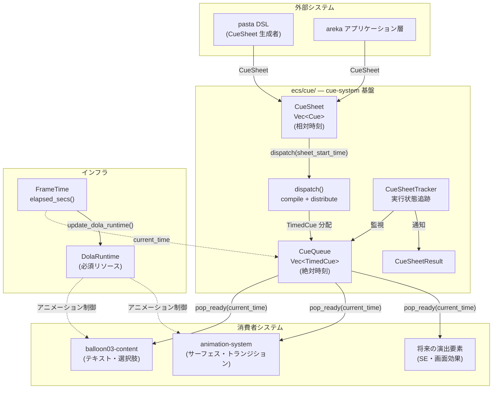
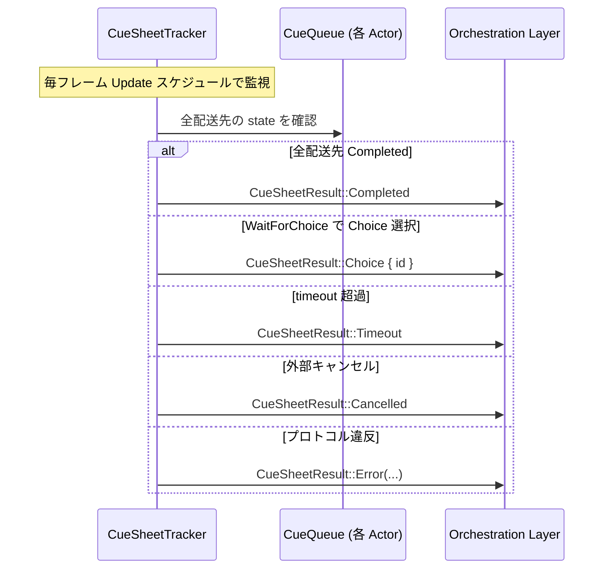
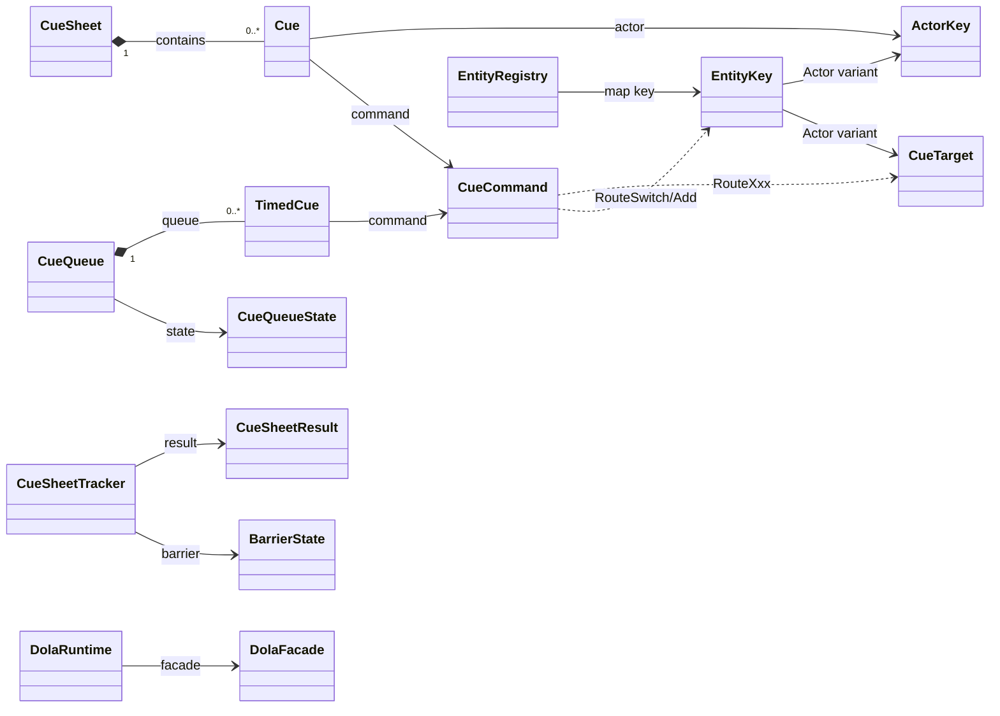

# 設計ドキュメント: wintf-P0-cue-system

| 項目               | 内容                                         |
| ------------------ | -------------------------------------------- |
| **Document Title** | wintf キューシステム（cue-system）技術設計書 |
| **Version**        | 2.0                                          |
| **Date**           | 2026-02-27                                   |
| **Requirements**   | v2.2（9 Req + 3 NFR）                       |
| **Status**         | 📐 Generated                                |

---

## Overview

**Purpose**: 本設計は、演出指令（キュー）の構造化定義・配送・消費メカニズムを ECS コンポーネントとして確立する。さくらスクリプトが果たしていた「コンテンツ再生を指示するミニ言語」の役割を、型安全な Rust enum + 絶対時刻キーフレーム方式で再構成する。

**Users**: pasta DSL / areka アプリケーション層が CueSheet を生成し、balloon03-content / animation-system 等の消費者システムが CueQueue からコマンドを時刻ベースで消費する。

**Impact**: 既存の TypewriterToken / TypewriterTalk パターンとは独立した新規モジュール `ecs/cue/` を追加。既存コードへの変更なし。

### Goals

- CueSheet → dispatch(compile) → CueQueue の3層パイプラインを型安全に実装
- dola の思想（宣言的構造 → コンパイル → 時刻ベース実行）を対話的台本の領域で実現
- 消費者（balloon, animation）が共通基盤上で独立消費できるプロトコルを確立
- CueSheetResult によるフィーチャー実行モデル（Modal Dialog パターン）を提供

### Non-Goals

- TypewriterToken / TypewriterTalk の変更・置換（段階的共存、DD6-b）
- 具体的な描画・音声再生実装（消費者仕様の責務）
- pasta DSL パーサー / コンパイラの実装（外部リポジトリ）
- dola ランタイム自体の実装（dola クレートの責務）
- CueSheet のシリアライズ / デシリアライズ（将来拡張）

---

## Architecture

### Existing Architecture Analysis

#### 既存パターンの継承

| パターン | 既存実装 | cue-system での適用 |
|----------|----------|---------------------|
| SparseSet コンポーネント | `TypewriterTalk`, `DragConfig` 等 27件 | `CueQueue` コンポーネント |
| on_add フックチェーン | `Typewriter` → Visual + TypewriterTalk 自動挿入 | 配送トリガーに活用可能（DD7） |
| 2段階 IR | Stage 1 (TypewriterToken) → Stage 2 (TimelineItem) | CueSheet(相対) → CueQueue(絶対) の1段変換（DD9 で Stage 2 不要化） |
| FrameTime 絶対時刻 | `elapsed_secs() -> f64`（QueryPerformanceCounter ベース） | `pop_ready(current_time)` の時刻ソース |
| Changed\<T\> gotcha | `Mut<T>` は内容変更なしでも Changed 発火 | CueQueue 消費では Changed フィルタ不使用 |

#### 遵守すべき制約

- **レイヤー依存方向**: COM → ECS → Message Handling（cue-system は ECS レイヤー内で完結）
- **スケジュール順**: Input → **Update**（キュー消費） → PreLayout → ... → FrameFinalize
- **DeferredWorld 制約**: on_add フック内での World アクセスは限定的

### Architecture Pattern & Boundary Map



**Architecture Integration**:
- **選択パターン**: 新規独立モジュール `ecs/cue/`（gap-analysis 推奨案）
- **ドメイン境界**: cue-system はウィジェット横断的基盤として `ecs/widget/` の外に配置
- **既存パターン保持**: SparseSet, on_add hook, FrameTime, tracing ログレベル規約
- **新規コンポーネント**: CueQueue（演出指示キュー）, CueSheetTracker（実行追跡）
- **Steering 準拠**: structure.md のレイヤー依存方向、logging.md のログレベル、tech.md の thiserror 採用

> **要件からの設計逸脱（dola 必須化）**: requirements.md Req 6 AC4 は `#[cfg(feature = "dola")]` による条件コンパイルを想定するが、設計分析の結果、dola は必須依存とし条件コンパイルは採用しない。根拠: (1) Custom パラメーター型に `dola::DynamicValue` を採用（DD12）、(2) 時刻基準を dola と統一（DD8-b）、(3) 物理エンティティが DolaRuntime を直接参照する設計。

### Technology Stack

| Layer | Choice / Version | Role in Feature | Notes |
|-------|------------------|-----------------|-------|
| ECS Framework | bevy_ecs 0.18.0 | コンポーネント・システム基盤 | SparseSet, on_add hooks, Changed\<T\> |
| 時刻管理 | FrameTime (f64秒) | 絶対時刻ソース | QueryPerformanceCounter ベース、OS起動時=0秒 |
| エラー型 | thiserror 2 | CueSystemError 定義 | workspace 統一規約 |
| 動的値 | dola::DynamicValue | Custom コマンドパラメーター | JSON互換、Clone + Debug + Eq + Hash |
| ロギング | tracing | 構造化ログ | debug!/trace!/warn! |
| アニメーション | dola（必須依存） | タイムライン実行エンジン | DolaRuntime リソース。FrameTime と同じ時刻基準を共有 |

---

## System Flows

### CueSheet 配送フロー（dispatch）

```mermaid
sequenceDiagram
    participant P as pasta DSL / areka
    participant D as dispatch()
    participant R as EntityRegistry
    participant Q1 as CueQueue (Shell)
    participant Q2 as CueQueue (Balloon)

    P->>D: dispatch(cue_sheet, sheet_start_time, registry, world)
    loop 各 Cue
        alt is_routing_command()
            D->>R: ルーティング更新（RouteAdd/RouteSwitch/RouteRemove）
            R-->>D: ok（CueQueue には届かない）
        else ブロードキャスト
            D->>R: routes_for_actor(actor_key)
            R-->>D: [(Shell, Entity), (Balloon, Entity), ...]
            D->>D: cue.start_time + sheet_start_time → 絶対時刻
            D->>Q1: push_sorted(TimedCue) ← Shell スロット
            D->>Q2: push_sorted(TimedCue) ← Balloon スロット
        end
    else Entity 見つからない
            R-->>D: None
            D->>D: tracing::warn! → skip
        end
    end
    D->>D: CueSheetTracker を生成・登録
```

### CueQueue 消費フロー（pop_ready）

```mermaid
stateDiagram-v2
    [*] --> Idle: CueQueue 空
    Idle --> Playing: TimedCue 追加
    Playing --> Playing: pop_ready(current_time)<br/>時刻到達コマンドを返却
    Playing --> WaitingForClick: WaitForClick 到達
    Playing --> WaitingForChoice: WaitForChoice 到達
    WaitingForClick --> Playing: クリック入力受信<br/>or timeout 超過
    WaitingForChoice --> Playing: Choice 選択受信
    WaitingForChoice --> Error: 先行 Choice 0件
    Playing --> Completed: 全コマンド消費済み
    WaitingForClick --> Completed: timeout → Timeout通知
    Error --> [*]: CueSheetResult::Error
    Completed --> [*]: CueSheetResult::Completed
    Completed --> Playing: 新 CueSheet 配送（追記）
```

### CueSheetResult 通知フロー



---

## Requirements Traceability

| Requirement | Summary | Components | Interfaces | Flows |
|-------------|---------|------------|------------|-------|
| Req 1 | CueSheet 構造化台本 | CueSheet, Cue, ActorKey | `CueSheet::new()`, `filter_by_actor()` | dispatch |
| Req 2 | CueCommand 型安全コマンド | CueCommand (11 variants) | `is_barrier()`, `is_routing_command()` | — |
| Req 3 | CueQueue エンティティキュー | CueQueue, TimedCue | `push_sorted()`, `pop_ready()`, `peek()` | pop_ready |
| Req 4 | CueSheet 配送 | PendingCueSheet, EntityRegistry | `dispatch_pending_cue_sheets()` | dispatch |
| Req 5 | 消費プロトコル | CueQueue, CueQueueState | `pop_ready()`, `resolve_click/choice()` | pop_ready |
| Req 6 | dola 統合 | DolaRuntime | `update_dola_runtime()` | — |
| Req 7 | コマンド拡張 | CueCommand::Custom | DynamicValue パラメーター | — |
| Req 8 | エラーハンドリング | CueSystemError | `push_sorted()` Result | — |
| Req 9 | CueSheet ライフサイクル | CueSheetTracker, CueSheetResult | `tracker.result()`, `cancel()` | result |
| NFR-1 | パフォーマンス | TimedCue ≤ 64B | 降順 Vec + pop tail O(1) | — |
| NFR-2 | デバッグ容易性 | 全型 Debug derive | tracing structured logging | — |
| NFR-3 | ECS 親和性 | SparseSet storage | bevy_ecs 0.18.0 準拠 | — |

> **Req 2 への補足**: requirements.md では 8 バリアントを定義。DD13 によりルーティングコマンド 3 バリアント（RouteAdd / RouteSwitch / RouteRemove）を追加し、計 11 バリアントに拡張。

---

## Components and Interfaces

### Component Summary

| Component | Layer | Intent | Req Coverage | Storage |
|-----------|-------|--------|--------------|---------|
| CueSheet / Cue / ActorKey | Data Model | 構造化演出台本 | 1 | — (値型) |
| CueCommand | Data Model | 型安全コマンド体系 (11 variants) | 2, 7 | — (値型) |
| CueTarget | Data Model | ルーティングスロット識別子 | 4 | — (値型) |
| TimedCue | Data Model | 絶対時刻コマンドエントリー | 1, 3 | — (値型) |
| CueQueue | Component | 演出指示キュー | 3, 5 | SparseSet |
| PendingCueSheet | Component | 配送待ち CueSheet | 4 | SparseSet |
| CueSheetTracker | Component | CueSheet 実行状態追跡 | 9 | SparseSet |
| EntityRegistry | Resource | ActorKey → Entity 解決 | 4 | — |
| DolaRuntime | Resource | dola ランタイムラッパー | 6 | — |

### Data Model Layer

#### CueSheet — 構造化演出台本

**DD1 決定: ActorKey = NewType(String)**。型安全性 + pasta DSL からの変換容易性のためにニュータイプパターンを採用。

```rust
/// 構造化演出台本。相対時刻で記述された演出指示の集合。
///
/// CueSheet は CueQueue にとっての "ソースコード" に相当し、
/// dispatch（コンパイル）を経て絶対時刻の TimedCue に変換される。
#[derive(Clone, Debug)]
pub struct CueSheet(Vec<Cue>);

impl CueSheet {
    /// start_time 昇順でソートして構築（安定ソート）
    pub fn new(mut cues: Vec<Cue>) -> Self {
        cues.sort_by(|a, b| a.start_time.partial_cmp(&b.start_time).unwrap());
        Self(cues)
    }
    pub fn cues(&self) -> &[Cue] { &self.0 }
    pub fn filter_by_actor(&self, key: &ActorKey) -> Vec<&Cue> { /* ... */ }
    pub fn actors(&self) -> Vec<&ActorKey> { /* ... */ }
    pub fn is_empty(&self) -> bool { self.0.is_empty() }
    pub fn len(&self) -> usize { self.0.len() }
}

/// 個々の演出指示
#[derive(Clone, Debug)]
pub struct Cue {
    /// 対象演者の識別子
    pub actor: ActorKey,
    /// CueSheet 開始時点からの相対秒数
    pub start_time: f64,
    /// 演出コマンド
    pub command: CueCommand,
}

/// 演者識別子。NewType パターンにより型安全性を確保。
///
/// さくらスクリプトの `\0` (さくら) / `\1` (うにゅう) に相当するが、
/// 文字列ベースで任意の名前を許容する。
#[derive(Clone, Debug, PartialEq, Eq, Hash)]
pub struct ActorKey(String);

impl ActorKey {
    pub fn new(key: impl Into<String>) -> Self { Self(key.into()) }
    pub fn as_str(&self) -> &str { &self.0 }
}

impl From<&str> for ActorKey {
    fn from(s: &str) -> Self { Self(s.to_string()) }
}
```

#### CueCommand — 型安全コマンド体系

**DD10 決定**: Wait バリアントなし。タイミングは start_time 差分で表現。  
**DD12 決定**: Custom パラメーターに `dola::DynamicValue` を採用。  
**DD13 決定**: 非ルーティングコマンドはブロードキャスト。RouteXxx は dispatch 層のみで消費。

コマンドは **3 カテゴリー** に分類される:

| カテゴリー | コマンド | 配信モデル | 消費者 |
|-----------|---------|-----------|--------|
| データ（演出指示） | Text, Clear, Emote, Choice, EntityRef, Custom | ブロードキャスト（全スロット） | 各消費者 |
| バリア（入力待ち） | WaitForChoice, WaitForClick | ブロードキャスト（全スロット） | ハンドラー or skip |
| ルーティング（配送制御） | RouteAdd, RouteSwitch, RouteRemove | dispatch 層のみ消費 | EntityRegistry |

```rust
/// 演出コマンド。さくらスクリプトの各タグに相当する型安全な enum。
#[derive(Clone, Debug)]
pub enum CueCommand {
    // ── データコマンド（ブロードキャスト） ──
    /// テキスト表示。意味解釈（縦書き、装飾等）は消費者の責務。
    Text(String),
    /// コンテンツクリア
    Clear,
    /// 演技発現。key の意味解釈は消費者が担う。
    /// Spot: サーフェスアニメーション選択、Balloon: フォントセット切替。
    Emote { key: String },
    /// 選択肢データ。WaitForChoice の前に連続投入する先積みプロトコル。
    Choice { id: String, text: String },
    /// ECS エンティティ参照渡し（消費者が解釈）
    EntityRef(Entity),
    /// 消費者固有コマンド。DynamicValue は JSON 互換辞書型。
    Custom { command: String, params: dola::DynamicValue },

    // ── バリアコマンド（ブロードキャスト） ──
    /// 選択肢バリア。直前の Choice 群を提示してブロック。
    WaitForChoice { timeout: Option<f64> },
    /// クリック待ちバリア。全体配信のため関係するどこをクリックしても応答される。
    WaitForClick { timeout: Option<f64> },

    // ── ルーティングコマンド（dispatch 層のみ消費） ──
    /// スロット追加（既存ルーティングを維持したまま追加先を登録）
    RouteAdd { target: CueTarget, to: EntityKey },
    /// スロット切替（既存ルーティングを上書き）
    RouteSwitch { target: CueTarget, to: EntityKey },
    /// スロット除去（指定ターゲットのルーティングを削除）
    RouteRemove { target: CueTarget },
}

impl CueCommand {
    /// バリアコマンドか判定
    pub fn is_barrier(&self) -> bool {
        matches!(self, Self::WaitForChoice { .. } | Self::WaitForClick { .. })
    }
    /// ルーティングコマンドか判定（dispatch 層で消費、CueQueue に入らない）
    pub fn is_routing_command(&self) -> bool {
        matches!(self, Self::RouteAdd { .. } | Self::RouteSwitch { .. } | Self::RouteRemove { .. })
    }
}
```

#### CueTarget — ルーティングスロット識別子

```rust
/// CueCommand の配送先スロット。
/// 1 ActorKey に対して複数の CueTarget スロットが存在する。
#[derive(Clone, Debug, PartialEq, Eq, Hash)]
pub enum CueTarget {
    /// シェル（キャラクター描画）— Emote, EntityRef を主に消費
    Shell,
    /// バルーン（テキスト表示）— Text, Clear, Choice, WaitForChoice を主に消費
    Balloon,
}
```

#### TimedCue — 絶対時刻コマンドエントリー

```rust
/// 絶対時刻に変換済みの消費可能コマンド。
/// dispatch 時に `cue.start_time + sheet_start_time` で生成される。
/// CueQueue 内部のエントリー型。
pub struct TimedCue {
    /// 世界絶対時刻（秒）
    pub start_time: f64,
    /// 演出コマンド（actor 情報は分配済みのため不要）
    pub command: CueCommand,
}
```

**メモリー見積もり（NFR-1 AC4 対応）**:

| フィールド | 型 | サイズ | 備考 |
|-----------|-----|--------|------|
| `start_time` | `f64` | 8 B | |
| `command` | `CueCommand` | ≤ 56 B | Text(String): tag 8 + ptr 8 + len 8 + cap 8 = 32B + padding |
| **合計** | | **≤ 64 B** | `static_assert!(size_of::<TimedCue>() <= 64)` |

### Component Layer

#### CueQueue — 演出指示キュー

**DD9 決定**: Vec\<TimedCue\> を降順ソートで保持し、末尾から pop（O(1)）する。  
**Storage**: SparseSet（`#[component(storage = "SparseSet")]`）— 動的変更が頻繁なため。

```rust
/// 各演者エンティティが保持する時刻付き演出指示のキュー。
///
/// CueSheet の配送（dispatch）により TimedCue が追加され、
/// 消費者システムが pop_ready() で時刻到達済みコマンドを取得する。
///
/// 内部は start_time **降順** ソートの Vec<TimedCue>。
/// 消費は末尾からの pop（O(1)）で行い、先頭への挿入移動を回避する。
#[derive(Component, Debug)]
#[component(storage = "SparseSet")]
pub struct CueQueue {
    queue: Vec<TimedCue>,
    state: CueQueueState,
    playback_rate: f64,
    capacity: Option<usize>,
    /// Choice バリアの先積みデータ
    pending_choices: Vec<PendingChoice>,
    /// 現在この CueQueue にコマンドを供給している CueSheet の Tracker エンティティ
    cue_sheet_entity: Option<Entity>,
    /// 現在アクティブなバリア
    barrier_state: Option<BarrierState>,
}

/// Choice コマンドの先積みデータ
#[derive(Clone, Debug)]
pub struct PendingChoice {
    pub id: String,
    pub text: String,
}
```

**Service Interface**:

```rust
impl CueQueue {
    pub fn new() -> Self { /* state: Playing, playback_rate: 1.0, capacity: None */ }
    pub fn with_capacity(capacity: usize) -> Self { /* ... */ }

    // ── 追加 ──
    /// TimedCue を降順ソート維持で挿入（O(log n) binary search + O(n) shift）
    pub fn push_sorted(&mut self, cue: TimedCue) -> Result<(), CueSystemError> { /* ... */ }
    /// 複数の TimedCue を一括追加（内部で再ソート）
    pub fn extend_sorted(&mut self, cues: impl IntoIterator<Item = TimedCue>) -> Result<(), CueSystemError> { /* ... */ }

    // ── 消費 ──
    /// current_time に到達した全コマンドを返却（O(1) per pop）
    ///
    /// - バリア中は空 Vec を返す
    /// - Choice コマンドは pending_choices に蓄積（返却しない）
    /// - WaitForChoice 到達時: pending_choices > 0 → ブロック、== 0 → Error
    /// - WaitForClick 到達時: ブロック
    pub fn pop_ready(&mut self, current_time: f64) -> Vec<CueCommand> { /* ... */ }
    /// 先頭（次に消費される）要素の参照
    pub fn peek(&self) -> Option<&TimedCue> { self.queue.last() }

    // ── バリア制御 ──
    /// クリック応答（WaitForClick 解除）
    pub fn resolve_click(&mut self) { /* state → Playing */ }
    /// 選択肢応答（WaitForChoice 解除）。該当 id を返す。
    pub fn resolve_choice(&mut self, choice_id: &str) -> Option<String> { /* ... */ }
    /// タイムアウト検査
    pub fn check_timeout(&mut self, current_time: f64) -> bool { /* ... */ }
    /// バリアを強制スキップ
    pub fn skip_barrier(&mut self) { /* ... */ }
    /// 現在保留中のバリア種別
    pub fn pending_barrier_kind(&self) -> Option<BarrierKind> { /* ... */ }

    // ── 制御 ──
    pub fn pause(&mut self) { /* state → Paused */ }
    pub fn resume(&mut self) { /* state → Playing */ }
    pub fn clear(&mut self) { /* queue + pending_choices + barrier_state をクリア */ }
    pub fn set_cue_sheet(&mut self, entity: Entity) { self.cue_sheet_entity = Some(entity); }
    pub fn cue_sheet_entity(&self) -> Option<Entity> { self.cue_sheet_entity }

    // ── 状態照会 ──
    pub fn state(&self) -> &CueQueueState { &self.state }
    pub fn is_empty(&self) -> bool { self.queue.is_empty() }
    pub fn len(&self) -> usize { self.queue.len() }
    pub fn pending_choices(&self) -> &[PendingChoice] { &self.pending_choices }
}
```

**Preconditions**: `current_time` は `FrameTime::elapsed_secs()` の値  
**Postconditions**: 返却されたコマンドは queue から除去済み  
**Invariants**: queue は常に start_time 降順を維持

#### CueQueueState — キュー状態

```rust
#[derive(Clone, Debug, PartialEq)]
pub enum CueQueueState {
    Playing,
    Paused,
    WaitingForClick,
    WaitingForChoice,
    Error(CueSystemError),
    Completed,
}
```

#### バリア関連型

```rust
/// バリア応答値。消費者がハンドラーとして返す、またはスキップする。
#[derive(Clone, Debug)]
pub enum BarrierResponse {
    /// 非ハンドラー（自ドメイン外のバリア）
    Skipped,
    /// クリック応答
    Click,
    /// 選択応答
    Choice { id: String },
    /// タイムアウト
    Timeout,
}

/// CueQueue 内部のバリア状態管理
#[derive(Clone, Debug)]
struct BarrierState {
    /// 最初に有効応答が到達した時点の BarrierResponse
    first_valid: Option<BarrierResponse>,
    /// バリア種別
    kind: BarrierKind,
}

/// バリア種別
#[derive(Clone, Debug, PartialEq, Eq)]
pub enum BarrierKind {
    Choice,
    Click,
}
```

#### CueSheetResult / CueSystemError — 実行結果とエラー

```rust
/// CueSheet の実行結果。Modal Dialog の DialogResult に相当。
#[derive(Clone, Debug)]
pub enum CueSheetResult {
    Completed,
    Cancelled,
    Timeout,
    Choice { id: String },
    Error(CueSystemError),
}

/// cue-system のエラー型（thiserror 2）
#[derive(Clone, Debug, thiserror::Error)]
pub enum CueSystemError {
    #[error("WaitForChoice に先行する Choice コマンドがありません (actor: {actor})")]
    EmptyChoiceBarrier { actor: String },
    #[error("EntityKey '{key}' に対応するエンティティが見つかりません")]
    EntityNotFound { key: String },
    #[error("CueQueue のキャパシティ上限 ({capacity}) を超過しました")]
    CapacityExceeded { capacity: usize },
}
```

### System Layer

#### PendingCueSheet + dispatch — 配送メカニズム

**DD7-c 決定**: PendingCueSheet コンポーネント + 内部ヘルパー関数パターン。  
通常システムから `Commands` で短命エンティティを spawn し、dispatch システムが自動処理。

```rust
/// 配送待ち CueSheet を保持する短命コンポーネント。
/// dispatch_pending_cue_sheets システムが消費し、同一エンティティに CueSheetTracker を付与する。
#[derive(Component)]
#[component(storage = "SparseSet")]
pub struct PendingCueSheet {
    pub sheet: CueSheet,
    pub start_time: f64,
}
```

**dispatch_pending_cue_sheets システム**:

```rust
/// PendingCueSheet を検出し、CueSheet を各演者の CueQueue に配送するシステム。
///
/// 1. PendingCueSheet を持つエンティティを走査
/// 2. dispatch_cue_sheet_internal() でルーティング + 分配
/// 3. PendingCueSheet を除去し、同一エンティティに CueSheetTracker を付与
///
/// Schedule: Update（消費者システムより前）
pub fn dispatch_pending_cue_sheets(
    mut commands: Commands,
    query: Query<(Entity, &PendingCueSheet)>,
    mut registry: ResMut<EntityRegistry>,
    world: &World,
) { /* ... */ }
```

**dispatch_cue_sheet_internal ヘルパー**:

```rust
/// CueSheet を各演者の CueQueue に分配する内部関数。
///
/// 処理フロー:
/// 1. 各 Cue を走査
/// 2. ルーティングコマンド → EntityRegistry を更新（CueQueue には入らない）
/// 3. 非ルーティングコマンド → routes_for_actor() で全スロットにブロードキャスト
/// 4. 各スロットの CueQueue に push_sorted(TimedCue)
/// 5. 配送先リスト (Vec<(ActorKey, CueTarget, Entity)>) を返却 → CueSheetTracker 生成に使用
fn dispatch_cue_sheet_internal(
    sheet: &CueSheet,
    start_time: f64,
    registry: &mut EntityRegistry,
    world: &mut World,
) -> CueSheetHandle { /* ... */ }

/// dispatch の戻り値。CueSheetTracker 生成に必要な配送先情報。
pub struct CueSheetHandle {
    pub targets: Vec<(ActorKey, CueTarget, Entity)>,
}
```

#### EntityRegistry — 統合レジストリ

**DD2-c 決定**: `HashMap<EntityKey, Entity>` による統合レジストリ。O(1) 解決、型安全な名前空間統合。

```rust
/// ActorKey + CueTarget から Entity を解決する統合レジストリ。
///
/// 名前空間の統合:
/// - Actor(ActorKey, CueTarget): アクターの特定スロット
/// - Spot(String): 物理スポットエンティティ (P1 拡張)
/// - Balloon(String): 物理バルーンエンティティ (P1 拡張)
#[derive(Resource, Default, Debug)]
pub struct EntityRegistry {
    map: HashMap<EntityKey, Entity>,
}

/// レジストリのキー。名前空間を型で分離。
#[derive(Clone, Debug, PartialEq, Eq, Hash)]
pub enum EntityKey {
    Actor(ActorKey, CueTarget),
    Spot(String),
    Balloon(String),
}

impl EntityRegistry {
    /// アクター登録（ショートカット）
    pub fn register_actor(&mut self, actor: impl Into<ActorKey>, target: CueTarget, entity: Entity) {
        self.map.insert(EntityKey::Actor(actor.into(), target), entity);
    }
    /// アクター解決（ショートカット）
    pub fn resolve_actor(&self, actor: &ActorKey, target: &CueTarget) -> Option<Entity> {
        self.map.get(&EntityKey::Actor(actor.clone(), target.clone())).copied()
    }
    /// 指定アクターの全ルーティングスロットを返却
    pub fn routes_for_actor(&self, actor: &ActorKey) -> Vec<(CueTarget, Entity)> { /* ... */ }

    // 汎用 API
    pub fn register(&mut self, key: EntityKey, entity: Entity) { self.map.insert(key, entity); }
    pub fn resolve(&self, key: &EntityKey) -> Option<Entity> { self.map.get(key).copied() }
}
```

#### CueSheetTracker — 実行状態追跡

**DD11 決定**: Component Poll パターン。TypewriterState パターンの自然な拡張。  
**DD14 決定**: バリアライフサイクルは `update()` が集中管理（自動検知 → タイムアウト → 強制スキップ → 解決判定）。

```rust
/// CueSheet の実行状態を追跡するコンポーネント。
/// dispatch により spawn され、全配送先の CueQueue を監視する。
///
/// 上位層は `tracker.result()` を毎フレーム poll して完了を検知する。
#[derive(Component, Debug)]
#[component(storage = "SparseSet")]
pub struct CueSheetTracker {
    /// 配送先の (ActorKey, CueTarget, Entity) リスト
    targets: Vec<(ActorKey, CueTarget, Entity)>,
    /// 実行結果（Some になったら完了）
    result: Option<CueSheetResult>,
    /// キャンセル要求フラグ
    cancelled: bool,
    /// バリア状態の集中管理
    barrier_state: Option<BarrierState>,
}

impl CueSheetTracker {
    /// 実行結果を poll（None = 実行中）
    pub fn result(&self) -> Option<&CueSheetResult> { self.result.as_ref() }
    /// 外部からのキャンセル要求
    pub fn cancel(&mut self) { self.cancelled = true; }
    /// 消費者がバリア応答を報告
    pub fn receive_barrier(&mut self, response: BarrierResponse) { /* first_valid 更新 */ }

    /// 毎フレーム呼び出し — バリアライフサイクル集中管理
    ///
    /// 4 フェーズアルゴリズム:
    /// 1. バリア自動検知: 全配送先の CueQueueState を走査し、
    ///    WaitingForClick/WaitingForChoice を検出したら BarrierState を生成
    /// 2. タイムアウト検出: barrier 開始からの経過時間が timeout を超過したら
    ///    BarrierResponse::Timeout を設定
    /// 3. 解決判定: first_valid が Some になったら:
    ///    - 残りの未応答スロットに skip_barrier() を強制適用
    ///    - Click → 全スロット resolve_click() → 継続
    ///    - Choice → result に CueSheetResult::Choice を設定
    ///    - Timeout → result に CueSheetResult::Timeout を設定
    ///    - 全 Skipped + Click → 全スロット resolve_click() → 継続
    ///    - 全 Skipped + Choice → CueSheetResult::Error
    /// 4. 完了判定: 全配送先が Completed → CueSheetResult::Completed
    pub fn update(&mut self, world: &World, current_time: f64) { /* ... */ }
}
```

**update_cue_sheet_trackers システム**:

```rust
/// 全 CueSheetTracker の update() を呼び出すシステム。
///
/// Schedule: Update（消費者システムの **後** に実行）
/// 理由: 消費者が receive_barrier() で応答を報告した後に集計するため。
pub fn update_cue_sheet_trackers(
    mut query: Query<&mut CueSheetTracker>,
    world: &World,
    frame_time: Res<FrameTime>,
) {
    let current_time = frame_time.elapsed_secs();
    for mut tracker in query.iter_mut() {
        tracker.update(world, current_time);
    }
}
```

#### DolaRuntime — dola ランタイムリソース

**DD8 決定**: dola は必須依存。DolaRuntime リソースを ECS Resource として提供し、物理エンティティが直接参照する。

```rust
use dola::runtime::DolaFacade;

/// dola アニメーションランタイムをラップする bevy_ecs リソース。
///
/// 物理エンティティ（Spot、Balloon）がアニメーション制御に直接使用する。
/// FrameTime と同じ時刻基準（QueryPerformanceCounter、OS起動時=0秒）を共有。
#[derive(Resource)]
pub struct DolaRuntime {
    facade: DolaFacade,
}

impl DolaRuntime {
    pub fn new() -> Self { Self { facade: DolaFacade::new() } }
    pub fn facade(&self) -> &DolaFacade { &self.facade }
    pub fn facade_mut(&mut self) -> &mut DolaFacade { &mut self.facade }
}

impl Default for DolaRuntime {
    fn default() -> Self { Self::new() }
}

/// dola ランタイム更新システム（毎フレーム実行）
///
/// FrameTime から現在時刻を取得し DolaRuntime を更新する。Req 6.1 対応。
/// UpdateResult（変更された変数リスト）の処理は後続仕様（animation-system）で実装。
pub fn update_dola_runtime(
    frame_time: Res<FrameTime>,
    mut dola: ResMut<DolaRuntime>,
) {
    let current_time = frame_time.elapsed_secs();
    let _result = dola.facade_mut().update(current_time);
}
```

**統合スコープ**:

| 責務 | 実装時期 | 説明 |
|------|----------|------|
| DolaRuntime リソース | P0 (cue-system) | bevy_ecs Resource として提供 |
| update_dola_runtime | P0 (cue-system) | 毎フレーム `runtime.update()` 実行 |
| 物理エンティティでの使用 | balloon03-content, animation-system | Spot、Balloon が直接 DolaRuntime を参照 |
| CueQueue との連携 | 将来（任意） | playback_rate 同期等（必須ではない） |

**時刻基準の統一（DD8-b）**: FrameTime と DolaRuntime は同じ QueryPerformanceCounter ベース（OS起動時=0秒）を使用し、時刻を直接比較可能。

### Module Structure — DD5

**DD5 決定**: `ecs/cue/` に配置（ウィジェット横断的基盤）。

```
crates/wintf/src/ecs/
├── cue/
│   ├── mod.rs           ← re-exports, CueSheet, Cue, ActorKey
│   ├── command.rs       ← CueCommand enum（11バリアント）, CueTarget enum
│   ├── component.rs     ← PendingCueSheet コンポーネント
│   ├── queue.rs         ← CueQueue, TimedCue, CueQueueState
│   ├── dispatch.rs      ← dispatch_pending_cue_sheets, EntityRegistry, EntityKey
│   ├── tracker.rs       ← CueSheetTracker, CueSheetResult
│   ├── runtime.rs       ← DolaRuntime, update_dola_runtime
│   ├── error.rs         ← CueSystemError (thiserror)
│   └── tests.rs         ← in-source unit tests
├── widget/
│   └── text/
│       └── typewriter*.rs  ← 変更なし（DD6-b: 共存）
```

**mod.rs の re-export 構造**:

```rust
//! cue-system — 演出指令の構造化定義・配送・消費基盤
//!
//! # 設計メタファー: 舞台演出のキューシート
//! > 演劇シーンを与えたら、演者が演じてくれる
//!
//! # dola 思想の共有
//! CueSheet(相対時刻) → dispatch(compile) → CueQueue(絶対時刻) → pop_ready(consume)

mod command;
mod component;
mod dispatch;
mod error;
mod queue;
mod runtime;
mod tracker;

pub use command::CueCommand;
pub use component::PendingCueSheet;
pub use dispatch::{dispatch_pending_cue_sheets, update_cue_sheet_trackers, EntityKey, EntityRegistry, CueSheetHandle};
pub use error::CueSystemError;
pub use queue::{CueQueue, CueQueueState, PendingChoice, TimedCue};
pub use runtime::{DolaRuntime, update_dola_runtime};
pub use tracker::{BarrierKind, BarrierResponse, CueSheetResult, CueSheetTracker};

// CueSheet, Cue, ActorKey, CueTarget は mod.rs に直接定義
// （小さい型は分離するほどでもない）
```

---

## Data Models

### Domain Model



> 各型の詳細（フィールド・メソッド）は「Components and Interfaces」セクションで定義済み。

### Invariants

1. **CueSheet 内の Cue は start_time 昇順**（`CueSheet::new()` でソート保証）
2. **CueQueue 内の TimedCue は start_time 降順**（`push_sorted()` で保持）
3. **Choice コマンドは WaitForChoice の前に連続配置**（プロトコル違反時は Error）
4. **CueQueueState の遷移は単方向**（Completed → Playing は新 CueSheet 配送時のみ許可）
5. **ActorKey は空文字列を許可しない**（バリデーションは生成者の責務）
6. **TimedCue の start_time は非負**（負値はコンパイルエラーではないが、即時消費される）
7. **PendingCueSheet エンティティ = CueSheetTracker エンティティ**（dispatch 後に同一 Entity が CueSheetTracker を保持）
8. **同時アクティブバリアは最大 1 件**（BarrierState が Some の間は次のバリアに到達しない）
9. **バリアライフサイクルは CueSheetTracker::update() が集中管理**（自動検知・タイムアウト・強制スキップ・解決判定すべてを update() が担う。消費者は receive_barrier() で応答報告のみ）
10. **1 CueQueue あたり同時アクティブ CueSheet は高々 1 つ**（`cue_sheet_entity` が単一値。逐次投入は前の CueSheet を await/cancel してから行う）

---

## Error Handling

### Error Strategy

| 分類 | エラー型 | 処理方針 | ログレベル |
|------|----------|----------|------------|
| EntityKey 未解決 | `CueSystemError::EntityNotFound` | スキップ + 継続 | `warn!` |
| キャパシティー超過 | `CueSystemError::CapacityExceeded` | 超過分スキップ + 継続 | `warn!` |
| Choice 空打ち | `CueSystemError::EmptyChoiceBarrier` | CueSheetResult::Error 即時発行 | `error!` |
| 未知コマンドスキップ | — | 消費者が `_` パターンで pass-through | `debug!` |
| Entity despawn | — | panic しない（Option チェック） | `debug!` |
| 遅延到達 | — | start_time < current_time → 即時消費 | `trace!` |

### Handler Responsibility Table

一つのコマンドに対してどの消費システムがハンドラーになるか。ハンドラーは有効な BarrierResponse を返す。非ハンドラーは `skip_barrier()` + `Skipped` を返す。

| コマンド | Spot (Shell) | Balloon |
|----------|-------------|---------|
| `Text` | ⏭ スキップ | ✅ ハンドラー（タイプライター表示） |
| `Clear` | ⏭ スキップ | ✅ ハンドラー |
| `Emote { key }` | ✅ ハンドラー（サーフェスアニメーション） | ✅ ハンドラー（フォントセット切替） |
| `Choice` | ⏭ スキップ | ✅ ハンドラー（pending 蓄積） |
| `WaitForChoice` | ⏭ skip_barrier() + `Skipped` | ✅ ハンドラー（選択 UI → `Choice { id }`） |
| `WaitForClick` | ✅ ハンドラー（クリック受付 → `Click`） | ✅ ハンドラー（クリック受付 → `Click`） |
| `EntityRef` | ✅ ハンドラー | ⏭ スキップ |
| `Custom` | 機能次第 | 機能次第 |

> **WaitForClick は全体配信バリア**: Spot と Balloon の両方が応答可能なため、関係するどこをクリックしても first valid wins で解決される。

---

## Integration Examples

### アクター登録（セットアップ）

```rust
use wintf::ecs::cue::{ActorKey, EntityRegistry, CueTarget, CueQueue};
use bevy_ecs::prelude::*;

fn setup_actors(mut registry: ResMut<EntityRegistry>, mut commands: Commands) {
    let sakura_shell = commands.spawn(CueQueue::new()).id();
    let unyuu_shell = commands.spawn(CueQueue::new()).id();
    let shared_balloon = commands.spawn(CueQueue::new()).id();

    registry.register_actor("sakura", CueTarget::Shell, sakura_shell);
    registry.register_actor("unyuu", CueTarget::Shell, unyuu_shell);
    // ★ sakura と unyuu が同一バルーンエンティティを共有
    registry.register_actor("sakura", CueTarget::Balloon, shared_balloon);
    registry.register_actor("unyuu", CueTarget::Balloon, shared_balloon);
}
```

### CueSheet 投入

```rust
use wintf::ecs::cue::{CueSheet, Cue, ActorKey, CueCommand, PendingCueSheet};

fn submit_cue_sheet(mut commands: Commands, frame_time: Res<FrameTime>) {
    let cues = vec![
        Cue { actor: ActorKey::from("sakura"), start_time: 0.0,
               command: CueCommand::Text("こんにちは".into()) },
        Cue { actor: ActorKey::from("sakura"), start_time: 1.0,
               command: CueCommand::WaitForClick { timeout: None } },
        Cue { actor: ActorKey::from("unyuu"), start_time: 0.5,
               command: CueCommand::Emote { key: "surprise".into() } },
    ];
    // PendingCueSheet として投入 → dispatch システムが自動処理
    commands.spawn(PendingCueSheet {
        sheet: CueSheet::new(cues),
        start_time: frame_time.elapsed_secs(),
    });
}
```

### CueSheetTracker 結果 poll

```rust
fn poll_cue_results(query: Query<(Entity, &CueSheetTracker)>, mut commands: Commands) {
    for (entity, tracker) in query.iter() {
        if let Some(result) = tracker.result() {
            match result {
                CueSheetResult::Completed => { /* 次の CueSheet を投入 */ }
                CueSheetResult::Choice { id } => { /* 選択分岐 */ }
                CueSheetResult::Error(err) => { tracing::error!(%err, "CueSheet error"); }
                _ => {}
            }
            commands.entity(entity).despawn();
        }
    }
}
```

### 消費者パターン（Balloon）

```rust
/// バリア中は pop_ready を呼ばず、応答イベントを待つ。
/// バリアの初期化・タイムアウト・残スロット強制スキップは CueSheetTracker::update() が管理。
/// 消費者は receive_barrier() で応答を報告するだけでよい。
fn consume_balloon_cues(
    mut query: Query<(Entity, &mut CueQueue)>,
    mut tracker_query: Query<&mut CueSheetTracker>,
    click_events: EventReader<BalloonClickEvent>,
    choice_events: EventReader<ChoiceSelectedEvent>,
    frame_time: Res<FrameTime>,
) {
    let current_time = frame_time.elapsed_secs();
    for (self_entity, mut queue) in query.iter_mut() {
        // バリア処理: ハンドラーは応答を報告、非ハンドラーは skip
        if let Some(kind) = queue.pending_barrier_kind() {
            if let Some(cue_sheet) = queue.cue_sheet_entity() {
                let response = match kind {
                    BarrierKind::Click => {
                        click_events.iter_for_entity(self_entity).next()
                            .map(|_| { queue.resolve_click(); BarrierResponse::Click })
                    }
                    BarrierKind::Choice => {
                        choice_events.iter_for_entity(self_entity).next()
                            .and_then(|ev| queue.resolve_choice(&ev.choice_id)
                                .map(|id| BarrierResponse::Choice { id }))
                    }
                };
                if let Some(resp) = response {
                    if let Ok(mut tracker) = tracker_query.get_mut(cue_sheet) {
                        tracker.receive_barrier(resp);
                    }
                }
            }
            continue;
        }

        // 通常消費
        for cmd in queue.pop_ready(current_time) {
            match cmd {
                CueCommand::Text(text) => { /* タイプライター表示 */ }
                CueCommand::Clear => { /* コンテンツクリア */ }
                CueCommand::Emote { key } => { /* フォントセット切替 */ }
                _ => { tracing::debug!(command = ?cmd, "Skipping unknown command"); }
            }
        }
    }
}
```

---

## Testing Strategy

### Unit Tests（`ecs/cue/tests.rs` + 各モジュール `#[cfg(test)]`）

| テスト対象 | テスト内容 | Req |
|------------|------------|-----|
| `CueSheet::new()` | start_time 昇順ソート + 安定ソート | 1 |
| `CueSheet::filter_by_actor()` | 演者別フィルタリング | 1 |
| `CueQueue::push_sorted()` | 降順挿入 + 順序維持 | 3 |
| `CueQueue::pop_ready()` | 時刻到達消費 + 一括消費 | 5 |
| `CueQueue::pop_ready()` 遅延到達 | start_time < current_time の即時消費 | 8 |
| Choice + WaitForChoice | 先積み → ブロック | 2, 5 |
| WaitForChoice 空打ち | 先行 Choice 0 件 → Error | 9 |
| `resolve_click/choice()` | ブロック解除 | 5 |
| `check_timeout()` | タイムアウト検知 | 9 |
| キャパシティー超過 | push_sorted で CapacityExceeded | 8 |
| メモリーサイズ assert | `size_of::<TimedCue>() <= 64` | NFR-1 |

### Integration Tests（`crates/wintf/tests/cue/`）

| テスト対象 | テスト内容 | Req |
|------------|------------|-----|
| dispatch → 消費 E2E | CueSheet → dispatch → pop_ready で全コマンド回収 | 4, 5 |
| 複数演者配送 | 2 演者への配送 + 独立消費 | 1, 4 |
| ActorKey 未解決 | 未登録 ActorKey → warn + 他演者は正常配送 | 4, 8 |
| CueSheetTracker 完了 | 全演者 Completed → CueSheetResult::Completed | 9 |
| CueSheetTracker キャンセル | cancel() → Cancelled | 9 |
| WaitForClick → クリック | ブロック → resolve_click → 再開 | 5 |

### Performance Tests

| テスト対象 | テスト内容 | Req |
|------------|------------|-----|
| push_sorted ベンチ | 100件/1000件の挿入時間 | NFR-1 |
| pop_ready ベンチ | 100件/1000件の消費時間 | NFR-1 |
| 空キュー走査 | 空 CueQueue の pop_ready コスト | NFR-1 |

---

## Migration Strategy: TypewriterToken（DD6-b — 段階的共存）

| Phase | 時期 | 内容 | 影響 |
|-------|------|------|------|
| Phase 1 | cue-system 実装完了 | 共存。TypewriterToken / TypewriterTalk は変更なし | ゼロ |
| Phase 2 | balloon03-content | Balloon が CueQueue を直接消費。Typewriter と並行稼働 | 限定的 |
| Phase 3 | balloon03-content 安定後 | Typewriter 内部を CueQueue ベースに移行。外部 API は維持 | 内部のみ |

**From 変換方向**: `CueCommand → TypewriterToken` は可能（Text→Text, WaitForClick→Wait(0.0)）。逆方向は Wait の意味が異なるため不可（DD10 により Wait バリアント削除済み）。

---

## Design Decisions Summary

全 14 件の Design Decisions:

| DD# | 決定事項 | 選定 | 根拠 |
|-----|----------|------|------|
| DD1 | ActorKey の型 | **NewType(String)** | 型安全性 + pasta DSL 変換容易性 |
| DD2-c | 演者解決メカニズム | **EntityKey enum + EntityRegistry** | O(1) 解決、型安全な名前空間統合 |
| DD3 | 拡張コマンド型 | **Custom { command, params: DynamicValue }** | DD12 確定。enum ネスト不採用（Clone 制約） |
| DD4 | 消費プロトコル提供形態 | **ヘルパー API + ドキュメント** | `pop_ready()` が主要 API。trait は過剰 |
| DD5 | モジュール配置 | **`ecs/cue/`** | ウィジェット横断的基盤は widget の外 |
| DD6-b | TypewriterToken 関係 | **段階的共存** | CueCommand は独立。将来 From 変換で移行 |
| DD7-c | CueSheet 投入 API | **PendingCueSheet コンポーネント** | Commands で spawn 可能。独立短命エンティティ |
| DD8 | dola 統合 | **必須依存。DolaRuntime リソース提供** | DynamicValue 採用(DD12)、時刻基準統一(DD8-b)、物理エンティティ直接参照 |
| DD8-b | 時刻基準 | **QueryPerformanceCounter（OS起動時=0秒）** | FrameTime と dola::clock::now() が同一値 |
| DD9 | タイミングモデル | **絶対時刻キーフレーム方式** | 降順 Vec + pop tail O(1) |
| DD10 | コマンド哲学 | **純粋データ列 + ブロードキャスト** | Wait なし。間合いは start_time 差分で表現 |
| DD11 | CueSheetResult await | **Component Poll** | TypewriterState パターンの自然な拡張 |
| DD12 | Custom パラメーター型 | **dola::DynamicValue** | JSON 互換、Clone + Debug + Eq + Hash |
| DD13 | コマンド配信モデル | **ブロードキャスト + ルーティングコマンド分離** | 非ルーティングは全スロットに配信。RouteXxx は dispatch 層のみ消費 |
| DD14 | バリア応答プロトコル | **直接応答 + Tracker 集中管理** | receive_barrier() で応答報告。update() が自動検知・タイムアウト・強制スキップ・解決判定を集中管理 |

---

## Version History

| Version | Date       | Changes                                    |
| ------- | ---------- | ------------------------------------------ |
| 1.0     | 2026-02-27 | 初版生成。DD1-DD12 全決定。9 Req + 3 NFR 対応 |
| 1.1     | 2026-02-27 | dola 統合明確化。DolaRuntime 必須依存化、DD8-b 時刻基準統一、物理エンティティ直接使用設計 |
| 2.0     | 2026-02-27 | 設計リファイン。dola 統合を Architecture + Components に統合、Data Models 重複排除、DD8 ラベル修正、用語統一、消費者コード例簡素化、Module Structure に runtime.rs 追加 |
