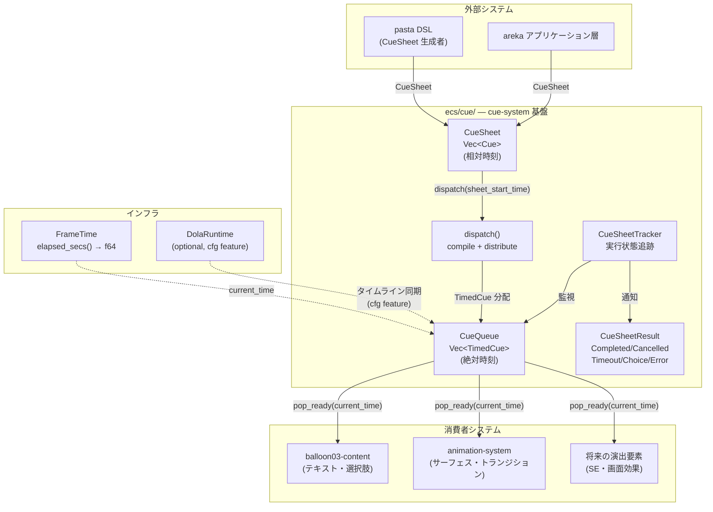
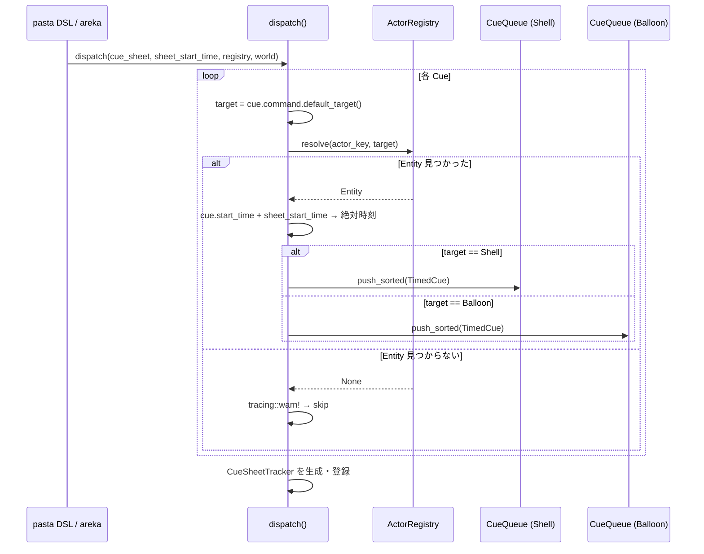
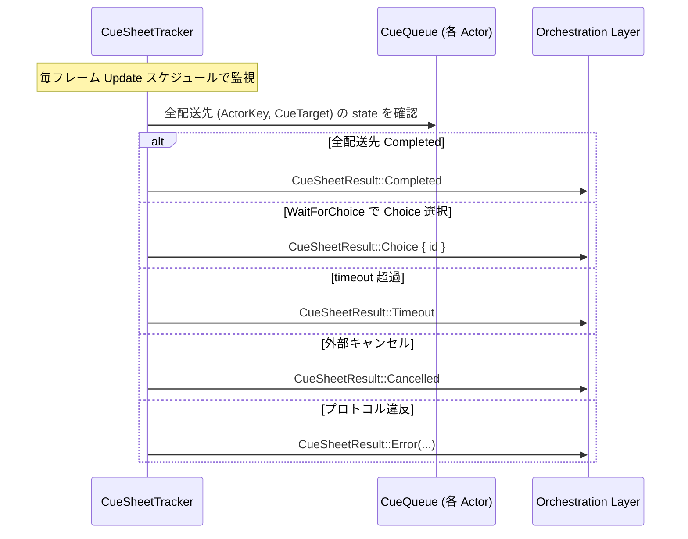
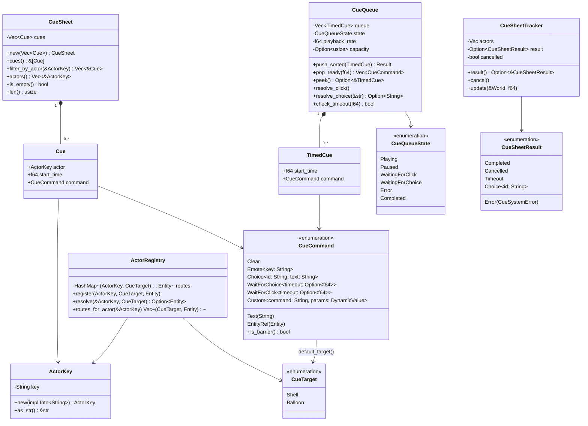

# 設計ドキュメント: wintf-P0-cue-system

| 項目               | 内容                                         |
| ------------------ | -------------------------------------------- |
| **Document Title** | wintf キューシステム（cue-system）技術設計書 |
| **Version**        | 1.0                                          |
| **Date**           | 2026-02-27                                   |
| **Requirements**   | v2.2（9 Req + 3 NFR）                       |
| **Status**         | 📐 Generated                                |

---

## Overview

**Purpose**: 本設計は、演出指令（キュー）の構造化定義・配送・消費メカニズムを ECS コンポーネントとして確立する。さくらスクリプトが果たしていた「コンテンツ再生を指示するミニ言語」の役割を、型安全な Rust enum + 絶対時刻キーフレーム方式で再構成する。

**Users**: pasta DSL / areka アプリケーション層が CueSheet を生成し、balloon03-content / animation-system 等の消費者システムが CueQueue からコマンドを時刻ベースで消費する。

**Impact**: 既存の TypewriterToken / TypewriterTalk パターンとは独立した新規モジュール `ecs/cue/` を追加。既存コードへの変更なし。

### Goals

- CueSheet → dispatch(compile) → CueQueue の3層パイプラインを型安全に実装
- dola の思想（宣言的構造 → コンパイル → 時刻ベース実行）を対話的台本の領域で実現
- 消費者（balloon, animation）が共通基盤上で独立消費できるプロトコルを確立
- CueSheetResult によるフィーチャー実行モデル（Modal Dialog パターン）を提供

### Non-Goals

- TypewriterToken / TypewriterTalk の変更・置換（段階的共存、DD6-b）
- 具体的な描画・音声再生実装（消費者仕様の責務）
- pasta DSL パーサー / コンパイラの実装（外部リポジトリ）
- dola ランタイムの実装（dola クレートの責務）
- CueSheet のシリアライズ / デシリアライズ（将来拡張）

---

## Architecture

### Existing Architecture Analysis

#### 既存パターンの継承

| パターン | 既存実装 | cue-system での適用 |
|----------|----------|---------------------|
| SparseSet コンポーネント | `TypewriterTalk`, `DragConfig` 等 27件 | `CueQueue` コンポーネント |
| on_add フックチェーン | `Typewriter` → Visual + TypewriterTalk 自動挿入 | 配送トリガーに活用可能（DD7） |
| 2段階 IR | Stage 1 (TypewriterToken) → Stage 2 (TimelineItem) | CueSheet(相対) → CueQueue(絶対) の1段変換（DD9 により Stage 2 不要化） |
| FrameTime 絶対時刻 | `elapsed_secs() -> f64`（GetSystemTimePreciseAsFileTime ベース） | `pop_ready(current_time)` の時刻ソース |
| Changed\<T\> gotcha | `Mut<T>` は内容変更なしでも Changed 発火 | CueQueue 消費では Changed フィルタを使わない設計 |

#### 遵守すべき制約

- **レイヤー依存方向**: COM → ECS → Message Handling（cue-system は ECS レイヤー内で完結）
- **スケジュール順**: Input → **Update**（キュー消費） → PreLayout → ... → FrameFinalize
- **DeferredWorld 制約**: on_add フック内での World アクセスは限定的

### Architecture Pattern & Boundary Map



**Architecture Integration**:
- **選択パターン**: 新規独立モジュール `ecs/cue/`（Option B — gap-analysis 推奨案）
- **ドメイン/フィーチャー境界**: cue-system はウィジット横断的基盤として `ecs/widget/` の外に配置
- **既存パターン保持**: SparseSet, on_add hook, FrameTime, tracing ログレベル規約
- **新規コンポーネント**: CueQueue（消費コンテナ）, CueSheetTracker（実行追跡）
- **Steering 準拠**: structure.md のレイヤー依存方向、logging.md のログレベル、tech.md の thiserror 採用

### Technology Stack

| Layer | Choice / Version | Role in Feature | Notes |
|-------|------------------|-----------------|-------|
| ECS Framework | bevy_ecs 0.18.0 | コンポーネント・システム基盤 | SparseSet, on_add hooks, Changed\<T\> |
| 時刻管理 | FrameTime (f64秒) | 絶対時刻ソース | GetSystemTimePreciseAsFileTime ベース |
| エラー型 | thiserror 2 | CueSystemError 定義 | workspace 統一規約 |
| 動的値 | dola::DynamicValue | Custom コマンドパラメータ | JSON互換、Clone + Debug + Eq + Hash |
| ロギング | tracing | 構造化ログ | debug!/trace!/warn! |
| アニメーション統合 | dola (optional) | タイムライン同期 | `#[cfg(feature = "dola")]` |

---

## System Flows

### CueSheet 配送フロー（dispatch）



### CueQueue 消費フロー（pop_ready）

```mermaid
stateDiagram-v2
    [*] --> Idle: CueQueue 空
    Idle --> Playing: TimedCue 追加
    Playing --> Playing: pop_ready(current_time)<br/>時刻到達コマンドを返却
    Playing --> WaitingForClick: WaitForClick 到達
    Playing --> WaitingForChoice: WaitForChoice 到達
    WaitingForClick --> Playing: クリック入力受信<br/>or timeout 超過
    WaitingForChoice --> Playing: Choice 選択受信
    WaitingForChoice --> Error: 先行 Choice 0件
    Playing --> Completed: 全コマンド消費済み
    WaitingForClick --> Completed: timeout → Timeout通知
    Error --> [*]: CueSheetResult::Error
    Completed --> [*]: CueSheetResult::Completed
    Completed --> Playing: 新 CueSheet 配送（追記）
```

### CueSheetResult 通知フロー



---

## Requirements Traceability

| Requirement | Summary | Components | Interfaces | Flows |
|-------------|---------|------------|------------|-------|
| 1.1-1.8 | CueSheet 構造化台本 | CueSheet, Cue, ActorKey | `CueSheet::new()`, `filter_by_actor()` | — |
| 2.1-2.11 | CueCommand 8バリアント | CueCommand | enum pattern match | — |
| 3.1-3.9 | CueQueue コンポーネント | CueQueue, TimedCue | `push_sorted()`, `pop_ready()`, `peek()` | 消費フロー |
| 4.1-4.7 | CueSheet 配送 | dispatch(), ActorRegistry, CueTarget | `dispatch_cue_sheet_internal()` | 配送フロー |
| 5.1-5.6 | 消費プロトコル | CueQueueState | `pop_ready(current_time)` | 消費フロー |
| 6.1-6.4 | タイミング制御・dola統合 | CueQueue (playback_rate) | `#[cfg(feature = "dola")]` | — |
| 7.1-7.5 | コマンド拡張機構 | CueCommand::Custom | DynamicValue | — |
| 8.1-8.6 | エラーハンドリング | CueSystemError | thiserror | — |
| 9.1-9.7 | CueSheetResult フィーチャーモデル | CueSheetTracker, CueSheetResult | poll / Observer | 結果通知フロー |
| NFR-1 | パフォーマンス | CueQueue (Vec) | — | — |
| NFR-2 | デバッグ容易性 | 全型に Debug | tracing | — |
| NFR-3 | ECS 親和性 | SparseSet, bevy_ecs 0.18 | — | — |

---

## Components and Interfaces

### Component Summary

| Component | Domain/Layer | Intent | Req Coverage | Key Dependencies | Contracts |
|-----------|--------------|--------|--------------|------------------|-----------|
| CueSheet | cue/data | 構造化演出台本（相対時刻） | Req 1 | ActorKey, CueCommand | Data |
| Cue | cue/data | 個別演出指示 | Req 1 | ActorKey, CueCommand | Data |
| ActorKey | cue/data | 演者識別子 | Req 1, 4 | — | Data |
| CueCommand | cue/data | 型安全コマンド enum | Req 2, 7 | DynamicValue, Entity | Data |
| CueTarget | cue/data | コマンドのルーティング先 | Req 4 | — | Data |
| TimedCue | cue/data | 絶対時刻付きコマンド | Req 3 | CueCommand | Data |
| CueQueue | cue/component | エンティティキュー | Req 3, 5 | TimedCue, CueQueueState | State, Service |
| CueQueueState | cue/data | 消費状態 enum | Req 5 | — | Data |
| dispatch() | cue/system | 配送システム | Req 4 | CueSheet, ActorRegistry, CueQueue | Service |
| ActorRegistry | cue/resource | 演者ルーティング | Req 4 | ActorKey, CueTarget | Service |
| CueSheetTracker | cue/component | 実行状態追跡 | Req 9 | CueQueue, CueSheetResult | State |
| CueSheetResult | cue/data | 実行結果 | Req 9 | CueSystemError | Data |
| CueSystemError | cue/data | 構造化エラー | Req 8, 9 | thiserror | Data |

### cue/data — データモデル層

#### CueSheet

| Field | Detail |
|-------|--------|
| Intent | 複数演者への構造化演出台本を表現する純粋データ型 |
| Requirements | 1.1, 1.2, 1.3, 1.4, 1.5, 1.6, 1.7, 1.8 |

**Responsibilities & Constraints**
- CueSheet は `Vec<Cue>` のニュータイプラッパー（メタデータフィールドなし — Req 1 AC1 確定）
- 内部の Cue は `start_time` 昇順で保持（同一時刻は挿入順で安定ソート）
- CueSheet は CueQueue ローカル座標系（相対秒数）を使用。世界絶対時刻への変換は dispatch() の責務

**Dependencies**
- Inbound: pasta DSL / areka（CueSheet 生成） — P0
- Outbound: dispatch()（配送） — P0

##### Data Contract

```rust
/// 構造化演出台本（相対時刻）
///
/// # dola 思想との対応
/// CueSheet ≈ dola::Document/Storyboard（宣言的、相対時刻）
#[derive(Debug, Clone)]
pub struct CueSheet(Vec<Cue>);

impl CueSheet {
    /// Cue 列から CueSheet を生成（start_time 昇順ソート + 安定ソート）
    pub fn new(mut cues: Vec<Cue>) -> Self {
        cues.sort_by(|a, b| {
            a.start_time
                .partial_cmp(&b.start_time)
                .unwrap_or(std::cmp::Ordering::Equal)
        });
        Self(cues)
    }

    /// 全 Cue のスライス参照
    pub fn cues(&self) -> &[Cue] {
        &self.0
    }

    /// 指定演者の Cue のみをフィルタリング抽出
    pub fn filter_by_actor(&self, actor: &ActorKey) -> Vec<&Cue> {
        self.0.iter().filter(|c| &c.actor == actor).collect()
    }

    /// CueSheet 内の一意な ActorKey 一覧を取得
    pub fn actors(&self) -> Vec<&ActorKey> {
        let mut seen = Vec::new();
        for cue in &self.0 {
            if !seen.contains(&&cue.actor) {
                seen.push(&cue.actor);
            }
        }
        seen
    }

    /// CueSheet が空かどうか
    pub fn is_empty(&self) -> bool {
        self.0.is_empty()
    }

    /// Cue の数
    pub fn len(&self) -> usize {
        self.0.len()
    }
}
```

#### Cue

```rust
/// 個別の演出指示（CueSheet ローカル座標系）
#[derive(Debug, Clone)]
pub struct Cue {
    /// 対象演者
    pub actor: ActorKey,
    /// CueSheet 開始時点からの相対秒数
    pub start_time: f64,
    /// 演出コマンド
    pub command: CueCommand,
}
```

#### ActorKey — DD1 決定: NewType(String)

| Field | Detail |
|-------|--------|
| Intent | 演者を一意に識別するキー型 |
| Requirements | 1.2, 4.3, 4.6 |

**設計判断 DD1**: `NewType(String)` を採用。

| 選択肢 | 評価 | 理由 |
|---------|------|------|
| (a) `String` | ❌ | 型安全性なし。演者キーと他の文字列の混同リスク |
| **(b) `NewType(String)`** | **✅ 採用** | 型安全。pasta DSL からの文字列変換が自然。`From<&str>` で ergonomic |
| (c) `Entity` 直接 | ❌ | CueSheet 生成時に Entity が必要 → pasta DSL から使用困難 |

```rust
/// 演者識別キー（NewType パターン）
///
/// pasta DSL のキャラクター名（`"sakura"`, `"unyu"`）から直接変換可能。
/// さくらスクリプトの `\0`, `\1` に相当するが、名前ベースで直感的。
#[derive(Debug, Clone, PartialEq, Eq, Hash)]
pub struct ActorKey(String);

impl ActorKey {
    pub fn new(key: impl Into<String>) -> Self {
        Self(key.into())
    }

    pub fn as_str(&self) -> &str {
        &self.0
    }
}

impl<S: Into<String>> From<S> for ActorKey {
    fn from(s: S) -> Self {
        Self(s.into())
    }
}

impl std::fmt::Display for ActorKey {
    fn fmt(&self, f: &mut std::fmt::Formatter<'_>) -> std::fmt::Result {
        write!(f, "{}", self.0)
    }
}
```

#### CueCommand — 8バリアント確定

| Field | Detail |
|-------|--------|
| Intent | 演出指示を型安全に表現する基盤コマンド型 |
| Requirements | 2.1-2.11, 7.1-7.5 |

**DD10 確定**: 純粋データ列哲学。Wait バリアントなし（start_time 差分でタイミング表現）。
**DD12 確定**: Custom パラメータは `dola::DynamicValue`（Clone + Debug 互換、JSON 変換可能）。

```rust
use dola::DynamicValue;

/// 型安全な演出コマンド enum（8バリアント）
///
/// # データとバリアの分離思想
/// - データコマンド: Text, Clear, Emote, Choice, EntityRef, Custom
/// - バリアコマンド: WaitForChoice, WaitForClick
///
/// バリアコマンドが到達するとタイムライン進行がブロックされ、
/// 外部入力を待つ。データコマンドは即時消費される。
#[derive(Debug, Clone)]
pub enum CueCommand {
    /// テキスト表示（意味解釈は消費者の責務）
    ///
    /// バルーンの場合: タイプライター表示の対象テキスト
    /// アニメーションの場合: ラベル表示等
    Text(String),

    /// コンテンツクリア
    ///
    /// バルーンの場合: テキスト全消去
    Clear,

    /// 演技発現（キーの意味解釈は消費者の責務）
    ///
    /// バルーンの場合: 感情値キー → BalloonStyleMap 切替
    /// アニメーションの場合: サーフェス切替キー
    Emote { key: String },

    /// 選択肢データ（先積み）
    ///
    /// WaitForChoice の前に連続投入し、選択肢群を構成する。
    /// id はユーザー選択結果を CueSheetResult::Choice { id } で通知する際の識別子。
    Choice { id: String, text: String },

    /// 選択肢バリア（ブロッキング）
    ///
    /// 到達時に直前の Choice 群を選択肢として提示しブロック開始。
    /// 先行 Choice が 0 件の場合は CueSheetResult::Error を発行。
    WaitForChoice { timeout: Option<f64> },

    /// クリック待ちバリア（ブロッキング）
    ///
    /// ユーザーのクリック入力またはタイムアウトまでブロック。
    WaitForClick { timeout: Option<f64> },

    /// ECS エンティティ渡し
    ///
    /// 消費者が Entity を解釈して処理する。
    /// 例: アニメーション対象のサーフェスエンティティ参照
    EntityRef(bevy_ecs::entity::Entity),

    /// 消費者固有コマンド
    ///
    /// command 文字列で分岐し、自ドメイン以外のコマンドは安全にスキップする。
    /// params に DynamicValue::Null を使用すれば引数なしコマンドを表現可能。
    ///
    /// # 使用例（バルーン向け）
    /// ```ignore
    /// CueCommand::Custom {
    ///     command: "balloon.font_size".into(),
    ///     params: DynamicValue::Integer(24),
    /// }
    /// ```
    ///
    /// # 使用例（アニメーション向け）
    /// ```ignore
    /// CueCommand::Custom {
    ///     command: "anim.transition".into(),
    ///     params: DynamicValue::Map(BTreeMap::from([
    ///         ("from".into(), DynamicValue::Integer(0)),
    ///         ("to".into(), DynamicValue::Integer(5)),
    ///         ("duration".into(), DynamicValue::Float(0.3)),
    ///     ])),
    /// }
    /// ```
    Custom { command: String, params: DynamicValue },
}

impl CueCommand {
    /// バリアコマンド（タイムライン進行をブロックするコマンド）かどうか
    pub fn is_barrier(&self) -> bool {
        matches!(self, CueCommand::WaitForChoice { .. } | CueCommand::WaitForClick { .. })
    }

    /// コマンドのデフォルトルーティング先
    ///
    /// dispatch 時に ActorRegistry で (ActorKey, CueTarget) → Entity を解決する際に使用。
    /// Custom コマンドはプレフィックス規約で判定。
    pub fn default_target(&self) -> CueTarget {
        match self {
            // バルーン向け: テキスト表示・選択肢・ブロッキング
            CueCommand::Text(_) => CueTarget::Balloon,
            CueCommand::Clear => CueTarget::Balloon,
            CueCommand::Choice { .. } => CueTarget::Balloon,
            CueCommand::WaitForChoice { .. } => CueTarget::Balloon,
            CueCommand::WaitForClick { .. } => CueTarget::Balloon,
            // シェル向け: サーフェス・感情・アニメーション
            CueCommand::Surface { .. } => CueTarget::Shell,
            CueCommand::Emote { .. } => CueTarget::Shell,
            CueCommand::EntityRef(_) => CueTarget::Shell,
            // Custom: プレフィックス規約で判定
            CueCommand::Custom { command, .. } => {
                if command.starts_with("balloon.") {
                    CueTarget::Balloon
                } else {
                    CueTarget::Shell
                }
            }
        }
    }
}

#### CueTarget

```rust
/// CueCommand のルーティング先種別
///
/// 演者は複数の CueQueue 配信先を持つ。
/// 例: 「さくら」は Shell（体）と Balloon（言葉）の両方に CueQueue を持つ。
///
/// # バルーン共有
/// 複数の演者が同一の Balloon エンティティを共有できる。
/// 例: ("sakura", Balloon) と ("unyuu", Balloon) が同一 Entity を指す構成。
#[derive(Debug, Clone, Copy, PartialEq, Eq, Hash)]
pub enum CueTarget {
    /// シェル（体・サーフェス・感情・アニメーション）
    Shell,
    /// バルーン（テキスト・選択肢・ブロッキング）
    Balloon,
}
```
```

**メモリサイズ見積もり**（NFR-1 AC3）:

| バリアント | フィールドサイズ | 備考 |
|------------|------------------|------|
| Text(String) | 24 bytes | String = ptr + len + cap |
| Clear | 0 bytes | unit |
| Emote { key } | 24 bytes | String |
| Choice { id, text } | 48 bytes | String × 2 |
| WaitForChoice { timeout } | 16 bytes | Option\<f64\> |
| WaitForClick { timeout } | 16 bytes | Option\<f64\> |
| EntityRef(Entity) | 8 bytes | Entity = u64 |
| Custom { command, params } | 24 + 56 bytes | String + DynamicValue(最大) |

enum 全体サイズ: **discriminant(8) + 最大バリアント(Choice: 48) = 56 bytes**（推定）。
TimedCue = `start_time(8) + CueCommand(56) = 64 bytes` → **NFR-1 AC4: 64バイト制約に適合**。

> 正確なサイズは `static_assert!(size_of::<TimedCue>() <= 64)` でコンパイル時検証する。

#### TimedCue

```rust
/// 絶対時刻付きコマンド（CueQueue のエントリ）
///
/// # dola 思想との対応
/// TypewriterTimeline::TimelineItem の show_at/start_at/fire_at に相当。
/// cue-system では統一された start_time フィールドで一元管理。
#[derive(Debug, Clone)]
pub struct TimedCue {
    /// 世界絶対時刻（秒）
    pub start_time: f64,
    /// 演出コマンド
    pub command: CueCommand,
}

impl TimedCue {
    pub fn new(start_time: f64, command: CueCommand) -> Self {
        Self { start_time, command }
    }
}
```

#### CueQueueState

```rust
/// CueQueue の消費状態
///
/// TypewriterState (Playing/Paused/Completed) を汎用化し、
/// WaitingForClick / WaitingForChoice / Error を追加。
#[derive(Debug, Clone, PartialEq, Default)]
pub enum CueQueueState {
    /// 時刻到達コマンドを消費中
    #[default]
    Playing,
    /// 一時停止中（外部からの resume 待ち）
    Paused,
    /// クリック入力待ちブロック中
    WaitingForClick {
        /// ブロック開始時刻（タイムアウト計算用）
        blocked_at: f64,
        /// タイムアウト秒数（None = 無制限）
        timeout: Option<f64>,
    },
    /// 選択肢入力待ちブロック中
    WaitingForChoice {
        /// ブロック開始時刻
        blocked_at: f64,
        /// タイムアウト秒数
        timeout: Option<f64>,
        /// 提示中の選択肢群（Choice コマンドから収集）
        choices: Vec<PendingChoice>,
    },
    /// プロトコル違反によるエラー状態
    ///
    /// この状態になると以降の消費は停止され、CueSheetTracker が
    /// CueSheetResult::Error に変換する。
    Error(CueSystemError),
    /// 全コマンド消費済み
    Completed,
}

/// 提示中の選択肢
#[derive(Debug, Clone)]
pub struct PendingChoice {
    pub id: String,
    pub text: String,
}
```

#### CueSheetResult

```rust
/// CueSheet の実行結果（Modal Dialog パターン）
///
/// 1 CueSheet = 1 フィーチャー実行単位。
/// 上位のオーケストレーション層がこの結果を await して次の処理に分岐する。
#[derive(Debug, Clone)]
pub enum CueSheetResult {
    /// 全演者の CueQueue が消費完了
    Completed,
    /// 外部からのキャンセル
    Cancelled,
    /// WaitForClick / WaitForChoice のタイムアウト超過
    Timeout,
    /// ユーザーが選択肢を選択
    Choice { id: String },
    /// システムエラー（プロトコル違反等）
    Error(CueSystemError),
}
```

#### CueSystemError

```rust
use thiserror::Error;

/// cue-system の構造化エラー型
#[derive(Debug, Clone, Error)]
pub enum CueSystemError {
    /// WaitForChoice 消費時に先行 Choice が 0 件
    #[error("Empty choice barrier for actor '{actor}': WaitForChoice reached with no preceding Choice commands")]
    EmptyChoiceBarrier { actor: String },

    /// (ActorKey, CueTarget) の解決に失敗（warn ログ用、配送は継続）
    #[error("Actor '{key}' with target '{target:?}' not found in registry")]
    ActorNotFound { key: String, target: CueTarget },

    /// CueQueue キャパシティ超過
    #[error("CueQueue capacity exceeded for actor '{actor}': limit={limit}, attempted={attempted}")]
    CapacityExceeded {
        actor: String,
        limit: usize,
        attempted: usize,
    },
}
```

### cue/component — ECS コンポーネント層

#### CueQueue

| Field | Detail |
|-------|--------|
| Intent | 各演者エンティティの時刻付き演出指示キュー |
| Requirements | 3.1-3.9, 5.1-5.6 |

**Responsibilities & Constraints**
- `Vec<TimedCue>` をソート済みで保持（start_time 昇順）
- 経過時刻を管理しない（消費時に外部から `current_time` を受け取る — dola 思想）
- SparseSet ストレージ（動的追加/削除が頻繁）
- CueQueue 自身は消費ロジックを持たない（消費プロトコルは `pop_ready()` API で提供）

**Dependencies**
- Inbound: dispatch()（TimedCue の追加） — P0
- Outbound: 消費者システム（`pop_ready()` 経由のコマンド取得） — P0
- Infra: FrameTime（current_time の提供元） — P0

**データ構造選択 — DD9 固有の決定**:

| 選択肢 | push | pop | peek | 選定理由 |
|---------|------|-----|------|----------|
| BinaryHeap\<Reverse\> | O(log n) | O(log n) | O(1) | 標準的だが pop 後の同一時刻一括消費が不便 |
| **Vec\<TimedCue\> ソート済み** | **O(log n)** | **O(1) 償却** | **O(1)** | **キャッシュフレンドリー。実用キュー長で最速** |
| VecDeque ソート済み | O(n) | O(1) | O(1) | pop_front は O(1) だが insert が O(n) |

**採用: Vec\<TimedCue\> ソート済み（逆順保持）**

実用上のキュー長は数十〜数百件。Vec の連続メモリ配置はキャッシュ効率で BinaryHeap を上回る。`start_time` 降順で保持し、末尾（最小時刻）から `pop()` することで O(1) 消費を実現する。挿入は `binary_search_by()` + `insert()` で O(log n) 探索 + O(n) シフトだが、実用キュー長では問題にならない。

> **gap-analysis の BinaryHeap 推奨を修正**: 実用観点で Vec のほうが適切。BinaryHeap は同一時刻の一括消費パターンとの相性が悪い（peek で1件しか見えず、pop 後に再ヒープ化が必要）。Vec は末尾から走査で同一時刻コマンドを効率的に一括消費できる。

##### Service Interface

```rust
/// エンティティキュー — 時刻付き演出指示の消費コンテナ
///
/// # dola 思想との対応
/// CueQueue ≈ dola::Runtime（実行可能形式）
/// pop_ready(current_time) ≈ dola::playback()
///
/// # メモリ戦略
/// Vec<TimedCue> を start_time **降順**で保持。
/// 末尾が最小時刻（次に消費すべきコマンド）。
/// pop() で O(1) 消費、binary_search + insert で O(log n + n) 挿入。
#[derive(Component, Debug, Clone)]
#[component(storage = "SparseSet")]
pub struct CueQueue {
    /// TimedCue 列（start_time 降順）
    queue: Vec<TimedCue>,
    /// 消費状態
    state: CueQueueState,
    /// 再生速度倍率（1.0 = 通常速度）
    playback_rate: f64,
    /// オプショナルなキャパシティ上限
    capacity: Option<usize>,
    /// WaitForChoice 前に収集した Choice コマンド群（一時バッファ）
    pending_choices: Vec<PendingChoice>,
}

impl CueQueue {
    /// 空のキューを生成
    pub fn new() -> Self {
        Self {
            queue: Vec::new(),
            state: CueQueueState::Playing,
            playback_rate: 1.0,
            capacity: None,
            pending_choices: Vec::new(),
        }
    }

    /// キャパシティ付きで生成
    pub fn with_capacity(capacity: usize) -> Self {
        Self {
            queue: Vec::with_capacity(capacity),
            capacity: Some(capacity),
            ..Self::new()
        }
    }

    // === 挿入 API ===

    /// 時刻順を維持して TimedCue を挿入
    ///
    /// start_time 降順の Vec に対して binary_search で挿入位置を特定。
    /// 同一時刻のコマンドは挿入順（= 末尾寄り）で安定。
    pub fn push_sorted(&mut self, timed_cue: TimedCue) -> Result<(), CueSystemError> {
        if let Some(cap) = self.capacity {
            if self.queue.len() >= cap {
                return Err(CueSystemError::CapacityExceeded {
                    actor: String::new(), // 呼び出し元で補完
                    limit: cap,
                    attempted: self.queue.len() + 1,
                });
            }
        }
        // 降順保持: 大きい start_time が先頭、小さいのが末尾
        let pos = self.queue.partition_point(|existing| {
            existing.start_time > timed_cue.start_time
        });
        self.queue.insert(pos, timed_cue);
        // 挿入により Idle → Playing 遷移
        if self.state == CueQueueState::Completed {
            self.state = CueQueueState::Playing;
        }
        Ok(())
    }

    /// 複数の TimedCue を一括挿入（配送時のバッチ用）
    pub fn extend_sorted(&mut self, cues: impl IntoIterator<Item = TimedCue>) -> Result<(), CueSystemError> {
        for cue in cues {
            self.push_sorted(cue)?;
        }
        Ok(())
    }

    // === 消費 API ===

    /// 時刻到達済みの先頭コマンドを全て取得・除去
    ///
    /// current_time ≥ start_time のコマンドを末尾から pop。
    /// 同一 start_time のコマンドはフレーム内で一括消費される。
    ///
    /// # バリアコマンドの処理
    /// - WaitForClick: state を WaitingForClick に遷移、以降の pop を中断
    /// - WaitForChoice: pending_choices を収集し WaitingForChoice に遷移
    /// - Choice: pending_choices に蓄積（消費者には返さない）
    ///
    /// # Returns
    /// 消費可能なコマンド列（Choice を除く）
    pub fn pop_ready(&mut self, current_time: f64) -> Vec<CueCommand> {
        // ブロック中またはエラー状態では消費しない
        match &self.state {
            CueQueueState::Playing => {}
            CueQueueState::Paused => return Vec::new(),
            CueQueueState::WaitingForClick { .. } => return Vec::new(),
            CueQueueState::WaitingForChoice { .. } => return Vec::new(),
            CueQueueState::Error(_) => return Vec::new(),
            CueQueueState::Completed => return Vec::new(),
        }

        let mut commands = Vec::new();

        while let Some(tail) = self.queue.last() {
            if tail.start_time > current_time {
                break;
            }
            let timed_cue = self.queue.pop().unwrap();

            match timed_cue.command {
                CueCommand::Choice { ref id, ref text } => {
                    // Choice はバッファに蓄積（消費者には返さない）
                    self.pending_choices.push(PendingChoice {
                        id: id.clone(),
                        text: text.clone(),
                    });
                }
                CueCommand::WaitForChoice { timeout } => {
                    // バリア: 先行 Choice 群を収集してブロック
                    let choices = std::mem::take(&mut self.pending_choices);
                    if choices.is_empty() {
                        // プロトコル違反 → Error 状態に遷移
                        // ActorKey 情報は CueQueue が持たないため、
                        // actor フィールドは空文字列で仮置き。
                        // CueSheetTracker::update() で補完される。
                        self.state = CueQueueState::Error(
                            CueSystemError::EmptyChoiceBarrier {
                                actor: String::new(),
                            }
                        );
                    } else {
                        self.state = CueQueueState::WaitingForChoice {
                            blocked_at: current_time,
                            timeout,
                            choices,
                        };
                    }
                    break; // バリア到達またはエラーで消費中断
                }
                CueCommand::WaitForClick { timeout } => {
                    self.state = CueQueueState::WaitingForClick {
                        blocked_at: current_time,
                        timeout,
                    };
                    break; // バリア到達で消費中断
                }
                other => {
                    commands.push(other);
                }
            }
        }

        // 全コマンド消費済み + Playing 状態 → Completed
        if self.queue.is_empty() && self.state == CueQueueState::Playing {
            self.state = CueQueueState::Completed;
        }

        commands
    }

    /// 先頭（次に消費すべき）コマンドを参照（除去しない）
    pub fn peek(&self) -> Option<&TimedCue> {
        self.queue.last()
    }

    /// 次のコマンドの start_time を取得
    pub fn next_start_time(&self) -> Option<f64> {
        self.queue.last().map(|tc| tc.start_time)
    }

    // === 状態 API ===

    /// 消費状態を取得
    pub fn state(&self) -> &CueQueueState {
        &self.state
    }

    /// キューが空かどうか
    pub fn is_empty(&self) -> bool {
        self.queue.is_empty()
    }

    /// キュー内のコマンド数
    pub fn len(&self) -> usize {
        self.queue.len()
    }

    /// 全コマンドを消去
    pub fn clear(&mut self) {
        self.queue.clear();
        self.pending_choices.clear();
        self.state = CueQueueState::Completed;
    }

    // === 制御 API ===

    /// 一時停止
    pub fn pause(&mut self) {
        if self.state == CueQueueState::Playing {
            self.state = CueQueueState::Paused;
        }
    }

    /// 再開
    pub fn resume(&mut self) {
        if self.state == CueQueueState::Paused {
            self.state = CueQueueState::Playing;
        }
    }

    /// クリック入力を受信（WaitingForClick 解除）
    pub fn resolve_click(&mut self) {
        if matches!(self.state, CueQueueState::WaitingForClick { .. }) {
            self.state = CueQueueState::Playing;
        }
    }

    /// 選択肢選択を受信（WaitingForChoice 解除）
    ///
    /// # Returns
    /// 選択された Choice の id（CueSheetResult::Choice に使用）
    pub fn resolve_choice(&mut self, choice_id: &str) -> Option<String> {
        if let CueQueueState::WaitingForChoice { choices, .. } = &self.state {
            let found = choices.iter().any(|c| c.id == choice_id);
            if found {
                self.state = CueQueueState::Playing;
                return Some(choice_id.to_string());
            }
        }
        None
    }

    /// タイムアウトチェック（WaitingForClick / WaitingForChoice 用）
    ///
    /// # Returns
    /// タイムアウトした場合 true
    pub fn check_timeout(&mut self, current_time: f64) -> bool {
        match &self.state {
            CueQueueState::WaitingForClick { blocked_at, timeout: Some(t) } => {
                if current_time - blocked_at >= *t {
                    self.state = CueQueueState::Playing;
                    return true;
                }
            }
            CueQueueState::WaitingForChoice { blocked_at, timeout: Some(t), .. } => {
                if current_time - blocked_at >= *t {
                    self.state = CueQueueState::Playing;
                    return true;
                }
            }
            _ => {}
        }
        false
    }

    /// 再生速度倍率を設定
    pub fn set_playback_rate(&mut self, rate: f64) {
        self.playback_rate = rate;
    }

    /// 再生速度倍率を取得
    pub fn playback_rate(&self) -> f64 {
        self.playback_rate
    }

    /// 提示中の選択肢を取得（WaitingForChoice 中のみ）
    pub fn pending_choices(&self) -> Option<&[PendingChoice]> {
        if let CueQueueState::WaitingForChoice { choices, .. } = &self.state {
            Some(choices)
        } else {
            None
        }
    }
}
```

### cue/system — システム層

#### dispatch() — 配送関数

| Field | Detail |
|-------|--------|
| Intent | CueSheet を絶対時刻化して各演者の CueQueue に分配する |
| Requirements | 4.1-4.7 |

**設計判断 DD7**: PendingCueSheet コンポーネント方式を採用。

DD7 で検討した3方式:
- (a) `PendingCueSheet` コンポーネント → dispatch システムで処理
- (b) `dispatch_cue_sheet()` 関数呼び出し（排他的 &mut World）
- **(c) 両方（コンポーネント投入 + 内部ヘルパー関数）→ 採用**

**DD7-c を採用する理由**:
- **通常のシステムから呼び出し可能**: `commands.spawn(PendingCueSheet)` で投入できる
- **独立短命エンティティパターン**: CueSheet は配送処理中のみ存在する一時エンティティとして自然
- **排他制御不要**: dispatch システムは Query/Commands で実装でき、他システムと並列実行可能
- **ECS 親和性**: bevy_ecs の Component-based 設計に沿った実装
- gap-analysis DD7-c の推奨に従う（当初の DD7-b 理由「親エンティティが不自然」は誤解、PendingCueSheet は独立エンティティとして使用）

#### PendingCueSheet — 配送待ちコンポーネント

```rust
/// 配送待ちの CueSheet（独立短命エンティティに付与）
///
/// # Usage
/// ```ignore
/// // 通常のシステムから投入
/// commands.spawn(PendingCueSheet {
///     sheet: cue_sheet,
///     start_time: frame_time.elapsed_secs(),
/// });
/// ```
#[derive(Component, Debug)]
#[component(storage = "SparseSet")]
pub struct PendingCueSheet {
    pub sheet: CueSheet,
    pub start_time: f64,
}
```

#### dispatch_pending_cue_sheets システム

```rust
/// PendingCueSheet を処理し、各演者の CueQueue に配送
///
/// Update スケジュールで実行される。
/// 配送完了後、PendingCueSheet エンティティを despawn し、
/// CueSheetTracker エンティティを spawn する。
pub fn dispatch_pending_cue_sheets(
    mut pending: Query<(Entity, &PendingCueSheet)>,
    mut queues: Query<&mut CueQueue>,
    registry: Res<ActorRegistry>,
    mut commands: Commands,
) {
    for (entity, pending) in pending.iter() {
        let handle = dispatch_cue_sheet_internal(
            &pending.sheet,
            pending.start_time,
            &registry,
            &mut queues,
        );
        
        // CueSheetTracker を spawn
        commands.spawn(CueSheetTracker::new(handle));
        
        // PendingCueSheet エンティティを削除
        commands.entity(entity).despawn();
    }
}
```

#### dispatch_cue_sheet_internal — 内部ヘルパー

```rust
/// CueSheet 配送結果
pub struct CueSheetHandle {
    /// 配送先のエンティティリスト（重複なし）
    pub targets: Vec<(ActorKey, CueTarget, bevy_ecs::entity::Entity)>,
    /// ルーティング解決に失敗した (ActorKey, CueTarget) ペア
    pub skipped: Vec<(ActorKey, CueTarget)>,
}

/// CueSheet を各演者の CueQueue に配送（内部ヘルパー）
///
/// # dola 思想との対応
/// dispatch() ≈ dola::compile()（相対時刻を絶対時刻にコンパイル）
///
/// # Process
/// 1. 各 Cue の CueCommand::default_target() でルーティング先を決定
/// 2. (ActorKey, CueTarget) を ActorRegistry で Entity に解決
/// 3. cue.start_time + sheet_start_time で世界絶対時刻を算出
/// 4. Entity の CueQueue に push_sorted()
///
/// # Routing Example
/// ```text
/// Cue { actor: "sakura", cmd: Text("hello") }
///   → default_target() = Balloon
///   → registry.resolve("sakura", Balloon) → balloon_entity
///   → balloon_entity.CueQueue.push_sorted(...)
///
/// Cue { actor: "sakura", cmd: Emote { key: "smile" } }
///   → default_target() = Shell
///   → registry.resolve("sakura", Shell) → sakura_shell_entity
///   → sakura_shell_entity.CueQueue.push_sorted(...)
/// ```
///
/// # Error Handling
/// - (ActorKey, CueTarget) 未解決: warn! ログ + スキップ（他は継続）
/// - CueQueue キャパシティ超過: warn! ログ + 超過分スキップ
/// - 空 CueSheet: no-op（エラーなし）
fn dispatch_cue_sheet_internal(
    cue_sheet: &CueSheet,
    sheet_start_time: f64,
    registry: &ActorRegistry,
    queues: &mut Query<&mut CueQueue>,
) -> CueSheetHandle {
    // Implementation: see Tasks
    todo!()
}
```

#### ActorRegistry — DD2 決定: (ActorKey, CueTarget) → Entity ルーティングマップ

| Field | Detail |
|-------|--------|
| Intent | (ActorKey, CueTarget) ペアから Entity へのルーティングを提供する |
| Requirements | 4.3, 4.6 |

**設計判断 DD2**: HashMap\<(ActorKey, CueTarget), Entity\> ルーティングマップを採用。

| 選択肢 | 評価 | 理由 |
|---------|------|------|
| (a) HashMap\<ActorKey, Entity\> | ❌ | 1演者 = 1エンティティの仮定。Shell/Balloon 分離不可 |
| **(b) HashMap\<(ActorKey, CueTarget), Entity\>** | **✅ 採用** | O(1) 解決。演者×ターゲットの多対多ルーティング。バルーン共有対応 |
| (c) Query\<(Entity, &ActorMarker)\> | ❌ | 毎フレームのクエリが不要（配送はイベント駆動） |

**設計ポイント**:
- 1演者 = 複数の CueQueue 配信先（Shell + Balloon）
- バルーン共有: 複数演者が同一 Balloon エンティティを共有可能
- CueCommand::default_target() でコマンド種別から㏫ーティング先を自動決定

```rust
use bevy_ecs::prelude::*;
use std::collections::HashMap;

/// 演者ルーティングレジストリ — (ActorKey, CueTarget) から Entity への解決
///
/// 1演者が複数の CueQueue 配信先を持つ。
/// バルーン共有: 複数の演者が同一の Balloon エンティティを共有できる。
///
/// ```ignore
/// // セットアップ例: さくらとうにゅうがバルーンを共有
/// registry.register("sakura", CueTarget::Shell, sakura_shell_entity);
/// registry.register("sakura", CueTarget::Balloon, balloon_0_entity);
/// registry.register("unyuu", CueTarget::Shell, unyuu_shell_entity);
/// registry.register("unyuu", CueTarget::Balloon, balloon_0_entity); // 共有!
/// ```
#[derive(Resource, Debug, Default)]
pub struct ActorRegistry {
    routes: HashMap<(ActorKey, CueTarget), Entity>,
}

impl ActorRegistry {
    /// 演者のルーティングを登録
    pub fn register(
        &mut self,
        key: impl Into<ActorKey>,
        target: CueTarget,
        entity: Entity,
    ) {
        self.routes.insert((key.into(), target), entity);
    }

    /// 演者のルーティングを解除
    pub fn unregister(&mut self, key: &ActorKey, target: CueTarget) -> Option<Entity> {
        self.routes.remove(&(key.clone(), target))
    }

    /// (ActorKey, CueTarget) から Entity を解決
    pub fn resolve(&self, key: &ActorKey, target: CueTarget) -> Option<Entity> {
        self.routes.get(&(key.clone(), target)).copied()
    }

    /// 指定演者の全ルーティングを取得
    pub fn routes_for_actor(&self, key: &ActorKey) -> Vec<(CueTarget, Entity)> {
        self.routes
            .iter()
            .filter(|((k, _), _)| k == key)
            .map(|((_, t), e)| (*t, *e))
            .collect()
    }

    /// 登録済みの全ルーティングを取得
    pub fn all_routes(&self) -> &HashMap<(ActorKey, CueTarget), Entity> {
        &self.routes
    }
}
```

#### CueSheetTracker — DD11 決定: Component Poll 方式

| Field | Detail |
|-------|--------|
| Intent | CueSheet の実行状態を追跡し、CueSheetResult を通知する |
| Requirements | 9.1-9.7 |

**設計判断 DD11**: Component Poll 方式を採用。

| 選択肢 | 評価 | 理由 |
|---------|------|------|
| (a) bevy Observer/Event | ❌ | bevy_ecs 0.18 の Observer は安定性が未検証。配送パターンの学習コストが高い |
| (b) bevy AsyncTask | ❌ | bevy_ecs の async 統合は不安定。ECS の外で Future を管理する複雑性 |
| **(c) Component Poll** | **✅ 採用** | TypewriterState::Completed パターンの自然な拡張。ECS の Changed\<T\> で検出可能。シンプルかつ確実 |

```rust
/// CueSheet 実行追跡コンポーネント
///
/// 配送時に生成され、全演者の CueQueue を監視する。
/// 上位層が `Changed<CueSheetTracker>` または毎フレーム poll で結果を取得。
///
/// # Modal Dialog パターン
/// ```ignore
/// // 配送
/// let handle = dispatch_cue_sheet(&sheet, start_time, &registry, world);
/// world.spawn(CueSheetTracker::new(handle));
///
/// // 毎フレーム poll（Update スケジュール）
/// for (entity, tracker) in query.iter() {
///     if let Some(result) = tracker.result() {
///         match result {
///             CueSheetResult::Completed => { /* 次の CueSheet へ */ }
///             CueSheetResult::Choice { id } => { /* 選択分岐 */ }
///             _ => {}
///         }
///         commands.entity(entity).despawn();
///     }
/// }
/// ```
#[derive(Component, Debug, Clone)]
#[component(storage = "SparseSet")]
pub struct CueSheetTracker {
    /// 追跡対象の配送先エンティティ（重複なし）
    targets: Vec<(ActorKey, CueTarget, bevy_ecs::entity::Entity)>,
    /// 実行結果（確定後に Some）
    result: Option<CueSheetResult>,
    /// キャンセルフラグ
    cancelled: bool,
}

impl CueSheetTracker {
    /// CueSheetHandle から生成
    pub fn new(handle: CueSheetHandle) -> Self {
        Self {
            targets: handle.targets,
            result: None,
            cancelled: false,
        }
    }

    /// 実行結果を取得（確定済みの場合 Some）
    pub fn result(&self) -> Option<&CueSheetResult> {
        self.result.as_ref()
    }

    /// 外部からキャンセル
    pub fn cancel(&mut self) {
        self.cancelled = true;
    }

    /// 追跡対象の配送先リスト
    pub fn targets(&self) -> &[(ActorKey, CueTarget, bevy_ecs::entity::Entity)] {
        &self.targets
    }

    /// 毎フレーム更新（Update システムから呼ばれる）
    ///
    /// 全配送先の CueQueue 状態を確認し、結果を確定する。
    pub fn update(&mut self, queues: &Query<&CueQueue>, current_time: f64) {
        if self.result.is_some() {
            return; // 既に確定済み
        }

        // キャンセルチェック
        if self.cancelled {
            self.result = Some(CueSheetResult::Cancelled);
            return;
        }

        // 全配送先の状態を確認
        let mut all_completed = true;
        for (actor_key, _target, entity) in &self.targets {
            if let Ok(queue) = queues.get(*entity) {
                match queue.state() {
                    CueQueueState::Error(err) => {
                        // Error 状態を検出 — actor 名を補完して即座に通知
                        let mut error = err.clone();
                        if let CueSystemError::EmptyChoiceBarrier { ref mut actor } = error {
                            *actor = actor_key.as_str().to_string();
                        }
                        self.result = Some(CueSheetResult::Error(error));
                        return;
                    }
                    CueQueueState::Completed => {} // OK
                    CueQueueState::WaitingForChoice { .. } => {
                        // 選択肢提示中 — まだ確定しない
                        all_completed = false;
                    }
                    CueQueueState::WaitingForClick { .. } => {
                        all_completed = false;
                    }
                    _ => {
                        all_completed = false;
                    }
                }
            }
            // Entity が despawn されていた場合は完了扱い
        }

        if all_completed {
            self.result = Some(CueSheetResult::Completed);
        }
    }
}
```

### モジュール構造 — DD5 決定: `ecs/cue/`

**設計判断 DD5**: `ecs/cue/` に配置（ウィジット横断的基盤）。

```
crates/wintf/src/ecs/
├── cue/
│   ├── mod.rs           ← re-exports, CueSheet, Cue, ActorKey, CueTarget
│   ├── command.rs       ← CueCommand enum（8バリアント）, CueTarget enum
│   ├── component.rs     ← PendingCueSheet コンポーネント
│   ├── queue.rs         ← CueQueue コンポーネント, TimedCue, CueQueueState
│   ├── dispatch.rs      ← dispatch_pending_cue_sheets システム, dispatch_cue_sheet_internal, ActorRegistry
│   ├── tracker.rs       ← CueSheetTracker, CueSheetResult
│   ├── error.rs         ← CueSystemError (thiserror)
│   └── tests.rs         ← in-source unit tests
├── widget/
│   └── text/
│       └── typewriter*.rs  ← 変更なし（DD6-b: 共存）
```

**mod.rs の re-export 構造**:

```rust
//! cue-system — 演出指令の構造化定義・配送・消費基盤
//!
//! # 設計メタファー: 舞台演出のキューシート
//! > 演劇シーンを与えたら、演者が演じてくれる
//!
//! # dola 思想の共有
//! CueSheet(相対時刻) → dispatch(compile) → CueQueue(絶対時刻) → pop_ready(consume)

mod command;
mod component;
mod dispatch;
mod error;
mod queue;
mod tracker;

pub use command::CueCommand;
pub use component::PendingCueSheet;
pub use dispatch::{dispatch_pending_cue_sheets, ActorRegistry, CueSheetHandle};
pub use error::CueSystemError;
pub use queue::{CueQueue, CueQueueState, PendingChoice, TimedCue};
pub use tracker::{CueSheetResult, CueSheetTracker};

/// 構造化演出台本（相対時刻）
// CueSheet, Cue, ActorKey は mod.rs に直接定義
// （小さい型は分離するほどでもない）
```

**ecs/mod.rs への追加**:

```rust
// 既存の mod 宣言に追加
pub mod cue;

// re-export に追加
pub use cue::{
    ActorKey, ActorRegistry, Cue, CueCommand, CueQueue, CueQueueState,
    CueSheet, CueSheetHandle, CueSheetResult, CueSheetTracker, CueSystemError,
    dispatch_cue_sheet,
};
```

---

## Data Models

### Domain Model



### 不変条件

1. **CueSheet 内の Cue は start_time 昇順**（`CueSheet::new()` でソート保証）
2. **CueQueue 内の TimedCue は start_time 降順**（`push_sorted()` で保持）
3. **Choice コマンドは WaitForChoice の前に連続配置**（プロトコル違反時は Error）
4. **CueQueueState の遷移は単方向**（Completed → Playing は新 CueSheet 配送時のみ許可）
5. **ActorKey は空文字列を許可しない**（バリデーションは生成者の責務）
6. **TimedCue の start_time は非負**（負値はコンパイルエラーではないが、即時消費される）

---

## Integration Examples

### アクター登録（セットアップ）

```rust
use wintf::ecs::cue::{ActorKey, ActorRegistry, CueTarget};
use bevy_ecs::prelude::*;

/// アクター登録 — シェルとバルーンを CueTarget 別に登録
fn setup_actors(
    mut registry: ResMut<ActorRegistry>,
    mut commands: Commands,
) {
    // エンティティを生成
    let sakura_shell = commands.spawn(CueQueue::new()).id();
    let unyuu_shell = commands.spawn(CueQueue::new()).id();
    let shared_balloon = commands.spawn(CueQueue::new()).id();

    // シェル（体・サーフェス・エモート）を登録
    registry.register("sakura", CueTarget::Shell, sakura_shell);
    registry.register("unyuu", CueTarget::Shell, unyuu_shell);

    // バルーン（テキスト・選択肢・待機）を登録
    // ★ sakura と unyuu が同一バルーンエンティティを共有
    registry.register("sakura", CueTarget::Balloon, shared_balloon);
    registry.register("unyuu", CueTarget::Balloon, shared_balloon);
}
```

### CueSheet 投入（上位層）

```rust
use wintf::ecs::cue::{CueSheet, Cue, ActorKey, CueCommand, PendingCueSheet};
use bevy_ecs::prelude::*;

/// 上位アプリケーション層からの CueSheet 投入
fn submit_cue_sheet(
    mut commands: Commands,
    frame_time: Res<FrameTime>,
) {
    // 1. CueSheet を作成
    let cues = vec![
        Cue {
            actor: ActorKey::from("sakura"),
            start_time: 0.0,
            command: CueCommand::Text("こんにちは".to_string()),
        },
        Cue {
            actor: ActorKey::from("sakura"),
            start_time: 1.0,
            command: CueCommand::WaitForClick { timeout: None },
        },
        Cue {
            actor: ActorKey::from("unyuu"),
            start_time: 0.5,
            command: CueCommand::Emote { key: "surprise".to_string() },
        },
    ];
    let cue_sheet = CueSheet::new(cues);

    // 2. PendingCueSheet として投入（独立短命エンティティを spawn）
    commands.spawn(PendingCueSheet {
        sheet: cue_sheet,
        start_time: frame_time.elapsed_secs(),
    });

    // 3. dispatch_pending_cue_sheets システムが自動処理
    //    → 各演者の CueQueue に分配
    //    → CueSheetTracker エンティティを spawn
}

/// CueSheetTracker の結果を poll（上位オーケストレーション層）
fn poll_cue_results(
    mut query: Query<(Entity, &CueSheetTracker)>,
    mut commands: Commands,
) {
    for (entity, tracker) in query.iter() {
        if let Some(result) = tracker.result() {
            match result {
                CueSheetResult::Completed => {
                    tracing::info!("CueSheet completed");
                    // 次の CueSheet を投入
                }
                CueSheetResult::Choice { id } => {
                    tracing::info!(choice_id = %id, "User selected choice");
                    // 選択分岐処理
                }
                CueSheetResult::Error(err) => {
                    tracing::error!(error = %err, "CueSheet error");
                }
                _ => {}
            }
            // 結果を受け取ったら Tracker を削除
            commands.entity(entity).despawn();
        }
    }
}
```

---

## Error Handling

### Error Strategy

| 分類 | エラー型 | 処理方針 | ログレベル |
|------|----------|----------|------------|
| (ActorKey, CueTarget) 未解決 | `CueSystemError::ActorNotFound` | スキップ + 継続 | `warn!` |
| キャパシティ超過 | `CueSystemError::CapacityExceeded` | 超過分スキップ + 継続 | `warn!` |
| Choice 空打ち | `CueSystemError::EmptyChoiceBarrier` | CueQueue.state → Error → CueSheetTracker が検知 → CueSheetResult::Error | `error!` |
| 未知コマンドスキップ | — | 消費者が `_` パターンで pass-through | `debug!` |
| Entity despawn | — | panic しない（Option チェック） | `debug!` |
| 遅延到達 | — | start_time < current_time → 即時消費 | `trace!` |

### 消費者側のコマンド処理パターン

```rust
// 消費者（balloon03-content）の典型的な消費ループ
fn consume_balloon_cues(
    mut query: Query<&mut CueQueue>,
    frame_time: Res<FrameTime>,
) {
    let current_time = frame_time.elapsed_secs();
    for mut queue in query.iter_mut() {
        let commands = queue.pop_ready(current_time);
        for cmd in commands {
            match cmd {
                CueCommand::Text(text) => { /* テキスト表示処理 */ }
                CueCommand::Clear => { /* コンテンツクリア */ }
                CueCommand::Emote { key } => { /* 感情値切替 */ }
                CueCommand::Custom { command, params } if command.starts_with("balloon.") => {
                    /* バルーン固有処理 */
                }
                CueCommand::WaitForChoice { .. } => {
                    /* 空 Choice → Error 処理は pop_ready 内で完了 */
                }
                _ => {
                    // 自ドメイン外のコマンド → 安全にスキップ
                    tracing::debug!(command = ?cmd, "Skipping unknown command");
                }
            }
        }
    }
}
```

---

## Testing Strategy

### Unit Tests（`ecs/cue/tests.rs` + 各モジュール内 `#[cfg(test)]`）

| テスト対象 | テスト内容 | 対象要件 |
|------------|------------|----------|
| `CueSheet::new()` | start_time 昇順ソート + 安定ソート | Req 1 AC4 |
| `CueSheet::filter_by_actor()` | 演者別フィルタリング | Req 1 AC7 |
| `CueQueue::push_sorted()` | 降順挿入 + 順序維持 | Req 3 AC3, AC4 |
| `CueQueue::pop_ready()` | 時刻到達消費 + 一括消費 | Req 5 AC1, AC3 |
| `CueQueue::pop_ready()` 遅延到達 | start_time < current_time の即時消費 | Req 8 AC6 |
| Choice + WaitForChoice プロトコル | Choice 先積み → WaitForChoice でブロック | Req 2 AC5, AC6 |
| WaitForChoice 空打ち | 先行 Choice 0 件 → Error 発行 | Req 9 AC7 |
| `resolve_click()` / `resolve_choice()` | ブロック解除 | Req 5 AC4 |
| `check_timeout()` | タイムアウト検知 | Req 9 AC4 |
| キャパシティ超過 | push_sorted で CapacityExceeded | Req 8 AC1 |
| メモリサイズ assert | `size_of::<TimedCue>() <= 64` | NFR-1 AC4 |

### Integration Tests（`crates/wintf/tests/cue/`）

| テスト対象 | テスト内容 | 対象要件 |
|------------|------------|----------|
| dispatch → 消費 E2E | CueSheet 生成 → dispatch → pop_ready で全コマンド回収 | Req 4, 5 |
| 複数演者配送 | 2演者への CueSheet 配送 + 独立消費 | Req 1 AC5, Req 4 AC5 |
| ActorKey 未解決 | 未登録 ActorKey → warn + 他演者は正常配送 | Req 4 AC6, Req 8 AC5 |
| CueSheetTracker 完了検知 | 全演者 Completed → CueSheetResult::Completed | Req 9 AC2 |
| CueSheetTracker キャンセル | cancel() → CueSheetResult::Cancelled | Req 9 AC3 |
| 逐次投入 | 2つの CueSheet を連続配送 → マージ消費 | Req 4 AC7 |
| WaitForClick → クリック | ブロック → resolve_click → 再開 | Req 5 AC4 |

### Performance Tests

| テスト対象 | テスト内容 | 対象要件 |
|------------|------------|----------|
| push_sorted ベンチ | 100件/1000件の挿入時間 | NFR-1 AC1 |
| pop_ready ベンチ | 100件/1000件の消費時間 | NFR-1 AC1 |
| 空キュー走査 | 空 CueQueue の pop_ready コスト | NFR-1 AC2 |

---

## Design Decisions Summary

全12件のDesign Decisionsの最終結果:

| DD# | 決定事項 | 選定 | 根拠 |
|-----|----------|------|------|
| DD1 | ActorKey の型 | **NewType(String)** | 型安全性 + pasta DSL からの変換容易性 |
| DD2 | 演者解決メカニズム | **(ActorKey, CueTarget) → Entity ルーティングマップ** | O(1) 解決、コマンド種別による自動ルーティング、バルーン共有対応 |
| DD3 | 拡張コマンドの型構造 | **Custom { command, params: DynamicValue }** | DD12 で確定済み。enum ネストは不採用（Clone 制約） |
| DD4 | 消費プロトコルの提供形態 | **ヘルパー API + ドキュメント** | `pop_ready()` が消費の主要 API。trait は過剰 |
| DD5 | モジュール配置 | **`ecs/cue/`** | ウィジット横断的基盤は widget の外 |
| DD6 | TypewriterToken との関係 | **共存 (DD6-b)** | CueCommand は独立。将来的に From 変換で段階移行 |
| DD7 | CueSheet 投入 API | **PendingCueSheet コンポーネント (DD7-c)** | 通常システムから Commands で呼び出し可能。独立短命エンティティパターン |
| DD8 | dola 統合の粒度 | **インターフェース定義のみ (DD8-a)** | 実質的な統合は後続仕様で |
| DD9 | タイミングモデル | **絶対時刻キーフレーム方式** | 要件確定済み（v2.0 で適用） |
| DD10 | コマンド複雑性の哲学 | **純粋データ列** | Wait なし、start_time 差分でタイミング |
| DD11 | CueSheetResult の await | **Component Poll** | TypewriterState パターンの自然な拡張 |
| DD12 | Custom パラメータ型 | **dola::DynamicValue** | 要件確定済み（v2.2 で確定） |

---

## dola 統合設計（DD8-a: インターフェース定義のみ）

```rust
// cue/dola_bridge.rs（将来実装、#[cfg(feature = "dola")] で隔離）

/// dola feature が有効な場合の統合ポイント定義
///
/// 実装は後続仕様（balloon03-content / animation-system）で行う。
/// cue-system では以下のインターフェースのみ定義する:
///
/// 1. CueQueue の playback_rate と dola の再生速度の同期
/// 2. CueQueue の消費進行を dola 変数として公開するバインディング候補
/// 3. FrameTime と DolaRuntime が同じ f64 秒時間軸であることの型レベル保証

// 本ファイルは MVP では空実装。
// wintf Cargo.toml に `dola = { path = "../dola", optional = true }` 追加は
// 実際の統合実装時に行う（C1 制約）。
```

---

## TypewriterToken との移行戦略（DD6-b: 段階的共存）

| Phase | 時期 | 内容 | 影響 |
|-------|------|------|------|
| Phase 1 | cue-system 実装完了 | 共存。TypewriterToken / TypewriterTalk は変更なし | ゼロ |
| Phase 2 | balloon03-content | balloon が CueQueue を直接消費。Typewriter と並行稼働 | 限定的 |
| Phase 3 | balloon03-content 安定後 | Typewriter 内部を CueQueue ベースに移行。外部 API は維持 | 内部のみ |

**From 変換方向**: `CueCommand → TypewriterToken` は可能（Text→Text, WaitForClick→Wait(0.0)）。逆方向（TypewriterToken→CueCommand）は Wait の意味が異なるため不可（DD10 により Wait バリアント削除済み）。

---

## Version History

| Version | Date       | Changes                                    |
| ------- | ---------- | ------------------------------------------ |
| 1.0     | 2026-02-27 | 初版生成。DD1-DD12 全決定。9 Req + 3 NFR 対応 |
