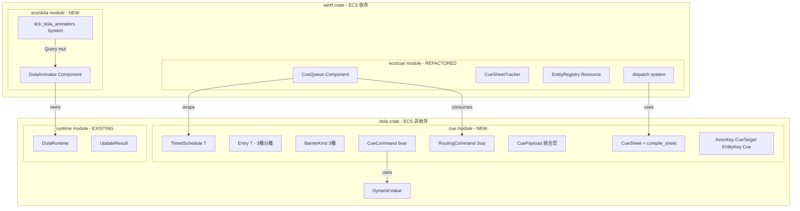
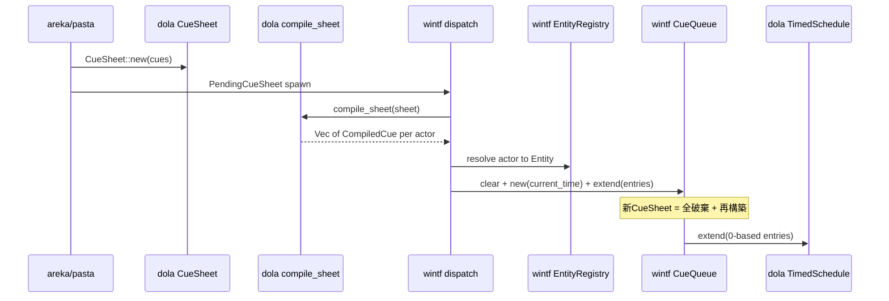
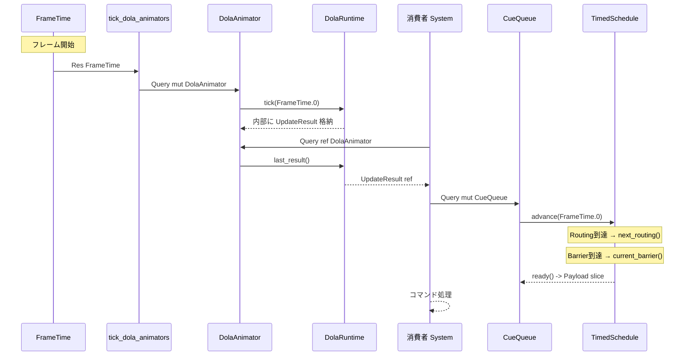
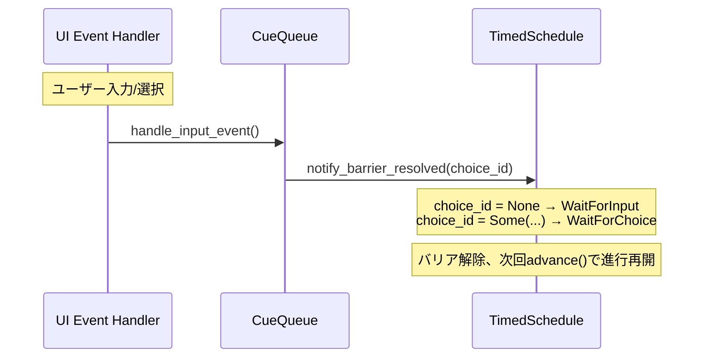
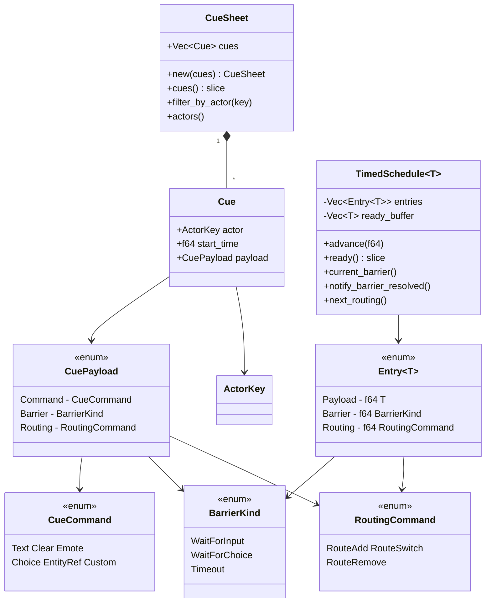
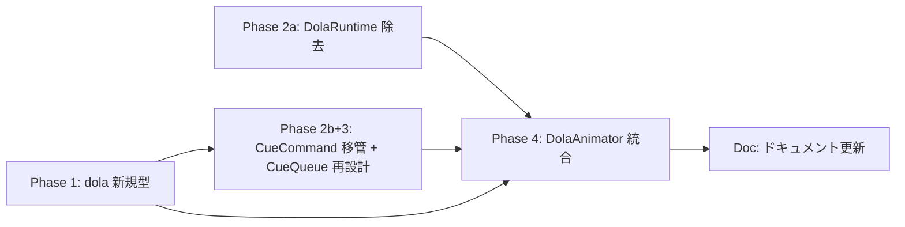

# Technical Design Document

| 項目               | 内容                                                  |
| ------------------ | ----------------------------------------------------- |
| **Document Title** | dola ランタイム責務境界定義（dola-boundary）技術設計書 |
| **Version**        | 2.0                                                   |
| **Date**           | 2026-03-02                                            |
| **Requirements**   | v4.2 + amendments                                     |
| **Status**         | 📐 Generated（v2: 議論反映・リファイン）              |

---

## Overview

dola クレートに離散コマンドスケジューリング基盤（`cue/` モジュール）を新設し、wintf の cue モジュールから ECS 非依存の演出ロジックを移管する。同時に `DolaRuntime` の API を `tick/last_result` に分離し、wintf に `DolaAnimator` ECS Component を新設する。

本設計は dola の「アニメーション実現のための汎用道具集」という位置づけを具現化し、2 エンジン（連続値アニメ / 離散コマンド配信）の独立性を型レベルで保証する。

### Goals

- dola に `cue/` モジュールを新設し `TimedSchedule<T>`, `CueSheet`, `CueCommand`, `RoutingCommand`, `CuePayload`, ドメイン型を提供する
- `DolaRuntime` API を `tick()` + `last_result()` に分離し、`TimedSchedule` の `advance()` + `ready()` と対称な 2 フェーズ API を確立する
- wintf に `DolaAnimator` Component を新設し、エンティティごとの独立アニメーション状態を実現する
- wintf `cue/` モジュールから誤配置 DolaRuntime コードを除去する
- 移管した型は re-export により wintf 側の後方互換を維持する

### Non-Goals

- `CueQueue` の完全再設計（Phase 2b+3 で実施、本仕様では方針決定のみ）
- `UpdateResult` の具体的消費実装（balloon06-text-effects に委譲）
- pasta DSL パーサーの実装（インターフェース設計の考慮のみ）
- dola ランタイム内部リファクタリング（`tick/last_result` 分離に必要な範囲のみ）
- CueSheet のコンパイル時バリデーション（記述者の自己責任モデル）

---

## Architecture

### Existing Architecture Analysis

現行は wintf `ecs/cue/` モジュール内に全演出ロジック（型定義・スケジューリング・ECS 統合・DolaRuntime ラッパー）が混在している。

**問題点**:
1. `DolaRuntime` が `#[derive(Resource)]` として cue モジュールに誤配置（cue パイプライン未消費）
2. `CueCommand` が `bevy_ecs::entity::Entity` に直接依存（dola からの独立使用不可）
3. `CueQueue` 内に `TimedSchedule` 相当のジェネリックロジックが埋没
4. ドメイン型（`ActorKey`, `CueTarget`, `EntityKey`, `Cue`）が ECS レイヤーに配置

### Architecture Pattern & Boundary Map

改修後のクレート境界とモジュール構成:



**境界原則**: dola → wintf の一方向依存。dola は `bevy_ecs` を知らない。wintf は dola 型を re-export し ECS Component/System でラップする。

### Design Decisions Summary

本設計で確定した設計判断（詳細な根拠は `research.md` を参照）:

| ID | 決定 | 要旨 |
|----|------|------|
| D4 | re-export only | wintf は `pub use dola::cue::CueCommand;` で型エイリアス再公開。newtype 不要 |
| D5 | 段階移行 | Phase 2a → 1 → 2b+3 → 4 → Doc の順で実施 |
| D7 | 必須依存 | `CueSheet` 系は feature flag 不要。dola コアの一部として常に含む |
| D8 | テスト分割移行 | DolaRuntime 5件は DolaAnimator に書き直し、FrameTime 3件は graphics に移動 |

---

## Technology Stack

| レイヤー | ツール/ライブラリ | バージョン | 役割 |
|---------|-----------------|-----------|------|
| アニメーションエンジン | dola | workspace | 連続値 + 離散コマンドの 2 エンジン基盤 |
| ECS フレームワーク | bevy_ecs | 0.18.0 | Component/System/Query による型安全な排他アクセス |
| シリアライゼーション | serde | 1 | CueCommand/CueSheet/ドメイン型の JSON/TOML/YAML 対応 |
| エラーハンドリング | thiserror | 2 | 構造化エラー enum 定義 |

**変更なし**: 新規依存の追加なし。既存の dola 依存（serde, thiserror）と wintf 依存（bevy_ecs, dola）の範囲内。

---

## System Flows

### Flow 1: CueSheet 配送フロー



### Flow 2: フレーム更新フロー（DolaAnimator + CueQueue 消費）



### Flow 3: バリア解除プッシュ通知



---

## Requirements Traceability

| 要件 | サマリー | コンポーネント | インターフェース | フロー |
|------|---------|--------------|----------------|--------|
| 1.1 | bevy_ecs 非依存 | dola::cue::* | — | — |
| 1.2 | TimedSchedule API（Entry 3種分離・0ベースオフセット） | TimedSchedule, Entry | advance/ready | Flow 2 |
| 1.3 | バリア管理（プッシュ通知） | TimedSchedule | current_barrier/notify_barrier_resolved/next_routing | Flow 2, 3 |
| 1.4 | CueSheet + compile_sheet（0ベース正規化） | CueSheet, compile_sheet, CuePayload | compile_sheet() | Flow 1 |
| 1.5 | CueCommand 6 バリアント（データ系のみ） | CueCommand | — | Flow 1 |
| 1.5a | RoutingCommand 3 バリアント | RoutingCommand | next_routing() | Flow 2 |
| 1.6 | ドメイン型 | ActorKey, CueTarget, EntityKey, Cue | — | Flow 1 |
| 1.7 | tick/last_result 分離 | DolaRuntime | tick(), last_result() | Flow 2 |
| 1.8 | 連続値/離散の責務分離 | cue/ vs runtime/ | — | — |
| 1.9 | pasta DSL 互換設計 | CueSheet | Serialize/Deserialize | — |
| 2.1 | DolaAnimator Component | DolaAnimator | new(), tick(), last_result() | Flow 2 |
| 2.2 | tick_dola_animators | tick_dola_animators | System signature | Flow 2 |
| 2.3 | 消費者パターン | — | Query ref + .after() | Flow 2 |
| 2.4 | 配置先モジュール | ecs/dola/ | — | — |
| 2.5 | balloon06 整合 | — | （文書化） | — |
| 3.1 | DolaRuntime 除去 | cue/runtime.rs 削除 | — | — |
| 3.2 | CueQueue リファクタリング方針（Actor独立） | CueQueue | — | — |
| 3.3 | TimedSchedule 委譲（全破棄+再構築） | CueQueue | inner: TimedSchedule | Flow 1, 2 |
| 3.4 | u64 ↔ Entity 変換 | CueQueue | push/pop 境界 | Flow 1 |
| 3.5 | re-export 後方互換 | cue/command.rs | pub use | — |
| 3.6 | 移行戦略 | — | （文書化） | — |
| 4.1-4.3 | UpdateResult 消費方針 | — | （文書化、balloon06 委譲） | — |
| 5.1-5.4 | ドキュメント整合性 | — | （文書化） | — |
| NFR-1 | 後方互換性 | 全コンポーネント | テスト 920+ パス | — |

---

## Components and Interfaces

### Component Summary

| コンポーネント | ドメイン | Intent | 要件 | 主要依存 |
|--------------|---------|--------|------|---------|
| `dola::cue::TimedSchedule<T>` | dola / 離散配信 | 0ベースオフセット汎用配信エンジン | 1.2, 1.3 | — |
| `dola::cue::CueCommand` | dola / 演出コマンド | データ系 6 バリアント enum | 1.5 | DynamicValue |
| `dola::cue::RoutingCommand` | dola / ルーティング | 配送制御 3 バリアント enum | 1.5a | CueTarget, EntityKey |
| `dola::cue::CuePayload` | dola / 記述統合 | CueSheet 記述時の統一型 | 1.4, 1.5, 1.5a | CueCommand, BarrierKind, RoutingCommand |
| `dola::cue::CueSheet` | dola / 演出台本 | 相対時刻コマンド列 + compile | 1.4, 1.9 | CuePayload, ActorKey |
| `dola::cue::{domain types}` | dola / 演出ドメイン | ActorKey, CueTarget, EntityKey, Cue | 1.6 | CuePayload |
| `dola::runtime::DolaRuntime` | dola / 連続値エンジン | tick/last_result API 分離 | 1.7, 1.8 | — |
| `wintf::ecs::dola::DolaAnimator` | wintf / ECS 統合 | DolaRuntime の ECS Component ラッパー | 2.1-2.4 | DolaRuntime, bevy_ecs |
| `wintf::ecs::cue::CueQueue` | wintf / ECS 統合 | TimedSchedule の ECS Component ラッパー（方針） | 3.2-3.5 | TimedSchedule, bevy_ecs |

---

### dola 離散配信基盤

#### Component: `dola::cue::TimedSchedule<T>`

| Field | Detail |
|-------|--------|
| Intent | 0 ベース相対オフセットの汎用配信エンジン。Entry<T> の型レベル 3 種分離と 2 フェーズ API |
| Requirements | 1.2, 1.3 |

**Dependencies**:
- Inbound: `T: Clone + Debug` — ジェネリック型制約 (P0)

**Contracts**: Service [x] / State [x]

##### Service Interface

```rust
/// 0 ベース相対オフセットの汎用配信エンジン。
/// Entry<T> により Payload / Barrier / Routing を型レベルで 3 種分離する。
pub struct TimedSchedule<T> {
    // ── 内部フィールド ──
    // start_time: f64         — 絶対時刻での開始時刻
    // entries: Vec<Entry<T>>  — 降順ソート（0 ベース相対オフセット）
    // ready_buffer: Vec<T>    — advance() で収集した Payload
    // routing_buffer: Vec<RoutingCommand> — advance() で収集した Routing
    // current_barrier: Option<BarrierKind>
}

/// エントリの型レベル 3 種分離
/// f64 = スケジュール開始からの相対オフセット（0 ベース）
pub enum Entry<T> {
    /// 時刻付きデータペイロード（実行すべきコマンド）
    Payload(f64, T),
    /// 時刻付きバリア（進行停止点、TimedSchedule が消費）
    Barrier(f64, BarrierKind),
    /// 時刻付きルーティング（配送制御、CueQueue 層が消費）
    Routing(f64, RoutingCommand),
}

/// バリア種別（3 種）
pub enum BarrierKind {
    /// クリック/キー入力待ち（旧 WaitForClick を統合）
    WaitForInput { timeout: Option<f64> },
    /// 選択肢待ち
    WaitForChoice { timeout: Option<f64> },
    /// 指定時間経過待ち（新規）
    Timeout { duration: f64 },
}

impl<T: Clone + Debug> TimedSchedule<T> {
    /// 絶対時刻 start_time でスケジュールを構築。
    pub fn new(start_time: f64) -> Self;

    /// エントリを時刻順ソート維持で挿入（0 ベース相対オフセット）
    pub fn insert(&mut self, entry: Entry<T>);

    /// 複数エントリを一括挿入（内部で再ソート）
    pub fn extend(&mut self, entries: impl IntoIterator<Item = Entry<T>>);

    // ── 2 フェーズ API（DolaRuntime の tick/last_result と対称） ──

    /// Phase 1: 時刻到達済み Payload を内部バッファに収集。
    /// current_time は絶対時刻（内部で start_time 差分 → 相対オフセット変換）。
    /// Barrier/Routing 到達または末尾到達まで進行。冪等。
    pub fn advance(&mut self, current_time: f64);

    /// Phase 2: 直前の advance() で収集された Payload スライスを返す。
    /// 次の advance() まで何度でも参照可能。
    pub fn ready(&self) -> &[T];

    // ── バリア管理 ──

    /// 現在停止中のバリア種別を照会（UI 表示用）
    pub fn current_barrier(&self) -> Option<&BarrierKind>;

    /// バリア解除プッシュ通知（外部イベント駆動）。
    /// WaitForInput: choice_id = None
    /// WaitForChoice: choice_id = Some(選択ID)
    pub fn notify_barrier_resolved(&mut self, choice_id: Option<String>);

    // ── ルーティング ──

    /// 時刻到達済みルーティングコマンドを取得（CueQueue 層が消費）
    pub fn next_routing(&mut self) -> Option<RoutingCommand>;

    // ── ユーティリティ ──

    pub fn remaining(&self) -> usize;
    pub fn is_completed(&self) -> bool;
    pub fn clear(&mut self);
}
```

##### State Management

- **状態遷移**: `Idle` → `Advancing` → `Blocked`（バリア到達）→ `Completed`（全消費）。外部からは `current_barrier()` / `is_completed()` で照会
- **冪等性**: `advance(t)` を同一 `t` で複数回呼び出しても `ready_buffer` は変化しない
- **消費型**: `advance()` で収集された Payload は内部キューから除去される（不可逆）
- **時刻変換**: `new(start_time)` で絶対時刻基準を保持。`advance(current_time)` は内部で `current_time - start_time` に変換

**Implementation Notes**

- **同一時刻の処理モデル**:
  - **Payload**: キーフレームベース — `ready()` が `&[T]` で複数返却。実行順序不定（並列処理可）
  - **Barrier**: シーケンシャル — 同一時刻に複数ある場合、最初の 1 つのみ有効。推奨: 各時刻に 1 つのみ記述
  - **Routing**: シーケンシャル — 同一時刻に複数ある場合、配列順（記述順）に `next_routing()` で順次取得
- **タイムアウト判定**: Barrier 到達時、`timeout_offset = barrier_offset + timeout_duration` を計算。`advance()` で `offset >= timeout_offset` なら自動解除
- **新 CueSheet 投入**: 既存スケジュールは全破棄（`clear()` + `new(start_time)` + `extend()`）。バリア中でも強制切替。Actor 単位で独立した TimedSchedule
- **Validation**: f64 オフセットは非負値を前提（insert 時の `debug_assert!`）
- **Risks**: `ready_buffer` の `Vec<T>` アロケーション。実用上 1 フレーム内の到達コマンド数は少数（1〜10）のためパフォーマンス問題なし

---

#### Component: `dola::cue::CueCommand`

| Field | Detail |
|-------|--------|
| Intent | 型安全な演出コマンド enum。データ系 6 バリアントのみ |
| Requirements | 1.5 |

**Dependencies**:
- Outbound: `DynamicValue` — `Custom` バリアントのパラメータ (P0)

**Contracts**: Service [x]

```rust
/// 演出コマンド（6 バリアント、データ系のみ）
/// バリアは BarrierKind、ルーティングは RoutingCommand として Entry レベルで分離済み
#[derive(Clone, Debug, PartialEq, Serialize, Deserialize)]
pub enum CueCommand {
    Text(String),
    Clear,
    Emote { key: String },
    Choice { id: String, text: String },
    EntityRef(u64),   // bevy Entity::to_bits() で変換済み
    Custom { command: String, params: DynamicValue },
}
```

**Implementation Notes**

- wintf は `pub use dola::cue::CueCommand;` で re-export（D4）
- `EntityRef(u64)` の変換: wintf dispatch 層が `Entity::to_bits()` で投入、消費時に `Entity::from_bits()` で復元
- `PartialEq` は `DynamicValue` の `PartialEq` 実装に依存。未実装の場合は手動実装を検討
- `EntityRef(u64)` の `from_bits()` で無効 Entity が生成される可能性 → wintf 消費者が Query 存在確認で検出

---

#### Component: `dola::cue::RoutingCommand`

| Field | Detail |
|-------|--------|
| Intent | 配送制御コマンド enum（3 バリアント）。CueQueue 層が消費し、ready() 利用側には届かない |
| Requirements | 1.5a |

**Dependencies**:
- Outbound: `CueTarget`, `EntityKey` — スロット/キー識別 (P0)

**Contracts**: Service [x]

```rust
/// ルーティングコマンド（3 バリアント）
#[derive(Clone, Debug, PartialEq, Serialize, Deserialize)]
pub enum RoutingCommand {
    /// スロット追加（既存ルーティング維持で追加先登録）
    RouteAdd { target: CueTarget, to: EntityKey },
    /// スロット切替（既存ルーティング上書き）
    RouteSwitch { target: CueTarget, to: EntityKey },
    /// スロット除去
    RouteRemove { target: CueTarget },
}
```

**Implementation Notes**

- wintf `CueQueue` は `next_routing()` で取得し `EntityRegistry` を更新
- 同一時刻のルーティング変更は次フレームから反映される設計でタイミング競合を回避
- `EntityKey` の妥当性検証は wintf dispatch 層の責務

---

#### Component: `dola::cue::CuePayload`

| Field | Detail |
|-------|--------|
| Intent | CueSheet 記述時の統一型。コマンド・バリア・ルーティングを同一インターフェースで記述可能にする |
| Requirements | 1.4, 1.5, 1.5a |

**Contracts**: Service [x]

```rust
/// CueSheet 記述時の統合型（3 種）
#[derive(Clone, Debug, PartialEq, Serialize, Deserialize)]
pub enum CuePayload {
    Command(CueCommand),
    Barrier(BarrierKind),
    Routing(RoutingCommand),
}

impl From<CueCommand> for CuePayload { /* ... */ }
impl From<BarrierKind> for CuePayload { /* ... */ }
impl From<RoutingCommand> for CuePayload { /* ... */ }

impl CuePayload {
    /// Entry<CueCommand> への変換（compile_sheet 内で使用）
    /// Command → Entry::Payload, Barrier → Entry::Barrier, Routing → Entry::Routing
    pub fn into_entry(self, offset: f64) -> Entry<CueCommand>;
}
```

**Implementation Notes**

- `Cue::payload` フィールドとして使用。`compile_sheet()` が `into_entry()` で `Entry<CueCommand>` に変換
- 記述例:
  ```rust
  let cues = vec![
      Cue { actor: actor.clone(), start_time: 0.0, payload: CueCommand::Text("hello".into()).into() },
      Cue { actor: actor.clone(), start_time: 1.0, payload: BarrierKind::WaitForInput { timeout: None }.into() },
      Cue { actor: actor.clone(), start_time: 2.0, payload: RoutingCommand::RouteSwitch { target: CueTarget::Balloon, to: key }.into() },
  ];
  ```

---

### dola 演出台本

#### Component: `dola::cue::CueSheet` + `compile_sheet`

| Field | Detail |
|-------|--------|
| Intent | 相対時刻コマンド列（演出台本）と 0 ベース正規化関数 |
| Requirements | 1.4, 1.9 |

**Dependencies**:
- Outbound: `CuePayload`, `ActorKey` — Cue 構成型 (P0)

**Contracts**: Service [x]

```rust
/// 相対時刻の演出台本
#[derive(Clone, Debug, Serialize, Deserialize)]
pub struct CueSheet(Vec<Cue>);

impl CueSheet {
    pub fn new(cues: Vec<Cue>) -> Self;    // start_time 昇順ソート
    pub fn cues(&self) -> &[Cue];
    pub fn filter_by_actor(&self, key: &ActorKey) -> Vec<&Cue>;
    pub fn actors(&self) -> Vec<&ActorKey>; // 重複なし
    pub fn is_empty(&self) -> bool;
    pub fn len(&self) -> usize;
}

/// コンパイル済みの 0 ベース相対オフセットエントリ
pub struct CompiledCue {
    pub offset: f64,             // 0 ベース相対オフセット
    pub actor: ActorKey,
    pub entry: Entry<CueCommand>,
}

/// CueSheet を 0 ベース相対オフセットに正規化。
/// Cue::start_time の最小値を 0 基準にし、CuePayload::into_entry() で Entry に変換。
/// 絶対時刻への変換は TimedSchedule::new(start_time) が担当。
pub fn compile_sheet(sheet: &CueSheet) -> Vec<CompiledCue>;
```

**Implementation Notes**

- wintf `dispatch_pending_cue_sheets` が `compile_sheet()` を呼び出し、actor ごとに分配
- 各 actor の `CueQueue` で `clear()` → `TimedSchedule::new(current_time)` → `extend(entries)` で投入
- `CueSheet` は `Serialize + Deserialize` で pasta DSL 出力を JSON/TOML 経由で受け取り可能（1.9）

---

#### Component: `dola::cue` ドメイン型

| Field | Detail |
|-------|--------|
| Intent | 演出パイプラインのドメイン概念を ECS 非依存な型で表現 |
| Requirements | 1.6 |

```rust
#[derive(Clone, Debug, PartialEq, Eq, Hash, Serialize, Deserialize)]
pub struct ActorKey(String);

#[derive(Clone, Debug, PartialEq, Eq, Hash, Serialize, Deserialize)]
pub enum CueTarget { Shell, Balloon }

#[derive(Clone, Debug, PartialEq, Eq, Hash, Serialize, Deserialize)]
pub enum EntityKey {
    Actor(ActorKey, CueTarget),
    Spot(String),
    Balloon(String),
}

/// 個々の演出指示（相対時刻）
#[derive(Clone, Debug, Serialize, Deserialize)]
pub struct Cue {
    pub actor: ActorKey,
    pub start_time: f64,
    pub payload: CuePayload,
}
```

**Implementation Notes**

- wintf は `pub use dola::cue::{ActorKey, CueTarget, EntityKey, Cue};` で re-export
- 移植元: `crates/wintf/src/ecs/cue/mod.rs` L316-L441, `crates/wintf/src/ecs/cue/command.rs` L11-L22

---

### dola 連続値エンジン

#### Component: `dola::runtime::DolaRuntime` — tick/last_result 分離

| Field | Detail |
|-------|--------|
| Intent | 既存 update() を tick() + last_result() に分離し、TimedSchedule と対称な 2 フェーズ API を確立 |
| Requirements | 1.7, 1.8 |

**Contracts**: Service [x]

```rust
impl DolaRuntime {
    // ── 既存 API（後方互換） ──

    #[deprecated(note = "use tick() + last_result() instead")]
    pub fn update(&mut self, current_time: f64) -> UpdateResult;

    // ── 新規 2 フェーズ API ──

    /// Phase 1: 内部状態を current_time まで進行し、結果を内部フィールドに格納
    pub fn tick(&mut self, current_time: f64);

    /// Phase 2: 直前の tick() 結果を読み取り専用で返す（tick() 未呼び出し時は空）
    pub fn last_result(&self) -> &UpdateResult;
}
```

**Implementation Notes**

- `last_update_result: UpdateResult` フィールド追加。`tick()` で上書き、`last_result()` で参照返却
- `update()` は `tick()` + `last_result().clone()` で後方互換維持。`#[deprecated]` で移行促進
- `Rc::clone()` は参照カウント増のみのためコスト無視可能

---

### wintf ECS 統合層

#### Component: `wintf::ecs::dola::DolaAnimator`

| Field | Detail |
|-------|--------|
| Intent | DolaRuntime を ECS Component として所有し、tick_dola_animators で unsafe Send+Sync の安全性を保証 |
| Requirements | 2.1, 2.2, 2.3, 2.4 |

**Dependencies**:
- Outbound: `dola::runtime::DolaRuntime` — 内部所有 (P0)
- Outbound: `bevy_ecs` — Component derive, Query, System (P0)
- Inbound: `FrameTime` — フレーム時刻注入 (P0)

**Contracts**: Service [x] / State [x]

##### Service Interface

```rust
/// DolaRuntime の ECS Component ラッパー。
/// 内部に Rc を含むため unsafe impl Send + Sync。
#[derive(Component)]
pub struct DolaAnimator {
    runtime: DolaRuntime,
}

// Safety: wintf は単一スレッド（Windows UI スレッド）でのみ動作。
// tick_dola_animators の Query<&mut DolaAnimator> が 1 tick 1 回・
// 単一スレッドの排他アクセスを型レベルで保証する。
unsafe impl Send for DolaAnimator {}
unsafe impl Sync for DolaAnimator {}

impl DolaAnimator {
    pub fn new() -> Self;
    pub fn with_runtime(runtime: DolaRuntime) -> Self;
    pub fn tick(&mut self, current_time: f64);
    pub fn last_result(&self) -> &UpdateResult;
    pub fn runtime(&self) -> &DolaRuntime;

    /// pub(crate) — 外部コードによる直接 tick() 呼び出しを禁止。
    /// DolaDocument ロード等には load_document() 等の専用メソッドを追加する。
    pub(crate) fn runtime_mut(&mut self) -> &mut DolaRuntime;
}

/// 全 DolaAnimator を一括 tick。Update スケジュール先頭に配置。
pub fn tick_dola_animators(
    mut query: Query<&mut DolaAnimator>,
    frame_time: Res<FrameTime>,
) {
    for mut animator in query.iter_mut() {
        animator.tick(frame_time.0);
    }
}
```

##### State Management

- **ライフサイクル**: Entity spawn 時に生成、despawn 時に自動 drop
- **順序保証**: 消費者システムは `.after(tick_dola_animators)` で順序依存を宣言
- **状態委譲**: DolaRuntime の状態を透過的に委譲。追加の状態管理なし

**Implementation Notes**

- **配置先**: `crates/wintf/src/ecs/dola/mod.rs`。将来拡張（PropertyBinding 等）に備える。balloon06 の `dola_bridge/` 想定を本仕様で上書き
- **unsafe 安全性根拠**: `tick()` は `tick_dola_animators` の `Query<&mut>` 排他アクセスでのみ呼び出される。API レベルでは禁止できないため規約による制約（`runtime_mut()` の `pub(crate)` 制限で補強）

---

#### Component: `wintf::ecs::cue::CueQueue` — リファクタリング方針

| Field | Detail |
|-------|--------|
| Intent | TimedSchedule<CueCommand> 内包による ECS Component ラッパーへの段階的移行方針 |
| Requirements | 3.2, 3.3, 3.4, 3.5 |

**Contracts** (リファクタリング後の構成):

```rust
/// リファクタリング後の CueQueue（Phase 2b+3 で実施）
#[derive(Component)]
#[component(storage = "SparseSet")]
pub struct CueQueue {
    /// dola TimedSchedule にコア時刻管理を委譲
    schedule: TimedSchedule<CueCommand>,

    // ── wintf 固有（ECS 依存） ──
    state: CueQueueState,
    playback_rate: f64,
    capacity: Option<usize>,
    pending_choices: Vec<PendingChoice>,
    cue_sheet_entity: Option<Entity>,
}
```

**Implementation Notes**

- **移行戦略（D5）**: Phase 2a → 1 → 2b+3 → 4 → Doc
- **re-export（D4）**: `pub use dola::cue::CueCommand;` でインポートパス維持
- **u64 ↔ Entity 変換**: `push_entity_command()` ヘルパーで `Entity::to_bits()` エンキュー、pop 時に `from_bits()` 復元
- **新 CueSheet 投入**: `clear()` + `new(current_time)` + `extend()` で全破棄再構築。同時に複数 CueSheet は非対応

---

## Data Models

### Domain Model



**不変条件**:
- `CueSheet` 内の `Cue` は `start_time` 昇順
- `TimedSchedule` 内の `Entry` は f64 オフセット降順（末尾 pop で O(1) 消費）
- `advance()` 後の `ready_buffer` はバリア到達前の全 Payload を含む
- `notify_barrier_resolved()` はバリア状態でのみ有効（非バリア時は no-op）

---

## Error Handling

### Error Strategy

dola `cue/` モジュールのエラーは `thiserror` ベースの `CueError` enum で定義。wintf 側は既存 `CueSystemError` を拡張。

| カテゴリー | エラー | 処理 |
|-----------|--------|------|
| バリデーション | 負のタイムスタンプ | `debug_assert!` + ログ警告（リリースでは許容） |
| 状態不正 | 非バリア時の `notify_barrier_resolved()` | no-op + ログ（静穏失敗） |
| キャパシティ | TimedSchedule 挿入限界超過 | `Result<(), CueError>` 返却 |
| Entity 復元 | `Entity::from_bits(u64)` の無効値 | wintf 消費者が Query 存在確認で検出 |

---

## Testing Strategy

### Unit Tests（dola crate）

| テスト対象 | 検証内容 |
|-----------|---------|
| `TimedSchedule::advance` | 時刻到達済み Payload の正確な収集、冪等性、同一時刻複数 Payload |
| `TimedSchedule::barrier` | バリア到達で停止、notify_barrier_resolved 後に再進行、タイムアウト自動解除 |
| `TimedSchedule::routing` | next_routing() による順次取得、ready() に含まれないことの確認 |
| `CuePayload::into_entry` | 3 種の変換正確性 |
| `CueSheet::new` | start_time 昇順ソート |
| `compile_sheet` | 相対→0ベースオフセット正規化の正確性 |
| `DolaRuntime::tick/last_result` | update() と同等の結果、last_result の冪等性 |

### Integration Tests（wintf crate）

| テスト対象 | 検証内容 |
|-----------|---------|
| `DolaAnimator` Component | spawn/tick/last_result の一連の流れ |
| `tick_dola_animators` System | Query<&mut> による全エンティティ一括 tick |
| re-export 後方互換 | `wintf::ecs::cue::CueCommand` パスの維持 |
| CueQueue + TimedSchedule | push → advance → ready → barrier → notify の統合フロー |
| 既存 cue テスト 75 件 | 全パス（リグレッションなし） |

### テスト移行（D8）

| 現行テスト | 移行先 | 処理 |
|-----------|--------|------|
| `cue_dola_integration_test.rs` DolaRuntime 5 件 | `tests/ecs/dola/` | DolaAnimator テストに書き直し |
| `cue_dola_integration_test.rs` FrameTime 3 件 | `tests/ecs/graphics/` | 移動 |
| `cue_dola_integration_test.rs` ファイル | — | 削除 |

---

## Migration Strategy

### Phase Plan



| Phase | 内容 | 前提 | 成果物 |
|-------|------|------|--------|
| **2a** | DolaRuntime 除去 — `cue/runtime.rs` 削除、`update_dola_runtime` 削除、re-export 削除、テスト 5 件移行 | なし（消費者ゼロ） | wintf cue モジュール浄化 |
| **1** | dola 新規型 — `cue/` モジュール新設、`TimedSchedule<T>`, `Entry<T>`, `BarrierKind`, `CueCommand`, `RoutingCommand`, `CuePayload`, `CueSheet`, `compile_sheet`, ドメイン型、`tick/last_result` 分離 | なし | dola cue 基盤完成 |
| **2b+3** | CueCommand 移管 + CueQueue 再設計 — wintf `CueCommand` を dola re-export に変更、`CueQueue` 内部を `TimedSchedule<CueCommand>` に委譲 | Phase 1 完了 | wintf cue 型の dola 委譲 |
| **4** | DolaAnimator 統合 — `ecs/dola/` 新設、DolaAnimator + tick_dola_animators、テスト書き直し | Phase 1, Phase 2a | ECS 統合完成 |
| **Doc** | ドキュメント更新 — cue-system design.md 是正、ARCHITECTURE.md・structure.md 更新、dola 統合ガイドライン | Phase 4 完了 | 文書整合性 |

### Rollback Triggers

- Phase 1: dola 既存テスト fail → ロールバック
- Phase 2a: wintf cue 関連 75 件 fail → ロールバック
- Phase 2b+3: re-export コンパイルエラー → パス修正で対応
- Phase 4: `unsafe impl Send + Sync` による UB 検出 → 設計見直し

### UpdateResult 消費方針（Req 4）

本仕様では方針決定にとどめる:

- **`changes`（購読変数差分）**: balloon06 の `dola_sync_system` が PropertyBinding → ECS Component 反映パターンを実装
- **`triggered`（トリガー結果）**: dola 単体のトリガー機構に委譲。連鎖アニメーションは DolaRuntime 内部で完結
- **将来仕様**: `wintf-P0-balloon06-text-effects` で具体的消費実装を定義

---

## Supporting References

### dola cue/ モジュール構成

```
crates/dola/src/
├── cue/                    ← NEW
│   ├── mod.rs              ← re-exports
│   ├── schedule.rs         ← TimedSchedule<T>, Entry<T>, BarrierKind
│   ├── command.rs          ← CueCommand, RoutingCommand, CuePayload, ドメイン型
│   └── sheet.rs            ← CueSheet, compile_sheet, CompiledCue
├── runtime/
│   ├── facade.rs           ← tick/last_result 追加
│   └── types.rs            ← UpdateResult (変更なし)
└── lib.rs                  ← pub mod cue; + re-exports 追加
```

### wintf モジュール変更

```
crates/wintf/src/ecs/
├── dola/                   ← NEW
│   └── mod.rs              ← DolaAnimator, tick_dola_animators
├── cue/
│   ├── command.rs          ← re-export only (pub use dola::cue::*)
│   ├── mod.rs              ← runtime/update_dola_runtime の re-export 除去
│   ├── queue.rs            ← Phase 2b+3 で TimedSchedule 内包に再設計
│   ├── runtime.rs          ← Phase 2a で削除
│   └── systems.rs          ← update_dola_runtime 除去
└── mod.rs                  ← pub mod dola; 追加
```
