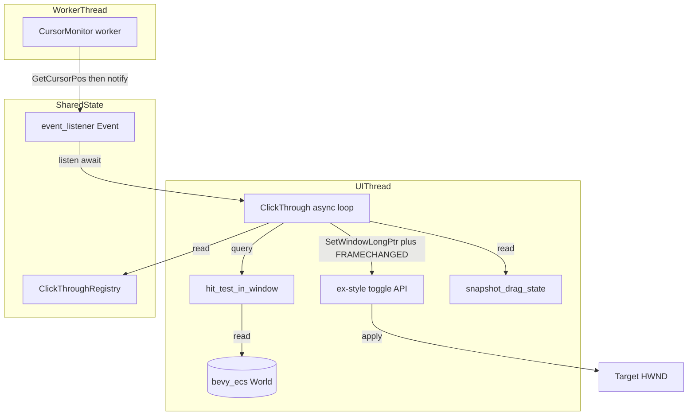
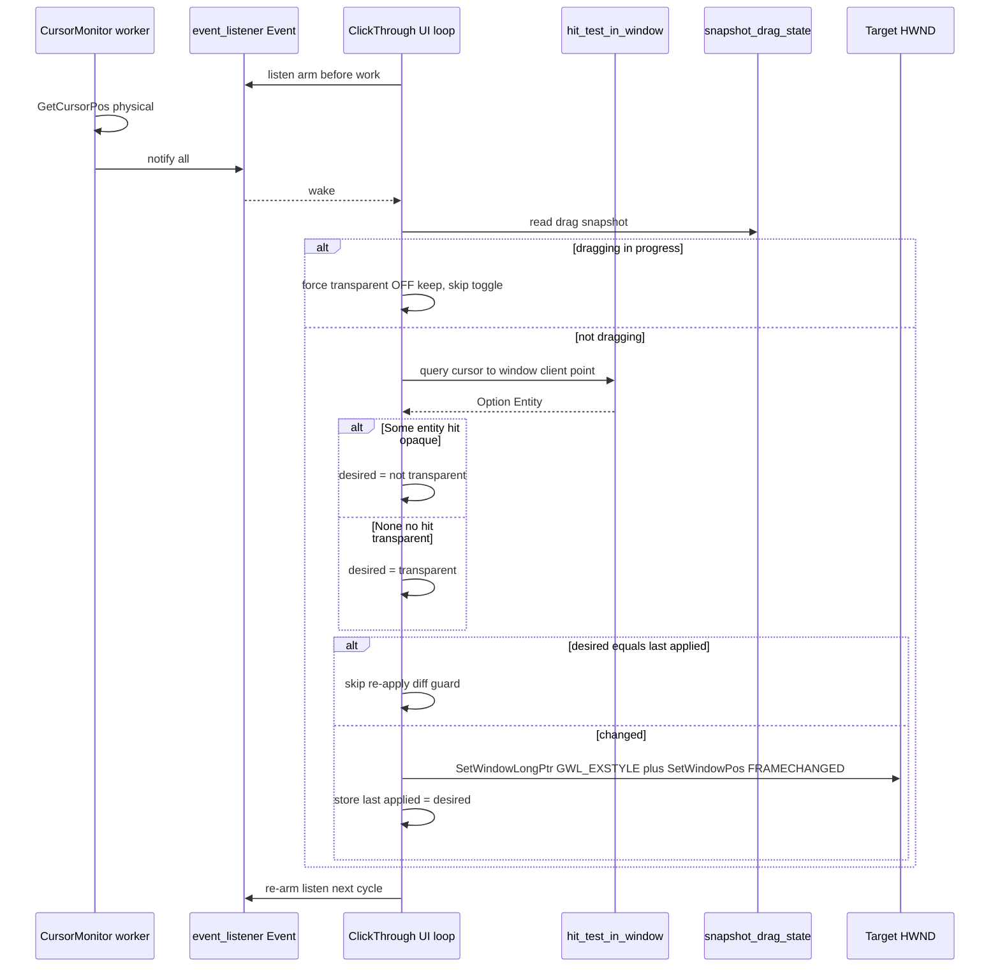

# 技術設計書: wintf-clickthrough-alpha-toggle

## Overview

**Purpose**: 本機能は、GPU 合成描画（WUC/DComp 経路）を維持したまま、キャラクター描画領域以外の透明領域上のクリックを背面プロセスへ透過させる「クリック透過機構」を `wintf` 本体へ提供する。至上要件は「別プロセス透過のために GPU 描画を諦める踏み絵」の回避であり、これを `WS_EX_TRANSPARENT` 拡張スタイルの動的トグルで実現する。

**Users**: マスコット利用者は、見えているキャラクター領域だけがクリックを受け取り透明領域は背面アプリへ透過する、見た目と操作範囲の一致した挙動を得る。システム保守者は、既存 ULW 経路・既存機能を壊さず、tokio 非依存・依存最小・リリース最適化互換のまま新機構を組み込める。

**Impact**: 現状 `wintf` の別プロセス透過は ULW（CPU ビットマップ方式）に依存し GPU 合成と併用不可である。本機能は「表示層＝合成 visual/content」と「当たり判定層＝HWND 拡張スタイル」を分離し、当たり判定層のみを別スレッドのカーソル監視＋既存シーングラフ・ヒットテスト連動で動的制御する。ULW バックエンドは検証期間中は残置（並走）し、撤去は別坑 `wintf-ulw-removal` が担う。あわせて areka 本体を WUC（`CompositionMode::DComp`）経路へ切替え、実マスコットでクリック透過を実動確認する。

### Goals

- GPU 合成描画を無効化・省略せずに、透明領域のクリックを背面プロセスへ透過させる（`WS_EX_TRANSPARENT` 動的トグル）。
- 当たり判定を既存シーングラフ・ヒットテスト（`hit_test_in_window` → `Option<Entity>`／`None`＝透過）に連動させ、固定矩形・外部仮マスク・GPU フレームバッファ readback に依存しない。
- カーソル監視を UI スレッドと別の実行文脈で行い、状態変化時のみ拡張スタイルを 1 回適用する（描画のなめらかさを損なわない）。
- スレッド跨ぎ通知を既存 `event_listener` 起床パターン（`VsyncEventBridge` テンプレ）で実現し、tokio を持ち込まない。
- ドラッグ移動中はクリック透過を抑止し続け、終了時に再収束する。
- areka を WUC 経路へ切替え、実マスコットでクリック透過を実動確認する（後続 ULW 撤去が areka デモを巻き込まない状態を作る）。
- `docs/click_through.md` を新規作成し、仕組み・不採用手段の理由・API 使用例・既知の制約を記す。

### Non-Goals

- ULW バックエンドの即時撤去（並走期間中は残置。撤去は別坑 `wintf-ulw-removal`）。
- 先進坑 `pilot-clickthrough-alpha-toggle` コードのコピペ流用（知見のクリーンな掘り直しのみ）。
- GPU 合成結果の CPU readback による「実描画αバッファ」取得経路の新設（要件ディスカッションで不要と確定。§Architecture 参照）。
- `WM_NCHITTEST`→`HTTRANSPARENT` ハンドラの追加（プロセス境界を越えず本要件で採用不可）。
- `WS_EX_LAYERED` を描画用途で使うこと（`UpdateLayeredWindow`／`SetLayeredWindowAttributes`）。同伴フラグ用途のみ。
- 新規大型クレート（winit/tauri 等）の追加・`Cargo.toml` 依存の大幅追加。
- `tech.md`／`roadmap.md`／`doc/COMPAT_ARCHITECTURE.md` の「ULW 一択」相当記述の実更新（ULW 撤去確定時＝別坑に回る。本坑は「更新対象を明示できる状態」の維持のみ）。

## Boundary Commitments

### This Spec Owns

- **クリック透過機構本体**（新規モジュール `ecs/clickthrough/`）: カーソル監視ワーカ、UI スレッド側の判定・適用ループ、状態変化最適化（差分ガード）、ドラッグ抑止の統合。
- **ex-style 動的トグル API**（`win_style.rs` への最小追加）: `WS_EX_TRANSPARENT` ビットのみを add/remove し `SetWindowPos(SWP_FRAMECHANGED)` を伴う適用関数。既存 `commit` は変更しない。
- **監視対象ウィンドウの登録・解除**: どの HWND／window Entity に対して機構を有効化するか（本坑では areka の 2 窓）。
- **areka の WUC 化**（`crates/areka/src/main.rs`）: shell/balloon 窓を `CompositionMode::DComp` へオプトインし、実動確認する。
- **`docs/click_through.md`** の新規作成。

### Out of Boundary

- **シーングラフ・ヒットテストのロジック本体**（`ecs/layout/hit_test/`）: 本機構は `hit_test_in_window` の**参照側**であり、判定ロジック・各エンティティの `HitTest` モード・`AlphaMask` 生成は既存経路が提供する（改変しない）。
- **合成描画・WUC/DComp 経路**（`ecs/graphics/`）: 表示層は既存 GPU 合成が担い、本機能は表示内容を変更しない。
- **ULW バックエンドの撤去**（別坑 `wintf-ulw-removal`）。ULW 専用の `compositor.rs`／`com/ulw.rs` にも触れない。
- **ドラッグ状態機械そのもの**（`ecs/drag/`）: 本機構は `DragState`／`WindowDragContextResource` の**読み取り参照**のみ。状態遷移ロジックは改変しない。
- **`CompositionMode` の動的切替**（生成時固定は不変。本坑は areka を生成時に DComp 選択するだけ）。

### Allowed Dependencies

- `crate::ecs::layout::hit_test::{hit_test_in_window, HitTestMode}` — 当たり判定の唯一の情報源（P0）。
- `crate::runtime::tick_bridge::VsyncEventBridge` — スレッド跨ぎ起床の**構造テンプレート**（コピー元パターン。直接依存ではなく踏襲）。
- `crate::ecs::drag::state::{snapshot_drag_state, DragStateSnapshot}` — ドラッグ中判定の読み取り（P0）。
- `crate::win_style`（拡張）／`crate::api`（`SetWindowLongPtr`/`SetWindowPos` safe ラッパー）— ex-style 適用（P0）。
- `crate::runtime`（`WinApp`/`spawn_ui_local`）— UI スレッド async 起動導管（P0）。
- 外部: `windows` 0.62.2（`GetCursorPos`）、`event_listener` 5、`bevy_ecs`（`World`/`Entity`）。**新規クレート追加なし**。

### Revalidation Triggers

- `hit_test_in_window` の**シグネチャ変更**（`world: &World, window: Entity, client_point: PhysicalPoint) -> Option<Entity>`）→ 本機構の判定呼び出しが破綻する。
- `PhysicalPoint`／`GlobalArrangement.bounds` の**座標系定義変更**（screen physical 前提）→ R8 座標一致が破綻する。
- `DragState` 列挙・`snapshot_drag_state()` の**返却契約変更**→ R5 抑止判定が破綻する。
- `CompositionMode` の**既定変更**または DComp 経路の ex-style 計算（`compute_ex_style`）変更 → areka WUC 化・LAYERED 同伴の前提が変わる。
- ULW 撤去（別坑）実行時 → `tech.md`/`roadmap.md`/`doc/COMPAT_ARCHITECTURE.md` の「ULW 一択」記述更新の連動が必要（R7.3/R10.3）。

## Architecture

### Existing Architecture Analysis

`wintf` は `bevy_ecs` ベースで、UI スレッド（`WinApp`／`COINIT_MULTITHREADED`）が `World` を単独所有する。`hit_test`／`hit_test_in_window`（`ecs/layout/hit_test/mod.rs` L437/L464）は `&World` を取り `screen_point`／`client_point`（いずれも物理座標 `PhysicalPoint`）から `Option<Entity>` を返す**合成バックエンド非依存**の当たり判定関数として既に存在する。各エンティティの `HitTestMode`（`Bounds` 合成α／`AlphaMask` ピクセル単位／`NamedRegions`）はツリー走査で honored され、複数 widget の OR 集約も走査で自動成立する。**「実描画α」はこのシーングラフ評価が体現する**（GPU フレームバッファの CPU readback は不要／不採用）。

スレッド跨ぎ起床の唯一の前例は `VsyncEventBridge`（`runtime/tick_bridge.rs`）: 専用 `std::thread`＋`Arc<event_listener::Event>`＋`Arc<AtomicBool>` stop_flag＋`Drop` で `stop→join` の RAII。UI 側は `spawn_local` の async ループが `event.listen()` を tick 実行**前**に arm し `await` する（取りこぼし防止規律）。本機構のカーソル監視ワーカはこの構造を 1:1 で踏襲する（tokio 不使用 R4.2 を自動的に満たす）。

拡張スタイルは `WinStyle::commit`（L24）が `SetWindowLongPtr(GWL_STYLE/GWL_EXSTYLE)` のみで反映し、`SetWindowPos(SWP_FRAMECHANGED)` を**呼ばない**。動的トグルには FRAMECHANGED が必須のため、`apply_initial_state`（`runtime/window_factory.rs` L216）が実装する `SetWindowPos(SWP_FRAMECHANGED|SWP_NOMOVE|SWP_NOSIZE|SWP_NOZORDER|SWP_NOACTIVATE)` レシピを再利用した最小トグル API を新設する。

`DragState`（`ecs/drag/state/mod.rs`）は `thread_local!` の `Idle/Preparing/JustStarted/Dragging/JustEnded` 状態機械で、`snapshot_drag_state() -> DragStateSnapshot` により読み取り専用スナップショットを取得できる。

### Architecture Pattern & Boundary Map

**選定パターン**: 二層分離（表示層／当たり判定層）＋ プロデューサ・コンシューマ（ワーカ＝プロデューサ、UI スレッド＝コンシューマ）＋ 自己完結モジュール（凝集）。ギャップ分析 Option C（ハイブリッド: 新規モジュール骨格＋既存資産の明示的再利用）を採用する。



**Architecture Integration**:
- **Selected pattern**: 二層分離。表示（GPU 合成 visual/content）は不変、当たり判定（HWND `WS_EX_TRANSPARENT`）のみ制御。
- **Domain/feature boundaries**: ワーカは `GetCursorPos` のみ（World 非アクセス）。判定・適用は UI スレッド（World 単独所有）。両者は `event_listener::Event` と共有レジストリで疎結合。
- **Existing patterns preserved**: `VsyncEventBridge` の RAII/listen-before-work 規律、`hit_test_in_window` の座標変換チェーン、`DragState` スナップショット、`apply_initial_state` の FRAMECHANGED レシピ。
- **New components rationale**: カーソル監視ワーカと ex-style 動的トグルは workspace に存在しない capability（`GetCursorPos` は grep 0 件、FRAMECHANGED 付きトグルも無し）ゆえ新規。
- **Steering compliance**: `com/`→`ecs/`→message-handling の依存方向を厳守。新規 unsafe は Win32 呼び出し（`GetCursorPos`）に限定。tokio 非採用（`event_listener` 5）。

### 判定実行スレッド境界（設計上の中核決定）

ワーカ（別スレッド）は `&World` を触れない（UI スレッド単独所有）。したがって**ワーカは `GetCursorPos`（物理座標取得）のみを行い、`event_listener::Event` で UI スレッドを起床する**。ヒットテスト（`hit_test_in_window`）・ドラッグ判定・ex-style 適用はすべて UI スレッド側の async ループで実行する。これにより αマスク・bounds・DPI・ウィンドウ位置のスナップショットをワーカへ共有する必要が消滅し（座標変換の二重化・整合リスクを回避）、判定は常に最新の `World` に対して行われる（R2.4「表示更新に追随」を構造的に満たす）。座標変換は既存 `hit_test_in_window` を**そのまま再利用**する（軽量複製しない）。

### Technology Stack

| Layer | Choice / Version | Role in Feature | Notes |
|-------|------------------|-----------------|-------|
| Windowing / Win32 | windows 0.62.2 | `GetCursorPos`（ワーカ）、`SetWindowLongPtr`/`SetWindowPos`（トグル） | 既存 `api.rs` safe ラッパー流用。新 API は `GetCursorPos` のみ |
| Threading / Events | event_listener 5 | ワーカ→UI 起床（tokio 非依存） | `VsyncEventBridge` と同一機構 |
| UI async runtime | wintf-winmsg-executor =0.0.5 | UI スレッド `spawn_local` で判定・適用ループ | 既存 `run_async_tick` と同一導管 |
| ECS | bevy_ecs 0.18.0 | `hit_test_in_window(&World, Entity, PhysicalPoint)` 呼び出し | 参照のみ |
| Hit-test / Drag | 既存 wintf モジュール | 当たり判定・ドラッグ状態の読み取り | 改変なし（参照側） |
| Application | crates/areka | shell/balloon 窓を `CompositionMode::DComp` へ | 実動確認対象 |

> 新規依存の追加はなし（R9.3）。すべて既存ワークスペース内クレート・既存外部依存で実装可能。

## File Structure Plan

### Directory Structure
```
crates/wintf/src/
├── ecs/
│   └── clickthrough/                 # 【新規】クリック透過機構の自己完結モジュール
│       ├── mod.rs                    # 公開 API・モジュール束ね（ClickThroughController の init/register）
│       ├── monitor.rs                # CursorMonitorBridge（ワーカスレッド・GetCursorPos・event notify・RAII stop/join）
│       ├── controller.rs             # UI スレッド async ループ（listen→判定→差分ガード→トグル適用）
│       ├── registry.rs               # ClickThroughRegistry（監視対象 window Entity/HWND と適用済み状態の保持）
│       └── tests.rs                  # 差分ガード・状態遷移の in-source ユニットテスト
├── win_style.rs                      # 【変更】WS_EX_TRANSPARENT 動的トグル最小 API を追加（既存 commit は不変）
└── runtime/mod.rs                    # 【変更・最小】WinApp から機構を起動する結線点（登録フック）
docs/
└── click_through.md                  # 【新規】仕組み概要・不採用手段の理由・API 使用例・既知の制約
crates/areka/src/
└── main.rs                           # 【変更】shell/balloon 窓を CompositionMode::DComp へ・機構登録
```

> `ecs/clickthrough/` は `runtime/` ではなく `ecs/` 配下に置く。判定が `&World`（ECS）へ結ばれ、`drag`/`hit_test`（いずれも `ecs/`）と隣接するため。ワーカ（`monitor.rs`）は物理的にワーカスレッドだが、機構の凝集を優先し同モジュール内へ配置する。

### Modified Files
- `crates/wintf/src/win_style.rs` — `WS_EX_TRANSPARENT` ビットのみを add/remove し `SetWindowPos(SWP_FRAMECHANGED)` を伴う最小トグル関数を追加。既存 `commit`・既存ビルダーは不変。
- `crates/wintf/src/runtime/mod.rs` — `WinApp::run`（または `wire_new_path` 相当）で `ClickThroughController` を起動・監視対象を登録する最小の結線（数行）。既存 tick/vsync 結線に相乗り。
- `crates/wintf/src/ecs/mod.rs`（該当する束ね）— `pub mod clickthrough;` の宣言追加。
- `crates/areka/src/main.rs` — shell 窓（現 L181 付近）・balloon 窓（現 L242 付近）の `Window { .. }` に `composition_mode: CompositionMode::DComp` を付与。機構への監視対象登録（両 window Entity）。`ex_style` は変更不要（factory が `compute_ex_style` で自動計算）。

> **R6.5 の遵守**: 上記「変更対象ファイルと変更内容」は既存コードへの改変を結線点（win_style.rs のトグル追加、runtime/mod.rs の起動フック、areka の DComp オプトイン）に限定する。実装着手前に本一覧を提示し確認を得る運用とする（§Open Questions / 運用規律 参照）。

## System Flows

### カーソル移動→透過状態収束（差分適用・ドラッグ抑止）



**フロー決定事項**:
- **ゲーティング順序**: ドラッグ判定を最優先。ドラッグ中は透過 ON への切替を必ず抑止（R5.1/R5.3）。透過を外したまま維持する。
- **ドラッグ終了再収束**: `JustEnded` を観測したサイクルで抑止を解除し、現在カーソル位置＋ヒットテストで再判定・再収束する（R5.2）。
- **差分ガード**: `last_applied` と `desired` が同一なら `SetWindowPos` を呼ばない（R3.2）。変化時のみ 1 回適用（R3.3）。
- **物理座標の窓ローカル化**: ワーカが得た `GetCursorPos`（screen physical）を、対象窓のクライアント原点で `hit_test_in_window` 用の client physical へ変換して問い合わせる（R8）。座標系対応は既存 `hit_test`（screen physical 前提）に委ねる。
- **マルチウィンドウ**: レジストリ内の各対象窓に対し順次判定・適用する（areka は shell/balloon の 2 窓）。

## Requirements Traceability

| Requirement | Summary | Components | Interfaces | Flows |
|-------------|---------|------------|------------|-------|
| 1.1 | GPU 合成維持でクリック透過 | ClickThroughController, ExStyleToggle | `apply_click_through` | カーソル移動→収束 |
| 1.2 | 透過時に自窓で受領しない | ExStyleToggle | `WS_EX_TRANSPARENT` add | 同上 |
| 1.3 | 合成描画を無効化しない | （表示層に触れない・境界で保証） | — | — |
| 1.4 | 表示内容種別に非依存 | ClickThroughController（hit_test 参照） | `hit_test_in_window` | 同上 |
| 1.5 | areka WUC で実動確認 | areka main.rs（DComp）, ClickThroughRegistry | — | 同上 |
| 2.1 | Some→受領可 | ClickThroughController | `hit_test_in_window`→`Some` | 同上 |
| 2.2 | None→透過 | ClickThroughController | `hit_test_in_window`→`None` | 同上 |
| 2.3 | シーングラフ参照・readback 不要 | ClickThroughController | `hit_test_in_window`, `HitTestMode` | — |
| 2.4 | 表示更新に追随 | ClickThroughController（UI スレッド最新 World 参照） | `hit_test_in_window` | 同上 |
| 3.1 | カーソル継続監視＋判定 | CursorMonitorBridge, ClickThroughController | `GetCursorPos` | 同上 |
| 3.2 | 同一状態は再適用しない | ClickThroughController（差分ガード） | `ClickThroughRegistry` | 差分ガード |
| 3.3 | 変化時 1 回適用 | ClickThroughController, ExStyleToggle | `apply_click_through` | 差分ガード |
| 3.4 | UI スレッドと別文脈で監視 | CursorMonitorBridge | worker thread | — |
| 4.1 | event_listener で通知 | CursorMonitorBridge | `event_listener::Event::notify` | 同上 |
| 4.2 | tokio 非使用 | CursorMonitorBridge, ClickThroughController | event_listener 5 | — |
| 4.3 | UI スレッドで適用 | ClickThroughController | `spawn_local` ループ | 同上 |
| 5.1 | ドラッグ中透過 ON しない | ClickThroughController | `snapshot_drag_state` | ドラッグ抑止 |
| 5.2 | ドラッグ終了で再収束 | ClickThroughController | `snapshot_drag_state`（JustEnded） | ドラッグ抑止 |
| 5.3 | 差分最適化の ON 切替も抑止 | ClickThroughController | 同上 | ドラッグ抑止 |
| 6.1 | TRANSPARENT 動的付与・除去 | ExStyleToggle | `apply_click_through` | — |
| 6.2 | LAYERED は同伴フラグのみ | ExStyleToggle（描画不使用） | — | — |
| 6.3 | NCHITTEST/HTTRANSPARENT 不追加 | （設計で不採用） | — | — |
| 6.4 | 追加 ex-style/ハンドラは要確認 | 運用規律 | — | — |
| 6.5 | 推測改変せず変更提示 | File Structure Plan＋運用規律 | — | — |
| 7.1 | ULW 並走残置 | （ULW 経路に触れない・追加のみ） | — | — |
| 7.2 | 既存機能非破壊 | 全コンポーネント（参照側徹底） | — | — |
| 7.3 | ULW 撤去時の更新対象明示 | docs/click_through.md（申し送り記載） | — | — |
| 7.4 | areka を WUC 化し撤去影響回避 | areka main.rs（DComp） | — | — |
| 8.1 | 高 DPI で座標一致 | ClickThroughController | `hit_test_in_window` | 同上 |
| 8.2 | マルチモニタ座標対応維持 | ClickThroughController | `GetCursorPos`→`hit_test_in_window` | 同上 |
| 8.3 | 移動後も一致維持 | ClickThroughController（毎サイクル最新 World） | `hit_test_in_window` | 同上 |
| 9.1 | opt-level z / lto 互換 | 全コンポーネント（依存追加なし） | — | — |
| 9.2 | 32bit 可搬性維持 | 全コンポーネント | — | — |
| 9.3 | 依存最小 | 全コンポーネント | — | — |
| 10.1 | docs/click_through.md 新規 | docs/click_through.md | — | — |
| 10.2 | 概要・不採用理由・使用例・制約 | docs/click_through.md | — | — |
| 10.3 | COMPAT_ARCHITECTURE 更新対象明示 | docs/click_through.md（申し送り記載） | — | — |

## Components and Interfaces

| Component | Domain/Layer | Intent | Req Coverage | Key Dependencies (P0/P1) | Contracts |
|-----------|--------------|--------|--------------|--------------------------|-----------|
| CursorMonitorBridge | ecs/clickthrough | ワーカスレッドで `GetCursorPos` し UI を起床 | 3.1, 3.4, 4.1, 4.2 | event_listener (P0), windows GetCursorPos (P0) | Service, State |
| ClickThroughController | ecs/clickthrough | UI スレッドで判定・差分ガード・ドラッグ抑止・適用 | 1.1–1.5, 2.1–2.4, 3.2, 3.3, 4.3, 5.1–5.3, 8.1–8.3 | hit_test_in_window (P0), snapshot_drag_state (P0), ExStyleToggle (P0) | Service, State |
| ClickThroughRegistry | ecs/clickthrough | 監視対象窓と適用済み状態の保持 | 1.5, 3.2 | bevy_ecs Entity (P1) | State |
| ExStyleToggle | win_style | `WS_EX_TRANSPARENT` の動的 add/remove＋FRAMECHANGED | 1.2, 3.3, 6.1, 6.2 | api SetWindowLongPtr/SetWindowPos (P0) | Service |
| areka DComp 化 | crates/areka | shell/balloon を WUC 経路へ・機構登録 | 1.5, 7.4 | CompositionMode (P0), ClickThroughRegistry (P1) | State |
| click_through docs | docs | 仕組み・不採用理由・使用例・制約の文書化 | 7.3, 10.1–10.3 | — | — |

### ecs/clickthrough

#### CursorMonitorBridge

| Field | Detail |
|-------|--------|
| Intent | 専用ワーカスレッドで `GetCursorPos` を継続取得し、`event_listener::Event` で UI スレッドを起床する |
| Requirements | 3.1, 3.4, 4.1, 4.2 |

**Responsibilities & Constraints**
- ワーカは `&World` を触れない。取得するのは screen physical カーソル座標のみ（判定は行わない）。
- `VsyncEventBridge` を構造テンプレとし、`Arc<event_listener::Event>`＋`Arc<AtomicBool>` stop_flag＋`Option<JoinHandle>`、`Drop` で `stop_flag.store(true)→join` の RAII を踏襲する。
- ワーカループはカーソル移動を検知した時（前回座標と異なる時）に `notify(usize::MAX)` する。ポーリング間隔は固定短周期（例: 8–16ms）＋前回座標差分ガードで無駄通知を抑える（R3 常時ポーリングの無駄回避方針）。UI 側でも差分ガードするため二重に安全。
- tokio・外部 async ランタイム不使用（`event_listener` 5 のみ）。

**Dependencies**
- Outbound: `event_listener::Event` — UI 起床（P0）
- External: `windows::Win32::UI::WindowsAndMessaging::GetCursorPos` — 物理カーソル座標（P0）

**Contracts**: Service [x] / State [x]

##### Service Interface
```rust
/// ワーカスレッドを起動し、カーソル移動を UI スレッドへ通知するブリッジ。
/// Drop で stop_flag を立ててワーカを join する（RAII）。
pub(crate) struct CursorMonitorBridge {
    cursor_event: Arc<event_listener::Event>,
    latest_pos: Arc<AtomicI64>,     // pack(x,y) の最新値。UI 側が読む
    stop_flag: Arc<AtomicBool>,
    handle: Option<std::thread::JoinHandle<()>>,
}

impl CursorMonitorBridge {
    /// ワーカを spawn する。cursor_event は UI ループと共有。
    pub(crate) fn spawn(cursor_event: Arc<event_listener::Event>) -> Self;
    /// UI 側が最新カーソル座標（screen physical）を読む。
    pub(crate) fn latest_cursor(&self) -> PhysicalPoint;
    fn stop(&mut self);             // stop_flag.store(true) → join
}
```
- Preconditions: UI スレッドで生成（`Event` を共有）。
- Postconditions: `spawn` 後ワーカが稼働。`Drop`/`stop` でワーカ停止・join 済み。
- Invariants: ワーカは `World` に触れない。`latest_pos` は原子的に更新される。

**Implementation Notes**
- Integration: `spawn` は `WinApp` 起動時（`runtime/mod.rs` の結線点）に呼ぶ。`cursor_event` は `ClickThroughController` の listen 対象と同一 `Arc`。
- Validation: ワーカ停止・join が Drop で確実に走ること（`VsyncEventBridge` と同じ RAII 検証）。
- Risks: ポーリング周期が短すぎると CPU 負荷。移動差分ガードで通知頻度を抑える。

#### ClickThroughController

| Field | Detail |
|-------|--------|
| Intent | UI スレッド async ループで、起床ごとにヒットテスト・ドラッグ抑止・差分ガードを行い ex-style を適用する |
| Requirements | 1.1–1.5, 2.1–2.4, 3.2, 3.3, 4.3, 5.1–5.3, 8.1–8.3 |

**Responsibilities & Constraints**
- `spawn_local` の async ループとして UI スレッドで駆動（`run_async_tick` と同じ listen-before-work 規律: `event.listen()` を判定**前**に arm→`await`→処理→再ループで再 arm）。
- 起床ごとに: (1) `snapshot_drag_state()` を読む。ドラッグ中なら透過 ON への切替を抑止し透過 OFF を維持（R5.1/R5.3）。`JustEnded` 観測時は抑止解除し再収束（R5.2）。(2) 非ドラッグ時、レジストリの各対象窓について、ワーカ最新カーソル座標（screen physical）を窓クライアント座標へ変換し `hit_test_in_window(&World, window, client_point)` を呼ぶ。(3) `Some`→不透過（desired = TRANSPARENT 除去）、`None`→透過（desired = TRANSPARENT 付与）。(4) `desired` が `last_applied` と異なる時のみ `ExStyleToggle` で 1 回適用し `last_applied` を更新（R3.2/R3.3）。
- World アクセスは UI スレッドに閉じる（ワーカは判定に関与しない）＝R2.4「表示更新に追随」を最新 World 参照で満たす。
- 座標変換は既存 `hit_test_in_window`（screen physical 前提の変換チェーン）へ委譲し、DPI/マルチモニタ/ウィンドウ移動を既存経路で吸収（R8）。

**Dependencies**
- Inbound: `CursorMonitorBridge` — 起床＋最新カーソル座標（P0）
- Outbound: `hit_test_in_window` — 当たり判定（P0）／`snapshot_drag_state` — ドラッグ判定（P0）／`ExStyleToggle::apply_click_through` — 適用（P0）／`ClickThroughRegistry` — 対象窓・状態（P1）

**Contracts**: Service [x] / State [x]

##### Service Interface
```rust
/// UI スレッドでクリック透過の判定・適用ループを駆動する。
pub struct ClickThroughController;

impl ClickThroughController {
    /// UI スレッドで機構を起動する。ワーカ生成・event 共有・async ループの spawn_local を束ねる。
    /// world は UI スレッド所有の Weak 参照（run_async_tick と同様の寿命規律）。
    pub fn start(world: Weak<RefCell<EcsWorld>>, registry: ClickThroughRegistry) -> ClickThroughHandle;
}

/// 1 サイクルの判定結果（テスト可能な純粋ロジック）。
#[derive(Debug, Clone, Copy, PartialEq, Eq)]
enum DesiredState { Transparent, Opaque }

/// 差分ガード＋ドラッグ抑止を適用して「今回適用すべき変化」を返す純関数。
/// 適用不要（差分なし or ドラッグ抑止）の場合は None。
fn resolve_transition(
    hit: Option<Entity>,
    drag: &DragStateSnapshot,
    last_applied: DesiredState,
) -> Option<DesiredState>;
```
- Preconditions: `start` は UI スレッドで呼ばれる。`registry` に対象窓が登録済み。
- Postconditions: ワーカ稼働・async ループ稼働。`ClickThroughHandle` drop で機構停止（ワーカ join）。
- Invariants: `hit_test_in_window`・World アクセスは UI スレッドのみ。ドラッグ中は `Transparent` へ遷移しない。

**Implementation Notes**
- Integration: `start` を `runtime/mod.rs` の結線点で呼ぶ。async ループは `spawn_local`。
- Validation: `resolve_transition` を in-source ユニットテストで検証（差分ガード・ドラッグ抑止・JustEnded 再収束の網羅）。World 非依存の純関数として切り出しテスト隔離。
- Risks: `SetWindowPos(SWP_FRAMECHANGED)` の副作用（z オーダー・アクティベーション）— `SWP_NOZORDER|SWP_NOACTIVATE|SWP_NOMOVE|SWP_NOSIZE` で限定し、pilot 実測（共存 OK）を本坑本体経路で再確認。

#### ClickThroughRegistry

| Field | Detail |
|-------|--------|
| Intent | 監視対象の window Entity/HWND と、その適用済み透過状態（`last_applied`）を保持する |
| Requirements | 1.5, 3.2 |

**Responsibilities & Constraints**
- 対象窓（Entity ＋ 対応 HWND）と `last_applied: DesiredState` を保持。差分ガードの状態基盤。
- 本坑では areka の 2 窓（shell/balloon）を登録。汎用機構として複数窓を巡回可能。
- ウィンドウ破棄時に対象から除去（既存 window ライフサイクルに追随）。

**Contracts**: State [x]

##### State Management
- State model: `Vec<ClickThroughTarget { window: Entity, hwnd: HWND, last_applied: DesiredState }>`（初期 `Opaque`）。
- Persistence & consistency: UI スレッド所有（`&World` と同居）。並行アクセスなし。
- Concurrency strategy: 単一スレッド（UI）内で更新・参照。ワーカとは共有しない。

### win_style

#### ExStyleToggle

| Field | Detail |
|-------|--------|
| Intent | `WS_EX_TRANSPARENT` ビットのみを動的に付与・除去し、`SetWindowPos(SWP_FRAMECHANGED)` で反映する最小 API |
| Requirements | 1.2, 3.3, 6.1, 6.2 |

**Responsibilities & Constraints**
- 既存 `WinStyle::commit` は `SetWindowPos(SWP_FRAMECHANGED)` を呼ばないため動的トグルに使えない。本 API は `WS_EX_TRANSPARENT` ビットのみを対象に、現在の ex-style を読み・当該ビットを add/remove・`SetWindowLongPtr(GWL_EXSTYLE)`＋`SetWindowPos(SWP_FRAMECHANGED|SWP_NOMOVE|SWP_NOSIZE|SWP_NOZORDER|SWP_NOACTIVATE)` を適用する（`apply_initial_state` のレシピ準拠）。
- **`WS_EX_LAYERED` は本 API では操作しない**。DComp 経路では生成時に factory（`compute_ex_style`）が LAYERED を除去し `WS_EX_NOREDIRECTIONBITMAP` を付与済み。同伴フラグとして LAYERED が必要な場合も、それは生成時 ex-style の領分であり本トグルは TRANSPARENT ビットのみを触る（R6.2）。実装中に LAYERED 付与・NCHITTEST ハンドラが必要と判断された場合は独断追加せず依頼者確認（R6.4）。
- 既存 `WinStyle` ビルダー・`commit` は不変。

**Dependencies**
- External: `api::set_window_long_ptr` / `SetWindowPos`（既存 safe ラッパー）（P0）

**Contracts**: Service [x]

##### Service Interface
```rust
/// 対象 HWND の WS_EX_TRANSPARENT を transparent フラグに一致させ、FRAMECHANGED で反映する。
/// 他の ex-style ビット（LAYERED 等）には触れない。
pub fn apply_click_through(hwnd: HWND, transparent: bool) -> windows::core::Result<()>;
```
- Preconditions: UI スレッドから呼ぶ（HWND は生成済み）。
- Postconditions: `WS_EX_TRANSPARENT` が `transparent` と一致。フレーム更新済み。
- Invariants: `WS_EX_TRANSPARENT` 以外の ex-style ビットを変更しない。

**Implementation Notes**
- Integration: `ClickThroughController` の適用ステップから呼ぶ。
- Validation: 適用後 `WindowStyle::from_hwnd` で ex-style を読み、TRANSPARENT のみが変化し他ビットが保存されることを確認（手動/統合）。
- Risks: 短周期の FRAMECHANGED 連打は差分ガードで抑止（変化時のみ適用）。

### crates/areka

#### areka DComp 化 & 機構登録

| Field | Detail |
|-------|--------|
| Intent | areka の shell/balloon 窓を `CompositionMode::DComp`（WUC）へ切替え、クリック透過機構へ登録し実動確認する |
| Requirements | 1.5, 7.4 |

**Responsibilities & Constraints**
- shell 窓（現 `main.rs` L181 付近）・balloon 窓（現 L242 付近）の `Window { .. }` に `composition_mode: CompositionMode::DComp` を付与。`ex_style` は変更不要（factory の `compute_ex_style` が `WS_EX_LAYERED` 除去＋`WS_EX_NOREDIRECTIONBITMAP` 付与を自動実施）。
- 両 window Entity を `ClickThroughRegistry` へ登録。
- wintf ライブラリの ULW バックエンド自体は残置（本坑では areka のみ WUC 化）。後続 `wintf-ulw-removal` が areka デモを巻き込まない状態を作る（R7.4）。

**Contracts**: State [x]

**Implementation Notes**
- Integration: `run_setup` の窓 spawn 箇所（2 窓）に `composition_mode` 追加＋機構登録。
- Validation: 実マスコットで、透明領域クリック→背面プロセス透過、キャラ領域クリック→受領、を目視確認（R1.5）。高 DPI 150%・マルチモニタ・ウィンドウ移動でも座標一致を確認（R8）。ドラッグ中に透過が入らないこと（R5）。
- Risks: WUC 化により ULW の自動αヒットテストが無くなるため、本機構が有効化されていないと透過しない（機構登録の取りこぼしに注意）。

### docs

#### click_through ドキュメント

| Field | Detail |
|-------|--------|
| Intent | 仕組み概要・ULW/HTTRANSPARENT/Layered を採らない理由・API 使用例・既知の制約を文書化 |
| Requirements | 7.3, 10.1, 10.2, 10.3 |

**Responsibilities & Constraints**
- `docs/click_through.md` を新規作成し以下を含む: (1) 二層分離（表示層 GPU 合成／当たり判定層 HWND ex-style）の概要、(2) `WS_EX_TRANSPARENT` 動的トグル＋カーソル監視＋シーングラフ・ヒットテスト連動の流れ、(3) 不採用理由（ULW＝GPU 合成併用不可／`HTTRANSPARENT`＝プロセス境界越え不可／Layered 描画＝GPU 合成と両立せず同伴フラグ用途のみ）、(4) API 使用例（`ClickThroughController::start` と対象窓登録、`apply_click_through`）、(5) 既知の制約（`SWP_FRAMECHANGED` 副作用、ポーリング周期、ドラッグ抑止の意味）。
- 申し送りとして、ULW 撤去確定時に更新すべき対象（`tech.md` の「ULW 一択」相当記述、`roadmap.md`、正本 `doc/COMPAT_ARCHITECTURE.md`）を明示（R7.3/R10.3。本坑では実更新しない）。

**Contracts**: （ドキュメントのみ）

## Error Handling

### Error Strategy
- Win32 呼び出し（`GetCursorPos`/`SetWindowLongPtr`/`SetWindowPos`）は `windows::core::Result` を返し、`#[from]` で内部エラーへ変換（steering 規約）。ex-style 適用失敗は `tracing::warn` で記録し、当該サイクルをスキップ（次サイクルで再収束を試みる＝グレースフル）。致命ではない。
- ワーカスレッドの `GetCursorPos` 失敗は稀。失敗時は当該サイクルの通知を見送り継続（`VsyncEventBridge` の `DwmFlush` 失敗時 sleep-continue と同様の耐性方針）。

### Error Categories and Responses
- **System Errors**: `SetWindowPos`/`SetWindowLongPtr` 失敗 → warn ログ＋当該窓の適用スキップ（`last_applied` を更新しないことで次サイクル再試行）。
- **Lifecycle**: 対象窓が破棄済み（無効 HWND） → レジストリから除去し以後スキップ。
- **Shutdown**: `world.upgrade()` が `None`（shutdown） → async ループ終了、ワーカは `ClickThroughHandle` drop で stop/join（`run_async_tick` の終了規律に準拠）。

### Monitoring
- `tracing` で機構起動・停止・状態遷移（透過 ON/OFF 適用）・適用失敗をログ。透過状態のトグルは debug レベル、失敗は warn レベル。

## Testing Strategy

### Unit Tests
- `resolve_transition`（純関数・World 非依存）: `Some`→`Opaque`／`None`→`Transparent` の写像、`last_applied` と同一時に `None`（差分ガード）を返すこと（3.2/3.3）。
- ドラッグ抑止: `DragStateSnapshot` が `Dragging` の時、`hit=None` でも `Transparent` へ遷移しない（`None` を返す）こと（5.1/5.3）。
- ドラッグ終了再収束: `JustEnded` 観測サイクルで抑止解除し、現在 `hit` に基づく `desired` を返すこと（5.2）。
- `apply_click_through`: 適用後 ex-style で `WS_EX_TRANSPARENT` のみが変化し `WS_EX_NOREDIRECTIONBITMAP` 等が保存されること（6.1/6.2）。

### Integration Tests
- `CursorMonitorBridge` RAII: `spawn`→`drop` でワーカが確実に stop/join されること（`VsyncEventBridge` テスト準拠）。
- UI ループ結線: `ClickThroughController::start` 後、`event_listener` 起床で `hit_test_in_window` が呼ばれ、変化時のみ `apply_click_through` が起きること（差分ガードの結線確認）。
- ウィンドウ破棄時にレジストリから除去され適用がスキップされること（7.2 非破壊）。

### E2E / Manual Verification（areka 実動）
- areka（DComp）で透明領域クリック→背面プロセスへ透過、キャラ領域クリック→areka が受領（1.5, 2.1, 2.2）。
- 高 DPI 150% ＋ マルチモニタ（異倍率）＋ ウィンドウ移動で、見た目のキャラ領域と当たり判定領域が一致（8.1–8.3）。
- キャラ不透明部を掴んでドラッグ中、カーソルがキャラ領域から一時的に外れても透過が入らずドラッグが崩れない（5.1）。終了後に再収束（5.2）。

### Build / Compatibility
- リリースビルド（`opt-level='z'`, `lto=true`）で機構込みビルド・動作（9.1）。
- 32bit ターゲットでビルドが通る（依存追加なしゆえ可搬性維持）（9.2/9.3）。

## Open Questions / 運用規律

- **R6.4/R6.5 の確認フロー**: `WS_EX_LAYERED` の追加付与や `WM_NCHITTEST` ハンドラ、追加 ex-style、依存追加が実装中に必要と判断された場合、独断で追加せず、理由を添えて依頼者へ確認する。本設計は現時点でこれらを不要としている（`compute_ex_style` が DComp で LAYERED を除去済み・`WS_EX_TRANSPARENT` 単独トグルで別プロセス透過が成立する pilot 実証済み）。
- **変更対象の事前提示（R6.5）**: 既存コードへの改変は File Structure Plan の Modified Files（`win_style.rs` トグル追加、`runtime/mod.rs` 起動フック、`ecs/mod.rs` 宣言、`areka/src/main.rs` DComp 化＋登録）に限定する。実装着手前にこの一覧を提示し確認を得る。
- **`SWP_FRAMECHANGED` 副作用の本坑再確認**: pilot は共存を実測済みだが、本坑本体経路（WUC 合成・z オーダー・フォーカス）での影響を実装時に再確認する（`SWP_NOZORDER|SWP_NOACTIVATE|SWP_NOMOVE|SWP_NOSIZE` で限定）。

> 上記はいずれも「実装運用上の確認事項」であり、要件の欠落・矛盾ではない。要件（R1〜R10）・研究（research.md §6-R1/R6 の解決済み結論）で設計判断は確定しており、設計は執筆可能な範囲で完結している。
