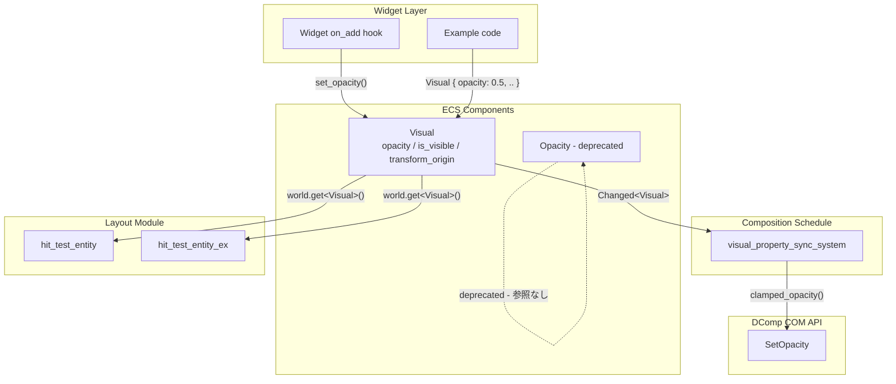
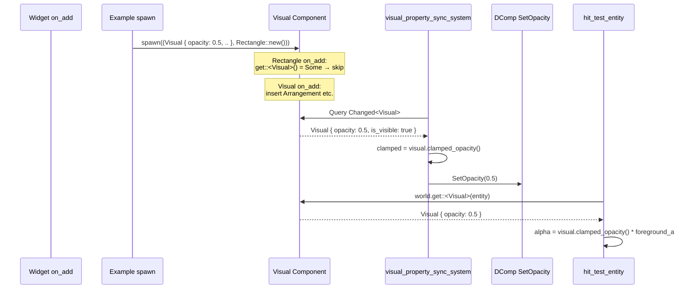
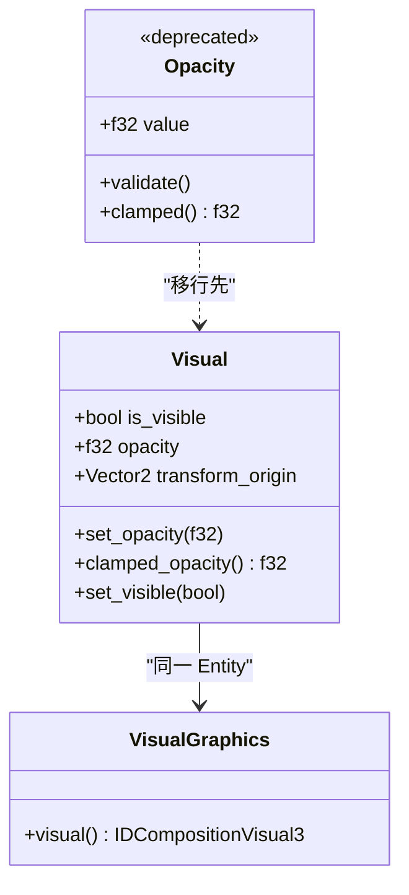

# 技術設計書: wintf-dcomp-migration-0-visual-opacity-dataflow

## Overview

**Purpose**: Widget 層から `Visual.opacity` / `Visual.is_visible` への書き込みデータフローを確立し、`Opacity` コンポーネントへの依存を段階的に廃止する。これにより DComp パイプライン（`visual_property_sync_system`）と将来の D2D1 パイプライン（`composite_render_system`）が同一データソースから透明度を取得できる。

**Users**: wintf フレームワーク開発者が、Widget の透明度・可視性を `Visual` コンポーネント経由で制御する。

**Impact**: 既存の `Opacity` → `visual_property_sync_system` データフローを `Visual.opacity` → 同 system に切り替え、`hit_test` の Opacity 読み取りも移行する。

### Goals
- `Visual.opacity` / `Visual.is_visible` への Widget 層書き込みパス確立
- `visual_property_sync_system` を `Visual` ベースのデータフローに移行
- `hit_test_entity` / `hit_test_entity_ex` の Opacity 読み取りを `Visual.opacity` に移行
- `Opacity` コンポーネントに `#[deprecated]` 属性を付与
- Phase 1 の `composite_render_system` が依存する Visual データフローの事前整備

### Non-Goals
- `Opacity` コンポーネントの即座削除
- Widget API の破壊的変更
- Layout 層への opacity フィールド追加
- `composite_render_system` の実装（Phase 1）

## Architecture

### Existing Architecture Analysis

現行のデータフローは二重構造になっている:

```
[現行] Widget → Opacity(metrics.rs) → visual_property_sync_system → DComp SetOpacity
                                     ↗ hit_test_entity
                                     ↗ hit_test_entity_ex

[未使用] Visual.opacity (常に 1.0) → 読み取りなし
```

**制約**:
- Widget on_add フックは `Visual::default()` を自動挿入するが、**全フックに既存チェック済み**（`world.get::<Visual>(entity).is_some()` → スキップ）
- `visual_property_sync_system` は `Composition` スケジュールに登録、Layout 後に実行
- `Changed<Visual>` はコードベースに 0 件（未使用）

### Architecture Pattern & Boundary Map



**Architecture Integration**:
- **Selected pattern**: 既存 `Visual` コンポーネント直接拡張（Option C: ハイブリッド方式）
- **Domain boundaries**: Graphics 層（`Visual`）が唯一のデータソースとなり、Layout 層（`Opacity`）は deprecated
- **Existing patterns preserved**: Widget on_add の既存チェックパターン、DComp COM API 呼び出しパターン
- **New components rationale**: 新コンポーネント追加なし（既存 `Visual` のメソッド追加のみ）

### Technology Stack

| Layer | Choice / Version | Role in Feature | Notes |
|-------|------------------|-----------------|-------|
| ECS Runtime | bevy_ecs 0.18.0 | コンポーネント管理・変更検出 | `Changed<Visual>` フィルタ活用 |
| COM API | windows 0.62.2 | DComp `SetOpacity` 呼び出し | 呼び出しパターン変更なし |
| Hit Test | wintf 内部 | α判定値の読み取り元変更 | `Opacity` → `Visual` |

## System Flows

### opacity データフロー（移行後）



## Requirements Traceability

| Requirement | Summary | Components | Interfaces | Flows |
|-------------|---------|------------|------------|-------|
| 1.1 | Widget → Visual.opacity 書き込み | Visual | `set_opacity()` | spawn flow |
| 1.2 | opacity クランプ | Visual | `clamped_opacity()`, `set_opacity()` | — |
| 1.3 | Changed\<Visual\> 変更検出 | Visual, sync system | bevy_ecs Changed filter | sync flow |
| 2.1 | Widget → Visual.is_visible 書き込み | Visual | `set_visible()` | spawn flow |
| 2.2 | Changed\<Visual\> is_visible 検出 | Visual, sync system | bevy_ecs Changed filter | sync flow |
| 2.3 | 描画システム継続 | — (既存動作) | — | — |
| 3.1 | sync system Visual.opacity 読み取り | sync system | Visual query | sync flow |
| 3.2 | sync system Changed\<Visual\> | sync system | bevy_ecs Changed filter | sync flow |
| 3.3 | sync system Opacity 完全切断 | sync system | — (削除) | — |
| 3.4 | is_visible → SetOpacity(0.0) | sync system | DComp SetOpacity | sync flow |
| 3.5 | hit_test Visual.opacity 読み取り | hit_test | `clamped_opacity()` | hit_test flow |
| 3.6 | hit_test テスト移行 | hit_test tests | Visual spawn | — |
| 4.1 | Opacity deprecated 付与 | Opacity | `#[deprecated]` | — |
| 4.2 | CI 警告可視化 | — (Rust compiler) | — | — |
| 5.1-5.5 | 検証基準 | テストコード | — | — |

## Components and Interfaces

| Component | Domain/Layer | Intent | Req Coverage | Key Dependencies | Contracts |
|-----------|-------------|--------|--------------|------------------|-----------|
| Visual | Graphics | opacity/is_visible データ保持・API | 1.1-1.3, 2.1-2.2 | — | Service |
| visual_property_sync_system | Graphics/Composition | Visual → DComp 同期 | 3.1-3.4 | Visual (P0), DComp COM (P0) | Service |
| hit_test_entity / hit_test_entity_ex | Layout | α判定値の Visual 読み取り | 3.5, 3.6 | Visual (P0) | Service |
| Opacity | Layout (deprecated) | 後方互換性維持 | 4.1, 4.2 | — | — |

### Graphics Layer

#### Visual コンポーネント拡張

| Field | Detail |
|-------|--------|
| Intent | Widget 層からの opacity/is_visible 書き込みと、読み取り側への統一 API 提供 |
| Requirements | 1.1, 1.2, 1.3, 2.1, 2.2 |

**Responsibilities & Constraints**
- opacity 値の 0.0〜1.0 クランプ保証
- `Changed<Visual>` による変更検出の基盤提供
- 既存 `pub` フィールドとの後方互換性維持（直接アクセスも許容）

**Dependencies**
- Inbound: Widget on_add フック — opacity/is_visible 設定 (P0)
- Inbound: Example コード — spawn 時の Visual 構築 (P0)
- Outbound: なし（データ保持のみ）

**Contracts**: Service [x]

##### Service Interface

```rust
impl Visual {
    /// opacity を 0.0〜1.0 にクランプして設定する。
    /// 範囲外の値は warn ログを出力後にクランプされる。
    pub fn set_opacity(&mut self, value: f32);

    /// クランプ済み opacity 値を返す (0.0〜1.0)。
    /// Opacity::clamped() の移行先。
    pub fn clamped_opacity(&self) -> f32;

    /// is_visible を設定する。
    pub fn set_visible(&mut self, visible: bool);
}
```

- Preconditions: なし
- Postconditions: `self.opacity` は 0.0〜1.0 の範囲内
- Invariants: `clamped_opacity()` は常に `self.opacity.clamp(0.0, 1.0)` を返す

**Implementation Notes**
- `set_opacity` は `Opacity::validate()` 相当のログ出力を移植する（範囲外警告）
- フィールド `pub opacity: f32` はそのまま維持。`set_opacity` はクランプ付き setter として追加
- `clamped_opacity()` は `Opacity::clamped()` と同一ロジック: `self.opacity.clamp(0.0, 1.0)`

#### visual_property_sync_system 修正

| Field | Detail |
|-------|--------|
| Intent | Visual → DComp SetOpacity 同期。Opacity コンポーネント完全切断。 |
| Requirements | 3.1, 3.2, 3.3, 3.4 |

**Responsibilities & Constraints**
- `Visual.opacity` を読み取り `SetOpacity()` に渡す
- `Visual.is_visible = false` の場合は `SetOpacity(0.0)` で非表示を実現
- `Changed<Visual>` で変更検出（`Changed<Opacity>` は完全削除）

**Dependencies**
- Inbound: Visual コンポーネント — opacity/is_visible 値 (P0)
- Inbound: Arrangement / GlobalArrangement — オフセット/スケール値 (P0)
- Outbound: DComp COM API — `IDCompositionVisual3::SetOpacity()` (P0)
- Outbound: DComp COM API — `set_offset_x()` / `set_offset_y()` (P0)

**Contracts**: Service [x]

##### Service Interface

```rust
pub fn visual_property_sync_system(
    changed_entities: Query<
        (
            Entity,
            &Arrangement,
            &GlobalArrangement,
            &Visual,                    // 追加: Opacity → Visual に変更
            &VisualGraphics,
            Option<&Name>,
            Has<Window>,
        ),
        Or<(
            Changed<Arrangement>,
            Changed<GlobalArrangement>,
            Changed<Visual>,            // 追加: Changed<Opacity> → Changed<Visual>
        )>,
    >,
)
```

- Preconditions: Visual コンポーネントがエンティティに存在する
- Postconditions: DComp Visual の opacity が `Visual.clamped_opacity()` と一致する
- Invariants: `is_visible = false` のエンティティは常に `SetOpacity(0.0)`

**Implementation Notes**
- クエリから `Option<&crate::ecs::layout::Opacity>` を削除し `&Visual` に置換
- フィルタから `Changed<crate::ecs::layout::Opacity>` を削除し `Changed<Visual>` に置換
- Opacity 同期ロジック（L1086-1097）を以下に置換:
  ```
  if !visual.is_visible {
      visual_com.set_opacity(0.0)
  } else {
      visual_com.set_opacity(visual.clamped_opacity())
  }
  ```

### Layout Layer

#### hit_test_entity / hit_test_entity_ex 修正

| Field | Detail |
|-------|--------|
| Intent | α判定値のデータソースを `Opacity` → `Visual.opacity` に切り替え |
| Requirements | 3.5, 3.6 |

**Responsibilities & Constraints**
- `world.get::<Visual>(entity)` で opacity 値を取得
- `Visual` 未挿入エンティティのフォールバック値は 1.0（現行 `Opacity` 未挿入と同等）

**Dependencies**
- Inbound: Visual コンポーネント — opacity 値 (P0)
- Outbound: なし（判定結果を返すのみ）

**Contracts**: Service [x]

##### Service Interface

変更前:
```rust
let opacity = world
    .get::<super::Opacity>(entity)
    .map(|o| o.clamped())
    .unwrap_or(1.0);
```

変更後:
```rust
let opacity = world
    .get::<crate::ecs::graphics::Visual>(entity)
    .map(|v| v.clamped_opacity())
    .unwrap_or(1.0);
```

**Implementation Notes**
- `hit_test_entity` (L204-207) と `hit_test_entity_ex` (L339-342) の 2 箇所が対象
- import パス: `use crate::ecs::graphics::Visual` の追加が必要（Layout モジュールから Graphics モジュールへの参照）
- テスト 6 関数の `Opacity(値)` を `Visual { opacity: 値, ..Default::default() }` に置換

### Layout Layer (Deprecated)

#### Opacity コンポーネント deprecation

| Field | Detail |
|-------|--------|
| Intent | `Opacity` の新規使用を抑止し、後続フェーズでの削除を容易にする |
| Requirements | 4.1, 4.2 |

**Responsibilities & Constraints**
- `#[deprecated]` 属性を構造体に付与
- 既存の impl ブロック（`validate()`, `clamped()`, `Default`）はそのまま維持

**Implementation Notes**
- 属性: `#[deprecated(since = "0.1.0", note = "Use Visual.opacity instead")]`
- 構造体定義のみに付与（impl ブロックには不要 — Rust は構造体の deprecated で使用箇所全体を警告）
- CI で `#[allow(deprecated)]` を使わない限りコンパイル警告が表示される

## Data Models

### Domain Model



**Invariants**:
- `Visual.opacity` は `set_opacity()` 経由で常に 0.0〜1.0（直接フィールドアクセスでは保証外）
- `clamped_opacity()` は入力値に関わらず常に 0.0〜1.0 を返す

## Error Handling

### Error Strategy

| エラー種別 | 対処 |
|-----------|------|
| DComp `SetOpacity` 失敗 | `warn!` ログ出力して継続（既存パターン維持） |
| opacity 範囲外値（`set_opacity`） | `warn!` ログ + クランプ（`Opacity::validate()` 移植） |
| `Visual` 未挿入エンティティへの hit_test | `unwrap_or(1.0)` フォールバック（既存パターン維持） |

## Testing Strategy

### Unit Tests
- `Visual::set_opacity()` — 正常範囲値、境界値（0.0, 1.0）、範囲外値（-0.1, 1.5）のクランプ検証
- `Visual::clamped_opacity()` — `Opacity::clamped()` と同等の動作検証
- `Visual::set_visible()` — true/false 設定検証
- `Visual::default()` — `opacity == 1.0`, `is_visible == true` の保証（既存テスト拡張）

### Integration Tests
- `visual_property_sync_system` が `Visual.opacity` を読み取り `SetOpacity()` に渡すことの検証
- `visual_property_sync_system` が `Visual.is_visible = false` で `SetOpacity(0.0)` を呼ぶことの検証
- `Changed<Visual>` フィルタが opacity 変更で発火することの検証
- `hit_test_entity` が `Visual.opacity` からα判定値を取得することの検証（既存テスト 6 関数の移行）
- Widget spawn 時に `Visual { opacity: 0.5, .. }` を指定した場合、`visual_property_sync_system` が正しく opacity を読み取り `SetOpacity(0.5)` を呼ぶことの検証（Req 1.1）
- `set_opacity()` を spawn 後に呼び出した場合、`Changed<Visual>` が発火し、`visual_property_sync_system` が更新された opacity を DComp に反映することの検証（Req 1.1, 1.3）

### Regression Tests
- 既存 Example（`dcomp_demo.rs`, `taffy_flex_demo.rs` 等）の手動実行による visual regression 確認
- `cargo test` 全テストパス確認
- deprecation 警告が `Opacity` 使用箇所で表示されることの確認

## Performance & Scalability

**Impact**: 低。データフロー切り替えのみで、計算量・メモリ使用量の変化なし。

- `Changed<Visual>` は `Changed<Opacity>` と同等のコスト
- `transform_origin` 変更による不要発火リスクは、R3 調査結果から実質ゼロ（将来のアニメーション対応時に再評価）
