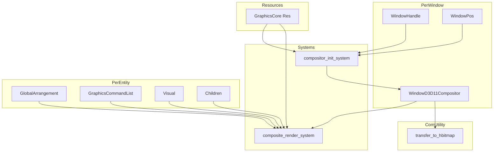
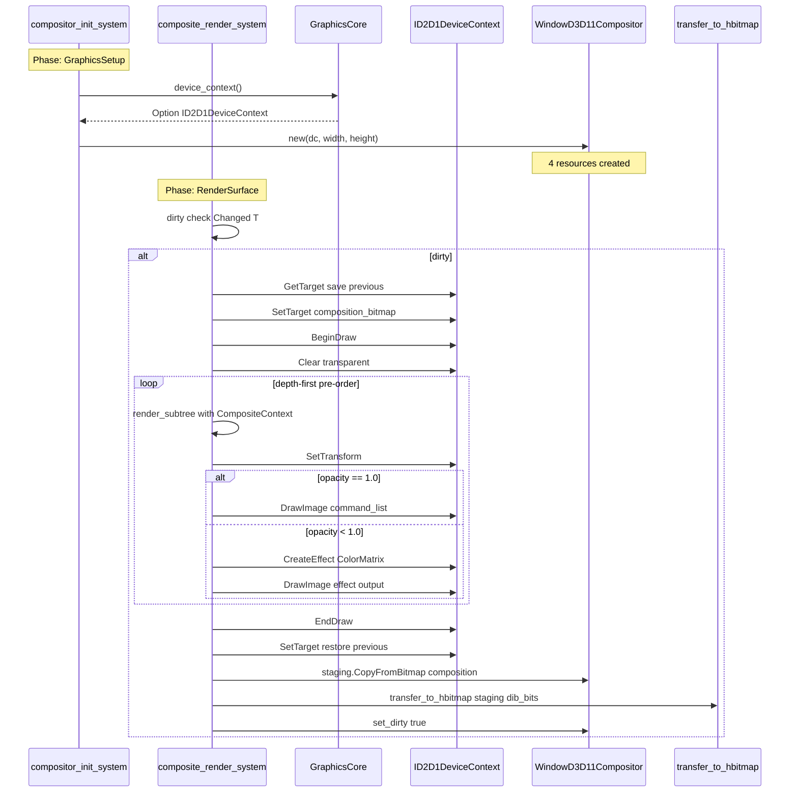
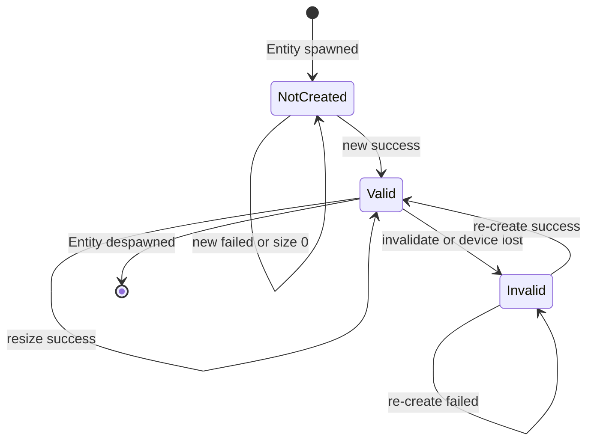

# 設計書: wintf-dcomp-migration-1-d2d1-composition (v2)

## Overview

**目的**: DComp パイプラインを温存しながら、D2D1 ソフトウェア合成描画スタックを独立モジュールとして構築する。全ウィジェットの `GraphicsCommandList`（`ID2D1CommandList`）を per-window 合成ビットマップ（`ID2D1Bitmap1`）上に z-order + transform + opacity で統合描画し、HBITMAP への転送基盤を確立する。

**利用者**: wintf フレームワーク開発者。Phase 2 以降で `world.rs` への登録・DComp 切り替えを行うまでは独立テスト環境で検証する。

**影響**: 新規モジュール3ファイルの追加と、既存モジュール定義ファイル2箇所への `mod` 行追加のみ。既存の DComp パイプラインおよびウィジェット描画システムは一切変更しない。

### Goals

- `WindowD3D11Compositor` コンポーネント — per-window 合成リソース（D2D1 Bitmap × 2 + GDI HBITMAP + MemoryDC）の統合管理
- `compositor_init_system` / `composite_render_system` — ECS 合成描画パイプライン
- `transfer_to_hbitmap()` — D2D1 → HBITMAP ピクセル転送ユーティリティ
- `CompositeContext` による opacity 階層累積（`render_subtree()` 再帰走査、Layout 層変更なし）
- 全新規コードは **独立テスト可能** — `world.rs` に登録しない（Phase 2 で登録）

### Non-Goals

- `world.rs` へのシステム登録（Phase 2）
- DComp パイプラインの変更・無効化（Phase 2）
- `UpdateLayeredWindow` 呼び出し（Phase 3）
- `WS_EX_LAYERED` スタイル変更（Phase 3）
- 旧 DComp コード削除（Phase 4）
- `Opacity` コンポーネント完全削除（Phase 4）
- Layout 層（`GlobalArrangement`）への opacity フィールド追加

---

## Architecture

### 新規モジュール配置

```
crates/wintf/src/
├── com/
│   ├── mod.rs              ← MODIFY: `pub mod ulw;` 追加
│   ├── ulw.rs              ← NEW: D2D→HBITMAP 転送ユーティリティ
│   └── (既存: d2d/, dwrite.rs, wic.rs, dcomp.rs)
├── ecs/
│   ├── graphics/
│   │   ├── mod.rs                  ← MODIFY: `pub mod compositor; pub mod compositor_systems;` 追加
│   │   ├── compositor.rs           ← NEW: WindowD3D11Compositor コンポーネント
│   │   ├── compositor_systems.rs   ← NEW: compositor_init_system, composite_render_system
│   │   └── (既存: core.rs, components.rs, systems.rs, command_list.rs, visual_manager.rs)
│   └── layout/
│       └── (既存: arrangement.rs, systems.rs) ← 変更なし
```

### コンポーネント間依存関係



### Architecture Integration

- **選択パターン**: 全新規ファイル方式（Option A）。DComp パイプラインに一切干渉しない
- **ドメイン境界**: COM 層（`com/ulw.rs`）と ECS 層（`ecs/graphics/compositor*.rs`）を分離
- **既存パターン維持**: `Option<Inner>` パターン、`SparseSet` ストレージ、`Send`/`Sync` 手動実装、`tracing` エラーログ
- **新規コンポーネント根拠**: `WindowD3D11Compositor` は DComp リソース（`WindowGraphics`）と異なるリソースセットを管理するため、既存コンポーネントの拡張ではなく独立設計が適切
- **steering 準拠**: GPU リソースコンポーネント命名規約（`XxxGraphics` サフィックス）に対する例外 — `WindowD3D11Compositor` は D2D1 + GDI 混合リソースであり、Phase 2 以降で DComp を完全置換する過渡的コンポーネントのため独自名称を採用

### Technology Stack

| 層 | 選択/バージョン | 役割 | 備考 |
|----|---------------|------|------|
| ECS | bevy_ecs 0.18.0 | コンポーネント・システム管理 | 既存 |
| Graphics | D2D1 (`ID2D1DeviceContext`) | 合成描画ターゲット管理 | 既存 DC を共有利用 |
| Effects | D2D1 (`ID2D1Effect`, `CLSID_D2D1ColorMatrix`) | opacity 適用 | **新規** |
| GDI | `CreateDIBSection`, `CreateCompatibleDC` | HBITMAP/MemoryDC 管理 | **新規** |
| Windows | windows 0.62.2 | COM バインディング | 既存 |

---

## System Flows

### 合成描画フロー



### compositor_init_system 状態遷移



---

## Requirements Traceability

| Requirement | 概要 | Components | Interfaces | Flows |
|-------------|------|-----------|------------|-------|
| 1.1-1.6 | WindowD3D11Compositor 4リソース管理 | WindowD3D11Compositor | Service (new/resize/invalidate) | init flow |
| 2.1 | depth-first pre-order 走査 | composite_render_system, render_subtree | — | render loop |
| 2.2 | Transform + DrawImage | composite_render_system | SetTransform, DrawImage | render loop |
| 2.3 | is_visible スキップ | render_subtree | Visual.is_visible | render loop |
| 2.4 | opacity 累積計算 | CompositeContext, render_subtree | Visual.clamped_opacity() | render loop |
| 2.5 | opacity 適用描画 | draw_with_opacity | D2D1 ColorMatrix Effect | render loop |
| 2.6 | opacity==0 スキップ | render_subtree | — | render loop |
| 2.7 | CopyFromBitmap + dirty | composite_render_system | CopyFromBitmap, set_dirty | post-render |
| 2.8 | ダーティ判定 | composite_render_system | Changed T 集約 | dirty check |
| 2.9 | 既存システム非侵襲 | — | GraphicsCommandList (read-only) | — |
| 2.10 | ファイル配置 | compositor_systems.rs | — | — |
| 3.1-3.7 | 合成リソース初期化 | compositor_init_system | WindowD3D11Compositor lifecycle | init flow |
| 4.1-4.5 | D2D→HBITMAP 転送 | transfer_to_hbitmap | Map/Unmap/memcpy | transfer flow |
| 5.1-5.6 | 検証基準 | テスト群 | — | — |

---

## Components and Interfaces

### コンポーネントサマリー

| Component | Domain/Layer | Intent | Req Coverage | Key Dependencies | Contracts |
|-----------|-------------|--------|-------------|-----------------|-----------|
| WindowD3D11Compositor | ECS/Graphics | per-window 合成リソース統合管理 | 1.1-1.6 | GraphicsCore (P0) | Service, State |
| compositor_init_system | ECS/Graphics | 合成リソース自動初期化 | 3.1-3.7 | GraphicsCore (P0), WindowHandle (P0) | — |
| composite_render_system | ECS/Graphics | D2D1 合成描画パイプライン | 2.1-2.10 | GraphicsCore (P0), WindowD3D11Compositor (P0) | — |
| CompositeContext | ECS/Graphics (internal) | opacity 階層累積 | 2.3-2.6 | Visual (P0) | — |
| transfer_to_hbitmap | COM/ULW | D2D→HBITMAP ピクセル転送 | 4.1-4.5 | — | Service |

---

### ECS / Graphics Layer

#### WindowD3D11Compositor

| Field | Detail |
|-------|--------|
| Intent | ウィンドウごとの D2D1 合成描画リソース群を統合管理する ECS コンポーネント |
| Requirements | 1.1, 1.2, 1.3, 1.4, 1.5, 1.6 |

**Responsibilities & Constraints**
- 4リソース（composition_bitmap, staging_bitmap, hbitmap, memory_dc）の一貫したライフサイクル管理
- 全リソースは常に同一サイズ・同一ピクセルフォーマット（PBGRA32）を維持
- GDI リソースは `Drop` で確実に解放（`DeleteObject`, `DeleteDC`）
- COM リソースは windows crate のスマートポインタで自動解放

**Dependencies**
- Inbound: `compositor_init_system` — 作成・リサイズ・再作成 (P0)
- Inbound: `composite_render_system` — 描画ターゲットとして参照 (P0)
- Outbound: `GraphicsCore` — `ID2D1DeviceContext` 取得元 (P0)

**Contracts**: Service [x] / State [x]

##### 構造体定義

```rust
#[derive(Component)]
#[component(storage = "SparseSet")]
pub struct WindowD3D11Compositor {
    inner: Option<WindowD3D11CompositorInner>,
    generation: u32,
    dirty: bool,
    cached_size: (u32, u32),
}

struct WindowD3D11CompositorInner {
    composition_bitmap: ID2D1Bitmap1,  // D2D1_BITMAP_OPTIONS_TARGET
    staging_bitmap: ID2D1Bitmap1,      // D2D1_BITMAP_OPTIONS_CPU_READ | CANNOT_DRAW
    hbitmap: HBITMAP,                  // CreateDIBSection PBGRA32 top-down
    memory_dc: CreatedHDC,             // CreateCompatibleDC
    dib_bits: *mut u8,                 // DIBSection pixel pointer
}

unsafe impl Send for WindowD3D11Compositor {}
unsafe impl Sync for WindowD3D11Compositor {}
```

##### Service Interface

| メソッド | シグネチャ | 前提条件 | 事後条件 |
|---------|-----------|---------|---------|
| `new()` | `(dc: &ID2D1DeviceContext, w: u32, h: u32) -> Result<Self>` | w>0, h>0, DC 有効 | 全4リソース有効、generation=0 |
| `resize()` | `(&mut self, dc: &ID2D1DeviceContext, w: u32, h: u32) -> Result<()>` | is_valid()==true | 全リソース新サイズ、generation++ |
| `invalidate()` | `(&mut self)` | — | inner=None, is_valid()==false |
| `is_valid()` | `(&self) -> bool` | — | inner.is_some() |
| `composition_bitmap()` | `(&self) -> Option<&ID2D1Bitmap1>` | — | — |
| `staging_bitmap()` | `(&self) -> Option<&ID2D1Bitmap1>` | — | — |
| `hbitmap()` | `(&self) -> Option<HBITMAP>` | — | — |
| `memory_dc()` | `(&self) -> Option<HDC>` | — | — |
| `dib_bits()` | `(&self) -> Option<*mut u8>` | — | — |
| `cached_size()` | `(&self) -> (u32, u32)` | — | — |
| `generation()` | `(&self) -> u32` | — | — |
| `is_dirty()` | `(&self) -> bool` | — | — |
| `set_dirty()` | `(&mut self, v: bool)` | — | dirty=v |

##### dirty フラグ契約（Phase 3 インターフェース）

- `composite_render_system`: 合成完了 + `transfer_to_hbitmap` 完了後に `set_dirty(true)`
- Phase 3 `ulw_present_system`: ULW 転送完了後に `set_dirty(false)`
- Phase 1 単体: dirty は設定されるが消費されない

##### Bitmap 作成パラメータ

**composition_bitmap** (Req 1.1):
```
D2D1_BITMAP_PROPERTIES1 {
    pixelFormat: D2D1_PIXEL_FORMAT {
        format: DXGI_FORMAT_B8G8R8A8_UNORM,
        alphaMode: D2D1_ALPHA_MODE_PREMULTIPLIED,
    },
    bitmapOptions: D2D1_BITMAP_OPTIONS_TARGET,
    dpiX: 96.0, dpiY: 96.0,
}
```

**staging_bitmap** (Req 1.1):
```
D2D1_BITMAP_PROPERTIES1 {
    pixelFormat: D2D1_PIXEL_FORMAT {
        format: DXGI_FORMAT_B8G8R8A8_UNORM,
        alphaMode: D2D1_ALPHA_MODE_PREMULTIPLIED,
    },
    bitmapOptions: D2D1_BITMAP_OPTIONS_CPU_READ | D2D1_BITMAP_OPTIONS_CANNOT_DRAW,
    dpiX: 96.0, dpiY: 96.0,
}
```

**DIBSection** (Req 1.1):
```
BITMAPINFOHEADER {
    biSize: size_of::<BITMAPINFOHEADER>() as u32,
    biWidth: width as i32,
    biHeight: -(height as i32),  // top-down DIB
    biPlanes: 1,
    biBitCount: 32,
    biCompression: BI_RGB,
    ..Default::default()
}
```

##### Drop 実装 (Req 1.5)

`WindowD3D11CompositorInner` の `Drop`:
- `DeleteObject(self.hbitmap)` — GDI HBITMAP 解放
- `DeleteDC(self.memory_dc)` — GDI MemoryDC 解放
- D2D1 `ID2D1Bitmap1` は COM スマートポインタの Drop で自動解放

##### State Management

```
[NotCreated] --new()--> [Valid] --invalidate()--> [Invalid]
                          |                          |
                          +--resize()-->[Valid]       |
[Invalid] ------new()---------------------------->[Valid]
```

- generation は `resize()` / 再作成時に `wrapping_add(1)` でインクリメント
- `cached_size` は `new()` / `resize()` 時に更新

**Implementation Notes**
- `SelectObject(memory_dc, hbitmap)` を `new()` 内で実行し、HBITMAP を DC に関連付ける
- `CreatedHDC` は windows crate の HDC ラッパーで `DeleteDC` の Drop が自動管理される場合はそちらに委譲。そうでなければ手動 Drop

---

#### compositor_init_system

| Field | Detail |
|-------|--------|
| Intent | HWND を持つウィンドウエンティティに `WindowD3D11Compositor` を自動作成・管理する |
| Requirements | 3.1, 3.2, 3.3, 3.4, 3.5, 3.6, 3.7 |

**Responsibilities & Constraints**
- 新規ウィンドウ検出（`Added<WindowHandle>` + `Without<WindowD3D11Compositor>`）→ 作成
- デバイスロスト復旧（`Changed<HasGraphicsResources>` + `!is_valid()`）→ 再作成
- リサイズ検出（`cached_size` vs `WindowPos.size`）→ `resize()`
- 幅または高さが 0 のウィンドウはスキップ

**Dependencies**
- Inbound: `GraphicsCore` (Res) — DC 取得 (P0)
- Inbound: `WindowHandle` — ウィンドウ存在の確認 (P0)
- Inbound: `WindowPos` — サイズ取得 (P0)
- Inbound: `HasGraphicsResources` — デバイスロスト検出 (P0)
- Outbound: `WindowD3D11Compositor` — 作成・更新 (P0)

##### システムシグネチャ

```rust
pub fn compositor_init_system(
    core: Res<GraphicsCore>,
    mut commands: Commands,
    // 新規ウィンドウ + デバイスロスト復旧
    mut query: Query<
        (Entity, &WindowHandle, &WindowPos, &HasGraphicsResources,
         Option<&mut WindowD3D11Compositor>, Option<&Name>),
        Or<(Without<WindowD3D11Compositor>, Changed<HasGraphicsResources>)>,
    >,
)
```

##### ロジックフロー

1. `core.device_context()` が `None` → early return（GraphicsCore 無効）
2. クエリイテレーション:
   - **WindowPos.size が None または幅/高さ 0** → スキップ (Req 3.6)
   - **`Option<WindowD3D11Compositor> = None`** → `WindowD3D11Compositor::new(dc, w, h)`:
     - 成功 → `commands.entity(entity).insert(compositor)` (Req 3.1)
     - 失敗 → `tracing::error!` + スキップ (Req 3.5)
   - **`Some(mut compositor)` + `!compositor.is_valid()`** → 再作成 (Req 3.4):
     - `WindowD3D11Compositor::new(dc, w, h)` で新インスタンス作成
     - 成功 → 旧 generation を引き継ぎ `increment_generation()`
     - 失敗 → `tracing::error!` + `invalidate()`
   - **`Some(mut compositor)` + `is_valid()` + サイズ変更** → `compositor.resize(dc, w, h)` (Req 3.3):
     - `cached_size != (w, h)` で検出
     - 失敗 → `tracing::error!`（旧サイズ維持）

**Implementation Notes**
- `init_window_graphics` と同一の `Or<(Without<T>, Changed<HasGraphicsResources>)>` パターンを踏襲
- リサイズ検出には `Changed<WindowPos>` フィルタは使わない — レイアウト変更でも発火するため、`cached_size` 比較で正確に検出
- Stage は `GraphicsSetup` 相当（Phase 2 で `world.rs` に登録予定）

---

#### composite_render_system

| Field | Detail |
|-------|--------|
| Intent | 全エンティティの GraphicsCommandList を z-order + transform + opacity で per-window 合成描画する |
| Requirements | 2.1, 2.2, 2.3, 2.4, 2.5, 2.6, 2.7, 2.8, 2.9, 2.10 |

**Responsibilities & Constraints**
- ウィンドウ内全エンティティを `Children` depth-first pre-order で走査（Req 2.1）
- 共有 DC の `SetTarget` でターゲット切替（RAII ガードで復元保証）
- `CompositeContext` で opacity 階層累積（Layout 層変更なし）
- PushLayer **不使用**（Req 2.5）— D2D1 ColorMatrix Effect で opacity 適用
- 既存ウィジェット描画システム群は一切変更しない（Req 2.9）

**Dependencies**
- Inbound: `GraphicsCore` (Res) — 共有 DC (P0)
- Inbound: `WindowD3D11Compositor` (per-window) — 合成ターゲット (P0)
- Inbound: `GlobalArrangement` (per-entity) — 座標変換 (P0)
- Inbound: `GraphicsCommandList` (per-entity) — 描画データ (P0)
- Inbound: `Visual` (per-entity) — opacity, is_visible (P0)
- Inbound: `Children` (per-entity) — 階層走査 (P0)
- Outbound: `transfer_to_hbitmap` — ステージング→HBITMAP 転送 (P1)

##### システムシグネチャ

```rust
pub fn composite_render_system(
    core: Res<GraphicsCore>,
    mut compositor_query: Query<(Entity, &mut WindowD3D11Compositor, &Children)>,
    entity_query: Query<(
        &GlobalArrangement,
        Option<&GraphicsCommandList>,
        &Visual,
        Option<&Children>,
    )>,
    // ダーティ判定用: ウィンドウ内に変更があるか検出
    changed_query: Query<
        Entity,
        (Or<(Changed<GraphicsCommandList>, Changed<GlobalArrangement>, Changed<Visual>)>,),
    >,
    children_query: Query<&Children>,
    // 初回フレーム検出用
    added_query: Query<Entity, Added<WindowD3D11Compositor>>,
)
```

##### ダーティ判定（Req 2.8）

ウィンドウ内のいずれかのエンティティで `Changed<GraphicsCommandList>` / `Changed<GlobalArrangement>` / `Changed<Visual>` が検出された場合、またはウィンドウ初回フレームの場合にウィンドウ全体を再合成する。

判定手順:
1. `added_query` で `Added<WindowD3D11Compositor>` を検出 → 初回フレームは常に dirty
2. ウィンドウの `Children` からサブツリー全体を走査
3. `changed_query` にヒットするエンティティが1つでもあれば dirty

**is_window_dirty 関数シグネチャ**:
```rust
fn is_window_dirty(
    window_entity: Entity,
    window_children: &Children,
    changed_query: &Query<Entity, Or<(Changed<GraphicsCommandList>, Changed<GlobalArrangement>, Changed<Visual>)>>,
    children_query: &Query<&Children>,
    added_query: &Query<Entity, Added<WindowD3D11Compositor>>,
) -> bool {
    // 初回フレーム検出
    if added_query.contains(window_entity) {
        return true;
    }
    
    // サブツリー内の Changed<T> 検出
    // ... 既存のロジック
}
```

> Phase 1 ではウィンドウ全体再合成。差分更新最適化は Phase 2 以降で検討。

##### 合成描画ループ

```rust
for (window_entity, mut compositor, window_children) in compositor_query.iter_mut() {
    let Some(dc) = core.device_context() else { continue };
    if !compositor.is_valid() { continue; }

    // 1. ダーティ判定（Req 2.8: 初回フレームまたは Changed<T> 検出）
    if !is_window_dirty(window_entity, window_children, &changed_query, &children_query, &added_query) {
        continue;
    }

    // 2. DC ターゲット切替（RAII ガード）
    let prev_target = unsafe { dc.GetTarget() };
    let comp_bmp = compositor.composition_bitmap().unwrap();
    unsafe { dc.SetTarget(comp_bmp) };

    // 3. BeginDraw → Clear
    unsafe { dc.BeginDraw() };
    unsafe { dc.Clear(Some(&D2D1_COLOR_F { r: 0.0, g: 0.0, b: 0.0, a: 0.0 })) };

    // 4. 再帰走査（Req 2.1）
    let ctx = CompositeContext { dc, accumulated_opacity: 1.0 };
    for &child in window_children.iter() {
        render_subtree(&ctx, child, &entity_query);
    }

    // 5. EndDraw + ターゲット復元
    unsafe { dc.EndDraw(std::ptr::null_mut(), std::ptr::null_mut()) };
    unsafe { dc.SetTarget(prev_target.as_ref()) };

    // 6. CopyFromBitmap（Req 2.7）
    let staging = compositor.staging_bitmap().unwrap();
    unsafe { staging.CopyFromBitmap(None, comp_bmp, None) };

    // 7. transfer_to_hbitmap（Req 4.1-4.5）
    if let (Some(staging), Some(dib_bits)) = (compositor.staging_bitmap(), compositor.dib_bits()) {
        let (w, h) = compositor.cached_size();
        unsafe { transfer_to_hbitmap(staging, dib_bits, w, h).ok() };
    }

    // 8. dirty フラグ設定（Req 2.7、Phase 3 で消費）
    compositor.set_dirty(true);
}
```

##### CompositeContext と render_subtree（Req 2.3, 2.4, 2.5, 2.6）

```rust
/// 合成描画ツリー走査時に親→子へ伝搬する描画コンテキスト
struct CompositeContext<'a> {
    dc: &'a ID2D1DeviceContext,
    accumulated_opacity: f32,
}
```

**render_subtree ロジック**:

```rust
fn render_subtree(
    ctx: &CompositeContext,
    entity: Entity,
    query: &Query<(&GlobalArrangement, Option<&GraphicsCommandList>, &Visual, Option<&Children>)>,
) {
    let Ok((ga, cmd_opt, visual, children_opt)) = query.get(entity) else { return };

    // Req 2.3: is_visible == false → サブツリーごとスキップ
    if !visual.is_visible { return; }

    // Req 2.4: opacity 累積計算
    let local_opacity = (ctx.accumulated_opacity * visual.clamped_opacity()).clamp(0.0, 1.0);

    // Req 2.6: opacity == 0.0 → サブツリーごとスキップ
    if local_opacity == 0.0 { return; }

    // Req 2.2: SetTransform
    unsafe { ctx.dc.SetTransform(&ga.transform) };

    // Req 2.5: opacity 適用描画
    if let Some(cmd) = cmd_opt {
        if let Some(command_list) = cmd.command_list() {
            if let Err(e) = unsafe { draw_with_opacity(ctx.dc, command_list, local_opacity) } {
                tracing::error!("draw_with_opacity failed for entity {:?}: {:?}", entity, e);
                return;  // 当該エンティティの描画をスキップ（子への再帰は後続で実施）
            }
        }
    }

    // 子エンティティへ再帰（accumulated_opacity を伝搬）
    let child_ctx = CompositeContext {
        dc: ctx.dc,
        accumulated_opacity: local_opacity,
    };
    if let Some(children) = children_opt {
        for &child in children.iter() {
            render_subtree(&child_ctx, child, query);
        }
    }
}
```

##### Opacity 適用方式: D2D1 ColorMatrix Effect（Req 2.5 設計決定）

**決定**: D2D1 ColorMatrix Effect を使用し、alpha チャネルに累積 opacity を乗算する。

**根拠**:
- `ID2D1DeviceContext::DrawImage(ID2D1Image)` COM API に opacity パラメータなし
- `ID2D1DeviceContext::DrawBitmap` は opacity パラメータあるが `ID2D1Bitmap` のみ受付（`ID2D1CommandList` は `ID2D1Image` であり直接使用不可）
- `PushLayer` は中間サーフェス確保の負荷のため不使用（Req 2.5）
- ColorMatrix Effect は GPU でインライン処理され、中間サーフェスの明示的確保が不要

**draw_with_opacity 関数**:

```rust
/// opacity を適用して GraphicsCommandList を描画する。
/// opacity == 1.0 の場合は Effect を介さず直接描画で最適化。
/// CreateEffect 失敗時は Err を返す（呼び出し側で graceful degradation）。
unsafe fn draw_with_opacity(
    dc: &ID2D1DeviceContext,
    command_list: &ID2D1CommandList,
    opacity: f32,
) -> windows::core::Result<()> {
    if (opacity - 1.0).abs() < f32::EPSILON {
        // opacity == 1.0: 直接描画（Effect 不要）
        dc.DrawImage(
            command_list,
            None, None,
            D2D1_INTERPOLATION_MODE_LINEAR,
            D2D1_COMPOSITE_MODE_SOURCE_OVER,
        );
    } else {
        // opacity < 1.0: ColorMatrix Effect で alpha 乗算
        let effect = dc.CreateEffect(&CLSID_D2D1ColorMatrix)?;
        effect.SetInput(0, command_list);
        let matrix = D2D1_MATRIX_5X4_F {
            M: [[1.0, 0.0, 0.0, 0.0],   // R
                [0.0, 1.0, 0.0, 0.0],   // G
                [0.0, 0.0, 1.0, 0.0],   // B
                [0.0, 0.0, 0.0, opacity], // A *= opacity
                [0.0, 0.0, 0.0, 0.0]],  // offset
        };
        // D2D1_COLORMATRIX_PROP_COLOR_MATRIX = 0
        effect.SetValue(0, /*PropertyType::*/ &matrix)?;
        let output = effect.GetOutput()?;
        dc.DrawImage(
            &output,
            None, None,
            D2D1_INTERPOLATION_MODE_LINEAR,
            D2D1_COMPOSITE_MODE_SOURCE_OVER,
        );
    }
    Ok(())
}
```

> **注**: 
> - `CreateEffect` は呼び出しコストがあるため、opacity < 1.0 のエンティティが多い場合は Effect インスタンスのキャッシュを Phase 2 以降で検討する。Phase 1 では毎回作成で正確性を優先。
> - CreateEffect/SetValue/GetOutput の失敗時は `Err` を返し、`render_subtree` が `tracing::error!` でログ出力後、当該エンティティの描画をスキップ（子エンティティへの再帰は継続）。この graceful degradation により GPU リソース枯渇時もアプリケーション全体のクラッシュを回避。

**Implementation Notes**
- DC ターゲット復元: `GetTarget()` → 保存 → 描画 → `SetTarget(prev)` のパターン。RAII ガード構造体への抽出は Phase 2 で検討
- `render_surface` と同様、直接 COM `DrawImage` を呼び出す（ラッパー trait の `draw_image` は opacity 制御に非対応）
- Stage は `RenderSurface` 相当（Phase 2 で `world.rs` に登録予定）

---

### COM / ULW Layer

#### transfer_to_hbitmap

| Field | Detail |
|-------|--------|
| Intent | D2D1 ステージングビットマップから GDI HBITMAP へピクセルデータを高速転送する |
| Requirements | 4.1, 4.2, 4.3, 4.4, 4.5 |

**Responsibilities & Constraints**
- ECS 非依存の純粋ユーティリティ関数
- Map 中は GPU→CPU 同期が発生するため、ダーティフラグで必要時のみ呼び出す
- pitch/stride 不一致時の行単位コピーを正しく処理

**Dependencies**
- External: `ID2D1Bitmap1::Map` / `Unmap` (windows 0.62.2) — ピクセルアクセス (P0)

**Contracts**: Service [x]

##### Service Interface

```rust
/// ステージング ID2D1Bitmap1 のピクセルデータを DIBSection HBITMAP にコピーする。
///
/// # Safety
/// `dib_bits` は `width * height * 4` バイト以上のメモリを指すこと。
/// staging bitmap は `D2D1_BITMAP_OPTIONS_CPU_READ` フラグ付きで作成されていること。
pub unsafe fn transfer_to_hbitmap(
    staging: &ID2D1Bitmap1,
    dib_bits: *mut u8,
    width: u32,
    height: u32,
) -> windows::core::Result<()>
```

- **前提条件**: staging は CPU_READ フラグ付き。dib_bits は width×height×4 バイト以上
- **事後条件**: DIBSection メモリに staging のピクセルデータがコピーされている
- **エラー**: Map 失敗時は `windows::core::Result::Err` を返却

##### 転送ロジック

1. `staging.Map(D2D1_MAP_OPTIONS_READ)` → `D2D1_MAPPED_RECT { pitch, bits }` (Req 4.1)
2. pitch と stride (`width * 4`) を比較:
   - **一致** → `std::ptr::copy_nonoverlapping(bits, dib_bits, stride * height)` (Req 4.3)
   - **不一致** → 行単位コピー: `for y in 0..height { copy row }` (Req 4.2)
3. `staging.Unmap()` (Req 4.1)

**Implementation Notes**
- `D2D1_MAPPED_RECT.pitch` は GPU ドライバ依存で `width * 4` と一致しない場合がある（パディングアライメント）
- Map/Unmap は GPU→CPU 同期を伴うため、Phase 1 ではダーティフレームのみ呼び出す

---

## Data Models

### WindowD3D11Compositor リソースライフサイクル

| 状態 | inner | generation | dirty | 遷移トリガー |
|------|-------|-----------|-------|------------|
| NotCreated | — | — | — | Entity 生成 |
| Valid | Some(Inner) | n | true/false | new() 成功、resize() 成功 |
| Invalid | None | n | false | invalidate()、デバイスロスト |

### CompositeContext Opacity 累積モデル

- `accumulated_opacity` ∈ `[0.0, 1.0]`（clamp 適用）
- 計算式: `child_opacity = clamp(parent_accumulated * child_visual.clamped_opacity(), 0.0, 1.0)`
- `is_visible == false` → opacity 計算前にサブツリー全体スキップ
- `accumulated_opacity == 0.0` → サブツリー全体スキップ（完全透明早期脱出）
- GlobalArrangement は座標変換専用のまま維持（opacity フィールド追加なし）
- `Opacity` コンポーネント（`#[deprecated]`）は参照しない

### 既存コンポーネントとの関係

| コンポーネント | Phase 1 での役割 | 変更 |
|-------------|-----------------|------|
| GraphicsCore | 共有 DC 取得元 | なし |
| WindowGraphics | DComp リソース管理（共存） | なし |
| Visual | opacity/is_visible 読み取り | なし |
| GlobalArrangement | transform 読み取り | なし |
| GraphicsCommandList | 描画データ読み取り | なし |
| Children | 階層走査 | なし |
| WindowPos | サイズ取得 | なし |

---

## Error Handling

| エラー | 発生元 | レスポンス | リカバリ |
|--------|--------|----------|---------|
| Bitmap 作成失敗 | `WindowD3D11Compositor::new()` | `tracing::error!` + コンポーネント未挿入 | 次フレームで `compositor_init_system` が再試行 |
| リサイズ失敗 | `WindowD3D11Compositor::resize()` | `tracing::error!` + 旧サイズ維持 | 次回サイズ変更時に再試行 |
| BeginDraw 失敗 | `composite_render_system` | `tracing::error!` + フレームスキップ | 次フレームで再描画 |
| EndDraw 失敗 | `composite_render_system` | `tracing::error!` + DC ターゲット復元 | 次フレームで再描画 |
| CopyFromBitmap 失敗 | `composite_render_system` | `tracing::error!` + dirty 未設定 | 次フレームで再試行 |
| Map 失敗 | `transfer_to_hbitmap` | `Err` 返却 → 呼出元で `tracing::error!` | 次フレームで再試行 |
| CreateEffect 失敗 | `draw_with_opacity` | `tracing::error!` + エンティティ描画スキップ | 次フレームで再試行 |
| デバイスロスト | D2D 操作全般 | `GraphicsCore::invalidate()` → 全 Compositor invalidate | 既存デバイスロスト復旧フロー |

---

## Testing Strategy

### Unit Tests

- `WindowD3D11Compositor::new()` — 全4リソース正常作成 (Req 5.1)
- `WindowD3D11Compositor::resize()` — リソース再作成 + サイズ整合性
- `WindowD3D11Compositor::invalidate()` — `is_valid() == false`
- `WindowD3D11Compositor` generation — `resize()` 後にインクリメント
- `WindowD3D11Compositor` dirty — `set_dirty(true)` / `set_dirty(false)`
- `CompositeContext` opacity 累積 — parent 0.8 × child 0.5 = 0.4 (Req 5.3)
- `CompositeContext` is_visible=false — サブツリースキップ
- `CompositeContext` clamp — 範囲外値のクランプ
- `transfer_to_hbitmap` — pitch==stride 一括コピー (Req 5.4)
- `transfer_to_hbitmap` — pitch!=stride 行単位コピー (Req 5.4)

### Integration Tests

- `composite_render_system` — 複数エンティティ z-order + transform 合成 (Req 5.2)
- `compositor_init_system` → `composite_render_system` パイプライン統合
- デバイスロスト → Compositor 再初期化 → 正常描画再開
- ウィンドウリサイズ → Bitmap 再作成 → 再合成

### E2E Tests

- `taffy_flex_demo` 相当の独立テスト環境で新パイプライン描画検証
- `cargo test` で全テスト（既存 + 新規）パス確認 (Req 5.5)
- `cargo build` で DComp パイプラインとの共存ビルド成功確認 (Req 5.6)

---

## 変更履歴

### v2 (2026-02-16): 要件 v2.1 + Discovery 反映による全面再設計

**v1 からの主要変更**:

- **要件 ID 体系**: 旧 Req 4-8 → Req 1-5 (v2) に統合。全 ID を `N.M` 形式（例: `1.1`, `2.5`）に統一
- **Opacity 適用方式確定**: D2D1 ColorMatrix Effect 方式を採用。`draw_with_opacity()` 関数の設計を詳細化（research.md v2.1 の Discovery 結果を反映）
- **DC ターゲット管理**: `GetTarget()` → `SetTarget(composition_bitmap)` → 描画 → `SetTarget(prev)` パターンを明記。RAII ガード構造体は Phase 2 で検討
- **GraphicsCommandList API 名修正**: `get()` → `command_list()` に修正（Discovery 確認済み）
- **ダーティ判定**: `Changed<T>` 集約検出 + サブツリー走査の具体的アルゴリズムを追加
- **compositor_init_system**: 要件 v2.1 の AC4 修正（GraphicsCore に generation なし）、リサイズ検出方式（`cached_size` 比較）を反映
- **Mermaid 図**: コンポーネント依存関係図、シーケンス図、状態遷移図を追加
- **Requirements Traceability**: 全 AC を `N.M` 形式で完全マッピング
- **transfer_to_hbitmap の呼び出し位置**: `composite_render_system` 内で CopyFromBitmap 直後に実行する設計に変更（v1 では呼び出し位置が曖昧だった）
