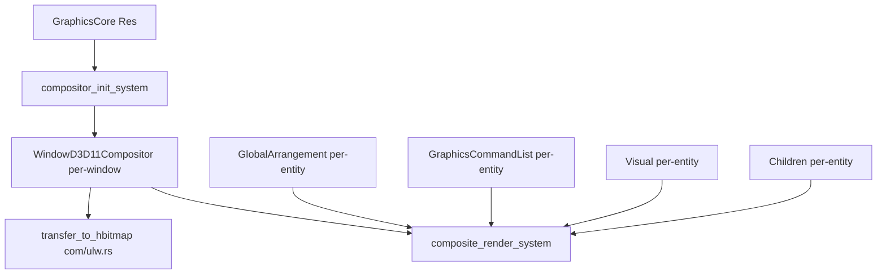

# 設計書: wintf-dcomp-migration-1-d2d1-composition

## Overview

DComp パイプラインを温存したまま、D2D1 合成描画スタックを新規モジュールとして並行構築する。本設計は親仕様 design.md と統合指針（migration-guide.md）から Phase 1 担当範囲を抽出・詳細化したものである。

### Goals

- `WindowD3D11Compositor` コンポーネントの実装（per-window 合成リソース管理）
- `compositor_init_system` / `composite_render_system` の実装（合成描画パイプライン）
- `com/ulw.rs` の `transfer_to_hbitmap()` 実装（D2D→HBITMAP 転送基盤）
- `CompositeContext` による Opacity 階層累積（`render_subtree()` 再帰走査中に手動累積、Layout層変更なし）
- 全新規コードは **独立テスト可能** — world.rs に登録しない（Phase 2 で登録）

### Non-Goals

- world.rs へのシステム登録
- DComp パイプラインの変更
- UpdateLayeredWindow 呼び出し（`present_layered_window` は Phase 3）
- 旧コード削除

---

## Architecture

### 新規モジュール配置

```
crates/wintf/src/
├── com/
│   ├── ulw.rs              ← NEW: D2D→HBITMAP転送ユーティリティ
│   └── (既存: d2d/, dwrite.rs, wic.rs, dcomp.rs)
├── ecs/
│   ├── graphics/
│   │   ├── compositor.rs           ← NEW: WindowD3D11Compositor コンポーネント
│   │   ├── compositor_systems.rs   ← NEW: compositor_init_system, composite_render_system
│   │   └── (既存: core.rs, components.rs, systems.rs, visual_manager.rs)
│   └── layout/
│       └── (既存: arrangement.rs, systems.rs) ← 変更なし
```

### コンポーネント間依存関係



---

## Components

### WindowD3D11Compositor

**ファイル**: `ecs/graphics/compositor.rs`

```rust
#[derive(Component)]
#[component(storage = "SparseSet")]
pub struct WindowD3D11Compositor {
    inner: Option<WindowD3D11CompositorInner>,
    generation: u32,
    dirty: bool,  // Phase 3 (ulw_present_system) が参照。composite_render_system が描画完了時に true に設定
}

struct WindowD3D11CompositorInner {
    composition_bitmap: ID2D1Bitmap1,  // D2D1_BITMAP_OPTIONS_TARGET
    staging_bitmap: ID2D1Bitmap1,      // D2D1_BITMAP_OPTIONS_CPU_READ | CANNOT_DRAW
    hbitmap: HBITMAP,                  // CreateDIBSection PBGRA32 top-down
    memory_dc: CreatedHDC,             // CreateCompatibleDC
    dib_bits: *mut u8,                 // DIBSection pixel pointer
    size: (u32, u32),                  // (width, height)
}
```

**Service Interface**:

| メソッド | 引数 | 返却 | 前提条件 | 事後条件 |
|---------|------|------|---------|---------|
| `new()` | `dc: &ID2D1DeviceContext, w: u32, h: u32` | `Result<Self>` | w>0, h>0, DC有効 | 全4リソース有効 |
| `resize()` | `dc: &ID2D1DeviceContext, w: u32, h: u32` | `Result<()>` | is_valid()==true | 全リソース新サイズ |
| `invalidate()` | — | `()` | — | inner=None |
| `is_valid()` | — | `bool` | — | — |
| `composition_bitmap()` | — | `Option<&ID2D1Bitmap1>` | — | — |
| `staging_bitmap()` | — | `Option<&ID2D1Bitmap1>` | — | — |
| `hbitmap()` | — | `Option<HBITMAP>` | — | — |
| `memory_dc()` | — | `Option<HDC>` | — | — |
| `dib_bits()` | — | `Option<*mut u8>` | — | — |
| `generation()` | — | `u32` | — | — |
| `is_dirty()` | — | `bool` | — | — |
| `set_dirty(v: bool)` | `v: bool` | `()` | — | dirty=v |

**dirty フラグ契約（Phase 3 インターフェース）**:
- `composite_render_system` が合成描画＋CopyFromBitmap 完了後に `set_dirty(true)` を呼び出す
- Phase 3 の `ulw_present_system` が ULW 転送完了後に `set_dirty(false)` を呼び出す
- Phase 1 単体では dirty フラグは設定されるが消費されない（Phase 3 で消費）

**Bitmap 作成パラメータ**:

composition_bitmap:
```
D2D1_BITMAP_PROPERTIES1 {
    pixelFormat: D2D1_PIXEL_FORMAT {
        format: DXGI_FORMAT_B8G8R8A8_UNORM,
        alphaMode: D2D1_ALPHA_MODE_PREMULTIPLIED,
    },
    bitmapOptions: D2D1_BITMAP_OPTIONS_TARGET,
    dpiX: 96.0, dpiY: 96.0,
}
```

staging_bitmap:
```
D2D1_BITMAP_PROPERTIES1 {
    pixelFormat: D2D1_PIXEL_FORMAT {
        format: DXGI_FORMAT_B8G8R8A8_UNORM,
        alphaMode: D2D1_ALPHA_MODE_PREMULTIPLIED,
    },
    bitmapOptions: D2D1_BITMAP_OPTIONS_CPU_READ | D2D1_BITMAP_OPTIONS_CANNOT_DRAW,
    dpiX: 96.0, dpiY: 96.0,
}
```

DIBSection:
```
BITMAPINFOHEADER {
    biSize: size_of::<BITMAPINFOHEADER>() as u32,
    biWidth: width as i32,
    biHeight: -(height as i32),  // top-down DIB
    biPlanes: 1,
    biBitCount: 32,
    biCompression: BI_RGB,
    ..Default::default()
}
```

**Drop実装**: `WindowD3D11CompositorInner` の Drop で `DeleteObject(hbitmap)`, `DeleteDC(memory_dc)` を呼び出す。D2D リソースは COM Drop で自動解放。

---

### CompositeContext（Opacity 階層累積）

**配置**: `ecs/graphics/compositor_systems.rs` 内のローカル構造体

**設計決定**: GlobalArrangement は**変更しない**。Opacity は描画属性であり Layout 層に含めず、`composite_render_system` の再帰走査中に `CompositeContext` で手動累積する。PushLayer は中間サーフェス確保の負荷が大きいため不使用。

```rust
/// 合成描画ツリー走査時に親→子へ伝搬する描画コンテキスト
struct CompositeContext<'a> {
    dc: &'a ID2D1DeviceContext,
    accumulated_opacity: f32,  // 親から累積された opacity
}
```

**累積ロジック**:
```rust
// render_subtree() 内での計算
let local_opacity = ctx.accumulated_opacity * visual.opacity;
if !visual.is_visible || local_opacity == 0.0 { return; } // サブツリースキップ

let child_ctx = CompositeContext {
    dc: ctx.dc,
    accumulated_opacity: local_opacity.clamp(0.0, 1.0),
};
```

**制約**:
- `accumulated_opacity` ∈ `[0.0, 1.0]`（clamp）
- `is_visible == false` → サブツリーごとスキップ
- 将来 clipping 等の拡張にも対応可能

---

## Systems

### compositor_init_system

**ファイル**: `ecs/graphics/compositor_systems.rs`

**Stage**: GraphicsSetup（Phase 2 で world.rs に登録予定）

**Query**:
```rust
fn compositor_init_system(
    core: Res<GraphicsCore>,
    mut commands: Commands,
    query: Query<(Entity, &WindowHandle), (Added<WindowHandle>, Without<WindowD3D11Compositor>)>,
    mut existing: Query<(&WindowHandle, &mut WindowD3D11Compositor)>,
) {
    // 1. 新規ウィンドウ: WindowD3D11Compositor 作成・挿入
    // 2. 既存ウィンドウ: generation不一致検出→再作成
    // 3. リサイズ検出: サイズ変更→resize()
}
```

**エラーハンドリング**:
- リソース作成失敗: `tracing::error!` + エンティティに `WindowD3D11Compositor` を挿入しない（次フレームで再試行）
- GraphicsCore 無効: システム全体をスキップ

---

### composite_render_system

**ファイル**: `ecs/graphics/compositor_systems.rs`

**Stage**: RenderSurface（Phase 2 で world.rs に登録予定）

**合成描画フロー**:

```rust
/// 合成描画ツリー走査時に親→子へ伝搬する描画コンテキスト
struct CompositeContext<'a> {
    dc: &'a ID2D1DeviceContext,
    accumulated_opacity: f32,
}

fn composite_render_system(
    core: Res<GraphicsCore>,
    mut compositor_query: Query<(Entity, &mut WindowD3D11Compositor, &Children)>,
    entity_query: Query<(&GlobalArrangement, Option<&GraphicsCommandList>, &Visual, Option<&Children>)>,
) {
    let dc = core.device_context();

    for (window_entity, mut compositor, children) in compositor_query.iter_mut() {
        // 1. ダーティ判定（Changed<GraphicsCommandList> || Changed<GlobalArrangement> || Changed<Visual>）
        // → ダーティでなければスキップ

        // 2. composition_bitmap を SetTarget
        let comp_bmp = compositor.composition_bitmap().unwrap();
        dc.SetTarget(comp_bmp);

        // 3. BeginDraw → Clear(transparent)
        dc.BeginDraw();
        dc.Clear(Some(&D2D1_COLOR_F { r: 0.0, g: 0.0, b: 0.0, a: 0.0 }));

        // 4. CompositeContext を作成し、ルートから再帰走査
        let ctx = CompositeContext { dc: &dc, accumulated_opacity: 1.0 };
        for &child in children.iter() {
            render_subtree(&ctx, child, &entity_query);
        }

        // 5. EndDraw
        dc.EndDraw(None, None);

        // 6. CopyFromBitmap(composition → staging)
        let staging = compositor.staging_bitmap().unwrap();
        staging.CopyFromBitmap(None, comp_bmp, None);

        // 7. dirty フラグ設定（Phase 3 ulw_present_system が消費）
        compositor.set_dirty(true);
    }
}

/// サブツリーを再帰的に描画。CompositeContext で DC + 累積透明度を伝搬。
fn render_subtree(
    ctx: &CompositeContext,
    entity: Entity,
    query: &Query<(&GlobalArrangement, Option<&GraphicsCommandList>, &Visual, Option<&Children>)>,
) {
    let Ok((ga, cmd_opt, visual, children_opt)) = query.get(entity) else { return; };

    // is_visible == false → サブツリーごとスキップ
    if !visual.is_visible { return; }

    // 累積 opacity 計算
    let local_opacity = ctx.accumulated_opacity * visual.opacity;
    if local_opacity == 0.0 { return; }

    // SetTransform
    ctx.dc.SetTransform(&ga.transform);

    // 描画（opacity < 1.0 の場合は D2D Effect 等で適用）
    if let Some(cmd) = cmd_opt {
        if let Some(command_list) = cmd.get() {
            draw_with_opacity(ctx.dc, command_list, local_opacity);
        }
    }

    // 子エンティティに累積 opacity を渡して再帰
    let child_ctx = CompositeContext {
        dc: ctx.dc,
        accumulated_opacity: local_opacity,
    };
    if let Some(children) = children_opt {
        for &child in children.iter() {
            render_subtree(&child_ctx, child, query);
        }
    }
}
```

**z-order走査関数**:
```rust
fn depth_first_preorder(
    root: Entity,
    root_children: &Children,
    query: &Query<...>,
) -> Vec<Entity> {
    // Children コンポーネントから再帰的に走査
    // 描画順: 親 → 子1 → 子1の子 → 子2 → ...
    // 先に描いたものが背景（画家のアルゴリズム）
}
```

**Opacity 適用方式**: **PushLayer は不使用**（中間サーフェス確保による負荷が大きいため）。`CompositeContext` で `accumulated_opacity` を親→子に手動累積し、D2D Effect または pre-multiplied alpha 操作で個別に適用。具体的な D2D API 選択は設計フェーズで確定。

**ダーティ判定**: bevy_ecs の `Changed<T>` フィルタを使用。ウィンドウに属するいずれかのエンティティが変更された場合にウィンドウ全体を再合成。初回フレーム（`Added<WindowD3D11Compositor>`）は必ず描画。

---

### com/ulw.rs — transfer_to_hbitmap

**ファイル**: `com/ulw.rs`

```rust
/// ステージング ID2D1Bitmap1 のピクセルデータを DIBSection HBITMAP にコピーする。
///
/// # Safety
/// `dib_bits` は `width * height * 4` バイト以上のメモリを指すこと。
pub unsafe fn transfer_to_hbitmap(
    staging: &ID2D1Bitmap1,
    dib_bits: *mut u8,
    width: u32,
    height: u32,
) -> windows::core::Result<()> {
    // 1. Map staging bitmap (D2D1_MAP_OPTIONS_READ)
    let mapped = staging.Map(D2D1_MAP_OPTIONS_READ)?;

    // 2. stride計算
    let src_pitch = mapped.pitch;          // D2D の行ストライド
    let dst_stride = width as usize * 4;   // DIBSection の行ストライド

    // 3. コピー
    if src_pitch as usize == dst_stride {
        // 一括コピー最適化
        std::ptr::copy_nonoverlapping(
            mapped.bits,
            dib_bits,
            dst_stride * height as usize,
        );
    } else {
        // 行単位コピー（pitch != stride の場合）
        for y in 0..height as usize {
            let src = mapped.bits.add(y * src_pitch as usize);
            let dst = dib_bits.add(y * dst_stride);
            std::ptr::copy_nonoverlapping(src, dst, dst_stride);
        }
    }

    // 4. Unmap
    staging.Unmap()?;

    Ok(())
}
```

---

## Data Models

### WindowD3D11Compositor 状態遷移

```
[未作成] --new()--> [有効] --invalidate()--> [無効]
   ^                  |                        |
   |                  +--resize()-->[有効]      |
   +--new()-----------------------------------+
```

- **未作成**: エンティティに挿入されていない
- **有効**: `is_valid() == true`、全リソースが使用可能
- **無効**: `is_valid() == false`、`inner == None`

### CompositeContext Opacity 累積（互換性）

- `CompositeContext` は `composite_render_system` 内部のローカル構造体であり、既存コンポーネントに一切影響しない
- GlobalArrangement は座標変換専用のまま維持（フィールド追加なし）
- Layout層（arrangement.rs, systems.rs）は一切変更不要

---

## Requirements Traceability

| Requirement (v2) | Design Component | Test Coverage |
|-------------------|-----------------|---------------|
| Req 1 AC1-AC6 (WindowD3D11Compositor) | WindowD3D11Compositor struct + methods + Drop | Unit: new/resize/invalidate lifecycle |
| Req 2 AC1-AC10 (composite_render_system) | composite_render_system + CompositeContext opacity 手動累積 | Integration: z-order, transform, opacity, dirty check |
| Req 3 AC1-AC7 (compositor_init_system) | compositor_init_system | Unit: creation, resize detection, HasGraphicsResources recovery |
| Req 4 AC1-AC5 (transfer_to_hbitmap) | com/ulw.rs transfer_to_hbitmap | Unit: pitch/stride copy |
| Req 5 AC1-AC6 (検証基準) | All above | E2E: taffy_flex_demo equivalent |

---

## Error Handling

| エラー | 発生元 | レスポンス | リカバリ |
|--------|--------|----------|---------|
| Bitmap作成失敗 | `WindowD3D11Compositor::new()` | `tracing::error` | 次フレームで再作成 |
| BeginDraw失敗 | `composite_render_system` | `tracing::error` + フレームスキップ | 次フレーム再描画 |
| CopyFromBitmap失敗 | `composite_render_system` | `tracing::error` + フレームスキップ | 次フレーム再試行 |
| Map失敗 | `transfer_to_hbitmap` | `Err` 返却 | 呼出元で判断 |
| リサイズ失敗 | `WindowD3D11Compositor::resize()` | `tracing::error` + 旧サイズ維持 | 次回リサイズ再試行 |
| デバイスロスト | D2D操作全般 | `GraphicsCore::invalidate()` → Compositor invalidate | 既存フロー |

---

## Testing Strategy

### Unit Tests

- `WindowD3D11Compositor::new()` — 全4リソース正常作成
- `WindowD3D11Compositor::resize()` — リソース再作成＋サイズ整合
- `WindowD3D11Compositor::invalidate()` — `is_valid() == false`
- CompositeContext `accumulated_opacity` — 初期値 1.0
- Opacity 累積計算 — parent 0.8 × child 0.5 = 0.4
- Opacity is_visible=false — サブツリースキップ
- Opacity clamp — 範囲外値のクランプ
- `transfer_to_hbitmap` — pitch==stride 一括コピー
- `transfer_to_hbitmap` — pitch!=stride 行単位コピー

### Integration Tests

- `composite_render_system` — 複数エンティティ z-order 合成
- `compositor_init_system` + `composite_render_system` 統合
- デバイスロスト → Compositor 再初期化
- ウィンドウリサイズ → Bitmap 再作成 → 再描画

### E2E Tests

- `taffy_flex_demo` 相当の描画が新パイプライン（独立テスト環境）で動作
- 既存テストへの回帰なし: `cargo test` 全パス
