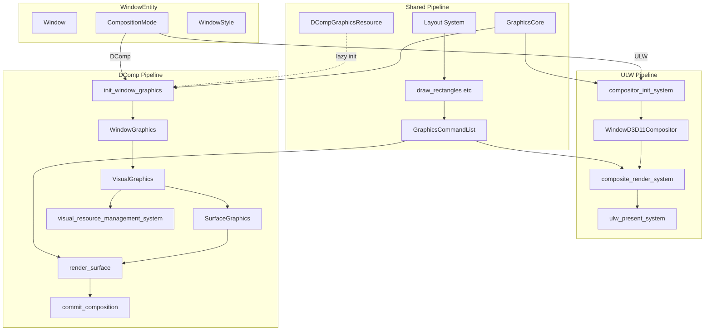
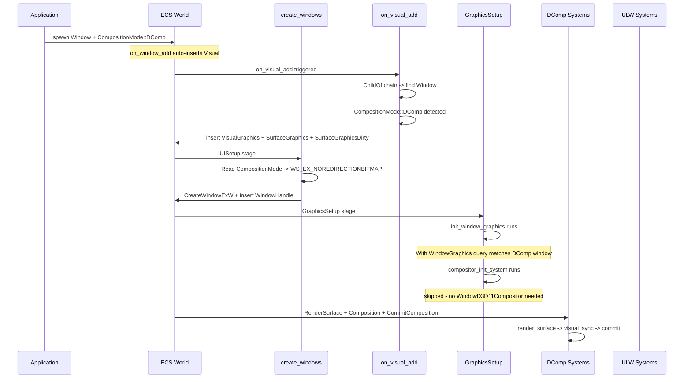
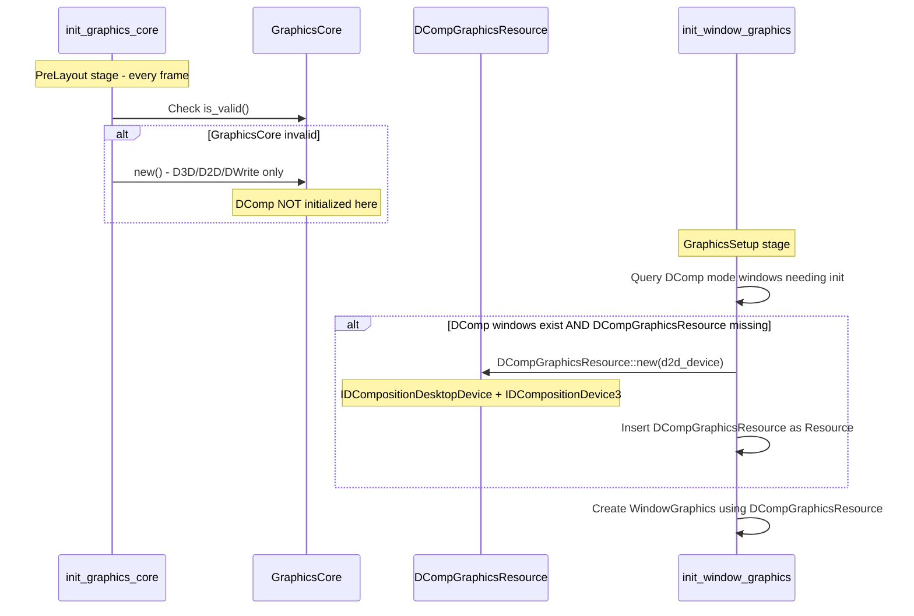
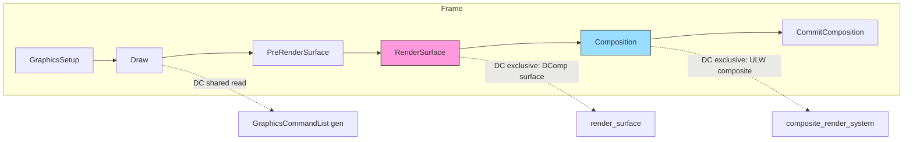
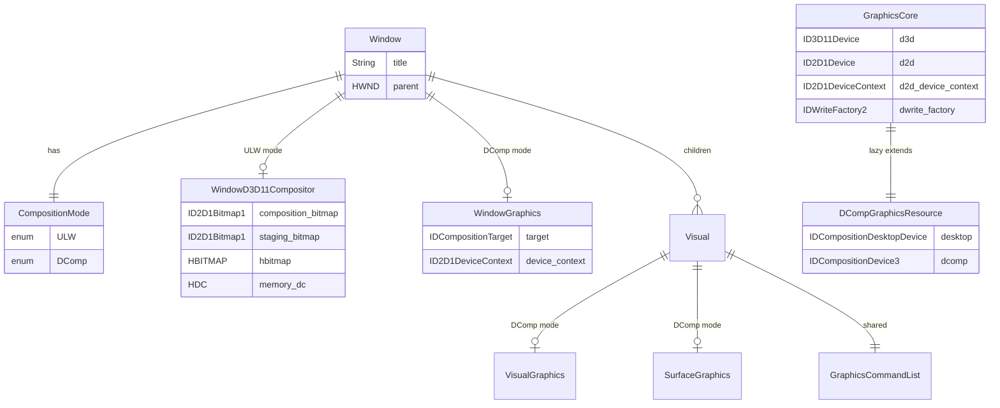

# Technical Design: wintf-dcomp-migration-4-switchable-backend

## Overview

**Purpose**: Window エンティティ単位で ULW（UpdateLayeredWindow）と DComp（DirectComposition）の描画パイプラインを切り替え、同一アプリ内で透過クリックスルーウィンドウと通常UIウィンドウを共存させる。

**Users**: areka アプリケーション開発者。デスクトップマスコット（ULW: 透過・クリックスルー）とバルーン/設定ウィンドウ（DComp: 通常UI）を同時表示する。

**Impact**: Phase 2 で無効化された DComp パイプラインを再有効化し、`CompositionMode` コンポーネントで Window ごとにパイプラインを選択可能にする。GraphicsCore を共通/DComp の2層に分離し、遅延初期化を実現する。

### Goals

- Window エンティティごとの ULW/DComp パイプライン選択
- 既存 DComp システムの最小変更での再有効化
- ULW のみ使用時の DComp 初期化コストゼロ
- 既存 ULW パイプラインの後方互換性維持

### Non-Goals

- WinRT Compositor（Windows.UI.Composition）対応（将来調査トピック、`research.md` 参照）
- ランタイムでの CompositionMode 動的切り替え（ウィンドウ生成時に決定、以降不変）
- DComp パイプラインの機能拡張（Phase 2 時点の機能を復元するのみ）

## Architecture

### Existing Architecture Analysis

現在のアーキテクチャは Phase 1〜3 の移行により以下の状態:

- **ULW パイプラインのみアクティブ**: `compositor_init_system` → `composite_render_system` → `ulw_present_system` が ECS スケジュールに登録済み
- **DComp コード残存**: `systems.rs`, `visual_manager.rs` の全システム関数が存在するがスケジュール未登録
- **GraphicsCore は DComp 常時初期化**: `GraphicsCoreInner` が `IDCompositionDesktopDevice` / `IDCompositionDevice3` を非 Option で保持
- **`on_visual_add` フック**: Phase 2 で DComp コンポーネント（`VisualGraphics`, `SurfaceGraphics`, `SurfaceGraphicsDirty`）自動挿入を除去済み
- **WindowStyle デフォルト**: Phase 3 で `WS_EX_LAYERED` に固定

**維持すべきパターン**:
- `Option<Inner>` パターン（`GraphicsCore`, `WindowGraphics`, `WindowD3D11Compositor`）
- コンポーネント存在による暗黙的 ECS クエリフィルタリング（`With<T>` / `Without<T>`）
- `ChildOf` チェーンによる祖先検索パターン（`find_owner_window()`）
- 構造化ロギング（tracing）

### Architecture Pattern & Boundary Map

**選択アプローチ: Option C（ハイブリッド方式）**

`CompositionMode` は Window エンティティにのみ保持。各パイプライン固有コンポーネントの存在/不在が ECS ネイティブクエリフィルタとして機能し、DComp/ULW システムが自然に分岐する。



**アーキテクチャ統合**:
- **選択パターン**: ハイブリッド方式 — Window レベルの `CompositionMode` enum + コンポーネント存在フィルタ
- **ドメイン境界**: ULW パイプライン（`compositor.rs`, `compositor_systems.rs`）と DComp パイプライン（`systems.rs`, `visual_manager.rs`）は既存のモジュール分離をそのまま活用
- **維持パターン**: `Option<Inner>` デバイスロスト対応、`With<T>` / `Without<T>` クエリフィルタ
- **新規コンポーネント**: `CompositionMode`（Window 専用）、`DCompGraphicsResource`（グローバルリソース）
- **ステアリング準拠**: ECS コンポーネントベース設計、COM ラッパー層分離、tracing ロギング

### Technology Stack

| Layer    | Choice / Version          | Role in Feature                                            | Notes                                                            |
| -------- | ------------------------- | ---------------------------------------------------------- | ---------------------------------------------------------------- |
| ECS      | bevy_ecs 0.18.0           | コンポーネント定義、スケジュール管理、クエリフィルタリング | `With<T>` / `Without<T>` フィルタ、`DeferredWorld` on_add フック |
| Graphics | DirectComposition (DComp) | DComp パイプライン描画                                     | `IDCompositionDevice3`, `IDCompositionDesktopDevice`             |
| Graphics | Direct2D / Direct3D11     | 共有描画基盤                                               | `ID2D1DeviceContext` 共有、両パイプラインで使用                  |
| Window   | Win32 API                 | ウィンドウスタイル制御                                     | `WS_EX_LAYERED` (ULW) / `WS_EX_NOREDIRECTIONBITMAP` (DComp)      |
| Crate    | windows 0.62.2            | COM API バインディング                                     | 既存依存、変更なし                                               |

## System Flows

### ウィンドウ生成からパイプライン初期化までのフロー



### GraphicsCore DComp 遅延初期化フロー



### DeviceContext 排他アクセスフロー



DComp の `render_surface`（RenderSurface ステージ）と ULW の `composite_render_system`（Composition ステージ）は異なるステージで実行されるため、`ID2D1DeviceContext` の排他アクセスはスケジュール順序で保証される。

## Requirements Traceability

| Requirement | Summary                         | Components                                      | Interfaces              | Flows           |
| ----------- | ------------------------------- | ----------------------------------------------- | ----------------------- | --------------- |
| 1.1         | CompositionMode enum 定義       | CompositionMode                                 | —                       | —               |
| 1.2         | Window コンポーネント保持       | CompositionMode                                 | —                       | Window生成      |
| 1.3         | デフォルト ULW                  | CompositionMode                                 | Default impl            | —               |
| 1.4         | ULW パイプライン適用            | CompositionMode, WindowD3D11Compositor          | —                       | ULW Pipeline    |
| 1.5         | DComp パイプライン適用          | CompositionMode, WindowGraphics, VisualGraphics | —                       | DComp Pipeline  |
| 2.1         | ULW システムフィルタ            | compositor_systems                              | With/Without filter     | —               |
| 2.2         | DComp システムフィルタ          | systems, visual_manager                         | With/Without filter     | —               |
| 2.3         | 共通システム共有                | draw systems, GraphicsCommandList               | —                       | Shared Pipeline |
| 2.4         | 混在時独立描画                  | 全パイプラインシステム                          | —                       | 全フロー        |
| 3.1         | DComp スケジュール再登録        | world.rs                                        | Schedule API            | —               |
| 3.2         | ULW スケジュール非破壊          | world.rs                                        | —                       | —               |
| 3.3         | 空クエリスキップ                | 全 DComp システム                               | With filter             | —               |
| 3.4         | deferred_surface DComp 限定     | deferred_surface_creation_system                | With filter             | —               |
| 4.1         | DComp Option 化                 | DCompGraphicsResource                           | new(), invalidate()     | 遅延初期化      |
| 4.2         | 初回 DComp 初期化               | DCompGraphicsResource, init_window_graphics     | ensure_dcomp_resource() | 遅延初期化      |
| 4.3         | ULW 時 DComp 不初期化           | GraphicsCore                                    | —                       | —               |
| 4.4         | アクセサ Option 返却            | DCompGraphicsResource                           | dcomp(), desktop()      | —               |
| 4.5         | デバイスロスト一括復旧          | GraphicsCore, DCompGraphicsResource             | invalidate()            | —               |
| 5.1         | ULW WS_EX_LAYERED               | create_windows                                  | —                       | Window生成      |
| 5.2         | DComp WS_EX_NOREDIRECTIONBITMAP | create_windows                                  | —                       | Window生成      |
| 5.3         | create_windows モード参照       | create_windows                                  | CompositionMode query   | Window生成      |
| 5.4         | WndProc モード分岐              | handlers.rs                                     | hwnd_to_entity lookup   | —               |
| 6.1         | 空クエリ即スキップ              | 全パイプラインシステム                          | With/Without filter     | —               |
| 6.2         | ECS ネイティブフィルタ          | 全パイプラインシステム                          | —                       | —               |
| 6.3         | GraphicsCommandList 共有        | draw systems                                    | —                       | Shared Pipeline |
| 6.4         | DComp 遅延初期化                | DCompGraphicsResource                           | —                       | 遅延初期化      |
| 6.5         | 共通リソース1回初期化           | GraphicsCore                                    | —                       | —               |
| 6.6         | 不要同期なし                    | world.rs Schedule                               | —                       | —               |
| 7.1         | DComp Visual 階層構築           | init_window_graphics, visual_manager            | —                       | DComp Pipeline  |
| 7.2         | DComp Surface 描画              | render_surface                                  | —                       | DComp Pipeline  |
| 7.3         | dcomp_demo リファレンス         | —                                               | —                       | —               |
| 7.4         | taffy_flex_demo DComp 動作      | —                                               | —                       | —               |
| 7.5         | COM エラーログ                  | 全 DComp システム                               | tracing                 | —               |
| 8.1         | 混在 World                      | CompositionMode                                 | —                       | —               |
| 8.2         | 独立描画                        | 全パイプラインシステム                          | —                       | 全フロー        |
| 8.3         | クリックスルー非干渉            | ULW/DComp 独立                                  | —                       | —               |
| 8.4         | ヒットテスト・イベント互換      | ポインタシステム                                | CompositionMode query   | —               |
| 9.1         | cargo test パス                 | —                                               | —                       | —               |
| 9.2         | ULW 後方互換                    | —                                               | —                       | —               |
| 9.3         | DComp example                   | dcomp_taffy_demo example                        | —                       | —               |
| 9.4         | 混在 example                    | multi_backend_demo example                      | —                       | —               |
| 9.5         | ULW クリックスルー              | —                                               | —                       | —               |
| 9.6         | DComp インタラクション          | —                                               | —                       | —               |

## Components and Interfaces

| Component                      | Domain/Layer | Intent                           | Req Coverage  | Key Dependencies           | Contracts      |
| ------------------------------ | ------------ | -------------------------------- | ------------- | -------------------------- | -------------- |
| CompositionMode                | ECS/Window   | Window のパイプライン選択を表現  | 1.1-1.5       | Window (P0)                | State          |
| DCompGraphicsResource          | ECS/Graphics | DComp COM デバイスの遅延管理     | 4.1-4.5       | GraphicsCore (P0)          | Service, State |
| GraphicsCore（変更）           | ECS/Graphics | 共通 GPU リソース管理            | 4.3, 4.5, 6.5 | —                          | Service, State |
| create_windows（変更）         | ECS/Window   | モード連動スタイル適用           | 5.1-5.3       | CompositionMode (P0)       | —              |
| on_visual_add（変更）          | ECS/Graphics | DComp コンポーネント条件付き挿入 | 2.2, 3.3      | CompositionMode (P0)       | —              |
| init_window_graphics（変更）   | ECS/Graphics | DComp 遅延初期化トリガー         | 4.2, 7.1      | DCompGraphicsResource (P0) | —              |
| compositor_init_system（変更） | ECS/Graphics | ULW モード限定化                 | 2.1           | CompositionMode (P0)       | —              |
| world.rs Schedule（変更）      | ECS/Core     | DComp システム再登録             | 3.1-3.2, 6.6  | —                          | —              |
| handlers.rs（変更）            | WndProc      | モード分岐処理                   | 5.4           | CompositionMode (P1)       | —              |

### ECS / Window Layer

#### CompositionMode

| Field        | Detail                                                                               |
| ------------ | ------------------------------------------------------------------------------------ |
| Intent       | Window エンティティの描画パイプラインを ULW / DComp から選択する enum コンポーネント |
| Requirements | 1.1, 1.2, 1.3, 1.4, 1.5                                                              |

**Responsibilities & Constraints**
- Window エンティティにのみ配置（子ウィジェットには伝播しない）
- ウィンドウ生成時に決定し、以降不変（ランタイム切り替え不可）
- デフォルト値は `ULW`（後方互換性）

**Dependencies**
- Inbound: `create_windows` — スタイル決定 (P0)
- Inbound: `on_visual_add` — DComp コンポーネント挿入判定 (P0)
- Inbound: `compositor_init_system` — ULW 限定判定 (P0)
- Inbound: `init_window_graphics` — DComp 限定判定 (P0)
- Inbound: `handlers.rs` — WndProc モード分岐 (P1)

**Contracts**: State [x]

##### State Management

```rust
#[derive(Component, Debug, Clone, Copy, PartialEq, Eq)]
pub enum CompositionMode {
    /// ULW パイプライン: D2D1 合成 → DIBSection → UpdateLayeredWindow
    /// 透過クリックスルー対応。デフォルト。
    ULW,
    /// DComp パイプライン: IDCompositionTarget → Visual → Surface
    /// 通常ウィンドウUI向け。
    DComp,
}

impl Default for CompositionMode {
    fn default() -> Self {
        Self::ULW
    }
}
```

- Persistence: ECS コンポーネントとして Entity に付与、永続化なし
- Consistency: ウィンドウ生成前に設定、生成後は不変
- Concurrency: 読み取り専用（生成時に1度書き込み）

**Implementation Notes**
- `on_visual_add` フック内で `DeferredWorld` を使い、`ChildOf` チェーンを辿って祖先 Window の `CompositionMode` を参照する。`find_owner_window` と同等のロジックを `DeferredWorld` 上で実装。
- `CompositionMode` は Window エンティティ専用のため、`on_window_add` フックでの自動挿入は行わない（呼び出し側が明示的に指定するか、`Default` で ULW が選択される）。

### ECS / Graphics Layer

#### DCompGraphicsResource

| Field        | Detail                                                                                                                                 |
| ------------ | -------------------------------------------------------------------------------------------------------------------------------------- |
| Intent       | DComp COM デバイス（`IDCompositionDesktopDevice`, `IDCompositionDevice3`）を遅延初期化し、DComp パイプライン専用リソースとして管理する |
| Requirements | 4.1, 4.2, 4.3, 4.4, 4.5                                                                                                                |

**Responsibilities & Constraints**
- `GraphicsCore` とは別の ECS Resource として管理（`Option<Res<DCompGraphicsResource>>` で参照）
- DComp モードのウィンドウが初めて必要になった時点で初期化（遅延初期化）
- `GraphicsCore.invalidate()` 時に連動して `invalidate()` される
- `Option<Inner>` パターンに従う

**Dependencies**
- Inbound: `init_window_graphics` — DComp デバイス参照 (P0)
- Inbound: `visual_resource_management_system` — DComp デバイス参照 (P0)
- Inbound: `commit_composition` — DComp Commit (P0)
- Outbound: GraphicsCore — D2D デバイス依存 (P0)

**Contracts**: Service [x] / State [x]

##### Service Interface

```rust
impl DCompGraphicsResource {
    /// DComp デバイスを初期化。GraphicsCore の D2D デバイスに依存。
    pub fn new(d2d_device: &ID2D1Device) -> windows::core::Result<Self>;

    /// 全 DComp COM リソースを無効化
    pub fn invalidate(&mut self);

    /// DComp デバイスが有効か
    pub fn is_valid(&self) -> bool;

    /// IDCompositionDevice3 への Option アクセサ
    pub fn dcomp(&self) -> Option<&IDCompositionDevice3>;

    /// IDCompositionDesktopDevice への Option アクセサ  
    pub fn desktop(&self) -> Option<&IDCompositionDesktopDevice>;
}
```

- Preconditions: `new()` は `GraphicsCore` が valid な状態で呼び出す
- Postconditions: `new()` 成功後、`dcomp()` / `desktop()` が `Some` を返す
- Invariants: `is_valid() == false` のとき、全アクセサは `None` を返す

##### State Management

```rust
struct DCompGraphicsResourceInner {
    desktop: IDCompositionDesktopDevice,
    dcomp: IDCompositionDevice3,
}

#[derive(Resource)]
pub struct DCompGraphicsResource {
    inner: Option<DCompGraphicsResourceInner>,
}
```

- Persistence: ECS Resource（`Res<DCompGraphicsResource>`）
- Consistency: `GraphicsCore.invalidate()` 時に `DCompGraphicsResource.invalidate()` を連動呼出し
- Concurrency: ECS Resource アクセス制御による排他管理

**Implementation Notes**
- `GraphicsCore` から DComp 2フィールド（`desktop`, `dcomp`）を除去し、`DCompGraphicsResource` に移管。
- `GraphicsCore::new()` は D3D/D2D/DWrite の共通リソースのみ初期化。DComp 初期化ステップ（7, 8）を除去。
- `init_window_graphics` 内で `Option<ResMut<DCompGraphicsResource>>` を受け取り、必要時に `Commands::init_resource()` で初期化。
- `invalidate_dependent_components` システムで `GraphicsCore` 無効化検知時に `DCompGraphicsResource` も無効化する。

#### GraphicsCore（変更）

| Field        | Detail                                                                           |
| ------------ | -------------------------------------------------------------------------------- |
| Intent       | D3D11/D2D/DWrite 共通 GPU リソースの管理。DComp デバイスを除去し、共通基盤に純化 |
| Requirements | 4.3, 4.5, 6.5                                                                    |

**変更内容**:
- `GraphicsCoreInner` から `desktop: IDCompositionDesktopDevice` と `dcomp: IDCompositionDevice3` の2フィールドを除去
- `new()` から DComp 初期化ステップ（7, 8）を除去
- `dcomp()` / `desktop()` アクセサを除去（`DCompGraphicsResource` に移管）
- `invalidate()` は変更なし（共通リソースの無効化のみ）
- 既存の `d2d_factory()`, `d2d_device()`, `device_context()`, `dwrite_factory()`, `d3d()`, `dxgi()`, `is_valid()` は変更なし

**Implementation Notes**
- DComp フィールド除去により、`GraphicsCore::new()` のエラーケースが減少（DComp COM 初期化失敗がなくなる）
- `Res<GraphicsCore>` を参照する全 DComp システムは追加で `Option<Res<DCompGraphicsResource>>` を参照する構造に変更

#### on_visual_add（変更）

| Field        | Detail                                                                                                        |
| ------------ | ------------------------------------------------------------------------------------------------------------- |
| Intent       | Visual コンポーネント追加時に、祖先 Window の CompositionMode に応じて DComp コンポーネントを条件付き挿入する |
| Requirements | 2.2, 3.3                                                                                                      |

**変更内容**:

```rust
fn on_visual_add(mut world: DeferredWorld, context: HookContext) {
    let entity = context.entity;

    // 既存: Arrangement, BrushInherit の挿入（変更なし）

    // 新規: 祖先 Window の CompositionMode を判定
    // DeferredWorld で ChildOf チェーンを辿り、Window を持つ祖先を探索
    let is_dcomp_mode = find_composition_mode_deferred(&world, entity)
        .map(|mode| matches!(mode, CompositionMode::DComp))
        .unwrap_or(false);

    if is_dcomp_mode {
        // DComp コンポーネントを挿入（Phase 2 で除去されたロジックの条件付き復元）
        let mut cmds = world.commands();
        let mut entity_cmds = cmds.entity(entity);
        entity_cmds.insert((
            VisualGraphics::default(),
            SurfaceGraphics::default(),
            SurfaceGraphicsDirty::default(),
        ));
    }
}

/// DeferredWorld で ChildOf チェーンを辿り、祖先 Window の CompositionMode を返す。
/// Window が見つからないか CompositionMode がない場合は None。
fn find_composition_mode_deferred(
    world: &DeferredWorld,
    entity: Entity,
) -> Option<CompositionMode> {
    // エンティティ自身が Window + CompositionMode を持つ場合
    if world.get::<Window>(entity).is_some() {
        return world.get::<CompositionMode>(entity).copied();
    }
    // ChildOf チェーンを辿る
    let mut current = entity;
    while let Some(child_of) = world.get::<ChildOf>(current) {
        let parent = child_of.parent();
        if world.get::<Window>(parent).is_some() {
            return world.get::<CompositionMode>(parent).copied();
        }
        current = parent;
    }
    None
}
```

**Implementation Notes**
- `DeferredWorld` は `world.get::<T>(entity)` を提供するため、`ChildOf` チェーン走査が可能。既存の `find_owner_window(&World, Entity)` と同等のロジック。
- Window エンティティ自身が Visual を持つ場合、`on_window_add` で `Visual::default()` が自動挿入される。この時点で Window にまだ `CompositionMode` が付与されていない可能性がある。spawn 時に `CompositionMode` と `Window` を同時に insert するか、`CompositionMode` → `Window` の順で insert する必要がある。
- ULW モードでは DComp コンポーネントは挿入されず、既存と同じ動作。後方互換性を維持。
- 万が一 `find_composition_mode_deferred` が `None` を返す場合（Window 未所属の orphan Visual）、DComp コンポーネントは挿入しない（安全側に倒す）。

#### init_window_graphics（変更）

| Field        | Detail                                                                                                        |
| ------------ | ------------------------------------------------------------------------------------------------------------- |
| Intent       | DComp モードの Window に対して DComp COM リソースを初期化し、DCompGraphicsResource の遅延初期化をトリガーする |
| Requirements | 4.2, 7.1                                                                                                      |

**変更内容**:
- 既存クエリはそのまま: `Query<(Entity, &WindowHandle, &HasGraphicsResources, ...), Or<(Without<WindowGraphics>, Changed<HasGraphicsResources>)>>`
- `Res<GraphicsCore>` に加え `Option<ResMut<DCompGraphicsResource>>` を受け取る
- `DCompGraphicsResource` が存在しない場合、GraphicsCore の D2D デバイスから初期化して挿入
- `WindowGraphics` に紐づく `IDCompositionTarget` 作成は `DCompGraphicsResource.desktop()` を使用

**フィルタリング戦略**:
- `init_window_graphics` は `Without<WindowGraphics>` を含むため、`WindowGraphics` が存在しない Window のみ処理
- ULW モードの Window には `WindowGraphics` が挿入されないため、`init_window_graphics` のクエリに引っかかりうる
- → クエリに `&CompositionMode` を追加し、ランタイムで `CompositionMode::DComp` の Window のみ処理する。`Without<WindowD3D11Compositor>` フィルタは **使用不可**（`GraphicsSetup` ステージ内で `init_window_graphics` が `compositor_init_system` より先に実行されるため、この時点では ULW Window にも `WindowD3D11Compositor` が未存在であり、両者を区別できない）

**Implementation Notes**
- `DCompGraphicsResource` の初期化は `init_window_graphics` 内で行う（最初の DComp Window 検出時にのみ実行）
- `Commands::insert_resource()` で `DCompGraphicsResource` を ECS World に挿入
- 初期化失敗時は `error!` ログを出力して スキップ（デバイスロスト時は次フレームで再試行）

#### compositor_init_system（変更）

| Field        | Detail                                                      |
| ------------ | ----------------------------------------------------------- |
| Intent       | ULW モードの Window にのみ WindowD3D11Compositor を生成する |
| Requirements | 2.1                                                         |

**変更内容**:
- クエリに `&CompositionMode` を追加
- ランタイムで `CompositionMode::ULW` のみ処理（`CompositionMode::DComp` はスキップ）
- または `Without<WindowGraphics>` フィルタ追加（DComp Window は `init_window_graphics` で `WindowGraphics` が挿入されるため）

**Implementation Notes**
- 既存の `Or<(Without<WindowD3D11Compositor>, Changed<HasGraphicsResources>, Changed<WindowPos>)>` フィルタはそのまま維持
- `CompositionMode` をクエリに含め、イテレーション内で `matches!(mode, CompositionMode::ULW)` チェック追加が最小変更

### ECS / Core Layer

#### world.rs Schedule（変更）

| Field        | Detail                                                        |
| ------------ | ------------------------------------------------------------- |
| Intent       | Phase 2 で除去された DComp システムをスケジュールに再登録する |
| Requirements | 3.1, 3.2, 6.6                                                 |

**再登録計画**:

| ステージ          | 追加システム                                                            | 既存システム              |
| ----------------- | ----------------------------------------------------------------------- | ------------------------- |
| GraphicsSetup     | `init_window_graphics`                                                  | `compositor_init_system`  |
| PreRenderSurface  | `visual_resource_management_system`, `deferred_surface_creation_system` | （空）                    |
| RenderSurface     | `render_surface`                                                        | （空）                    |
| Composition       | `visual_hierarchy_sync_system`, `visual_property_sync_system`           | `composite_render_system` |
| CommitComposition | `commit_composition`                                                    | `ulw_present_system`      |

**ステージ内順序ルール**:
- `GraphicsSetup`: `init_window_graphics` → `compositor_init_system`（DComp Window が先に初期化されることで、compositor_init が正しくスキップ可能）
- `Composition`: `visual_hierarchy_sync_system` → `visual_property_sync_system` → `composite_render_system`（DComp Visual 同期後に ULW 合成）
- `CommitComposition`: `commit_composition` → `ulw_present_system`（順序は任意、独立して動作）

**Implementation Notes**
- `mark_dirty_surfaces` / `cleanup_surface_on_commandlist_removed` は `Draw` ステージまたは `PreRenderSurface` ステージに再登録
- `window_visual_integration_system` は `GraphicsSetup` の `init_window_graphics` 直後に再登録
- 各ステージ内のシステムが Multi executor で並列実行可能な場合は bevy_ecs のデフォルトに委ねる

### WndProc Layer

#### handlers.rs（変更）

| Field        | Detail                                                         |
| ------------ | -------------------------------------------------------------- |
| Intent       | WM_PAINT / WM_ERASEBKGND を CompositionMode に応じて分岐させる |
| Requirements | 5.4                                                            |

**変更内容**:

**WM_PAINT**:
- 現状（ULW 前提）: `BeginPaint` / `EndPaint` 最小ペア → `LRESULT(0)`
- DComp モード時: `DefWindowProcW` に委譲（DComp は OS 側で描画管理）
- モード判定: `hwnd_to_entity` → Entity → `world.get::<CompositionMode>(entity)`

**WM_ERASEBKGND**:
- 現状（ULW 前提）: `LRESULT(1)`（背景消去スキップ）
- DComp モード時: 同じく `LRESULT(1)` で良い（`WS_EX_NOREDIRECTIONBITMAP` ウィンドウは WM_ERASEBKGND が発火しないため影響なし）
- → 変更不要

**WM_WINDOWPOSCHANGED**:
- 現状: `try_tick_on_vsync()` 呼び出しで ULW 再描画をトリガー
- DComp モード時: 同じフローで問題ない（DComp は OS の vsync に同期し `Commit()` で反映される）
- → 変更不要

**Implementation Notes**
- WM_PAINT のモード分岐のみ必要。WM_ERASEBKGND と WM_WINDOWPOSCHANGED は両モード共通で動作。
- `CompositionMode` 取得に失敗した場合（Entity 未登録等）は現状の ULW 動作をフォールバック。

## Data Models

### Domain Model



**集約境界**:
- `GraphicsCore` + `DCompGraphicsResource`: グローバルリソース集約。`invalidate()` は `GraphicsCore` → `DCompGraphicsResource` の順で連鎖無効化。
- Window エンティティ: `CompositionMode` に応じて `WindowD3D11Compositor`（ULW）または `WindowGraphics`（DComp）のいずれか一方を保持。
- Visual エンティティ: DComp モード Window 配下でのみ `VisualGraphics` + `SurfaceGraphics` を保持。ULW モード Window 配下では保持しない。

**ビジネスルール**:
- `CompositionMode::ULW` の Window: `WindowD3D11Compositor` あり、`WindowGraphics` なし
- `CompositionMode::DComp` の Window: `WindowGraphics` あり、`WindowD3D11Compositor` なし
- 上記の排他性はシステム（`compositor_init_system` / `init_window_graphics`）が保証

### Component Insertion Matrix

| Entity Type               | CompositionMode | auto-insert Components                                                                            |
| ------------------------- | --------------- | ------------------------------------------------------------------------------------------------- |
| Window (ULW)              | ULW             | WindowD3D11Compositor（compositor_init_system）                                                   |
| Window (DComp)            | DComp           | WindowGraphics（init_window_graphics）                                                            |
| Visual under ULW Window   | —               | Arrangement, BrushInherit（on_visual_add）                                                        |
| Visual under DComp Window | —               | Arrangement, BrushInherit, VisualGraphics, SurfaceGraphics, SurfaceGraphicsDirty（on_visual_add） |

## Error Handling

### Error Strategy

既存のエラーハンドリングパターンを踏襲:
- COM API 失敗: `tracing::error!` で構造化ログ出力、操作スキップ
- リソース作成失敗: `inner = None` のまま保持、次フレームで再試行
- デバイスロスト: `GraphicsCore.invalidate()` + `DCompGraphicsResource.invalidate()` → 全リソース再構築

### Error Categories and Responses

**DComp 遅延初期化失敗**:
- `DCompGraphicsResource::new()` が COM エラーを返した場合 → `error!` ログ、DComp Window は描画されずフレームスキップ。次フレームで再試行。
- ULW Window の描画には影響しない（独立パイプライン）。

**モード判定失敗**:
- `on_visual_add` で `find_composition_mode_deferred` が `None` を返す → DComp コンポーネント挿入せず（ULW フォールバック）
- `handlers.rs` で `CompositionMode` 取得失敗 → 現状 ULW 動作を維持

**共有 DeviceContext 競合**:
- スケジュールステージ順序で保証。`RenderSurface`（DComp）→ `Composition`（ULW）は順次実行。同一ステージ内で DeviceContext を排他使用するシステムは存在しない。

## Testing Strategy

### Unit Tests

- `CompositionMode` の `Default` 実装が `ULW` であること
- `DCompGraphicsResource::new()` / `invalidate()` / `is_valid()` の状態遷移
- `find_composition_mode_deferred` の各ケース（Window 自身、子 Visual、orphan）
- `WindowStyle` の CompositionMode 連動（ULW → `WS_EX_LAYERED`、DComp → `WS_EX_NOREDIRECTIONBITMAP`）

### Integration Tests

- ULW Window 生成 → `WindowD3D11Compositor` が自動挿入される（`WindowGraphics` は挿入されない）
- DComp Window 生成 → `WindowGraphics` が自動挿入される（`WindowD3D11Compositor` は挿入されない）
- DComp Window 配下の Visual → `VisualGraphics` + `SurfaceGraphics` が自動挿入される
- ULW Window 配下の Visual → `VisualGraphics` は挿入されない
- `GraphicsCore.invalidate()` → `DCompGraphicsResource` も連動して無効化

### E2E / Visual Tests (Example ベース)

- `taffy_flex_demo`: 既存 ULW モードが正常動作（後方互換性検証）
- `dcomp_taffy_demo`（新規）: DComp モードで taffy_flex_demo 相当の描画
- `multi_backend_demo`（新規）: ULW + DComp の2ウィンドウ同時表示、各々の描画・インタラクション検証
- `dcomp_demo`（既存）: ECS 非使用の DComp リファレンス維持

### Performance Verification

- ULW のみ使用時に `DCompGraphicsResource` が未初期化であること
- DComp のみ使用時に `WindowD3D11Compositor` が存在しないこと
- 空クエリ時のシステムスキップを `tracing::trace!` ログで確認

## Performance & Scalability

### パフォーマンス目標

| 観点                           | 目標                                                                       |
| ------------------------------ | -------------------------------------------------------------------------- |
| ULW のみ使用時のオーバーヘッド | DComp システムの空クエリスキップ: < 1μs/フレーム                           |
| DComp 遅延初期化               | ULW のみ使用時に DComp COM オブジェクト生成ゼロ                            |
| DeviceContext 共有             | 両パイプラインで同一 `ID2D1DeviceContext` を共有（追加アロケーションなし） |
| GraphicsCommandList            | 両パイプラインで共有（描画処理の重複なし）                                 |

### 計測方法

- `tracing::trace!` でシステム実行/スキップをログ出力
- `DCompGraphicsResource` の初期化タイミングをログ記録
- `cargo test` + example 手動実行で目視確認
