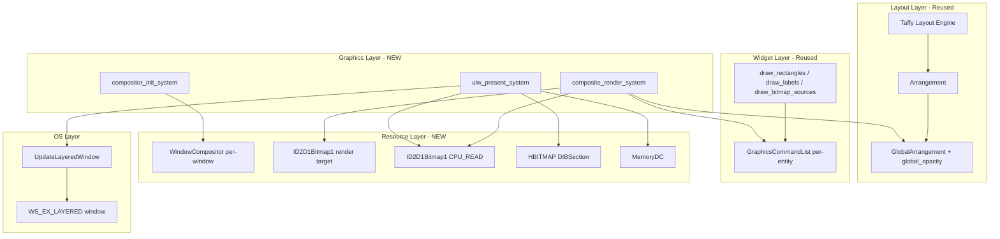
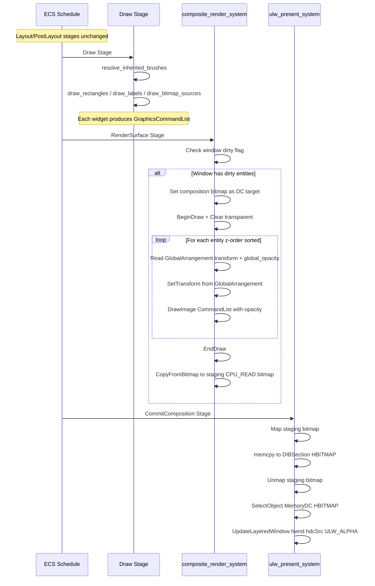
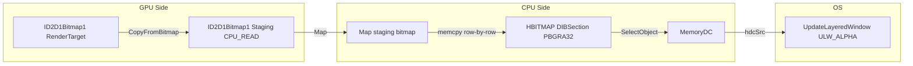
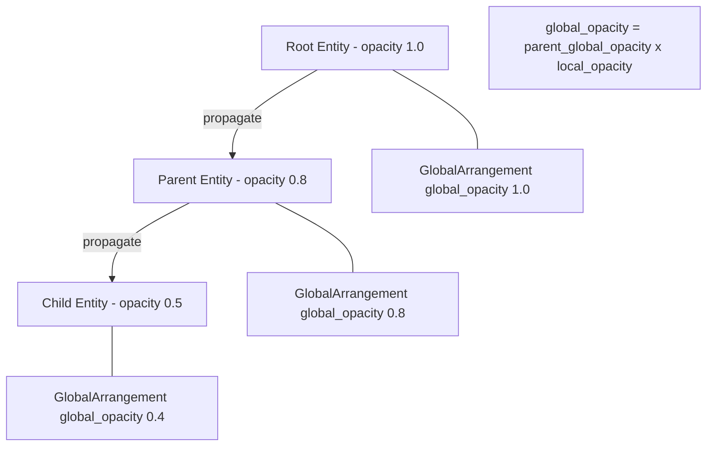
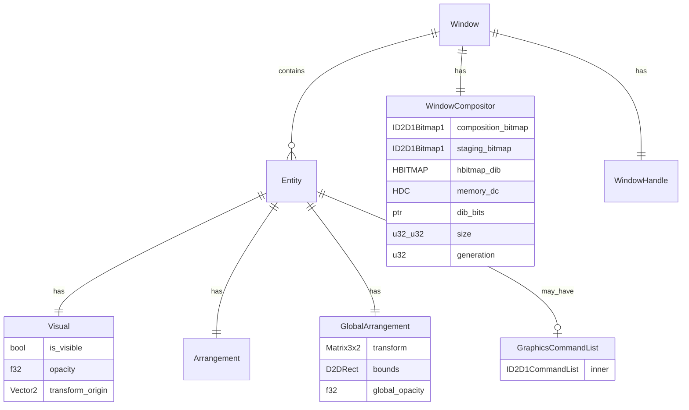
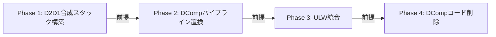

# 設計書: wintf-dcomp-to-layered-migration

## Overview

DirectComposition（DComp）ベースの描画パイプラインを、D2D1合成＋UpdateLayeredWindow（ULW）ベースの描画パイプラインへ全面移行するための**実装指針設計書**である。本仕様は親仕様として4つの段階的子仕様を策定し、各子仕様が参照する技術的指針・コンポーネント設計・システムフロー・移行戦略を包括的に定義する。

現行パイプラインではper-entity DCompリソース（IDCompositionVisual3, IDCompositionSurface）をGPU側で並列合成しているが、DComp描画ではクロスプロセスのクリックスルーが不可能であり、デスクトップマスコットの根幹要件を満たせない。新パイプラインではper-window ID2D1Bitmap1に全ウィジェットのGraphicsCommandListを合成描画し、UpdateLayeredWindow経由でウィンドウに転送することで、alpha=0ピクセルのOS自動クリックスルーを実現する。

### Goals

- DComp依存コード（~15%）を段階的にD2D1合成方式に置換し、既存資産（~70%）を完全再利用する
- per-entity DCompリソースモデルからper-window合成ビットマップモデルへ移行する
- UpdateLayeredWindow + ULW_ALPHAによるalpha=0クリックスルーを実現する
- 4フェーズの段階的移行により各段階で検証可能な構成とする
- Visual/Surface のComposition概念（階層・z-order・parent-child）をD2D1合成描画で論理的に継承する
- 親→子のOpacity階層累積を自前実装する（DComp自動処理の代替）

### Non-Goals

- 本設計書での実装コード生成（子仕様で実施）
- DComp以外のレンダリングバックエンド対応（Vulkan, OpenGL等）
- マルチウィンドウ間の合成最適化（各ウィンドウ独立）
- GPU合成の維持（ULW方式はCPU転送を含む — デスクトップマスコットのウィジェット規模では問題にならない）
- wintf-P0-click-through-rgn仕様の設計変更（競争的並走として独立進行）

---

## Architecture

### Existing Architecture Analysis

現行パイプラインはDCompのVisual Tree構造に全面依存している。

```
GraphicsCore (Resource)
  ├── ID3D11Device → IDXGIDevice4 → ID2D1Device → ID2D1DeviceContext (共有)
  ├── IDCompositionDesktopDevice → IDCompositionDevice3  ← 廃止対象
  └── IDWriteFactory2

Per-Window:
  WindowGraphics { IDCompositionTarget, ID2D1DeviceContext }  ← 廃止対象

Per-Entity:
  VisualGraphics { IDCompositionVisual3 }  ← 廃止対象
  SurfaceGraphics { IDCompositionSurface }  ← 廃止対象
  GraphicsCommandList { ID2D1CommandList }  ← 再利用
```

**主要制約**:
- DComp Visual TreeはGPU側で合成するため、ピクセル単位のalpha判定（クリックスルー）が不可能
- per-entityのIDCompositionSurface → BeginDraw/EndDraw → 個別描画 → DComp Commit という4段階フロー
- `visual_hierarchy_sync_system` がECS階層をDComp Visual Treeに同期する橋渡しとして機能
- `visual_property_sync_system` がVisualコンポーネントのopacity/offsetをDComp Visual PropertyにPushする

**維持すべきパターン**:
- bevy_ecs 0.18.0のSchedule/Stageベースの描画パイプライン構成
- GraphicsCommandList（ID2D1CommandList）によるウィジェット描画の抽象化
- GlobalArrangementによる親→子の座標変換累積（Layout層、DComp非依存）
- コンポーネント命名規則（GPUリソース: `XxxGraphics` サフィックス）

### Architecture Pattern & Boundary Map



**Architecture Integration**:
- **選択パターン**: ハイブリッド段階アプローチ（research.md Option C）。子仕様1-2で新モジュール並行追加、子仕様3でULW統合、子仕様4で旧コード削除
- **ドメイン境界**: Layout層（GREEN, 変更なし）→ Widget層（GREEN, 変更なし）→ Graphics層（RED→NEW, 全面置換）→ OS層（NEW, ULW統合）
- **維持パターン**: Schedule/Stageベースの描画パイプライン、GraphicsCommandListによる描画抽象化、GlobalArrangement座標累積
- **新コンポーネント根拠**: WindowCompositor（per-window合成リソースの統合管理）、GlobalArrangement拡張（Opacity累積の自然な配置場所）
- **steering準拠**: bevy_ecs 0.18.0 API、windows 0.62.2 COM安全パターン、tracing計装

### Technology Stack

| Layer | Choice / Version | Role in Feature | Notes |
|-------|------------------|-----------------|-------|
| ECS Runtime | bevy_ecs 0.18.0 | Schedule/System/Component基盤 | 変更なし |
| Graphics Device | ID3D11Device + ID2D1Device (windows 0.62.2) | GPU描画リソース作成 | DComp初期化を除去 |
| Rendering | ID2D1DeviceContext + ID2D1CommandList | ウィジェット描画 + 合成描画 | CommandList生成は既存、合成描画は新規 |
| Composition | ID2D1Bitmap1 (render target + staging) | per-window合成ビットマップ | DComp Visual Treeの代替 |
| Transfer | CreateDIBSection + MemoryDC | D2D→HBITMAP→HDC変換 | 新規COM ユーティリティ |
| Presentation | UpdateLayeredWindow (Win32 API) | ULW_ALPHA モードでウィンドウ更新 | 新規。windows crateに API バインディング存在 |
| Window Style | WS_EX_LAYERED (Win32) | alpha=0 自動クリックスルー | WS_EX_NOREDIRECTIONBITMAP から切替 |
| Layout | taffy 0.9.2 | フレックスボックスレイアウト | 変更なし |

---

## System Flows

### 合成描画パイプライン（新フロー）



### D2D → HBITMAP 転送パス（設計決定: Option B — GPU Render + CPU Map）



**設計決定: Option B（GPU Render + CPU Map）を採用**

research.mdの3方式（A: WIC経由, B: CPU Map, C: WICBitmapRenderTarget）から Option B を選択した理由:
- 既存のD2D1DeviceContext（ハードウェアアクセラレーション）をそのまま合成描画に使用できる
- WICBitmapRenderTarget（Option C）はソフトウェアレンダリングとなりD2D機能サポートが限定される
- WIC経由（Option A）は中間IWICBitmapオブジェクトが追加で必要となり複雑度が増す
- CPU Map方式はD2D APIのみで完結し、追加ライブラリ依存が発生しない
- デスクトップマスコット規模（~500x500px, 数十ウィジェット）ではGPU→CPUコピーのオーバーヘッドは無視できる

### Opacity階層累積フロー（設計決定: GlobalArrangement拡張）



**設計決定: GlobalArrangement拡張方式を採用**

要件3.6で指定されたOpacity階層累積について、`GlobalArrangement` に `global_opacity: f32` フィールドを追加し、既存の `propagate_global_arrangements` で伝播する方式を選択した理由:
- 既存のtransform累積と同一のPropagateメカニズムを利用でき、実装の一貫性が保たれる
- 合成描画ループでは `GlobalArrangement.global_opacity` を読み取るだけで済み、ツリー走査が不要
- 各エンティティのローカルopacityは既存の `Visual.opacity` フィールドに維持される
- `propagate_parent_transforms` ジェネリクスの `PropagateTransform` トレイト実装で累積計算を追加する

---

## Requirements Traceability

| Requirement | Summary | Components | Interfaces | Flows |
|-------------|---------|------------|------------|-------|
| 1.1 | DComp依存3カテゴリ分類 | research.md参照 | — | — |
| 1.2 | 廃止対象ファイル識別 | research.md §1-3 | — | — |
| 1.3 | 再利用可能資産保証 | GraphicsCommandList, Layout全体, Widget全体 | — | — |
| 2.1 | 4フェーズ移行戦略 | Migration Strategy節 | — | — |
| 2.2 | フェーズ1: DComp同等描画 | WindowCompositor, composite_render_system | CompositorService | 合成描画パイプライン |
| 2.3 | フェーズ2: DComp無効化 | world.rs Schedule更新 | — | — |
| 2.4 | フェーズ3: ULW統合 | UlwTransfer, ulw_present_system | UlwService | D2D→HBITMAP転送 |
| 2.5 | フェーズ4: DComp削除 | com/dcomp.rs削除, DCompコンポーネント削除 | — | — |
| 3.1 | per-window合成ビットマップ | WindowCompositor | CompositorService | 合成描画パイプライン |
| 3.2 | Composition概念継承 | composite_render_system, GlobalArrangement | — | z-orderソート走査 |
| 3.3 | DCompステージ置換 | Schedule再構成（後述） | — | — |
| 3.4 | GraphicsCommandList再利用 | 変更なし | — | — |
| 3.5 | リサイズ対応 | WindowCompositor.resize() | CompositorService | WM_SIZE→リサイズ |
| 3.6 | Opacity階層累積 | GlobalArrangement.global_opacity | PropagateTransform | Opacity累積フロー |
| 4.1 | ULW呼出 | UlwTransfer | UlwService | D2D→HBITMAP転送 |
| 4.2 | WS_EX_LAYERED切替 | WindowStyle, main.rs | — | — |
| 4.3 | alpha=0クリックスルー | OS標準動作 | — | — |
| 4.4 | commit→ULW置換 | ulw_present_system | — | — |
| 4.5 | ULWエラーリカバリ | ulw_present_system内retry | — | — |
| 5.1 | DComp初期化除去 | GraphicsCore | — | — |
| 5.2 | デバイスチェーン維持 | GraphicsCore | — | — |
| 5.3 | DCompフィールド除去 | GraphicsCoreInner | — | — |
| 5.4 | デバイスロスト対応 | invalidate()フロー維持 | — | — |
| 6.1 | WindowGraphics置換 | WindowCompositor | CompositorService | — |
| 6.2 | Visual概念継承 | Visual（変更なし） | — | — |
| 6.3 | VisualGraphics/SurfaceGraphics一新 | 削除（per-entityリソース不要） | — | — |
| 6.4 | visual_manager置換 | 廃止（合成描画で代替） | — | — |
| 6.5 | 命名規則維持 | WindowCompositor (XxxGraphicsではなくCompositor) | — | — |
| 7.1 | WM_PAINT更新 | handlers.rs | — | — |
| 7.2 | WM_SIZE→合成リサイズ | handlers.rs + WindowCompositor | — | — |
| 7.3 | BeginPaint/EndPaint最小化 | handlers.rs | — | — |
| 8.1 | click-through-rgn競争的並走 | 実装指針（Migration Strategy節） | — | — |
| 8.2 | animation-system影響評価 | 実装指針（影響なし） | — | — |
| 8.3 | balloon-system影響評価 | 実装指針（ULW移行後に再評価） | — | — |
| 8.4 | dcomp_demo.rsフェーズ4削除 | Migration Strategy §Phase 4 | — | — |
| 9.1 | 4子仕様構成 | Migration Strategy節 | — | — |
| 9.2 | 子仕様間依存関係 | Migration Strategy §依存関係 | — | — |
| 9.3 | 段階的検証可能性 | Testing Strategy節 | — | — |
| 9.4 | DComp並行稼働期間 | Migration Strategy §Phase 1-2 | — | — |
| 10.1 | フェーズ別検証基準 | Testing Strategy節 | — | — |
| 10.2 | 完了基準（DoD） | Testing Strategy §DoD | — | — |
| 10.3 | 描画品質許容範囲 | Testing Strategy §品質基準 | — | — |

---

## Components and Interfaces

### Summary

| Component | Domain/Layer | Intent | Req Coverage | Key Dependencies | Contracts |
|-----------|--------------|--------|--------------|------------------|-----------|
| GraphicsCore（改修） | Graphics/Resource | GPU初期化・DComp除去 | 5.1-5.4 | ID3D11Device(P0), ID2D1Device(P0) | State |
| WindowCompositor（新規） | Graphics/Resource | per-window合成リソース管理 | 3.1, 3.5, 4.1, 6.1 | GraphicsCore(P0), ID2D1Bitmap1(P0) | Service, State |
| UlwTransfer（新規） | COM/Transfer | D2D→HBITMAP→ULW転送 | 4.1, 4.2, 4.4, 4.5 | WindowCompositor(P0), Win32 API(P0) | Service |
| Visual（維持） | Graphics/Logic | 可視性・透明度・変換原点 | 6.2 | — | State |
| GlobalArrangement（拡張） | Layout/Metrics | 累積座標変換 + Opacity | 3.6 | Arrangement(P0) | State |
| composite_render_system（新規） | Graphics/System | 全CommandList合成描画 | 3.1-3.4 | WindowCompositor(P0), GlobalArrangement(P0) | — |
| ulw_present_system（新規） | Graphics/System | ULW呼出 + エラーリカバリ | 4.1, 4.4, 4.5 | UlwTransfer(P0), WindowCompositor(P0) | — |
| compositor_init_system（新規） | Graphics/System | per-window合成リソース初期化 | 3.1, 6.1 | GraphicsCore(P0) | — |

### Graphics / Resource Layer

#### GraphicsCore（改修）

| Field | Detail |
|-------|--------|
| Intent | D3D11/D2D1デバイスの初期化とライフサイクル管理（DComp除去） |
| Requirements | 5.1, 5.2, 5.3, 5.4 |

**Responsibilities & Constraints**
- DComp初期化ステップ（`dcomp_create_desktop_device`, `desktop.cast::<IDCompositionDevice3>()`）を除去
- `GraphicsCoreInner` から `desktop: IDCompositionDesktopDevice`, `dcomp: IDCompositionDevice3` フィールドを削除
- `dcomp()`, `desktop()` アクセサメソッドを削除
- `invalidate()` → 再初期化フローは維持（DComp再初期化ステップのみ省略）
- `com/dcomp.rs` への `use` 依存を除去

**Dependencies**
- External: ID3D11Device, IDXGIDevice4, ID2D1Factory, ID2D1Device, IDWriteFactory2 — GPU初期化 (P0)

##### State Management
- 現行の `Option<GraphicsCoreInner>` パターンを維持
- `is_valid()` / `invalidate()` のセマンティクスに変更なし
- デバイスロスト時は `invalidate()` 後に `GraphicsCore::new()` で再構築（DCompステップが無い分簡素化）

---

#### WindowCompositor（新規）

| Field | Detail |
|-------|--------|
| Intent | ウィンドウごとの合成描画リソース（合成ビットマップ + CPU転送用ステージング + HBITMAP）を統合管理 |
| Requirements | 3.1, 3.5, 4.1, 6.1 |

**Responsibilities & Constraints**
- per-windowコンポーネント（SparseSet戦略 — ウィンドウ数は少ない）
- 合成描画先ビットマップ（ID2D1Bitmap1, RENDER_TARGET | TARGET options）を保持
- CPU読み取り用ステージングビットマップ（ID2D1Bitmap1, CPU_READ | CANNOT_DRAW options）を保持
- HBITMAP（CreateDIBSection, PBGRA32形式）とMemoryDCを保持
- ウィンドウリサイズ時にビットマップ群を再作成
- `generation: u32` でリソース世代管理（既存パターン踏襲）

**Dependencies**
- Inbound: compositor_init_system — リソース作成 (P0)
- Inbound: composite_render_system — 合成描画先として使用 (P0)
- Inbound: ulw_present_system — CPU転送元として使用 (P0)
- External: ID2D1DeviceContext, Win32 GDI (CreateDIBSection, CreateCompatibleDC) — リソース作成 (P0)

**Contracts**: State [x]

##### Service Interface

```
WindowCompositor:
  new(d2d_dc: &ID2D1DeviceContext, width: u32, height: u32) -> Result<Self>
  resize(d2d_dc: &ID2D1DeviceContext, width: u32, height: u32) -> Result<()>
  invalidate() -> ()
  is_valid() -> bool
  composition_bitmap() -> Option<&ID2D1Bitmap1>    // 合成描画先
  staging_bitmap() -> Option<&ID2D1Bitmap1>         // CPUステージング
  hbitmap() -> Option<HBITMAP>                       // DIBSection
  memory_dc() -> Option<HDC>                         // MemoryDC
  dib_bits() -> Option<*mut u8>                      // DIBSection pixel pointer
  generation() -> u32
```

Preconditions:
- `new()`: `width > 0 && height > 0`、D2D DeviceContextが有効
- `resize()`: `is_valid() == true`

Postconditions:
- `new()` 成功後: `is_valid() == true`、全4リソース（composition_bitmap, staging_bitmap, hbitmap, memory_dc）が有効
- `resize()` 成功後: 全リソースが新サイズで再作成済み

Invariants:
- composition_bitmap, staging_bitmap, HBITMAP のピクセルフォーマットは全て PBGRA32
- composition_bitmap と staging_bitmap は同一サイズ
- HBITMAP（DIBSection）のサイズは composition_bitmap と一致

##### State Management
- `Option<WindowCompositorInner>` パターン（WindowGraphicsと同一パターン）
- `WindowCompositorInner` にID2D1Bitmap1 x2, HBITMAP, HDC, `*mut u8`（DIBSection bits pointer）, `(u32, u32)` size
- `invalidate()` で `inner = None`（リソース解放はDrop）

**Implementation Notes**
- ID2D1Bitmap1 作成には `ID2D1DeviceContext::CreateBitmap()` を使用。RENDER_TARGET用は `D2D1_BITMAP_OPTIONS_TARGET`、ステージング用は `D2D1_BITMAP_OPTIONS_CPU_READ | D2D1_BITMAP_OPTIONS_CANNOT_DRAW`
- CreateDIBSection で BITMAPINFOHEADER (biCompression=BI_RGB, biBitCount=32) を指定し、DIBセクションのポインタを取得
- ピクセルフォーマット: D2D1 PBGRA32 と GDI PBGRA32 は同一メモリレイアウト（memcpy互換）
- stride alignment注意: D2D1 Map() の pitch と DIBSection の stride が異なる場合は行単位コピーが必要

---

#### UlwTransfer（新規モジュール: `com/ulw.rs`）

| Field | Detail |
|-------|--------|
| Intent | D2D合成ビットマップからHBITMAPへの転送およびUpdateLayeredWindow呼び出しを提供 |
| Requirements | 4.1, 4.2, 4.4, 4.5 |

**Responsibilities & Constraints**
- `com/` 層のユーティリティモジュール（ECS非依存、純粋Win32 API呼び出し）
- 入力: WindowCompositorのステージングビットマップ（CPU_READ）+ DIBSection HBITMAP + MemoryDC
- 出力: UpdateLayeredWindow呼び出し
- BLENDFUNCTION設定: `BlendOp = AC_SRC_OVER, SourceConstantAlpha = 255, AlphaFormat = AC_SRC_ALPHA`

**Dependencies**
- External: windows crate Win32 API — UpdateLayeredWindow, BLENDFUNCTION, ULW_ALPHA (P0)
- External: windows crate GDI — SelectObject, CreateCompatibleDC, CreateDIBSection (P0)

**Contracts**: Service [x]

##### Service Interface

```
// com/ulw.rs — ECS非依存のユーティリティ関数群

transfer_to_hbitmap(
    staging: &ID2D1Bitmap1,
    dib_bits: *mut u8,
    width: u32,
    height: u32,
) -> Result<()>
// Precondition: staging は CPU_READ 可能、dib_bits は width*height*4 bytes 確保済み
// Postcondition: dib_bits にステージングビットマップのピクセルデータがコピーされる

present_layered_window(
    hwnd: HWND,
    memory_dc: HDC,
    width: u32,
    height: u32,
    window_pos: Option<(i32, i32)>,
) -> Result<()>
// Precondition: memory_dc に HBITMAP が SelectObject 済み、WS_EX_LAYERED 設定済み
// Postcondition: UpdateLayeredWindow が成功、ウィンドウが更新される
// Error: 失敗時は windows::core::Error を返す（呼び出し元でリトライ判断）
```

**Implementation Notes**
- `transfer_to_hbitmap`: staging bitmap を `Map()` → stride/pitch を考慮してDIBSection メモリへ行単位コピー → `Unmap()`
- `present_layered_window`: `BLENDFUNCTION` 構造体を構築し `UpdateLayeredWindow(hwnd, None, ptDst, size, hdcSrc, ptSrc, 0, &blend, ULW_ALPHA)` 呼び出し
- `window_pos: Option<(i32, i32)>` は `pptDst` パラメータに対応。`None` の場合は位置変更しない（サイズ変更のみ）
- WS_EX_LAYERED ウィンドウは WM_PAINT を受信しないため、描画は完全に ULW 駆動となる

---

### Graphics / Logic Layer

#### Visual（維持 — 変更なし）

| Field | Detail |
|-------|--------|
| Intent | 可視性・ローカル透明度・変換原点の論理コンポーネント |
| Requirements | 6.2 |

**Responsibilities & Constraints**
- フィールド: `is_visible: bool`, `opacity: f32`, `transform_origin: Vector2`
- DComp依存なし（Discovery確認済み）VisualGraphics/SurfaceGraphicsを除去しても影響なし
- `opacity` フィールドはローカル値（累積値は `GlobalArrangement.global_opacity` に伝播）

**変更点: `on_visual_add` フック**
- 現行: `VisualGraphics::default()`, `SurfaceGraphics::default()`, `SurfaceGraphicsDirty::default()` を自動挿入
- 新規: VisualGraphics/SurfaceGraphics/SurfaceGraphicsDirtyの挿入を**削除**
- 維持: `Arrangement::default()` と `BrushInherit` マーカーの挿入は維持

**Implementation Notes**
- フェーズ1では `on_visual_add` フックは変更せず（DComp並行稼働のため旧コンポーネントも挿入）
- フェーズ2以降で `on_visual_add` フックからDCompコンポーネント挿入を除去

---

### Layout / Metrics Layer

#### GlobalArrangement（拡張）

| Field | Detail |
|-------|--------|
| Intent | 累積座標変換に加え、累積Opacityを保持 |
| Requirements | 3.6 |

**変更点**:
- 新規フィールド: `global_opacity: f32`（初期値 `1.0`）
- `propagate_global_arrangements` 経由で `parent_global_opacity * child_local_opacity` を累積
- `Default::default()` で `global_opacity: 1.0` を設定

**PropagateTransform 実装の拡張**:
- 既存の `PropagateTransform` トレイト（`Arrangement` → `GlobalArrangement` 変換）にOpacity累積ロジックを追加
- ローカル `Visual.opacity` を参照するため、伝播クエリに `&Visual` を追加する必要がある
- 代替案: `Opacity(f32)` コンポーネントが別に存在するが、`Visual.opacity` フィールドと統合されているため、`Visual` から直接取得が自然

**Constraints**:
- `global_opacity` は `0.0..=1.0` の範囲（アンダーフロー/オーバーフローは clamp）
- `is_visible == false` の場合、`global_opacity` は `0.0` に設定（描画スキップ最適化用）

---

### Graphics / System Layer

#### compositor_init_system（新規）

| Field | Detail |
|-------|--------|
| Intent | HWND付きウィンドウエンティティに WindowCompositor を作成・アタッチ |
| Requirements | 3.1, 6.1 |

**動作**:
- Stage: GraphicsSetup
- Query: `Added<WindowHandle>` かつ `Without<WindowCompositor>` のエンティティ
- GraphicsCoreからID2D1DeviceContextを取得
- WindowCompositorを作成し、エンティティに挿入
- 既存の `init_window_graphics` を**置換**

**Dependencies**:
- Inbound: GraphicsCore — D2D DeviceContext (P0)
- Outbound: WindowCompositor — 作成 (P0)

---

#### composite_render_system（新規）

| Field | Detail |
|-------|--------|
| Intent | 全エンティティのGraphicsCommandListをz-orderソートでper-window合成ビットマップに描画 |
| Requirements | 3.1, 3.2, 3.3, 3.4 |

**動作**:
- Stage: RenderSurface（既存ステージ再利用）
- 既存の `render_surface`（per-entity DComp Surface描画）を**置換**

**合成描画ループ**:
1. per-windowの `WindowCompositor` をイテレート
2. ウィンドウに属するエンティティをz-order順（Children関係のbreadth-first）でソート
3. WindowCompositorの composition_bitmap を D2D DeviceContextにSetTarget
4. BeginDraw → Clear(transparent)
5. 各エンティティについて:
   - `GlobalArrangement.transform` で SetTransform
   - `GlobalArrangement.global_opacity` が 0.0 ならスキップ（`Visual.is_visible == false` の場合を含む）
   - `global_opacity < 1.0` の場合、PushLayer で opacity を適用（または DrawImage の composite mode で適用）
   - `GraphicsCommandList` が存在する場合、`DrawImage(command_list)` で描画
6. EndDraw
7. CopyFromBitmap(composition_bitmap → staging_bitmap)

**Dependencies**:
- Inbound: WindowCompositor — 合成描画先 (P0)
- Inbound: GlobalArrangement — 座標変換 + Opacity (P0)
- Inbound: GraphicsCommandList — ウィジェット描画データ (P0)
- Inbound: Visual — is_visible判定 (P1)
- External: ID2D1DeviceContext — DrawImage, SetTransform, PushLayer (P0)

**Implementation Notes**
- z-orderソート: bevy_ecsの `Children` コンポーネントから再帰的にBFS走査して描画順序を決定。parent先 → children後
- Opacity適用方法: `ID2D1DeviceContext::PushLayer()` で `D2D1_LAYER_PARAMETERS` の `opacity` フィールドを使用するか、`DrawImage` 前後でグローバルPrimitiveBlendを操作する。子仕様1設計フェーズで最適方式を確定
- ダーティ判定: ウィンドウ内のいずれかのエンティティで `Changed<GraphicsCommandList>` || `Changed<GlobalArrangement>` || `Changed<Visual>` であればウィンドウ全体を再合成

---

#### ulw_present_system（新規）

| Field | Detail |
|-------|--------|
| Intent | WindowCompositorのステージングビットマップをHBITMAPに転送し、UpdateLayeredWindowで表示 |
| Requirements | 4.1, 4.4, 4.5 |

**動作**:
- Stage: CommitComposition（既存ステージ再利用）
- 既存の `commit_composition`（DComp Commit）を**置換**

**フロー**:
1. 各 `WindowCompositor` の staging bitmap を Map()
2. `UlwTransfer::transfer_to_hbitmap()` でDIBSectionにコピー
3. `UlwTransfer::present_layered_window()` でULW呼び出し
4. エラー発生時: tracing::warnでログ記録、次フレームで再試行（明示的なリトライカウンタなし）

**Dependencies**:
- Inbound: WindowCompositor — ステージングビットマップ + HBITMAP + MemoryDC (P0)
- External: UlwTransfer (com/ulw.rs) — Win32 API呼び出し (P0)

---

### Schedule Stage 再構成

| Stage | 現行システム | 新パイプラインシステム | 変更 |
|-------|-------------|----------------------|------|
| Input | 変更なし | 変更なし | — |
| Update | invalidate_dependent_components (YELLOW) | コンポーネント型変更に追従 | 軽微改修 |
| **PreLayout** | visual_resource_management (RED), visual_hierarchy_sync (RED), init_graphics_core (YELLOW) | init_graphics_core（DComp除去版）のみ | RED 2システム削除 |
| Layout | 変更なし（taffy系4システム） | 変更なし | — |
| PostLayout | 変更なし（arrangement伝播系5システム） | propagate_global_arrangementsにOpacity累積追加 | 軽微拡張 |
| UISetup | 変更なし（create_windows, apply_window_pos_changes） | 変更なし | — |
| **GraphicsSetup** | init_window_graphics (RED), window_visual_integration (RED) | **compositor_init_system** | 全面置換 |
| **Draw** | deferred_surface_creation (RED), cleanup_surface (RED), ウィジェット描画系 (GREEN) | ウィジェット描画系のみ（RED 2システム削除） | RED削除 |
| PreRenderSurface | mark_dirty_surfaces (YELLOW) | ウィンドウ単位ダーティ検出に改修 | 改修 |
| **RenderSurface** | render_surface (RED) | **composite_render_system** | 全面置換 |
| **Composition** | visual_property_sync (RED) | **削除**（合成描画でtransform/opacity適用済み） | ステージ空化 |
| **CommitComposition** | commit_composition (RED) | **ulw_present_system** | 全面置換 |
| FrameFinalize | 変更なし | 変更なし | — |

---

## Data Models

### Domain Model



**Aggregates and Boundaries**:
- **Window Aggregate**: Window + WindowCompositor + WindowHandle。ウィンドウリソースのライフサイクルはWindowエンティティに紐づく
- **Visual Entity Aggregate**: Visual + Arrangement + GlobalArrangement + GraphicsCommandList。各エンティティの論理状態と描画データ
- **分離ポイント**: WindowCompositor（per-window）が複数の Visual Entity（per-entity）の GraphicsCommandList を合成する1:N関係

**Business Rules & Invariants**:
- `global_opacity = parent.global_opacity * local.opacity`（`is_visible == false` の場合は `0.0`）
- `global_opacity ∈ [0.0, 1.0]`
- WindowCompositor の全ビットマップリソースは同一サイズ
- 合成描画の z-order は Children 関係の depth-first pre-order に従う

### GlobalArrangement 拡張（Logical Data Model）

**変更前**:
```
GlobalArrangement {
    transform: Matrix3x2,    // 累積座標変換
    bounds: D2DRect,          // 累積バウンディングボックス
}
```

**変更後**:
```
GlobalArrangement {
    transform: Matrix3x2,    // 累積座標変換（変更なし）
    bounds: D2DRect,          // 累積バウンディングボックス（変更なし）
    global_opacity: f32,      // 累積不透明度（NEW）
}
```

**Consistency**:
- `global_opacity` は `propagate_global_arrangements` で毎フレーム再計算（layoutツリー変更時のみ）
- `ArrangementTreeChanged` マーカーコンポーネントが既存のdirty伝播メカニズムとして機能

---

## Error Handling

### Error Strategy

| Error Category | Source | Response | Recovery |
|----------------|--------|----------|----------|
| D2D Bitmap作成失敗 | compositor_init_system | tracing::error + WindowCompositor::invalidate() | 次フレームで再作成試行 |
| BeginDraw/EndDraw失敗 | composite_render_system | tracing::error + フレームスキップ | 次フレームで再描画 |
| CopyFromBitmap失敗 | composite_render_system | tracing::error + フレームスキップ | 次フレームで再試行 |
| Map失敗 | ulw_present_system (via UlwTransfer) | tracing::error + フレームスキップ | 次フレームで再試行 |
| UpdateLayeredWindow失敗 | ulw_present_system (via UlwTransfer) | tracing::warn + 次フレーム再試行 | 4.5: 自動リトライ |
| デバイスロスト (DXGI_ERROR_DEVICE_REMOVED) | 任意のD2D操作 | GraphicsCore::invalidate() → 全WindowCompositor::invalidate() | 既存有効化フロー維持 |
| リサイズ時ビットマップ作成失敗 | WindowCompositor::resize() | tracing::error + 旧サイズ維持 | 次回リサイズで再試行 |

**デバイスロスト対応**:
- 既存の `init_graphics_core` システムが `GraphicsCore.is_valid()` を監視して再初期化
- `HasGraphicsResources.set_changed()` で全GPUリソースコンポーネントの再初期化をトリガー（既存パターン維持）
- WindowCompositor は `generation` カウンタでリソース世代を追跡。`compositor_init_system` で世代不一致を検出して再作成

---

## Testing Strategy

### Unit Tests
- `GlobalArrangement::global_opacity` の累積計算テスト（parent 0.8 × child 0.5 = 0.4）
- `WindowCompositor::new()` / `resize()` / `invalidate()` のライフサイクルテスト
- `UlwTransfer::transfer_to_hbitmap()` のpitch/strideが異なるケースでの正しいコピー検証
- `UlwTransfer::present_layered_window()` のBLENDFUNCTION構成テスト

### Integration Tests
- `composite_render_system`: 複数エンティティのGraphicsCommandListが正しい z-order・transform・opacity で合成されること
- `compositor_init_system` + `composite_render_system` + `ulw_present_system` の完全パイプライン統合テスト
- デバイスロスト後のWindowCompositor自動再初期化テスト
- ウィンドウリサイズ後の合成ビットマップ正常再作成テスト

### E2E Tests (Phase-specific — 子仕様検証基準を兼ねる)
- **Phase 1**: `taffy_flex_demo` 相当の描画が新パイプラインで動作すること
- **Phase 2**: 全既存 example（taffy_flex_demo, typewriter_demo, multi_window_test, split_image）が新パイプラインで動作すること
- **Phase 3**: UpdateLayeredWindow での透過表示＋alpha=0クリックスルーが動作すること
- **Phase 4**: `cargo test` 全テストパス＋`com/dcomp.rs` への参照がECSコードから除去されていること

### 描画品質基準（10.3）
- DComp方式とULW方式で最終的なピクセル出力が同一であることは**保証しない**
- 許容基準: 人間の目視で差異が認識できないレベル（サブピクセルアンチエイリアシングの微差は許容）
- GPU→CPU転送時のフォーマットはPBGRA32で同一のため、理論上の品質劣化はない
- D2D DeviceContext（ハードウェアアクセラレーション）を合成描画に使用するため、描画品質はDComp方式と同等

---

## Migration Strategy

### Phase Overview



### 子仕様1: D2D1合成スタック構築（Phase 1）

**担当範囲**:
- `com/ulw.rs` 新規作成: ULW ユーティリティ関数（ただしULW呼び出しはPhase 3）
- `ecs/graphics/compositor.rs` 新規作成: WindowCompositor コンポーネント定義
- `ecs/graphics/compositor_systems.rs` 新規作成: compositor_init_system, composite_render_system
- `ecs/layout/arrangement.rs` 拡張: GlobalArrangement に global_opacity フィールド追加
- `ecs/layout/systems.rs` 拡張: propagate_global_arrangements に Opacity 累積ロジック追加

**前提条件**: なし（新規モジュールとして並行追加）
**並行稼働**: DComp パイプラインは変更せず稼働継続。新システムは world.rs に**登録しない**（独立テスト）

**完了基準（DoD）**:
- `WindowCompositor::new()` が ID2D1Bitmap1 + HBITMAP リソースを正しく作成
- `composite_render_system` が GraphicsCommandList を z-order + transform + opacity で合成描画
- `global_opacity` 累積が unit test でパス
- 新パイプライン単体での描画結果が taffy_flex_demo 相当と視覚的に一致

### 子仕様2: DCompパイプライン置換（Phase 2）

**担当範囲**:
- `ecs/world.rs`: DComp システム（12個 RED）の登録を新システムに切り替え
- `ecs/graphics/components.rs`: `on_visual_add` フックから VisualGraphics/SurfaceGraphics 挿入を除去
- `ecs/graphics/systems.rs`: DComp システムの登録解除（コード自体は残存 — Phase 4 で削除）
- `ecs/graphics/core.rs`: GraphicsCore から DComp 初期化を除去

**前提条件**: 子仕様1完了
**並行稼働**: DComp コードは残存するが、ECS Schedule からは除去済み。旧コード参照可能

**完了基準（DoD）**:
- 全既存 example がD2D1合成パイプラインで動作
- DComp API 呼び出しがゼロであること（grep 検証）
- `cargo test` 全テストパス

### 子仕様3: UpdateLayeredWindow統合（Phase 3）

**担当範囲**:
- `com/ulw.rs`: `present_layered_window()` 実装完了
- `ecs/graphics/compositor_systems.rs`: `ulw_present_system` を world.rs の CommitComposition ステージに登録
- `ecs/window.rs`: `WindowStyle::default()` の `ex_style` を `WS_EX_LAYERED` に変更
- `areka/src/main.rs`: Shell/Balloon の `WS_EX_NOREDIRECTIONBITMAP` → `WS_EX_LAYERED`
- `ecs/window_proc/handlers.rs`: WM_PAINT / WM_ERASEBKGND / WM_SIZE ハンドラを ULW 方式に更新

**前提条件**: 子仕様2完了
**WS_EX_LAYERED 注意点**: WS_EX_LAYERED ウィンドウは WM_PAINT を受信しない。描画は完全に ulw_present_system から駆動される

**完了基準（DoD）**:
- UpdateLayeredWindow での透過ウィンドウ表示が動作
- alpha=0 ピクセル領域のクリックスルーが動作
- WM_SIZE 時のリサイズが正常動作
- ULW 失敗時のログ出力 + 次フレーム再試行が動作

### 子仕様4: DCompコード削除・クリーンアップ（Phase 4）

**担当範囲**:
- `com/dcomp.rs`: ファイル全体削除（315行）
- `ecs/graphics/components.rs`: VisualGraphics, SurfaceGraphics, SurfaceGraphicsDirty, SurfaceCreationStats のstruct削除
- `ecs/graphics/systems.rs`: RED分類の12システム関数のコード削除
- `ecs/graphics/visual_manager.rs`: ファイル全体削除（170行）
- `examples/dcomp_demo.rs`: ファイル削除（8.4）
- `ecs/graphics/core.rs`: DComp関連 `use` 文の最終クリーンアップ
- テストファイル: DComp 参照を含むテストの修正 or 削除

**前提条件**: 子仕様3完了

**完了基準（DoD）**:
- `com/dcomp.rs` が削除されている
- ECS コード内の `IDComposition*` 型参照がゼロ
- `cargo test` 全テストパス
- `cargo build --examples` 全ビルドパス（dcomp_demo.rs 削除済み）

### 既存仕様への影響（8.1-8.3）

| 仕様 | 影響度 | 対応方針 |
|------|--------|---------|
| wintf-P0-click-through-rgn | 高 | **競争的並走**: 両仕様は独立進行。CTRが十分な性能を示す場合は本仕様凍結の可能性あり。逆に本仕様完了時はCTRの大部分が不要化 |
| wintf-P0-animation-system | 低 | dola駆動アニメーションはDComp非依存。出力先がDComp Visual PropertiesからD2D合成パラメータに変わるのみ |
| wintf-P0-balloon-system | 中 | バルーンウィンドウもULW方式に移行。ウィジェット描画（GREEN）はそのまま動作。ULW移行（本仕様）を先に完了推奨 |

### 実装アプローチ: ハイブリッド段階（research.md Option C）

- **Phase 1-2**: 新モジュールを `ecs/graphics/` 内に並行追加。DCompモジュールと共存
  - 新ファイル: `compositor.rs`, `compositor_systems.rs`
  - 既存ファイル: DCompコードに触れない
- **Phase 3**: ULW統合をインプレースで実装（WindowStyle変更等）
- **Phase 4**: 旧モジュール削除

利点: 旧実装を参照しながら新実装を検討でき、各段階でロールバック可能

---

## Supporting References

### D2D1 Bitmap Options 設定

合成描画先ビットマップ（composition_bitmap）:
```
D2D1_BITMAP_PROPERTIES1:
  pixelFormat: { format: DXGI_FORMAT_B8G8R8A8_UNORM, alphaMode: D2D1_ALPHA_MODE_PREMULTIPLIED }
  bitmapOptions: D2D1_BITMAP_OPTIONS_TARGET
```

CPUステージングビットマップ（staging_bitmap）:
```
D2D1_BITMAP_PROPERTIES1:
  pixelFormat: { format: DXGI_FORMAT_B8G8R8A8_UNORM, alphaMode: D2D1_ALPHA_MODE_PREMULTIPLIED }
  bitmapOptions: D2D1_BITMAP_OPTIONS_CPU_READ | D2D1_BITMAP_OPTIONS_CANNOT_DRAW
```

### BLENDFUNCTION for UpdateLayeredWindow

```
BLENDFUNCTION:
  BlendOp: AC_SRC_OVER
  BlendFlags: 0
  SourceConstantAlpha: 255
  AlphaFormat: AC_SRC_ALPHA
```

### DIBSection 作成パラメータ

```
BITMAPINFOHEADER:
  biSize: sizeof(BITMAPINFOHEADER)
  biWidth: window_width
  biHeight: -(window_height as i32)   // top-down DIB (negative height)
  biPlanes: 1
  biBitCount: 32
  biCompression: BI_RGB
```

注意: `biHeight` を負にすることでtop-down DIBになり、D2D1のピクセルレイアウト（top-down）とメモリレイアウトが一致する。これにより行の反転コピーが不要になる。
