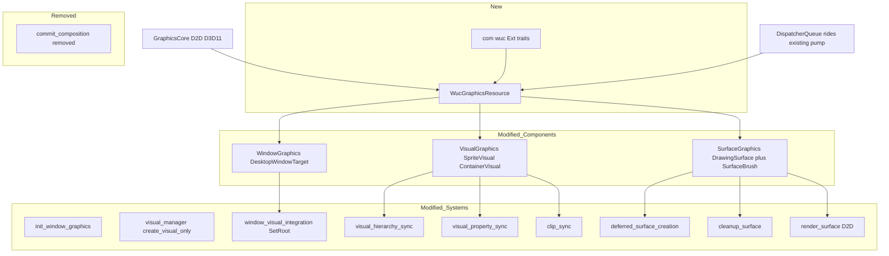
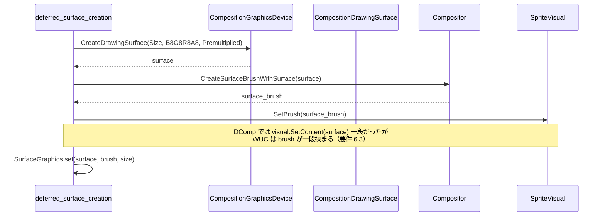
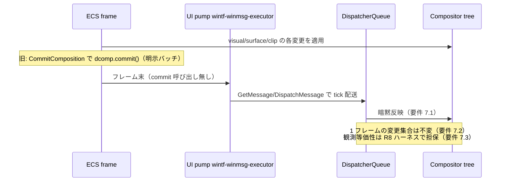
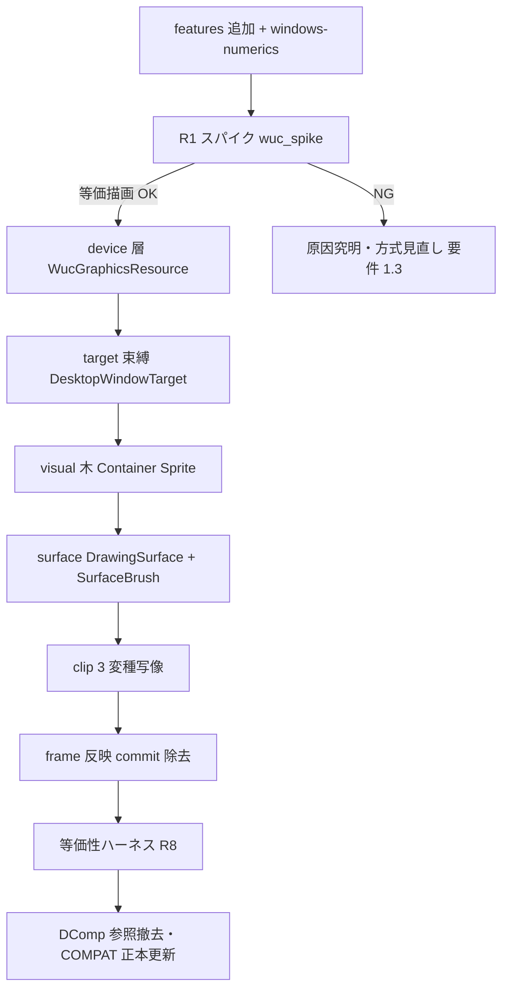

# 技術設計書: wintf-dcomp-to-wuc-migration

## Overview

**Purpose**: 本移行は wintf の表示合成バックエンドを **DirectComposition（DComp）** から WinRT の **Windows.UI.Composition（WUC）** へ**純粋等価**に差し替え、DComp 依存を廃する。価値の受け手は wintf/areka 保守者であり、その対価として利用者から見た**描画結果・再描画挙動・入力挙動が一切変化しない**ことを受け入れ前提とする。

**Users**: wintf/areka 保守者が、合成基盤の起点（device / target / visual-tree / surface / frame-apply）を WUC 系へ寄せた状態で以後の保守を行う。利用者（エンドユーザー）の体験は不変。

**Impact**: device 層（`Compositor`＋`CompositionGraphicsDevice`）・target 束縛（`DesktopWindowTarget`）・visual 木（`ContainerVisual`/`SpriteVisual`）・surface（`CompositionDrawingSurface`＋`CompositionSurfaceBrush`）・frame-apply（`Commit()` 廃止→暗黙反映）を DComp 相当から WUC 相当へ写像する。唯一の新規初期化は DispatcherQueue コントローラで、既存 UI スレッド message pump に相乗りする（pump 非差し替え）。

### Goals
- DComp COM 型（`IDCompositionDevice3`/`IDCompositionTarget`/`IDCompositionVisual3`/`IDCompositionSurface`/`IDCompositionRectangleClip`）への依存を、隔離層内で WUC 型へ全置換する。
- 移行の正当性を R1 スパイク（DispatcherQueue＋`DesktopWindowTarget`＋D2D `BeginDraw` の 1 サーフェス最小往復）で先行検証してから全面移行する。
- 描画等価性を自動ピクセル差分ハーネス（主受け入れ手段）で担保する。
- スレッド構成・当たり判定・ウィンドウ管理・ULW アームを不変に保つ。

### Non-Goals
- ULW 一式の除去・`CompositionMode` enum の collapse（別 spec `wintf-ulw-removal`）。
- 当たり判定（ヒットテスト・`WS_EX_TRANSPARENT` クリックスルー）の変更。
- WUC 新能力（合成アニメーション・エフェクトグラフ）の活用、将来拡張のための投機的抽象。
- swapchain content 束縛パス（`CreateCompositionSurfaceForSwapChain`）。

## Boundary Commitments

### This Spec Owns
- DComp→WUC の合成バックエンド写像（device / target / visual-tree / surface / frame-apply の各層）。
- 新規モジュール `com/wuc.rs`（WUC interop Ext trait 群）と `WucGraphicsResource`（`Compositor`＋`CompositionGraphicsDevice`＋`DispatcherQueueController` を保持する lazy 単一 Resource）。
- 既存コンポーネント `WindowGraphics`/`VisualGraphics`/`SurfaceGraphics` の**内部保持 COM 型のみ**の WUC 差し替え（コンポーネント名・公開アクセサ形は維持）。
- `commit_composition` システムの除去と `CommitComposition` schedule からの登録解除。
- clip（`ClipShape` の 3 変種）の WUC clip 型への等価写像（DPI スケール込み）。
- ルート `Cargo.toml` への WUC features 追加（最小）と `windows-numerics` 依存追加。
- 描画等価性検証ハーネス（サーフェス層ビット等価＋合成層キャプチャ比較）。

### Out of Boundary
- ULW アーム（`compositor.rs`/`com/ulw.rs`/`compositor_systems/`）・`ulw_present_system`・`CompositionMode` enum の変更/除去。
- `compute_ex_style` の DComp 分岐ロジックの意味論変更（`WS_EX_NOREDIRECTIONBITMAP` は不変流用のみ）。
- クリックスルー機構（`wintf-clickthrough-alpha-toggle` の当たり判定層）。
- UI スレッド message pump（`wintf-winmsg-executor`）の実装差し替え。
- `com/dcomp.rs` の物理削除（DComp 型消費が全て WUC へ移った後の dead-code 掃除は移行完了内で行うが、ULW/`CompositionMode` の DComp 参照が残る限り enum 自体は残置）。

### Allowed Dependencies
- 既存 `GraphicsCore`（D2D/D3D11 デバイススタック・`d2d_device()`/`device_context()` アクセサ）。WUC の `CreateGraphicsDevice` は既存 `ID2D1Device` を流用。
- `wintf-winmsg-executor`（UI スレッド message pump）— DispatcherQueue が相乗りする先。差し替えない。
- `windows` 0.62.2 の WUC bindings ＋ `windows-numerics` 0.3。
- 既存 `com/wic.rs`（`IWICBitmapSource::CopyPixels`）— サーフェス層のピクセル読み戻し検証に流用。
- 既存 ECS schedule ラベル（`GraphicsSetup`/`PreRenderSurface`/`RenderSurface`/`Composition`/`CommitComposition`/`PreLayout`）— 構造据え置き。

### Revalidation Triggers
- `WucGraphicsResource` の公開契約（アクセサ・ライフサイクル）変更 → 消費 6 システムの再検証。
- `WindowGraphics`/`VisualGraphics`/`SurfaceGraphics` のアクセサ signature 変更 → 消費側 query の再検証。
- `compute_ex_style` の窓フラグ算出変更 → `wintf-clickthrough-alpha-toggle`（テキストマージ点）の再検証。
- DispatcherQueue の apartment 種別・COM 初期化前提の変更 → スレッド構成・pump 相乗り前提の再検証。
- `CommitComposition` schedule の構成変更 → `ulw_present_system`（同 schedule 残留）の再検証。
- `doc/COMPAT_ARCHITECTURE.md` の設計判断更新（要件 10.3）。

## Architecture

### Existing Architecture Analysis

現状の DComp パスは ULW アームと COM 型レベルで完全独立し、`com/dcomp.rs`（Ext trait 群）＋ 4 コンポーネント種（`DCompGraphicsResource`/`WindowGraphics`/`VisualGraphics`/`SurfaceGraphics`）＋ 消費 6 システムに閉じる。維持すべき既存パターン:

- **lazy-init 単一 Resource**: `DCompGraphicsResource`（`IDCompositionDesktopDevice`＋`Device3`）は最初の DComp ウィンドウで遅延生成される。WUC も同型ライフサイクルを踏襲。
- **UI スレッドアフィニティ**: 全 `*Graphics` コンポーネントは `unsafe impl Send/Sync`＋「同一 COM オブジェクトへ並行アクセスしない schedule 配置」で担保。WUC オブジェクトも同規律に載せる。
- **13 段 schedule 連鎖**: PreRenderSurface（visual/surface 資源管理）→ RenderSurface（D2D 描画）→ Composition（木・プロパティ・clip 同期）→ CommitComposition（commit）。順序は W7b-V テスト等で固定。移行は各システムの中身のみ差し替え、順序は不変。
- **事前配置パターン**: `SurfaceGraphics`/`SurfaceGraphicsDirty` は Visual の on_add で空配置され、`deferred_surface_creation_system` が populate する。

### Architecture Pattern & Boundary Map

**採用パターン**: Option C（混成）— 新規は interop Ext（`com/wuc.rs`）と Resource（`WucGraphicsResource`）に限定し、既存コンポーネントは内部型のみ in-place で WUC 化。schedule 構造・システム順序は温存して等価性を守る（判断根拠 research.md §B-Decision-1）。



**Architecture Integration**:
- Selected pattern: Option C 混成（新規 = Ext＋Resource、既存コンポーネントは内部型 in-place）。
- Domain/feature boundaries: 合成バックエンドは `WucGraphicsResource` を単一の起点とし、消費側はコンポーネントアクセサ経由でのみ WUC 型に触れる。当たり判定・ULW・pump は非所有。
- Existing patterns preserved: lazy 単一 Resource、UI スレッドアフィニティ、13 段 schedule、事前配置。
- New components rationale: `WucGraphicsResource`（Compositor/GraphicsDevice/DispatcherQueueController の集約ライフサイクル）と `com/wuc.rs`（interop の unsafe out-param を安全 wrapper 化）は DComp の `dcomp_resource.rs`＋`com/dcomp.rs` に 1:1 対応する必然の対。
- Steering compliance: Rust 2024・`windows` 0.62.2・tokio 非使用・32bit 可搬・UI スレッド固定（tech.md/structure.md/`areka 並行モデル`と整合）。

### Technology Stack

| Layer | Choice / Version | Role in Feature | Notes |
|-------|------------------|-----------------|-------|
| 合成 device | `windows::UI::Composition::Compositor` 0.62.2 | 合成起点・visual/brush/clip factory | feature `UI_Composition` |
| 合成 device (interop) | `ICompositorInterop::CreateGraphicsDevice(ID2D1Device)` | 既存 D2D デバイスから `CompositionGraphicsDevice` 生成 | feature `Win32_System_WinRT_Composition` |
| target 束縛 | `DesktopWindowTarget` ＋ `ICompositorDesktopInterop::CreateDesktopWindowTarget` | HWND への合成出力先 | feature `UI_Composition_Desktop` |
| visual 木 | `ContainerVisual`/`SpriteVisual`/`VisualCollection` | 親子・Z 順・offset・opacity | offset/size は `windows_numerics::Vector3/Vector2` |
| surface | `CompositionDrawingSurface` ＋ `ICompositionDrawingSurfaceInterop::BeginDraw` | D2D 直描き（既存コード流用）＋ atlas offset | `BeginDraw` は IID＋void** out-param |
| surface 束ね | `CompositionSurfaceBrush`（`CreateSurfaceBrushWithSurface`） | Sprite への brush 束ね（構造変化点） | DComp 直付け→brush 一段 |
| clip | `InsetClip`/`CompositionGeometricClip`＋`CompositionRoundedRectangleGeometry`/`CompositionPathGeometry` | `ClipShape` 3 変種の等価写像 | 個別半径は PathGeometry |
| frame-apply | DispatcherQueue 暗黙反映 | `Commit()` 廃止 | feature `Win32_System_WinRT`＋`System` |
| runtime | `CreateDispatcherQueueController`（`DQTYPE_THREAD_CURRENT`） | 既存 pump 相乗り | apartment は R1 で確定 |
| numerics | `windows-numerics` 0.3 | `Vector3`/`Vector2` | 別 crate（`Foundation_Numerics` 非経由） |

> 追加 features（ルート `Cargo.toml` `windows`）: `UI_Composition`, `UI_Composition_Desktop`, `Win32_System_WinRT`, `Win32_System_WinRT_Composition`, `System`, `Foundation`, `Graphics_DirectX`。加えて `windows-numerics = "0.3"`。詳細は research.md §A。

## File Structure Plan

### 新規ファイル
```
crates/wintf/src/
├── com/
│   └── wuc.rs                         # WUC interop Ext trait 群（ICompositorInterop / ICompositorDesktopInterop /
│                                      #   ICompositionDrawingSurfaceInterop の unsafe out-param を安全 wrapper 化）
└── ecs/graphics/
    └── wuc_resource.rs                # WucGraphicsResource: Compositor + CompositionGraphicsDevice +
                                       #   DispatcherQueueController（lazy 単一・invalidate・ドレイン）
crates/wintf/
├── examples/
│   └── wuc_spike.rs                   # R1 スパイク: DispatcherQueue + DesktopWindowTarget + D2D BeginDraw の 1 surface 往復
└── tests/graphics/
    └── surface_pixel_equivalence_test.rs  # R8.6 サーフェス層ビット等価回帰（WIC 読み戻し・ハッシュ比較）
```

### 変更ファイル（要件 10.1 の「対象ファイル事前提示」対象・全列挙）
- `Cargo.toml`（ルート）— WUC features 追加＋`windows-numerics` 依存追加（Modified: 依存宣言）。
- `crates/wintf/src/ecs/graphics/components.rs` — `WindowGraphics.target` を `IDCompositionTarget`→`DesktopWindowTarget`、`VisualGraphics.inner`/`parent_visual` を `IDCompositionVisual3`→WUC `Visual`（Container/Sprite の基底）、`SurfaceGraphics.inner` を `IDCompositionSurface`→`CompositionDrawingSurface` ＋ `CompositionSurfaceBrush` 保持追加。アクセサ名は維持（内部型のみ差し替え）。
- `crates/wintf/src/ecs/graphics/dcomp_resource.rs` — 参照撤去（`WucGraphicsResource` へ置換）。DComp Resource 定義は WUC 移行完了で消費ゼロになるため登録解除（enum/ULW が残す DComp 参照が無ければファイル削除可・判断は impl 時）。
- `crates/wintf/src/ecs/graphics/core.rs` — 変更なし（D2D デバイスアクセサをそのまま WUC が消費）。参照確認のみ。
- `crates/wintf/src/ecs/graphics/systems/init.rs` — `create_window_graphics_for_hwnd`: `create_target_for_hwnd`→`CreateDesktopWindowTarget`。`WucGraphicsResource` の lazy 生成をここへ。
- `crates/wintf/src/ecs/graphics/visual_manager.rs` — `create_visual_only`: `dcomp.create_visual()`→`compositor.CreateSpriteVisual()`/`CreateContainerVisual()`。`window_visual_integration_system`: `target.SetRoot(visual)` を WUC 型で維持。
- `crates/wintf/src/ecs/graphics/systems/visual_sync.rs` — `visual_hierarchy_sync_system`: `remove_all_visuals`/`add_visual`→`Children().RemoveAll()`/`InsertAtTop`。`visual_property_sync_system`: `SetOffsetX2/Y2`→`SetOffset(Vector3)`、`SetOpacity2`→`SetOpacity`。
- `crates/wintf/src/ecs/graphics/systems/clip_sync.rs` — `create_rectangle_clip`＋radii→`InsetClip`/`GeometricClip`＋Geometry（3 変種写像・DPI 維持）。
- `crates/wintf/src/ecs/graphics/systems/surface.rs` — `deferred_surface_creation_system`: `create_surface`＋`SetContent(surface)`→`CreateDrawingSurface`＋`SetBrush(CreateSurfaceBrushWithSurface)`。`cleanup_surface_on_commandlist_removed`: `SetContent(None)`→`SetBrush(None)`。
- `crates/wintf/src/ecs/graphics/systems/render.rs` — `render_surface`: `surface.begin_draw`→`ICompositionDrawingSurfaceInterop::BeginDraw`（offset 適用ロジック流用）。`commit_composition`: **削除**。
- `crates/wintf/src/ecs/graphics/systems/window_pos.rs` — `invalidate_dependent_components`: `DCompGraphicsResource::invalidate()`→`WucGraphicsResource::invalidate()`。
- `crates/wintf/src/ecs/world/mod.rs` — schedule 登録: `commit_composition` を `CommitComposition` から登録解除（`ulw_present_system` は残す）。他システムは同ラベル・同順で WUC 版を登録。Resource 登録を `DCompGraphicsResource`→`WucGraphicsResource`。
- `crates/wintf/src/com/dcomp.rs` — 消費ゼロ化に伴い登録/参照撤去（ファイル削除可否は impl 時判断）。
- `crates/wintf/src/runtime/window_factory.rs`（`compute_ex_style`）— **不変**（`WS_EX_NOREDIRECTIONBITMAP` DComp 分岐流用・要件 9.3）。参照確認のみ。
- `doc/COMPAT_ARCHITECTURE.md` — 設計判断（DComp→WUC 移行）を正本更新（要件 10.3）。

> 各ファイルは単一責務。DComp 型を直接参照する `clip_sync.rs`/`visual_manager.rs`/`components.rs` は移行しないとビルド不通のため必須対象（research.md §2.2）。

## System Flows

### サーフェス生成→束ね（構造変化点・DComp 直付け vs WUC brush）



### フレーム反映（Commit 廃止・暗黙反映）



## Requirements Traceability

| Requirement | Summary | Components | Interfaces | Flows |
|-------------|---------|------------|------------|-------|
| 1.1–1.3 | スパイク先行検証 | `wuc_spike` example, WucGraphicsResource | CreateDispatcherQueueController, CreateDesktopWindowTarget, BeginDraw | サーフェス生成→束ね |
| 2.1–2.3 | device 層 | WucGraphicsResource, com/wuc Ext | Compositor::new, ICompositorInterop::CreateGraphicsDevice | — |
| 3.1–3.4 | DispatcherQueue 相乗り | WucGraphicsResource | CreateDispatcherQueueController(DQTYPE_THREAD_CURRENT), ShutdownQueueAsync | フレーム反映 |
| 4.1–4.2 | target 束縛 | WindowGraphics, init.rs | ICompositorDesktopInterop::CreateDesktopWindowTarget, SetRoot | — |
| 5.1–5.3 | visual 木・Z 順・offset/opacity | VisualGraphics, visual_sync.rs, visual_manager.rs | CreateSpriteVisual, VisualCollection(InsertAtTop/RemoveAll), SetOffset/SetOpacity | — |
| 5.4 | clip 等価写像 | clip_sync.rs, ClipShape | InsetClip/GeometricClip + RoundedRectangleGeometry/PathGeometry, SetClip | — |
| 6.1–6.5 | surface 直描き＋brush | SurfaceGraphics, surface.rs, render.rs | CreateDrawingSurface, BeginDraw/EndDraw, CreateSurfaceBrushWithSurface, SetBrush | サーフェス生成→束ね |
| 7.1–7.3 | frame 反映（Commit 廃止） | render.rs(commit 除去), world/mod.rs | DispatcherQueue 暗黙反映 | フレーム反映 |
| 8.1–8.7 | 描画等価受入 | surface_pixel_equivalence_test, 検証ハーネス | WIC CopyPixels, Desktop Duplication | — |
| 9.1–9.4 | スコープ境界不変 | window_factory.rs(不変), ULW アーム(非改変), CompositionMode(非改変) | compute_ex_style(WS_EX_NOREDIRECTIONBITMAP) | — |
| 10.1–10.3 | 変更前提示・正本更新 | File Structure Plan（本節）, doc/COMPAT_ARCHITECTURE.md | プロセス規律 | — |

## Components and Interfaces

| Component | Layer | Intent | Req Coverage | Key Dependencies | Contracts |
|-----------|-------|--------|--------------|------------------|-----------|
| WucGraphicsResource | device/runtime | Compositor＋GraphicsDevice＋DispatcherQueue の lazy 単一ライフサイクル | 2.1–2.3, 3.1–3.4 | GraphicsCore (P0), com/wuc (P0) | State |
| com/wuc Ext | interop | WUC interop の unsafe out-param を安全 wrapper 化 | 2.1, 4.1, 6.1–6.3 | windows 0.62.2 (P0) | Service |
| WindowGraphics | target | HWND への `DesktopWindowTarget` 束縛保持 | 4.1–4.2 | WucGraphicsResource (P0) | State |
| VisualGraphics | visual-tree | WUC `Visual`（Container/Sprite）＋parent キャッシュ保持 | 5.1–5.4 | WucGraphicsResource (P0) | State |
| SurfaceGraphics | surface | `CompositionDrawingSurface`＋`CompositionSurfaceBrush`＋size 保持 | 6.1–6.4 | WucGraphicsResource (P0) | State |
| clip_sync_system | visual-tree | `ClipShape` 3 変種の WUC clip 写像（DPI 込み） | 5.4 | Compositor (P0), VisualGraphics (P0) | Service |
| 検証ハーネス | test | サーフェス層ビット等価＋合成層キャプチャ比較 | 8.5–8.7 | com/wic (P1), Desktop Duplication (P1) | Batch |

### device / runtime

#### WucGraphicsResource

| Field | Detail |
|-------|--------|
| Intent | `Compositor`＋`CompositionGraphicsDevice`＋`DispatcherQueueController` を lazy 単一で保持し、invalidate/ドレインを提供 |
| Requirements | 2.1, 2.2, 2.3, 3.1, 3.3 |

**Responsibilities & Constraints**
- 最初の WUC ウィンドウ生成時に遅延初期化（現行 `DCompGraphicsResource` と同型ライフサイクル・要件 2.2）。
- DispatcherQueueController を Compositor より**長寿命**に保持し、終了時 `ShutdownQueueAsync` で保留分をドレイン（要件 3.3）。
- 全保持 COM/WinRT オブジェクトは UI スレッドアフィニティ（`unsafe impl Send/Sync`＋schedule で並行アクセス排除）。
- device 初期化経路から DComp デバイスへの依存を含まない（要件 2.3）。

**Dependencies**
- Inbound: `init_window_graphics` — lazy 生成トリガ（P0）
- Outbound: `GraphicsCore::d2d_device()` — `CreateGraphicsDevice` の入力（P0）
- External: `Compositor::new`, `ICompositorInterop::CreateGraphicsDevice`, `CreateDispatcherQueueController` — 生成 API（P0）

**Contracts**: State [x]

##### State Management
- State model: `Option<WucGraphicsResourceInner{ compositor: Compositor, graphics_device: CompositionGraphicsDevice, dq_controller: DispatcherQueueController }>`（lazy）。
- 初期化順序: (1) `CreateDispatcherQueueController(DQTYPE_THREAD_CURRENT, apartment)`（Compositor 生成前・要件 3.1）→ (2) `Compositor::new()` → (3) `compositor.cast::<ICompositorInterop>().CreateGraphicsDevice(d2d_device)`。
- apartment 種別: 現状 COM 初期化済み（STA）なら `DQTAT_COM_NONE`、未初期化なら `DQTAT_COM_ASTA`。**R1 スパイクで実測確定**（research.md §B-Decision-3）。
- Persistence: プロセス生存中は単一インスタンス。デバイスロスト時 `invalidate()` で null 化し `init` 経路で再生成。
- Concurrency: UI スレッド固定。ワーカーからは channel marshal（要件 3.4・不変）。

**Implementation Notes**
- Integration: `dcomp_resource.rs` の `DCompGraphicsResource::{new, invalidate, is_valid}` を 1:1 で置換。
- Validation: R1 スパイクで DispatcherQueue tick が pump 上で配送されることを確認。
- Risks: apartment 種別ミスは初期化失敗を招く（R1 で吸収）。
- **Drop 順の不変条件（明文化）**: `WucGraphicsResourceInner` のフィールド宣言順を `compositor` → `graphics_device` → `dq_controller`（**controller を最後**に宣言）で固定し、Rust の宣言順 drop により DispatcherQueueController が Compositor より**後**に drop されることを保証する。`invalidate()` の null 化も同順（controller を最後に解放）。この順序保証は R1 スパイクの受け入れ項目「終了時ドレイン成立」で検証する（要件 3.3）。

### interop

#### com/wuc Ext trait 群

| Field | Detail |
|-------|--------|
| Intent | WUC interop の `unsafe` メソッド（特に IID＋void** out-param の `BeginDraw`）を安全な Rust wrapper へ |
| Requirements | 2.1, 4.1, 6.1, 6.2, 6.3 |

**Responsibilities & Constraints**
- `com/dcomp.rs` の Ext trait パターンに倣い、各 WUC interop 呼び出しを Result 返却の trait メソッドで包む。
- `ICompositionDrawingSurfaceInterop::BeginDraw` は `iid=&ID2D1DeviceContext::IID` を渡し `updateobject` を受け取り `ID2D1DeviceContext3` へ cast、`updateoffset: POINT` と共に **`(ID2D1DeviceContext3, POINT)` を返す**（現行 DComp `begin_draw` と**戻り型・signature を完全一致**させ、`render_surface` の下流コードを byte-identical に保つ）。現行 `com/dcomp.rs` L235 の `begin_draw(&self, updaterect: Option<&RECT>) -> Result<(ID2D1DeviceContext3, POINT)>` に一致。

**Contracts**: Service [x]

##### Service Interface
```rust
// 概念シグネチャ（詳細型は windows 0.62.2 に準拠）
trait CompositorInteropExt {
    fn create_graphics_device(&self, d2d_device: &ID2D1Device) -> Result<CompositionGraphicsDevice>;
    fn create_desktop_window_target(&self, hwnd: HWND, topmost: bool) -> Result<DesktopWindowTarget>;
}
trait DrawingSurfaceInteropExt {
    // 戻り型は現行 com/dcomp.rs の begin_draw と完全一致（render_surface 差分ゼロ）
    fn begin_draw(&self, update_rect: Option<&RECT>) -> Result<(ID2D1DeviceContext3, POINT)>;
    fn end_draw(&self) -> Result<()>;
}
```
- Preconditions: `Compositor` は UI スレッドで生成済み。`d2d_device` は `GraphicsCore` 由来。
- Postconditions: `begin_draw` は atlas offset を返し、呼出側は既存の `SetTransform` M31/M32 で反映（要件 6.2）。
- Invariants: interop cast 失敗は Err で伝播（推測で握り潰さない・要件 10.2 の精神）。

**Implementation Notes**
- Integration: `render_surface` は既存 offset 適用ロジックをそのまま流用（DComp と同 offset 意味論・research.md §A）。
- Risks: void** out-param の cast は raw ポインタ操作。wrapper 内に unsafe を局所化し単体テストで往復確認。

### surface

#### SurfaceGraphics（内部型差し替え＋brush 追加）

| Field | Detail |
|-------|--------|
| Intent | `CompositionDrawingSurface` と、それを束ねる `CompositionSurfaceBrush` を保持 |
| Requirements | 6.1, 6.3, 6.4 |

**Responsibilities & Constraints**
- 現行 `{ inner: Option<IDCompositionSurface>, size: (u32,u32) }` に **`brush: Option<CompositionSurfaceBrush>` を追加**（brush ライフタイム管理）。
- 画素形式は `B8G8R8A8UIntNormalized` ＋ `Premultiplied`（DComp 指定と等価・要件 6.4）。
- swapchain 経路は用いない（要件 6.5）。

**Contracts**: State [x]

##### State Management
- 生成: `deferred_surface_creation_system` が `CreateDrawingSurface`→`CreateSurfaceBrushWithSurface`→`SpriteVisual.SetBrush(brush)` を実行し、surface と brush を保持。
- 解除: `cleanup_surface_on_commandlist_removed` が `SpriteVisual.SetBrush(None)`→`clear()`。
- 事前配置パターン（Visual on_add で空配置）は維持。

**Implementation Notes**
- Integration: 束ね方の構造変化が本 spec 最大のリスク（research.md R-High）。生成/解除を単一システムで対称化。
- Risks: brush を保持し損ねると surface が GC/解放され黒画像化。フィールド保持で寿命を固定。

### visual-tree

#### clip_sync_system（3 変種写像）

| Field | Detail |
|-------|--------|
| Intent | `ClipShape` の 3 変種を WUC clip 型へ DPI スケール込みで等価写像 |
| Requirements | 5.4, 9.4 |

**Responsibilities & Constraints**
- `Rectangle` → `Compositor.CreateInsetClip()`（inset 0・rect 範囲）。
- `RoundedRectangle{radius}` → `CreateRoundedRectangleGeometry()`（`SetCornerRadius(Vector2{r,r})`＋`SetSize`）→ `CreateGeometricClipWithGeometry`。
- `RoundedRectangleIndividual{4 角}` → `CreatePathGeometry`（角ごとの弧を組んだ `CompositionPath`）→ `CreateGeometricClipWithGeometry`。WUC に単一 clip 直接等価が無いための等価写像（新能力ではない・要件 9.4）。
- DPI: `scale_x`/`scale_y` を半径・矩形へ乗算（現行 `clip_sync_system` と同一計算・要件 5.4）。
- `visual.SetClip(clip)` / `SetClip(None)`（clear）を WUC `Visual::SetClip` で維持。

**Contracts**: Service [x]

**Implementation Notes**
- Integration: areka 本体は個別半径を構築せず（example/ULW guard のみ）だが `clip_sync.rs` が enum 全変種を扱うためビルド・挙動等価目的で全写像を実装。
- Validation: 各変種を固定シーンで合成層キャプチャ比較（R8.7）。
- Risks: PathGeometry の弧構築が DComp 個別半径と幾何一致するかは合成層キャプチャで確認（過渡は残差目視フォールバック）。

### visual-tree（要約のみ）

- **VisualGraphics**（`visual_manager.rs`/`visual_sync.rs`）: `IDCompositionVisual3`→WUC `Visual`。生成は `CreateSpriteVisual`（surface 描画対象）/`CreateContainerVisual`（純コンテナ）。木同期は `Children().RemoveAll()`→Children 順 `InsertAtTop`（逐次 = 反復順 z 順一致・要件 5.2）。offset は `SetOffset(Vector3{x,y,0})`、opacity は `SetOpacity(f32)`（要件 5.3）。on_remove フックは `parent.remove_visual`→`Children().Remove` へ。
- **WindowGraphics**（`init.rs`/`window_visual_integration`）: `IDCompositionTarget`→`DesktopWindowTarget`。root 束縛は `target.SetRoot(root_visual)`（要件 4.1・4.2）。

## Error Handling

### Error Strategy
- WUC/interop 呼び出しは全て `windows::core::Result` を返す。既存 DComp 経路の「エラーはログして処理継続（デバイスロスト回復は invalidate 経路）」方針を踏襲。
- 不確実な API 前提（apartment 種別等）は推測で握り潰さず、R1 スパイクで実測してから本移行（要件 10.2）。

### Error Categories and Responses
- **初期化エラー（device/DispatcherQueue 生成失敗）**: `WucGraphicsResource` を invalid のままにし、次フレームの `init` で再試行。R1 スパイクで前提（COM 初期化・apartment）を確定して発生率を最小化。
- **描画エラー（BeginDraw/EndDraw/SetBrush 失敗）**: 該当 Entity をログして skip（現行 `SetContent` 失敗と同挙動）。surface 黒画像化を避けるため brush 寿命はフィールド保持で担保。
- **デバイスロスト**: `invalidate_dependent_components` が `WucGraphicsResource::invalidate()`＋各 `*Graphics::invalidate()` を呼び、`init` 経路で再生成（現行 DComp と同一）。

### Monitoring
- 既存 `tracing`（debug/trace/warn/error）を踏襲。生成/解除/commit 廃止の各所に既存ログ水準を維持。

## Testing Strategy

### Unit Tests
- `com/wuc` の `begin_draw` wrapper: IID＋void** out-param から `ID2D1DeviceContext3`＋`POINT` を正しく取り出す往復（offset 非ゼロケース含む）。
- `clip_sync` 写像: `Rectangle`/`RoundedRectangle`/`RoundedRectangleIndividual` の各変種が期待の WUC clip 型・半径（DPI 乗算後）を生成する（既存 `compute_ex_style` 単体テスト同様の純関数化可能部分）。
- `WucGraphicsResource` ライフサイクル: lazy 生成・`invalidate`・`is_valid` の状態遷移。
- visual 木 z 順: `Children().RemoveAll()`→逐次 `InsertAtTop` が Children 反復順と一致する順序を再現。

### Integration Tests
- `deferred_surface_creation`→`SetBrush` 束ね→`render_surface` D2D 描画→（暗黙反映）の一連が 1 surface を表示する（R1 スパイク相当をテスト化）。
- `commit_composition` 除去後も `CommitComposition` schedule で `ulw_present_system` が従来通り動作する（ULW アーム非回帰・要件 9.2）。
- `invalidate_dependent_components` 経由のデバイスロスト→再生成が WUC Resource でも成立。

### E2E / 描画等価性（R8・主受け入れ手段）
- **サーフェス層ビット等価**（`surface_pixel_equivalence_test.rs`・要件 8.6）: **ゴールデン取得＝ランタイム二重描画方式**（永続ゴールデンを repo に持たない）。同一 `GraphicsCommandList` をテスト実行時にその場で (a) D2D 直描き（WIC render target・参照基準）と (b) WUC surface の `BeginDraw` D2D 出力の両方へ描画し、WIC `CopyPixels` 読み戻し→ハッシュ一致／差分ゼロを自動判定する。D2D 描画コードは移行で不変ゆえ「D2D 直描き基準」＝「移行前サーフェス出力」と論理等価であり、固定ゴールデンのバイナリ資産管理・腐敗を避けつつ決定論的回帰を担保する（個別シーンの過去凍結が必要になれば固定 commit ゴールデンへ拡張可）。
- **合成層キャプチャ比較**（要件 8.7）: 固定シーン（visual 配置・z 順・opacity・clip 各変種）を Desktop Duplication でキャプチャし、移行前後を比較。`PrintWindow` は DComp/WUC content で黒画像化するため不採用。DWM タイミング非決定性は静止シーン安定待ちで吸収。決定論的キャプチャ不能な過渡のみ目視を残差フォールバック。
- **透過共存**（要件 9.3）: `WS_EX_NOREDIRECTIONBITMAP`＋`DesktopWindowTarget` で per-pixel alpha が DComp 時と同一に成立することを R1 スパイクで確認。
- **DispatcherQueue 終了ドレイン**（要件 3.3・R1 スパイク受入項目）: プロセス終了時に `ShutdownQueueAsync` が保留分をドレインし、`WucGraphicsResourceInner` の drop 順（controller を最後に宣言）に起因する shutdown クラッシュが無いことを R1 スパイクで確認する。

### Performance / 可搬性
- **release z/LTO 疎通**（要件 8.1）: WUC features 追加後に `opt-level='z'`, `lto=true`, `codegen-units=1` でビルド通過を CI/手動で確認。
- **32bit（i686）可搬**（要件 8.4）: R1 スパイクを i686 でも走らせ、WUC/DispatcherQueue ランタイム動作を実証（memory で i686 ビルド実績あり・WUC ランタイムは未実証ゆえ検証項目）。

## Migration Strategy



- Phase 境界: features→スパイク→device→target→tree→surface→clip→frame→検証。層順序依存を厳守（research.md §B-Decision-1）。
- Rollback triggers: R1 スパイクで等価描画不成立なら全面移行へ進まない（要件 1.3）。各層で合成層キャプチャ差分が出たら該当層に戻す。
- Validation checkpoints: 各層完了時に該当 Requirement のテスト（Unit/Integration/E2E）を通す。既存本体コード変更前に対象ファイル・変更内容を依頼者へ提示（要件 10.1・File Structure Plan が素材）。
