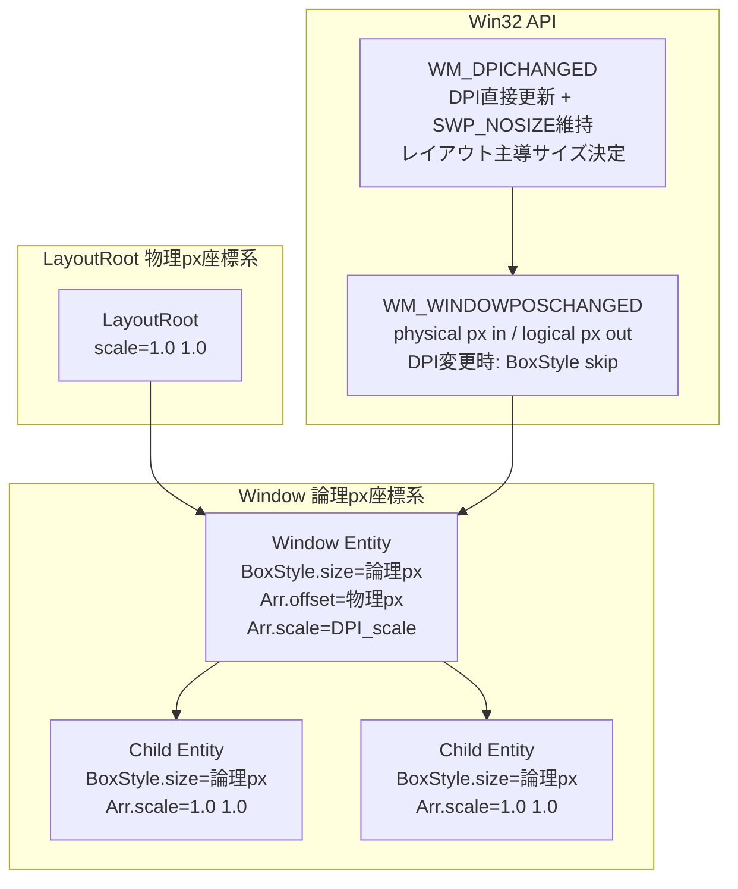
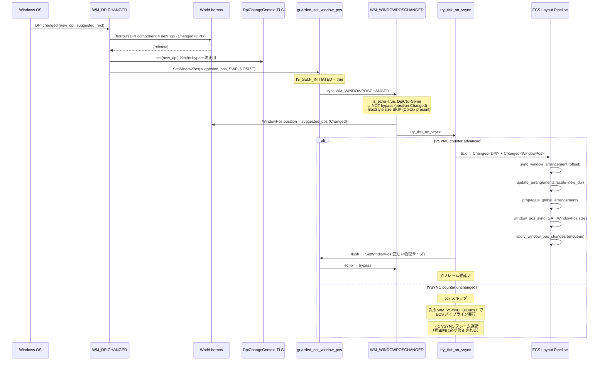

# Technical Design: wintf-dpi-aware-layout

## Overview

**Purpose**: wintf の DPI 対応レイアウトシステムを修正し、Per-Monitor DPI Aware V2 環境下で異なる DPI モニター間の正しいスケーリングを実現する。

**Users**: wintf 開発者が、DPI に依存しない論理ピクセル座標系でレイアウトを定義し、DPI スケーリングを ECS 変換伝播で自動化する。

**Impact**: 既存の3関数（`update_arrangements_system`、WM_WINDOWPOSCHANGED ハンドラ、WM_DPICHANGED ハンドラ）のパラメータ修正と、デモファイルのサイズ調整・ログ移行。WM_DPICHANGED ハンドラには DPI 直接更新（World borrow）が新規追加される。新規コンポーネント追加なし。

### Goals
- BoxStyle の座標系を論理ピクセル（96 DPI / 100% 相当）に統一
- Window エンティティの `Arrangement.scale` に DPI スケールを設定し、変換伝播で物理ピクセルへの変換を自動化
- DPI 変更時のラウンドトリップ（論理→物理→論理）で論理サイズが保存されること
- デモの自動検証フロー（手作業不要）を確立

### Non-Goals
- `Arrangement` 構造体の単位型分離リファクタリング（offset=物理 / size=論理の混在は受容）
- LayoutRoot 座標系の変更（物理 px のまま維持）
- Transform（非推奨）系との統合

---

## Architecture

### Existing Architecture Analysis

現在のレイアウトシステムは以下の変換連鎖で動作する:

```
BoxStyle → Taffy レイアウト → ComputedLayout → Arrangement → GlobalArrangement
```

**既存の制約**:
- `GlobalArrangement.bounds` = 物理ピクセル（Direct2D `SetTransform` で使用）
- `LayoutRoot` = 物理ピクセル座標系（`GetSystemMetrics` が物理 px を返すため）
- `Window.position = Absolute` により LayoutRoot サイズに制約されない

**現在の問題**:
- `Arrangement.scale` が全エンティティで `(1.0, 1.0)` 固定
- `BoxStyle.size` に物理 px が直接格納される
- `WM_DPICHANGED` で `SWP_NOSIZE` によりサイズ更新が抑制される（→ 新設計では SWP_NOSIZE を維持しつつ、ECS レイアウトパイプラインでサイズを算出する方式に変更）

### Architecture Pattern & Boundary Map



**Architecture Integration**:
- **Selected pattern**: 既存コンポーネント修正（Option A from research.md）。新規コンポーネント追加なし。
- **Domain boundaries**: Window エンティティが論理/物理の座標系境界。LayoutRoot より上は物理 px、Window 以下は論理 px。
- **Existing patterns preserved**: ECS 変換伝播（`GlobalArrangement * Arrangement`）、TLS ベースの echo/bypass ガード、RAII SetWindowPos ガード。

### Technology Stack

| Layer | Choice / Version | Role in Feature | Notes |
|-------|------------------|-----------------|-------|
| ECS | bevy_ecs 0.18.0 | コンポーネント管理、変更検知 | 既存 |
| Layout | taffy 0.9.2 | Flexbox レイアウト計算（論理 px） | 既存 |
| Window | windows 0.62.2 | Win32 API: SetWindowPos, DPI API | 既存 |
| Logging | tracing | 構造化ロギング（info! マクロ） | 既存 |

新規依存なし。

---

## System Flows

### DPI 変更フロー（レイアウトシステム主導方式）

**基本方針**: DPI変更時のウィンドウサイズ決定権は**ECSレイアウトシステム**が持つ。`suggested_rect` のサイズは使わず、DPI コンポーネント更新 → `Changed<DPI>` → `Arrangement.scale` 変更 → GA 再計算 → 正しい物理サイズを ECS パイプラインで算出する。

**旧設計との比較**:
- 旧: `WM_DPICHANGED` → `SWP_NOSIZE`除去 → `suggested_rect` サイズを受入 → `WM_WINDOWPOSCHANGED` で `physical / new_dpi` を BoxStyle に書き戻し
- 新: `WM_DPICHANGED` → DPI直接更新 → `SWP_NOSIZE`維持（位置のみ） → ECS tick で正しい物理サイズを算出



#### なぜレイアウト主導が正しいか

1. **単一権威の原則**: BoxStyle.size（論理px）がサイズの唯一のソース・オブ・トゥルース。Windows の `suggested_rect` に依存しない
2. **ラウンドトリップ不要**: `suggested_rect → physical → physical/dpi → logical` の変換連鎖が消滅し、丸め誤差リスクがゼロ
3. **BoxStyle不変**: DPI変更で BoxStyle.size は一切書き換わらない → 行き先もなく論理サイズが保存される
4. **ECSパイプライン再利用**: 通常のレイアウト変更と同じ `Changed<DPI> → scale → GA → WindowPos → SetWindowPos` の経路を通るため、新規コードパスが最小

#### 0フレーム到達条件の分析

`try_tick_on_vsync` は VSYNC カウンター変化をゲートとする（`VSYNC_TICK_COUNT != LAST_VSYNC_TICK` の場合のみ tick 実行）。

| シナリオ | VSYNC状況 | 結果 |
|----------|-----------|------|
| **ドラッグ中DPI変更** | WM_MOUSEMOVE間隔(~1-8ms) ≥ VSYNC間隔(~16ms) → VSYNC進行 | **0フレーム（高確率）** |
| **タスクバー移動** | WM_DPICHANGED後のWM_WINDOWPOSCHANGED内 | VSYNC進行していれば0フレーム |
| **ディスプレイ設定変更** | 低頻度イベント、次VSYNC確定 | **最大1 VSYNCフレーム** |

いずれのケースでも **描画パイプライン（Composition → CommitComposition）実行前に必ず正しいサイズが確定する**。ULW方式（`WS_EX_LAYERED`）ではOSによる自動スケーリングが発生しないため、旧サイズのまま新モニターに表示される瞬間は存在しない。

#### ラウンドトリップ検証（125% → 200%）

```
旧方式: BoxStyle.size = physical/new_DPI = (logical × old_DPI) × (new_DPI/old_DPI) / new_DPI = logical
新方式: BoxStyle.size = logical（不変、書き換えなし） ← 丸め誤差リスクゼロ
```

### ドラッグ中の WM_DPICHANGED 安全性解析（深掘り版・レイアウト主導方式）

wintf のドラッグは **OS モーダルループ（`WM_NCLBUTTONDOWN` → `DefWindowProc`）を使わず**、`WM_MOUSEMOVE` ごとにアプリが `guarded_set_window_pos(SWP_NOSIZE)` を直接呼ぶアプリ制御ドラッグである。

#### 前提: ウィンドウ特性

- **スタイル**: `WS_POPUP | WS_VISIBLE` + `WS_EX_LAYERED`（window.rs L721-724）
- **フレーム**: タイトルバーなし、ボーダーなし → `AdjustWindowRectExForDpi` は恒等変換
- **座標変換**: `window_to_client_coords` ≈ `client_to_window_coords` ≈ identity
- **含意**: `GetDpiForWindow` のタイミング問題（WM_DPICHANGED中にold/new DPIのどちらを返すか）が座標変換に影響しない

#### 前提: ドラッグ位置計算

```
screen_x = client_x + WindowPos.position.x  (= mouse の実スクリーン座標)
new_pos  = initial_window_pos + (current_mouse_screen - start_mouse_screen)
```

- `initial_window_pos`: ドラッグ開始時に固定、以降不変（WINDOW座標）
- 結果: ウィンドウ位置はマウスの絶対座標のみに依存し、現在のウィンドウ位置には非依存

#### 前提: レイアウト主導方式でのサイズ変更

レイアウト主導方式では WM_DPICHANGED が **SWP_NOSIZE を維持**するため、SetWindowPos はサイズを変更しない。サイズ変更は ECS パイプラインで算出し、`apply_window_pos_changes` → `flush_window_pos_commands` で反映する。

この変更により、Case A/B/C いずれにおいても SetWindowPos のネスト深度が浅くなり、F1（SetWindowPosGuard ネスト問題）の影響範囲が縮小する。

#### Windows API イベント発火順序

ドラッグの `guarded_set_window_pos(P_drag, SWP_NOSIZE)` が DPI 境界を越えた場合、
Windows API の仕様上、以下の3つの順序が考えられる:

##### Case A: WM_WINDOWPOSCHANGED → WM_DPICHANGED（最有力）

```
WM_MOUSEMOVE:
  [World borrow] ... [release]  ← World FREE
  deferred guarded_set_window_pos(P_drag, SWP_NOSIZE):
    IS_SELF_INITIATED = true, _guard1 作成
    Win32 SetWindowPos:
      ① WM_WINDOWPOSCHANGED(P_drag):
         is_echo=true, DpiCtx=None → bypass (Changed なし)
         try_tick_on_vsync → (変更なし、ほぼ空振り)
         flush_window_pos_commands → no-op
      ② OS が DPI 変化を検知
      ③ WM_DPICHANGED(new_dpi, suggested_rect):
         [World borrow] DPI component = new_dpi (Changed<DPI>) [release]
         DpiChangeContext::set(new_dpi)  ※echo bypass防止用
         inner guarded_set_window_pos(P_suggested, SWP_NOSIZE):  ← サイズ変更なし!
           IS_SELF_INITIATED = true (上書き), _guard2 作成
           Win32 SetWindowPos:
             ④ WM_WINDOWPOSCHANGED(P_suggested):
                is_echo=true, DpiCtx=Some → NOT bypass
                WindowPos.position = P_suggested (Changed<WindowPos>) ✓
                BoxStyle.size → SKIP (DpiCtx present, レイアウト主導) ✓
                try_tick_on_vsync:
                  IS_TICK_FLUSH_IN_PROGRESS = false → 実行可能
                  tick:
                    Changed<DPI> → update_arrangements(scale=new_dpi)
                    Changed<WindowPos> → sync_window_arrangement(offset)
                    propagate_global_arrangements → GA.bounds(正しい物理サイズ)
                    window_pos_sync → WindowPos.size = 正しい物理サイズ
                    apply_window_pos_changes → SetWindowPosCommand enqueue
                  flush: guarded_set_window_pos(正しい物理サイズ)
                    → ⑤ WM_WINDOWPOSCHANGED: is_echo=true → bypass
                    → _guard3 drops: IS_SELF_INITIATED = false ← ★
                  IS_TICK_FLUSH_IN_PROGRESS = false に復帰
           _guard2 drops: IS_SELF_INITIATED = false (already false ← ★)
      ③ returns
    Win32 SetWindowPos returns
    _guard1 drops: IS_SELF_INITIATED = false (already false)
```

**重要**: ④の tick は VSYNC カウンター進行に依存する。ドラッグ中の WM_MOUSEMOVE 間隔（~1-8ms）は VSYNC 間隔（~16ms）に跨る確率が高く、tick 実行の確率も高い。tick がスキップされた場合でも、次の WM_VSYNC（≤16ms）で確実に実行される。

##### Case B: SetWindowPos 完了後 → WM_DPICHANGED（メッセージキュー経由）

```
outer guarded_set_window_pos(P_drag, SWP_NOSIZE):
  IS_SELF_INITIATED = true
  Win32 SetWindowPos:
    WM_WINDOWPOSCHANGED(P_drag): bypass
  SetWindowPos returns
  _guard1 drops: IS_SELF_INITIATED = false
(メッセージポンプ)
WM_DPICHANGED:               ← ネストなし、IS_SELF_INITIATED = false
  [World borrow] DPI = new_dpi (Changed<DPI>) [release]
  DpiChangeContext::set(new_dpi)
  guarded_set_window_pos(P_suggested, SWP_NOSIZE):
    WM_WINDOWPOSCHANGED: DpiCtx=Some → NOT bypass
      WindowPos Changed ✓, BoxStyle.size SKIP ✓
      tick (if VSYNC) → 正しい物理サイズ → flush
  _guard drops: IS_SELF_INITIATED = false ← 正常
```

Case B はネストが浅く、F1 問題が完全に回避される。

##### Case C: WM_DPICHANGED → WM_WINDOWPOSCHANGED（DPI検知が先）

```
outer guarded_set_window_pos(P_drag, SWP_NOSIZE):
  IS_SELF_INITIATED = true, _guard1 作成
  Win32 SetWindowPos:
    ① WM_DPICHANGED:
       [World borrow] DPI = new_dpi (Changed<DPI>) [release]
       DpiChangeContext::set(new_dpi)
       inner guarded_set_window_pos(P_suggested, SWP_NOSIZE):
         IS_SELF_INITIATED = true, _guard2 作成
         WM_WINDOWPOSCHANGED(P_suggested): DpiCtx=Some → NOT bypass
           WindowPos Changed ✓, BoxStyle.size SKIP ✓
           tick (if VSYNC) → 正しい物理サイズ → flush
         _guard2 drops: IS_SELF_INITIATED = false ← ★
    ② WM_WINDOWPOSCHANGED(P_drag):
       is_echo = is_self_initiated() → FALSE (★で解除済み)
       DpiCtx = None (①で消費済み)
       → 外部由来と誤認! WindowPos をドラッグ位置で上書き (Changed)
       → tick → apply_window_pos_changes → SetWindowPos(P_drag + 正しいサイズ)
  _guard1 drops
```

**Case C の F6（is_echo誤判定）**: 外側 WM_WINDOWPOSCHANGED がドラッグ位置を外部リサイズと誤認するが、レイアウト主導方式では **BoxStyle.size は DpiCtx がないため skip されず本来 physical/dpi で書かれる**。ただし SWP_NOSIZE のため物理サイズ未変更 → 旧 physical / 新 DPI = 誤った論理値のリスクあり。

**F6 の緩和要因（レイアウト主導方式）**:
1. ドラッグ位置は次の WM_MOUSEMOVE（~1-8ms）で即座に復帰
2. BoxStyle.size への誤書き込みは旧 physical / 新 DPI だが、次の tick で ECS サイドの Changed<DPI> が既に処理済みのため、サイズは ECS パイプラインの算出値（正しい物理サイズ）で上書きされる
3. WS_POPUP + ULW のため視覚的なフリッカーは不可視に近い

#### 発見事項（レイアウト主導方式への更新）

| # | 発見 | 重大度 | 説明 |
|---|------|--------|------|
| **F1** | `SetWindowPosGuard` がネスト非対応 | **Medium** | `Drop` で無条件に `IS_SELF_INITIATED = false`。保存/復元方式に要修正。ただしレイアウト主導方式では SWP_NOSIZE 維持のためネスト深度が浅くなり影響が縮小 |
| **F2** | `WS_POPUP` → フレーム補正ゼロ | Low (朗報) | `GetDpiForWindow` タイミング問題が無害化。`AdjustWindowRectExForDpi` は恒等変換 |
| **F3** | ドラッグ中の位置ジャンプ | **Low** | suggested→drag 位置復帰は次 `WM_MOUSEMOVE`（~1-8ms）で自動修正。WS_POPUP + ULW なので flicker は不可視に近い |
| **F4** | 3 Case 全てで機能的に収束 | Info | 経路は異なるが DPI 更新 + 位置復帰 + レイアウト主導サイズ算出は全ケースで達成される |
| **F5** | `IS_TICK_FLUSH_IN_PROGRESS` 再入防止が正常動作 | Info | 再帰 tick 無限ループを防止。`try_tick_on_vsync` の guard は tick+flush スコープ全体を保護 |
| **F6** | Case C で `is_echo` 誤判定 | **Medium** | 外側 WM_WINDOWPOSCHANGED が外部由来と誤認し BoxStyle.size に旧physical/新DPI を書き込むリスク。ただしレイアウト主導方式では次 tick の ECS パイプラインが正しいサイズを再算出するため実害は軽微 |
| **F7** | DpiChangeContext は引き続き必要 | Info | echo bypass 防止（Changed<WindowPos> を発火させ sync_window_arrangement_from_window_pos が Arrangement.offset を更新するため）に必須。DPI直接更新に移行しても DpiChangeContext の信号的役割は維持 |

#### サイズ不変性の安全性評価

**結論: レイアウト主導方式では BoxStyle.size の不正な書き換えが発生しないため、旧設計より安全である。** 理由:

1. **BoxStyle.size 不変**: DpiChangeContext 存在時は BoxStyle.size のスキップが保証され、論理サイズが保存される
2. **サイズ主導権の明確化**: ECS レイアウトパイプライン（Changed<DPI> → scale → GA → WindowPos）が物理サイズの唯一の算出元
3. **SWP_NOSIZE 維持**: DPI変更方向の SetWindowPos がサイズを変えないため、nested guard 問題（F1）のサイズ方向の副作用がゼロ
4. **位置復帰が高速**: ドラッグ中は WM_MOUSEMOVE が高頻度（125-1000Hz）、1 メッセージ間隔で復帰

#### 設計への推奨事項

1. **F1 修正（実装タスクに追加）**: `SetWindowPosGuard` を save/restore 方式に変更。`previous: bool` フィールドを追加し、Drop で `IS_SELF_INITIATED.set(self.previous)` とする
2. **SWP_NOSIZE 維持の確定**: WM_DPICHANGED では位置のみ SetWindowPos。サイズ変更は ECS パイプライン経由で `apply_window_pos_changes` → `flush_window_pos_commands` が担当
3. **ドラッグ中 WM_DPICHANGED 特別処理は不要**: 位置自動復帰が成立、サイズはレイアウトシステムが正しく算出
4. **イベント順序の不確定性を受容**: 3 Case いずれでも安全に収束するため、特定順序を前提にしない設計で OK

---

## Requirements Traceability

| Requirement | Summary | Components | Interfaces | Flows |
|-------------|---------|------------|------------|-------|
| 1.1 | BoxStyle 値を論理 px として扱う | update_arrangements_system, WM_WINDOWPOSCHANGED | BoxStyle, Arrangement | — |
| 1.2 | BoxStyle.size に物理 px を直接設定しない | WM_WINDOWPOSCHANGED | BoxStyle | DPI 変更フロー |
| 1.3 | 論理→物理変換を Arrangement.scale 経由で行う | update_arrangements_system | Arrangement, GlobalArrangement | — |
| 2.1 | Window の Arrangement.scale = DPI.scale | update_arrangements_system | Arrangement, DPI | — |
| 2.2 | 子エンティティの scale は (1.0, 1.0) 維持 | update_arrangements_system | Arrangement | — |
| 2.3 | GA.bounds を物理 px で正しく算出 | update_arrangements_system | GlobalArrangement | — |
| 3.1 | WM_WINDOWPOSCHANGED で physical / DPI → BoxStyle（外部リサイズ時のみ） | WM_WINDOWPOSCHANGED | BoxStyle, DPI | DPI 変更フロー |
| 3.2 | DpiChangeContext による echo bypass 防止 + BoxStyle skip 信号 | WM_WINDOWPOSCHANGED, WM_DPICHANGED | DpiChangeContext | DPI 変更フロー |
| 4.1 | DPI 直接更新 + SWP_NOSIZE 維持 + レイアウトシステム主導サイズ決定 | WM_DPICHANGED, update_arrangements_system | DPI, Arrangement.scale | DPI 変更フロー |
| 4.2 | WM_WINDOWPOSCHANGED で DPI 変更時 BoxStyle.size スキップ（レイアウト主導） | WM_WINDOWPOSCHANGED | BoxStyle, DpiChangeContext | DPI 変更フロー |
| 5.1 | デモウィンドウが 200% モニターに収まる | taffy_flex_demo | BoxStyle | — |
| 5.2 | 子要素がウィンドウ内に収まりレイアウト正常 | taffy_flex_demo | BoxStyle, HitRegionMap | — |
| 6.1 | 手作業なし自動終了 | taffy_flex_demo run_demo | — | — |
| 6.2 | 総所要時間の大幅削減 | taffy_flex_demo run_demo | — | — |
| 7.1 | Arrangement.scale の INFO ログ出力 | dump_all_windows_dpi | — | — |
| 7.2 | GA.bounds の物理 px サイズを INFO ログ出力 | dump_all_windows_dpi | — | — |
| 7.3 | BoxStyle.size の論理 px サイズを INFO ログ出力 | dump_all_windows_dpi | BoxStyle | — |
| 7.4 | RUST_LOG=info で全ログ出力 | dump_all_windows_dpi | — | — |

---

## Components and Interfaces

| Component | Domain/Layer | Intent | Req Coverage | Key Dependencies | Contracts |
|-----------|-------------|--------|--------------|------------------|-----------|
| update_arrangements_system | Layout/ECS | Window の scale を DPI から設定 | 1.1, 1.3, 2.1, 2.2, 2.3 | DPI (P0), Window marker (P0) | Service |
| WM_WINDOWPOSCHANGED handler | WindowProc/Win32 | 外部リサイズ時のみ物理→論理変換で BoxStyle 更新、DPI変更時は BoxStyle スキップ | 1.1, 1.2, 3.1, 3.2, 4.2 | DPI (P0), DpiChangeContext (P0) | Service |
| WM_DPICHANGED handler | WindowProc/Win32 | DPI 直接更新 + SWP_NOSIZE 維持、レイアウトシステム主導サイズ決定 | 4.1, 4.2 | DPI (P0, **新規直接更新**), DpiChangeContext (P0), guarded_set_window_pos (P0) | Service |
| dump_all_windows_dpi | Demo/Logging | println → info! 移行、BoxStyle ログ追加 | 7.1, 7.2, 7.3, 7.4 | tracing (P0) | — |
| taffy_flex_demo sizing | Demo | ウィンドウ・子要素サイズ適正化 | 5.1, 5.2 | — | — |
| taffy_flex_demo run_demo | Demo | 自動検証フロー | 6.1, 6.2 | — | — |

### Layout System

#### update_arrangements_system

| Field | Detail |
|-------|--------|
| Intent | Window エンティティの Arrangement.scale を DPI スケールに設定する |
| Requirements | 1.1, 1.3, 2.1, 2.2, 2.3 |

**Responsibilities & Constraints**
- Window エンティティ（`Window` マーカーコンポーネント保持）の場合のみ、`Arrangement.scale` を `DPI.scale` に設定
- Window 以外のエンティティは `LayoutScale::default()` = (1.0, 1.0) を維持
- DPI コンポーネントが存在しない Window では (1.0, 1.0) にフォールバック

**Dependencies**
- Inbound: `DPI` コンポーネント — DPI スケールファクター取得 (P0)
- Inbound: `Window` マーカー — Window エンティティの判定 (P0)
- Outbound: `Arrangement.scale` — 変換伝播で `GlobalArrangement` に反映 (P0)

**Contracts**: Service [x]

##### Service Interface
```rust
// 変更前
let scale = LayoutScale::default(); // 常に (1.0, 1.0)

// 変更後（擬似コード）
fn determine_scale(is_window: bool, dpi: Option<&DPI>) -> LayoutScale {
    // Window エンティティかつ DPI コンポーネントありの場合 → DPI.scale
    // それ以外 → (1.0, 1.0)
}
```
- Preconditions: ComputedLayout が存在する
- Postconditions: Window の Arrangement.scale = DPI.scale、子は (1.0, 1.0)
- Invariants: GA.bounds.width = BoxStyle.size.width × GA.transform.M11 = 物理 px

---

### Window Proc Layer

#### WM_WINDOWPOSCHANGED handler（BoxStyle 更新部分）

| Field | Detail |
|-------|--------|
| Intent | Win32 から受け取る物理 px を DPI で除算し論理 px で BoxStyle.size に設定する（外部リサイズ時のみ） |
| Requirements | 1.1, 1.2, 3.1, 3.2, 4.2 |

**Responsibilities & Constraints**
- **外部リサイズ時**（`is_echo=false && dpi_context.is_none()`）: `physical_width / dpi.scale_x()` と `physical_height / dpi.scale_y()` で論理 px に変換し BoxStyle.size に設定
- **DPI 変更時**（`dpi_context.is_some()`）: BoxStyle.size の更新を **スキップ**。レイアウトシステムが `Changed<DPI>` → `update_arrangements_system` → `propagate_global_arrangements` → `window_pos_sync_system` の経路で正しい物理サイズを算出するため、BoxStyle を不正値で汚染しない
- **echo 時**（`is_echo=true && dpi_context.is_none()`）: 従来どおりスキップ（自発的 SetWindowPos のフィードバック）
- **DPI 変更時でも bypass しない**: DpiChangeContext 存在時は `use_bypass=false` を維持し、`Changed<WindowPos>` を発火させる → `sync_window_arrangement_from_window_pos` が `Arrangement.offset` を更新するために必要
- 値が変化した場合のみ `Changed<BoxStyle>` を発火（既存の差分チェックロジック維持）

**スキップ条件の設計（新規）**:
```rust
// WindowPos: DpiCtx 存在時は bypass しない（position Changed が必要）
let use_bypass = is_echo && dpi_context.is_none();

// BoxStyle.size: echo OR DpiCtx 存在時はスキップ（レイアウト主導サイズ決定）
let skip_box_style = is_echo || dpi_context.is_some();
```

| 条件 | use_bypass | skip_box_style | 理由 |
|------|-----------|----------------|------|
| 外部リサイズ（非echo, 非DPI） | false | false | physical/dpi → 論理px に変換して BoxStyle 更新 |
| echo (非DPI) | true | true | 自発的 SetWindowPos のフィードバック抑制 |
| DPI 変更（echo + DpiCtx） | false | true | position Changed 必要、サイズはレイアウト主導 |

**Dependencies**
- Inbound: `DPI` コンポーネント — scale_x(), scale_y() (P0)
- Inbound: `DpiChangeContext` — DPI 変更信号（echo bypass 防止 + BoxStyle skip 判定） (P0)
- Outbound: `BoxStyle.size` — Taffy 再計算のトリガー（外部リサイズ時のみ） (P0)
- Outbound: `Changed<WindowPos>` — `sync_window_arrangement_from_window_pos` トリガー（DPI 変更時の位置更新） (P0)

**Contracts**: Service [x]

##### Service Interface
```rust
// 変更前
let new_size = BoxSize {
    width: Some(Dimension::Px(physical_width)),    // 物理 px
    height: Some(Dimension::Px(physical_height)),  // 物理 px
};

// 変更後（擬似コード）
let skip_box_style = is_echo || dpi_context.is_some();
if !skip_box_style {
    // 外部リサイズ時のみ: 物理px → 論理px 変換して BoxStyle 更新
    let logical_width = physical_width / dpi.scale_x();
    let logical_height = physical_height / dpi.scale_y();
    let new_size = BoxSize {
        width: Some(Dimension::Px(logical_width)),     // 論理 px
        height: Some(Dimension::Px(logical_height)),   // 論理 px
    };
    // ... 差分チェック＆更新
}
// DPI変更時: BoxStyle 不変 → レイアウトシステムが Changed<DPI> 経由で正しいサイズを算出
```
- Preconditions: `client_size` が有効な物理ピクセルサイズ、`dpi` が取得済み
- Postconditions: 外部リサイズ時は BoxStyle.size が論理 px 単位で設定。DPI 変更時は BoxStyle.size 不変。
- Invariants: `BoxStyle.size × DPI.scale = physical_size`（外部リサイズ時、端数丸め許容）

#### WM_DPICHANGED handler

| Field | Detail |
|-------|--------|
| Intent | DPI コンポーネントを直接更新し、SWP_NOSIZE 維持で位置のみ SetWindowPos。サイズは ECS レイアウトパイプラインが算出 |
| Requirements | 4.1, 4.2 |

**Responsibilities & Constraints**
- **① World borrow**: DPI コンポーネントを `new_dpi` に直接更新（`Changed<DPI>` 発火）
- **② DpiChangeContext::set**: echo bypass 防止用の TLS 信号を設定（WM_WINDOWPOSCHANGED で position Changed を発火させ、BoxStyle.size をスキップさせるため）
- **③ guarded_set_window_pos**: `suggested_rect` の **位置のみ**（`SWP_NOSIZE` 維持）で SetWindowPos
- `SWP_NOZORDER | SWP_NOACTIVATE | SWP_NOSIZE` の3フラグすべてを維持

**DPI 直接更新が必要な理由**:
- DPI コンポーネントが WM_WINDOWPOSCHANGED の tick 前に更新されている必要がある（`Changed<DPI>` を `update_arrangements_system` が検知するため）
- 旧設計では WM_WINDOWPOSCHANGED 内で DpiChangeContext から DPI を更新していたが、新設計では WM_DPICHANGED 自体で直接設定

**DpiChangeContext が引き続き必要な理由**:
1. **echo bypass 防止**: WM_DPICHANGED → SetWindowPos → WM_WINDOWPOSCHANGED の経路で、`is_echo=true` でも `use_bypass=false` にし、`Changed<WindowPos>` を発火させる必要がある
2. **`sync_window_arrangement_from_window_pos`**: `Changed<WindowPos>` がないと `Arrangement.offset` が更新されず、`propagate_global_arrangements` → `window_pos_sync_system` が古い offset で GA を生成 → 位置退行バグ
3. **BoxStyle.size スキップ信号**: DpiChangeContext 存在 → `skip_box_style=true` → 旧 physical / 新 DPI の誤値書き込み防止

**Dependencies**
- Outbound: `DPI` コンポーネント — 直接更新 (P0, **新規**)
- Outbound: `DpiChangeContext` TLS — echo bypass 防止信号 (P0)
- Outbound: `guarded_set_window_pos` — RAII ガード付き SetWindowPos、位置のみ (P0)
- Outbound: WM_WINDOWPOSCHANGED — SetWindowPos が同期的に発火 (P0)

**Contracts**: Service [x]

##### Service Interface
```rust
// 変更前
DpiChangeContext::set(new_dpi);
guarded_set_window_pos(hwnd, None, x, y, 0, 0,
    SWP_NOSIZE | SWP_NOZORDER | SWP_NOACTIVATE)  // 位置のみ

// 変更後（擬似コード）
// ① World borrow: DPI 直接更新
if let Some(world) = try_get_ecs_world() {
    if let Ok(mut w) = world.try_borrow_mut() {
        if let Some(mut dpi) = w.entity_mut(entity).get_mut::<DPI>() {
            *dpi = new_dpi;  // Changed<DPI> 発火
        }
    }
}
// ② echo bypass 防止信号
DpiChangeContext::set(new_dpi);
// ③ 位置のみ SetWindowPos（SWP_NOSIZE 維持）
guarded_set_window_pos(hwnd, None, x, y, 0, 0,
    SWP_NOSIZE | SWP_NOZORDER | SWP_NOACTIVATE)
```
- Preconditions: `new_dpi` が OS から提供された有効な DPI 値、`suggested_rect` が有効な RECT
- Postconditions: DPI コンポーネントが更新済み（Changed<DPI>）、ウィンドウ位置が `suggested_rect` の位置に移動（サイズ不変）
- Invariants: ECS パイプラインの次の tick で `Changed<DPI>` → `Arrangement.scale` 更新 → 正しい物理サイズが `apply_window_pos_changes` 経由で反映される

---

### Demo Layer

#### dump_all_windows_dpi

| Field | Detail |
|-------|--------|
| Intent | println! を info! マクロに移行し、BoxStyle.size ログを追加 |
| Requirements | 7.1, 7.2, 7.3, 7.4 |

**Responsibilities & Constraints**
- 全ての `println!` を `info!` マクロに置換
- 各エンティティの `BoxStyle.size`（論理 px）をログに追加
- `dump_children_dpi` も同様に `println!` → `info!` 移行
- steering/logging.md の構造化フィールド規約に準拠

**Implementation Notes**
- `tracing::info` は既に `use tracing::{debug, info};` でインポート済み
- `BoxStyle` は既に `use wintf::ecs::layout::{..., BoxStyle, ...};` でインポート済み

#### taffy_flex_demo sizing

| Field | Detail |
|-------|--------|
| Intent | ウィンドウサイズを 200% DPI モニターに収まるサイズに縮小 |
| Requirements | 5.1, 5.2 |

**Responsibilities & Constraints**
- Window の BoxStyle.size を 200% DPI モニター（論理 720×450）に `find_non_primary_monitor_origin` の配置マージンを考慮して収まるサイズに設定
- 子要素（RegionTest 子: 140×150）をウィンドウ内に収まるサイズに縮小
- Rect/Polygon HitRegionMap 座標を縮小後のボックスサイズに合わせて更新（ColorMap は自動スケーリングのため不要）
- ClickThrough 子要素（150×100）はウィンドウサイズとの比率で必要に応じて調整

**Implementation Notes**
- 具体的なサイズ値は実装時に決定（REQ-5 は「収まること」が本質）
- gap-analysis.md §3.2 の Taffy レイアウト計算を参考に、子要素間の余白・grow/shrink バランスを検証すること

#### taffy_flex_demo run_demo

| Field | Detail |
|-------|--------|
| Intent | 自動検証フロー：起動→ウィンドウ作成→DPI ダンプ→自動終了 |
| Requirements | 6.1, 6.2 |

**Responsibilities & Constraints**
- `run_demo` の総所要時間を 60 秒から大幅に削減
- レイアウト安定に必要な初期待機は維持（Taffy 計算＋DirectComposition コミット完了待ち）
- DPI ダンプ出力後に自動的にウィンドウを閉じて終了
- `change_layout_parameters` の呼び出しは DPI 検証に不要であれば削除または短縮

---

## Error Handling

### Error Strategy
本修正ではエラーパスの変更はない。既存のエラーハンドリングを維持する。

### Error Categories
- **DPI コンポーネント欠落**: `LayoutScale::default()` にフォールバック（既存動作維持）
- **SetWindowPos 失敗**: 既存の `warn!` ログ出力を維持
- **DpiChangeContext 欠落**: 既存 DPI コンポーネントの値を使用（既存動作維持）

---

## Testing Strategy

### Unit Tests
- 本修正の対象関数は Win32 API に強く依存しており、純粋なユニットテストは困難
- 既存の `cargo test` で回帰テストを確認

### Integration Tests（デモ実行ベース）
1. **125% DPI モニターでの GA.bounds 検証**: `BoxStyle.size × 1.25 = GA.bounds size` をログで確認
2. **200% DPI モニターでの GA.bounds 検証**: `BoxStyle.size × 2.0 = GA.bounds size` をログで確認
3. **DPI 変更ラウンドトリップ**: ウィンドウをモニター間でドラッグし、論理サイズが保存されることを確認
4. **デモ自動終了**: `RUST_LOG=info cargo run --example taffy_flex_demo` で手作業なしに完了すること
5. **ヒットテスト正常動作**: RegionTest 子要素のクリック検知が縮小後も正しく動作すること

### Performance
- レイアウト計算: 既存の Taffy 計算に DPI スケール設定が1行追加されるのみ。パフォーマンス影響なし。

---

## 確認基準（gap-analysis.md §4.4 より）

| 確認項目 | Window 1 (125%) | Window 2 (200%) |
|---|---|---|
| GA.bounds 幅 = BoxStyle.width × DPI_scale | width × 1.25 | width × 2.0 |
| GA.bounds 高 = BoxStyle.height × DPI_scale | height × 1.25 | height × 2.0 |
| 両 Window の論理 px サイズ | 同一 | 同一 |
| 両 Window の物理 px サイズ | DPI に比例して異なる | DPI に比例して異なる |
