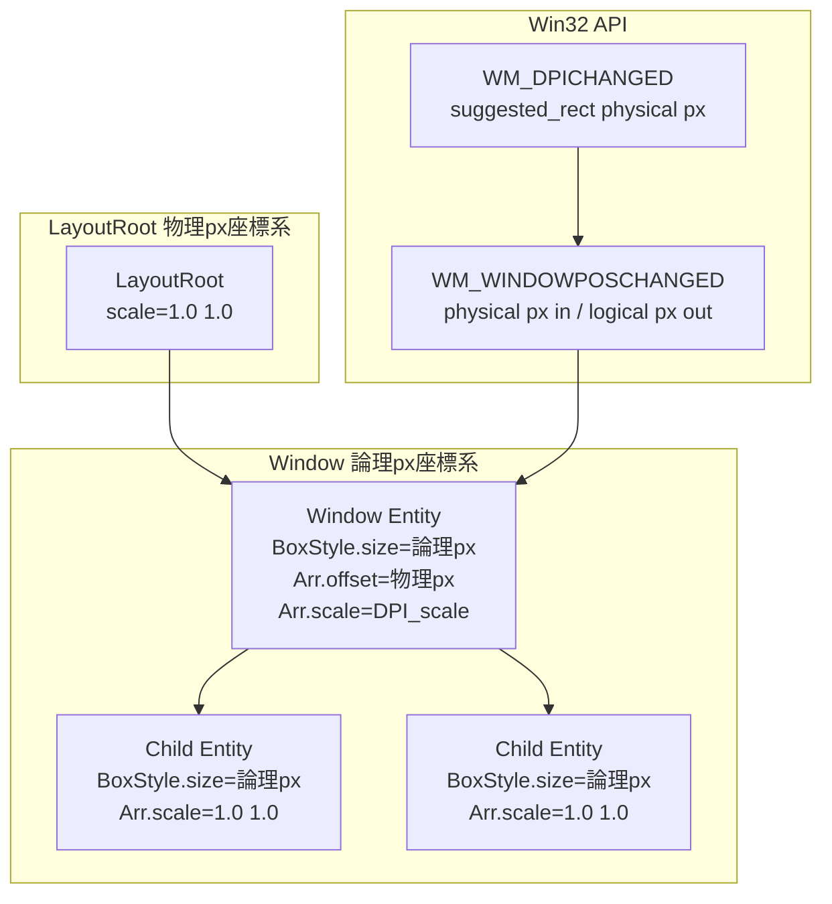
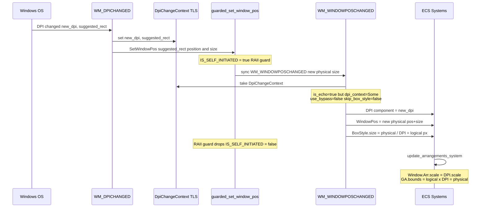

# Technical Design: wintf-dpi-aware-layout

## Overview

**Purpose**: wintf の DPI 対応レイアウトシステムを修正し、Per-Monitor DPI Aware V2 環境下で異なる DPI モニター間の正しいスケーリングを実現する。

**Users**: wintf 開発者が、DPI に依存しない論理ピクセル座標系でレイアウトを定義し、DPI スケーリングを ECS 変換伝播で自動化する。

**Impact**: 既存の3関数（`update_arrangements_system`、WM_WINDOWPOSCHANGED ハンドラ、WM_DPICHANGED ハンドラ）のパラメータ修正と、デモファイルのサイズ調整・ログ移行。新規コンポーネント追加なし。

### Goals
- BoxStyle の座標系を論理ピクセル（96 DPI / 100% 相当）に統一
- Window エンティティの `Arrangement.scale` に DPI スケールを設定し、変換伝播で物理ピクセルへの変換を自動化
- DPI 変更時のラウンドトリップ（論理→物理→論理）で論理サイズが保存されること
- デモの自動検証フロー（手作業不要）を確立

### Non-Goals
- `Arrangement` 構造体の単位型分離リファクタリング（offset=物理 / size=論理の混在は受容）
- LayoutRoot 座標系の変更（物理 px のまま維持）
- Transform（非推奨）系との統合

---

## Architecture

### Existing Architecture Analysis

現在のレイアウトシステムは以下の変換連鎖で動作する:

```
BoxStyle → Taffy レイアウト → ComputedLayout → Arrangement → GlobalArrangement
```

**既存の制約**:
- `GlobalArrangement.bounds` = 物理ピクセル（Direct2D `SetTransform` で使用）
- `LayoutRoot` = 物理ピクセル座標系（`GetSystemMetrics` が物理 px を返すため）
- `Window.position = Absolute` により LayoutRoot サイズに制約されない

**現在の問題**:
- `Arrangement.scale` が全エンティティで `(1.0, 1.0)` 固定
- `BoxStyle.size` に物理 px が直接格納される
- `WM_DPICHANGED` で `SWP_NOSIZE` によりサイズ更新が抑制される

### Architecture Pattern & Boundary Map



**Architecture Integration**:
- **Selected pattern**: 既存コンポーネント修正（Option A from research.md）。新規コンポーネント追加なし。
- **Domain boundaries**: Window エンティティが論理/物理の座標系境界。LayoutRoot より上は物理 px、Window 以下は論理 px。
- **Existing patterns preserved**: ECS 変換伝播（`GlobalArrangement * Arrangement`）、TLS ベースの echo/bypass ガード、RAII SetWindowPos ガード。

### Technology Stack

| Layer | Choice / Version | Role in Feature | Notes |
|-------|------------------|-----------------|-------|
| ECS | bevy_ecs 0.18.0 | コンポーネント管理、変更検知 | 既存 |
| Layout | taffy 0.9.2 | Flexbox レイアウト計算（論理 px） | 既存 |
| Window | windows 0.62.2 | Win32 API: SetWindowPos, DPI API | 既存 |
| Logging | tracing | 構造化ロギング（info! マクロ） | 既存 |

新規依存なし。

---

## System Flows

### DPI 変更フロー



### ラウンドトリップ検証（125% → 200%）

```
論理サイズ保存: BoxStyle.size = physical / new_DPI = (logical × old_DPI) × (new_DPI / old_DPI) / new_DPI = logical ✓
```

---

## Requirements Traceability

| Requirement | Summary | Components | Interfaces | Flows |
|-------------|---------|------------|------------|-------|
| 1.1 | BoxStyle 値を論理 px として扱う | update_arrangements_system, WM_WINDOWPOSCHANGED | BoxStyle, Arrangement | — |
| 1.2 | BoxStyle.size に物理 px を直接設定しない | WM_WINDOWPOSCHANGED | BoxStyle | DPI 変更フロー |
| 1.3 | 論理→物理変換を Arrangement.scale 経由で行う | update_arrangements_system | Arrangement, GlobalArrangement | — |
| 2.1 | Window の Arrangement.scale = DPI.scale | update_arrangements_system | Arrangement, DPI | — |
| 2.2 | 子エンティティの scale は (1.0, 1.0) 維持 | update_arrangements_system | Arrangement | — |
| 2.3 | GA.bounds を物理 px で正しく算出 | update_arrangements_system | GlobalArrangement | — |
| 3.1 | WM_WINDOWPOSCHANGED で physical / DPI → BoxStyle | WM_WINDOWPOSCHANGED | BoxStyle, DPI | DPI 変更フロー |
| 3.2 | DpiChangeContext 経由で最新 DPI を使用 | WM_WINDOWPOSCHANGED | DpiChangeContext | DPI 変更フロー |
| 4.1 | SWP_NOSIZE 除去 + suggested_rect サイズ適用 | WM_DPICHANGED | — | DPI 変更フロー |
| 4.2 | WM_WINDOWPOSCHANGED で座標系一貫性を自動維持 | WM_WINDOWPOSCHANGED | BoxStyle | DPI 変更フロー |
| 5.1 | デモウィンドウが 200% モニターに収まる | taffy_flex_demo | BoxStyle | — |
| 5.2 | 子要素がウィンドウ内に収まりレイアウト正常 | taffy_flex_demo | BoxStyle, HitRegionMap | — |
| 6.1 | 手作業なし自動終了 | taffy_flex_demo run_demo | — | — |
| 6.2 | 総所要時間の大幅削減 | taffy_flex_demo run_demo | — | — |
| 7.1 | Arrangement.scale の INFO ログ出力 | dump_all_windows_dpi | — | — |
| 7.2 | GA.bounds の物理 px サイズを INFO ログ出力 | dump_all_windows_dpi | — | — |
| 7.3 | BoxStyle.size の論理 px サイズを INFO ログ出力 | dump_all_windows_dpi | BoxStyle | — |
| 7.4 | RUST_LOG=info で全ログ出力 | dump_all_windows_dpi | — | — |

---

## Components and Interfaces

| Component | Domain/Layer | Intent | Req Coverage | Key Dependencies | Contracts |
|-----------|-------------|--------|--------------|------------------|-----------|
| update_arrangements_system | Layout/ECS | Window の scale を DPI から設定 | 1.1, 1.3, 2.1, 2.2, 2.3 | DPI (P0), Window marker (P0) | Service |
| WM_WINDOWPOSCHANGED handler | WindowProc/Win32 | 物理→論理変換で BoxStyle 更新 | 1.1, 1.2, 3.1, 3.2, 4.2 | DPI (P0), DpiChangeContext (P0) | Service |
| WM_DPICHANGED handler | WindowProc/Win32 | SWP_NOSIZE 除去、suggested_rect 適用 | 4.1 | guarded_set_window_pos (P0) | Service |
| dump_all_windows_dpi | Demo/Logging | println → info! 移行、BoxStyle ログ追加 | 7.1, 7.2, 7.3, 7.4 | tracing (P0) | — |
| taffy_flex_demo sizing | Demo | ウィンドウ・子要素サイズ適正化 | 5.1, 5.2 | — | — |
| taffy_flex_demo run_demo | Demo | 自動検証フロー | 6.1, 6.2 | — | — |

### Layout System

#### update_arrangements_system

| Field | Detail |
|-------|--------|
| Intent | Window エンティティの Arrangement.scale を DPI スケールに設定する |
| Requirements | 1.1, 1.3, 2.1, 2.2, 2.3 |

**Responsibilities & Constraints**
- Window エンティティ（`Window` マーカーコンポーネント保持）の場合のみ、`Arrangement.scale` を `DPI.scale` に設定
- Window 以外のエンティティは `LayoutScale::default()` = (1.0, 1.0) を維持
- DPI コンポーネントが存在しない Window では (1.0, 1.0) にフォールバック

**Dependencies**
- Inbound: `DPI` コンポーネント — DPI スケールファクター取得 (P0)
- Inbound: `Window` マーカー — Window エンティティの判定 (P0)
- Outbound: `Arrangement.scale` — 変換伝播で `GlobalArrangement` に反映 (P0)

**Contracts**: Service [x]

##### Service Interface
```rust
// 変更前
let scale = LayoutScale::default(); // 常に (1.0, 1.0)

// 変更後（擬似コード）
fn determine_scale(is_window: bool, dpi: Option<&DPI>) -> LayoutScale {
    // Window エンティティかつ DPI コンポーネントありの場合 → DPI.scale
    // それ以外 → (1.0, 1.0)
}
```
- Preconditions: ComputedLayout が存在する
- Postconditions: Window の Arrangement.scale = DPI.scale、子は (1.0, 1.0)
- Invariants: GA.bounds.width = BoxStyle.size.width × GA.transform.M11 = 物理 px

---

### Window Proc Layer

#### WM_WINDOWPOSCHANGED handler（BoxStyle 更新部分）

| Field | Detail |
|-------|--------|
| Intent | Win32 から受け取る物理 px を DPI で除算し論理 px で BoxStyle.size に設定 |
| Requirements | 1.1, 1.2, 3.1, 3.2, 4.2 |

**Responsibilities & Constraints**
- `physical_width / dpi.scale_x()` と `physical_height / dpi.scale_y()` で論理 px に変換
- `dpi` は既に L153-170 で取得済み（`DpiChangeContext` → 新 DPI 優先、なければ既存 DPI コンポーネント）
- 値が変化した場合のみ `Changed<BoxStyle>` を発火（既存の差分チェックロジック維持）

**Dependencies**
- Inbound: `DPI` コンポーネント — scale_x(), scale_y() (P0)
- Inbound: `DpiChangeContext` — DPI 変更時の新 DPI 値 (P0)
- Outbound: `BoxStyle.size` — Taffy 再計算のトリガー (P0)

**Contracts**: Service [x]

##### Service Interface
```rust
// 変更前
let new_size = BoxSize {
    width: Some(Dimension::Px(physical_width)),    // 物理 px
    height: Some(Dimension::Px(physical_height)),  // 物理 px
};

// 変更後（擬似コード）
let logical_width = physical_width / dpi.scale_x();
let logical_height = physical_height / dpi.scale_y();
let new_size = BoxSize {
    width: Some(Dimension::Px(logical_width)),     // 論理 px
    height: Some(Dimension::Px(logical_height)),   // 論理 px
};
```
- Preconditions: `client_size` が有効な物理ピクセルサイズ、`dpi` が取得済み
- Postconditions: BoxStyle.size が論理 px 単位で設定される
- Invariants: `BoxStyle.size × DPI.scale = physical_size`（端数丸め許容）

#### WM_DPICHANGED handler

| Field | Detail |
|-------|--------|
| Intent | SWP_NOSIZE を除去し、suggested_rect の位置＋サイズで SetWindowPos を呼ぶ |
| Requirements | 4.1 |

**Responsibilities & Constraints**
- `SWP_NOSIZE` フラグを除去
- `suggested_rect` から幅 = `right - left`、高さ = `bottom - top` を算出し SetWindowPos に渡す
- 既存の `SWP_NOZORDER | SWP_NOACTIVATE` は維持

**Dependencies**
- Outbound: `guarded_set_window_pos` — RAII ガード付き SetWindowPos (P0)
- Outbound: WM_WINDOWPOSCHANGED — SetWindowPos が同期的に発火 (P0)

**Contracts**: Service [x]

##### Service Interface
```rust
// 変更前
guarded_set_window_pos(hwnd, None, x, y, 0, 0,
    SWP_NOSIZE | SWP_NOZORDER | SWP_NOACTIVATE)

// 変更後（擬似コード）
let w = suggested_rect.right - suggested_rect.left;
let h = suggested_rect.bottom - suggested_rect.top;
guarded_set_window_pos(hwnd, None, x, y, w, h,
    SWP_NOZORDER | SWP_NOACTIVATE)
```
- Preconditions: `suggested_rect` が OS から提供された有効な RECT
- Postconditions: ウィンドウの物理サイズが `suggested_rect` のサイズに更新される
- Invariants: 後続の WM_WINDOWPOSCHANGED で BoxStyle.size が論理 px に正しく変換される

---

### Demo Layer

#### dump_all_windows_dpi

| Field | Detail |
|-------|--------|
| Intent | println! を info! マクロに移行し、BoxStyle.size ログを追加 |
| Requirements | 7.1, 7.2, 7.3, 7.4 |

**Responsibilities & Constraints**
- 全ての `println!` を `info!` マクロに置換
- 各エンティティの `BoxStyle.size`（論理 px）をログに追加
- `dump_children_dpi` も同様に `println!` → `info!` 移行
- steering/logging.md の構造化フィールド規約に準拠

**Implementation Notes**
- `tracing::info` は既に `use tracing::{debug, info};` でインポート済み
- `BoxStyle` は既に `use wintf::ecs::layout::{..., BoxStyle, ...};` でインポート済み

#### taffy_flex_demo sizing

| Field | Detail |
|-------|--------|
| Intent | ウィンドウサイズを 200% DPI モニターに収まるサイズに縮小 |
| Requirements | 5.1, 5.2 |

**Responsibilities & Constraints**
- Window の BoxStyle.size を 200% DPI モニター（論理 720×450）に `find_non_primary_monitor_origin` の配置マージンを考慮して収まるサイズに設定
- 子要素（RegionTest 子: 140×150）をウィンドウ内に収まるサイズに縮小
- Rect/Polygon HitRegionMap 座標を縮小後のボックスサイズに合わせて更新（ColorMap は自動スケーリングのため不要）
- ClickThrough 子要素（150×100）はウィンドウサイズとの比率で必要に応じて調整

**Implementation Notes**
- 具体的なサイズ値は実装時に決定（REQ-5 は「収まること」が本質）
- gap-analysis.md §3.2 の Taffy レイアウト計算を参考に、子要素間の余白・grow/shrink バランスを検証すること

#### taffy_flex_demo run_demo

| Field | Detail |
|-------|--------|
| Intent | 自動検証フロー：起動→ウィンドウ作成→DPI ダンプ→自動終了 |
| Requirements | 6.1, 6.2 |

**Responsibilities & Constraints**
- `run_demo` の総所要時間を 60 秒から大幅に削減
- レイアウト安定に必要な初期待機は維持（Taffy 計算＋DirectComposition コミット完了待ち）
- DPI ダンプ出力後に自動的にウィンドウを閉じて終了
- `change_layout_parameters` の呼び出しは DPI 検証に不要であれば削除または短縮

---

## Error Handling

### Error Strategy
本修正ではエラーパスの変更はない。既存のエラーハンドリングを維持する。

### Error Categories
- **DPI コンポーネント欠落**: `LayoutScale::default()` にフォールバック（既存動作維持）
- **SetWindowPos 失敗**: 既存の `warn!` ログ出力を維持
- **DpiChangeContext 欠落**: 既存 DPI コンポーネントの値を使用（既存動作維持）

---

## Testing Strategy

### Unit Tests
- 本修正の対象関数は Win32 API に強く依存しており、純粋なユニットテストは困難
- 既存の `cargo test` で回帰テストを確認

### Integration Tests（デモ実行ベース）
1. **125% DPI モニターでの GA.bounds 検証**: `BoxStyle.size × 1.25 = GA.bounds size` をログで確認
2. **200% DPI モニターでの GA.bounds 検証**: `BoxStyle.size × 2.0 = GA.bounds size` をログで確認
3. **DPI 変更ラウンドトリップ**: ウィンドウをモニター間でドラッグし、論理サイズが保存されることを確認
4. **デモ自動終了**: `RUST_LOG=info cargo run --example taffy_flex_demo` で手作業なしに完了すること
5. **ヒットテスト正常動作**: RegionTest 子要素のクリック検知が縮小後も正しく動作すること

### Performance
- レイアウト計算: 既存の Taffy 計算に DPI スケール設定が1行追加されるのみ。パフォーマンス影響なし。

---

## 確認基準（gap-analysis.md §4.4 より）

| 確認項目 | Window 1 (125%) | Window 2 (200%) |
|---|---|---|
| GA.bounds 幅 = BoxStyle.width × DPI_scale | width × 1.25 | width × 2.0 |
| GA.bounds 高 = BoxStyle.height × DPI_scale | height × 1.25 | height × 2.0 |
| 両 Window の論理 px サイズ | 同一 | 同一 |
| 両 Window の物理 px サイズ | DPI に比例して異なる | DPI に比例して異なる |
