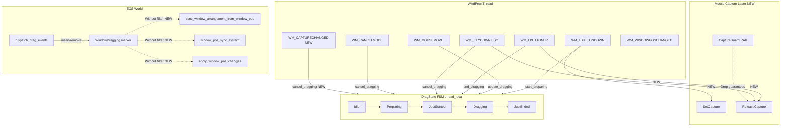
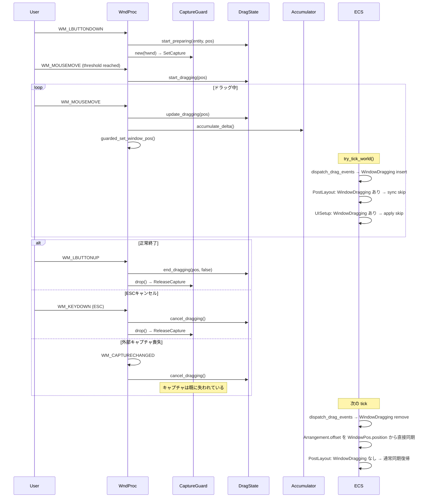
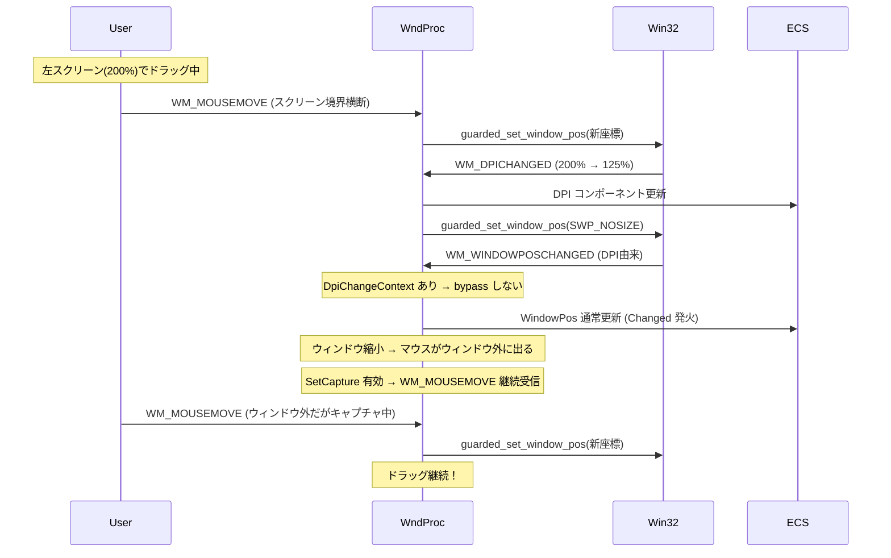

# Technical Design: wintf-screen-drag-stability

## Overview

**Purpose**: スクリーン間ドラッグ時のウィンドウ位置安定性を確保する。Win32 マウスキャプチャ（`SetCapture`/`ReleaseCapture`）の導入と、ECS レイアウトパイプラインのドラッグ排他制御（`WindowDragging` フィルタ）により、DPI 境界横断およびレイアウト再計算に起因する不安定動作を解消する。

**Users**: wintf を使用するデスクトップアプリケーション開発者。エンドユーザーはドラッグ操作のスムーズさを体験する。

**Impact**: 既存の WndProc ハンドラ（mouse_click, keyboard）と ECS レイアウトシステム（PostLayout, UISetup）に最小差分の変更を加える。新規コンポーネントは `CaptureGuard` のみ。

### Goals
- DPI 境界横断時のドラッグ途切れを解消する（P2 根因: マウスキャプチャ未実装）
- ECS レイアウトパイプラインによるドラッグ位置の巻き戻しを防止する（P1 根因: ステール offset カスケード）
- ドラッグ終了時の ECS 状態整合性を保証する
- パニック時のマウスキャプチャ解放を RAII で保証する

### Non-Goals
- 副次根因 S3-S7（NCHITTEST キャッシュ、flush 重複、borrow 失敗）の対処は本仕様のスコープ外
- `WM_MOVING` / `WM_ENTERSIZEMOVE` 等の未使用メッセージ活用は将来仕様に委ねる
- ドラッグ中のウィンドウリサイズ最適化は対象外（DPI 変更によるリサイズはドラッグ終了後に ECS パイプラインが処理）

## Architecture

> 詳細な調査ログは `research.md` を参照。本ドキュメントは設計判断と契約のみを記載する。

### Existing Architecture Analysis

**現行のドラッグアーキテクチャ**:

```
WndProc Thread                         ECS World (try_tick_world)
─────────────                           ─────────────────────────
WM_LBUTTONDOWN                          Input Schedule:
  → start_preparing()                     dispatch_drag_events
  → [TODO: SetCapture]                      → WindowDragging insert/remove
                                            → DragStartEvent/DragEndEvent
WM_MOUSEMOVE
  → check_threshold()                   PostLayout Schedule:
  → start_dragging()                      sync_window_arrangement_from_window_pos
  → update_dragging()                     → sync_simple_arrangements
  → DragAccumulator.accumulate_delta()    → mark_dirty_arrangement_trees
  → guarded_set_window_pos()              → propagate_global_arrangements
                                          → window_pos_sync_system
WM_LBUTTONUP
  → end_dragging()                      UISetup Schedule:
  → [TODO: ReleaseCapture]               apply_window_pos_changes
```

**既存のパターンと制約**:
- `DragState` FSM は thread_local（WndProc スレッド専用）
- `DragAccumulatorResource`（`Arc<Mutex>`）がスレッド間ブリッジ
- `SELF_INITIATED_DEPTH` RAII ガードで echo 判定
- `bypass_change_detection()` でドラッグ由来の `WM_WINDOWPOSCHANGED` による `Changed<WindowPos>` を抑止（直接ループ防止済み）
- `WindowDragging` マーカーは `dispatch_drag_events` で insert/remove 済み（**ただし他システムで未参照**）

**メッセージキューの特性**:
- SetCapture 中、移動中の `WM_MOUSEMOVE` はシステムによって間引かれる可能性がある（Win32 仕様）
- `DragAccumulator` がデルタを累積する設計により、メッセージ間引きに対応済み（各 `WM_MOUSEMOVE` 受信時に `accumulate_delta()` で加算、ECS tick 時にまとめて flush）
- マウスボタン離脱時の `WM_LBUTTONUP` は保証される

**根本問題**: 
1. `SetCapture` がないため、DPI 変更でウィンドウが縮小するとマウスイベントが途切れる
2. `Without<WindowDragging>` がないため、間接レイアウト再計算が古い座標を復活させる

### Architecture Pattern & Boundary Map



**Architecture Integration**:
- **Selected pattern**: 既存拡張（Option A）— 既に配置済みの拡張ポイント（TODO コメント、WindowDragging マーカー）を有効化する最小差分アプローチ
- **Domain boundaries**: WndProc ドメイン（キャプチャ管理）と ECS ドメイン（レイアウト排他）を独立して変更。ブリッジは既存の `DragAccumulatorResource` をそのまま使用
- **Existing patterns preserved**: `SELF_INITIATED_DEPTH` RAII ガード、`bypass_change_detection()`、`dispatch_drag_events` の Ended パス同期
- **New component**: `CaptureGuard`（RAII Drop ガード）のみ追加
- **Steering compliance**: logging.md の構造化ログ規約に従い、キャプチャ取得/解放を `debug!` レベルで記録

### Technology Stack

| Layer | Choice / Version | Role in Feature | Notes |
|-------|------------------|-----------------|-------|
| Win32 API | windows 0.62.2 | `SetCapture`, `ReleaseCapture`, `WM_CAPTURECHANGED` ハンドリング | `Win32_UI_Input_KeyboardAndMouse` feature 有効済み |
| DPI Mode | Per-Monitor DPI Aware V2 | DPI 境界横断時の座標系統一 | `DPI_AWARENESS_CONTEXT_PER_MONITOR_AWARE_V2` 設定済み（process_singleton.rs）。スクリーン座標は物理ピクセルで統一され、DPI 差に依らず一貫性を保つ |
| ECS | bevy_ecs 0.18.0 | `Without<WindowDragging>` クエリフィルタ、`Changed<T>` 検知 | 既存パターン準拠 |
| Layout | taffy 0.9.2 | ドラッグ排他時もサイズ計算は維持 | 位置のみ排他 |
| Logging | tracing | キャプチャ取得/解放の構造化ログ | steering/logging.md 準拠 |

## System Flows

### ドラッグライフサイクル（修正後）



### DPI境界横断シナリオ（修正後）



## Requirements Traceability

| Requirement | Summary | Components | Interfaces | Flows |
|-------------|---------|------------|------------|-------|
| 1.1 | ドラッグ中のマウスキャプチャ取得 | CaptureGuard, mouse_click | SetCapture API | ドラッグライフサイクル |
| 1.2 | ドラッグ終了時のキャプチャ解放 | CaptureGuard, mouse_click, keyboard | ReleaseCapture API | ドラッグライフサイクル |
| 1.3 | キャプチャ失敗時のフォールバック | mouse_click | tracing::warn! | — |
| 1.4 | WM_CAPTURECHANGED でのドラッグ終了 | keyboard (capture_changed handler) | cancel_dragging() | 外部キャプチャ喪失 |
| 1.5 | パニック時の RAII 解放 | CaptureGuard | Drop trait | — |
| 2.1 | スクリーン境界での連続追従 | CaptureGuard（イベント継続保証） | SetCapture | DPI境界横断 |
| 2.2 | echo bypass の正常動作 | （既存: 変更なし） | — | — |
| 2.3 | SetWindowPos 1フレーム1回制約 | （既存: 変更なし） | — | — |
| 2.4 | ECS レイアウト排他制御 | window_pos_systems, apply_window_pos_changes | Without<WindowDragging> | ドラッグライフサイクル |
| 2.5 | DPI変更時のドラッグ継続 | CaptureGuard | SetCapture | DPI境界横断 |
| 3.1 | 同一DPI時の DPI処理スキップ | （既存: 変更なし） | — | — |
| 3.2 | SELF_INITIATED_DEPTH の正常動作 | （既存: 変更なし） | — | — |
| 3.3 | echo での Changed 非発火 | （既存: 変更なし） | — | — |
| 3.4 | VSYNC tick での巻き戻し防止 | window_pos_systems | Without<WindowDragging> | ドラッグライフサイクル |
| 4.1 | DirectComposition の同期 | （既存: 変更なし） | — | — |
| 4.2 | dirty フラグの不要発火防止 | apply_window_pos_changes | Without<WindowDragging> | — |
| 4.3 | ドラッグ中のリサイズ遅延 | window_pos_systems（排他制御） | Without<WindowDragging> | — |
| 4.4 | HasGraphicsResources 非発火 | （既存: 変更なし） | — | — |
| 5.1 | 終了後の WindowPos 一致 | dispatch_drag_events Ended パス | Arrangement 直接同期 | ドラッグライフサイクル |
| 5.2 | 終了後の DPI 一致 | （既存: DPI 変更ハンドラ） | — | — |
| 5.3 | 終了後の Arrangement 正常計算 | dispatch_drag_events Ended パス | offset 直接同期 → PostLayout 復帰 | ドラッグライフサイクル |
| 5.4 | 終了後の ReleaseCapture | CaptureGuard | Drop trait | ドラッグライフサイクル |
| 5.5 | パニック時の capture 解放 | CaptureGuard | Drop trait, panic='unwind' | — |

## Components and Interfaces

| Component | Domain/Layer | Intent | Req Coverage | Key Dependencies | Contracts |
|-----------|-------------|--------|--------------|------------------|-----------|
| CaptureGuard | WndProc / Input | マウスキャプチャの RAII 管理 | 1.1-1.5, 2.1, 2.5, 5.4-5.5 | Win32 SetCapture/ReleaseCapture (P0) | State |
| WM_CAPTURECHANGED handler | WndProc / Input | 外部キャプチャ喪失時のドラッグ終了 | 1.4 | DragState FSM (P0) | — |
| WindowDragging filter (3 systems) | ECS / Layout | ドラッグ中の位置同期排他 | 2.4, 3.4, 4.2, 4.3 | bevy_ecs Without filter (P0) | — |

### WndProc / Input Layer

#### CaptureGuard

| Field | Detail |
|-------|--------|
| Intent | SetCapture/ReleaseCapture の RAII ライフサイクル管理 |
| Requirements | 1.1, 1.2, 1.3, 1.5, 2.1, 2.5, 5.4, 5.5 |

**Responsibilities & Constraints**
- マウスキャプチャの取得（`SetCapture`）と確実な解放（`ReleaseCapture`）をペアで管理する
- Drop 時に `ReleaseCapture` を呼び出し、パニック時のリソースリークを防止する（`panic = 'unwind'` 設定で保証）
- キャプチャ取得自体が失敗するケースはない（Win32 API 仕様: `SetCapture` は常に成功し、前の capture owner の HWND を返す）

**Dependencies**
- Outbound: `windows::Win32::UI::Input::KeyboardAndMouse::{SetCapture, ReleaseCapture}` — Win32 API (P0)
- Inbound: `mouse_click.rs` handle_button_message — 生成と保持 (P0)

**Contracts**: State [x]

##### State Management

```rust
// thread_local に配置。DragState と同じスレッド親和性を持つ
thread_local! {
    static CAPTURE_GUARD: Cell<Option<CaptureGuardInner>> = const { Cell::new(None) };
}

struct CaptureGuardInner {
    hwnd: HWND,
}

impl Drop for CaptureGuardInner {
    fn drop(&mut self) {
        // ReleaseCapture を呼び出す
        // HWND は検証不要（ReleaseCapture はグローバル状態をリセット）
    }
}
```

- **State model**: thread_local `Cell<Option<CaptureGuardInner>>` — Idle（None）/ Active（Some）の2状態
- **取得**: `acquire_capture(hwnd)` → `SetCapture(hwnd)` → `CAPTURE_GUARD.set(Some(...))`
  - 既に Active の場合は先に release してから再取得
  - `SetCapture` が失敗することはないが、`warn!` ログを出力する方針は不要（API 仕様上常に成功）
- **解放**: `release_capture()` → `CAPTURE_GUARD.take()` → Drop → `ReleaseCapture()`
  - 既に Idle の場合は no-op（冪等）
- **パニック安全性**: `panic = 'unwind'` 設定によりスタック巻き戻しで Drop が実行される

**Implementation Notes**
- Integration: `mouse_click.rs` の `start_preparing` 直後で `acquire_capture(hwnd)`、`end_dragging` / `cancel_dragging` 直後で `release_capture()`
- Validation: `CaptureGuardInner` が保持されている場合のみ `ReleaseCapture` を呼ぶ（ `WM_CAPTURECHANGED` で外部解放された場合は guard を clear するだけ）
- Risks: `WM_CAPTURECHANGED` を受けた時点で OS 側のキャプチャは既に解放済み。guard 側は `release_capture()` で clear するのみ（`ReleaseCapture` は不要）

#### WM_CAPTURECHANGED Handler

| Field | Detail |
|-------|--------|
| Intent | 外部要因でマウスキャプチャを失った際にドラッグを安全に終了する |
| Requirements | 1.4 |

**Responsibilities & Constraints**
- `WM_CAPTURECHANGED` メッセージを受信したとき、ドラッグが進行中であれば `cancel_dragging()` を呼び出す
- 既に Idle 状態ならば何もしない（冪等）
- CaptureGuard を clear する（`ReleaseCapture` は呼ばない — OS が既に解放済み）

**Dependencies**
- Inbound: `ecs_wndproc` ディスパッチテーブル — メッセージルーティング (P0)
- Outbound: `crate::ecs::drag::cancel_dragging()` — DragState 遷移 (P0)
- Outbound: `CaptureGuard::clear_without_release()` — guard リセット (P0)

**Implementation Notes**
- Integration: `keyboard.rs` に `handle_capture_changed` 関数を追加。`ecs_wndproc` の `mod.rs` ディスパッチテーブルに `WM_CAPTURECHANGED` エントリを追加
- Validation: `WM_CANCELMODE` ハンドラとの冪等性を確保（DragState が既に Idle なら早期 return）
- Risks: `WM_CAPTURECHANGED` は `ReleaseCapture()` 呼び出し時にも発火する。自発的な解放時は DragState が既に JustEnded/Idle なので、cancel_dragging の冪等性で安全

### ECS / Layout Layer

#### WindowDragging Filter（3 システム共通）

| Field | Detail |
|-------|--------|
| Intent | ドラッグ中のウィンドウに対する ECS レイアウトパイプラインの位置更新を抑止する |
| Requirements | 2.4, 3.4, 4.2, 4.3 |

**Responsibilities & Constraints**
- `window_pos_sync_system`（PostLayout）: `Changed<GlobalArrangement>` → WindowPos の書き戻しをドラッグ中は skip
- `sync_window_arrangement_from_window_pos`（PostLayout）: `Changed<WindowPos>` → `Arrangement.offset` の同期をドラッグ中は skip
- `apply_window_pos_changes`（UISetup）: `Changed<WindowPos>` → `SetWindowPos` の発行をドラッグ中は skip
- ドラッグ終了時の再同期は `dispatch_drag_events` Ended パスで既に実装済み（`Arrangement.offset` を `WindowPos.position` から直接設定）

**Dependencies**
- Inbound: `dispatch_drag_events` — `WindowDragging` マーカーの insert/remove (P0)
- Outbound: なし（既存システムのクエリフィルタ変更のみ）

**Contracts**: State [x]

##### State Management
- **State model**: `WindowDragging` コンポーネントの有無（bevy_ecs marker component）
- **Persistence**: `dispatch_drag_events` の `DragTransition::Started` で insert、`DragTransition::Ended` で remove
- **Concurrency**: ECS schedule 内で排他アクセス（bevy_ecs の Query フィルタで保証）

**変更対象のシステムシグネチャ**:

```rust
// window_pos_sync_system: GlobalArrangement → WindowPos
pub fn window_pos_sync_system(
    mut query: Query<
        (Entity, &GlobalArrangement, &mut WindowPos, Option<&Name>),
        (With<Window>, Changed<GlobalArrangement>, Without<WindowDragging>),
        //                                         ^^^^^^^^^^^^^^^^^^^^^^^^ NEW
    >,
    // ...
)

// sync_window_arrangement_from_window_pos: WindowPos → Arrangement
pub fn sync_window_arrangement_from_window_pos(
    mut query: Query<
        (Entity, &WindowPos, &mut Arrangement, Option<&Name>),
        (With<Window>, Changed<WindowPos>, Without<WindowDragging>),
        //                                 ^^^^^^^^^^^^^^^^^^^^^^^^ NEW
    >,
)

// apply_window_pos_changes: WindowPos → SetWindowPos
pub fn apply_window_pos_changes(
    mut query: Query<
        (Entity, &WindowHandle, &WindowPos, Option<&Name>),
        (Changed<WindowPos>, With<Window>, Without<WindowDragging>),
        //                                 ^^^^^^^^^^^^^^^^^^^^^^^^ NEW
    >,
)
```

**Implementation Notes**
- Integration: 各システムの Query タプルの型パラメータに `Without<WindowDragging>` を追加するのみ。ロジック変更は不要
- Validation: `dispatch_drag_events` の Ended パス（[dispatch.rs L219-L252](crates/wintf/src/ecs/drag/dispatch.rs#L219-L252)）で `Arrangement.offset` を直接同期する既存処理がドラッグ終了時の整合性を保証
- Risks: ドラッグ中に DPI 変更が発生した場合、`sync_window_arrangement_from_window_pos` がスキップされるが、ドラッグ終了時の Ended パスで再同期されるため、最終的な整合性は維持

## Error Handling

### Error Strategy

ドラッグ安定性の修正は**フォールバック優先**の設計を採用する。キャプチャ取得に失敗しても（実際には Win32 API 仕様上失敗しないが）、既存のキャプチャなしドラッグ処理にフォールバックする。

### Error Categories and Responses

| カテゴリ | シナリオ | 対応 | ログレベル |
|----------|----------|------|-----------|
| キャプチャ喪失 | 外部アプリが SetCapture を呼び出し | `WM_CAPTURECHANGED` → `cancel_dragging()` + `DragEndEvent{cancelled: true}` | `debug!` |
| WM_CAPTURECHANGED + WM_CANCELMODE 重複 | 両方が短時間に到着 | `cancel_dragging()` の冪等性で安全（Idle なら早期 return） | `trace!` |
| ドラッグ中のパニック | 任意の panic | `CaptureGuard` の Drop → `ReleaseCapture()` | `error!`（human-panic） |

### Monitoring

- キャプチャ取得/解放: `debug!` レベルで HWND を構造化ログ出力
- `WM_CAPTURECHANGED` 受信: `debug!` レベルでドラッグ状態と合わせて出力
- `WindowDragging` フィルタ適用状況: 既存の `window_pos_sync_system` / `apply_window_pos_changes` のログで観測可能

## Testing Strategy

### Unit Tests

1. **CaptureGuard の RAII 動作**: `acquire_capture` → `release_capture` のペア呼び出しで状態が Idle に戻ること
2. **CaptureGuard の冪等性**: `release_capture` を2回呼んでもパニックしないこと
3. **WM_CAPTURECHANGED ハンドラの冪等性**: DragState が Idle の場合に何もしないこと

### Integration Tests

1. **WindowDragging フィルタ検証**: `WindowDragging` insert 状態で `window_pos_sync_system` がスキップされること（既存テスト `boxstyle_coordinate_separation_test.rs` の拡張）
2. **ドラッグ終了後の Arrangement 整合性**: `WindowDragging` remove 後に `dispatch_drag_events` Ended パスが `Arrangement.offset` を正しく同期すること
3. **ドラッグ中 + レイアウト再計算**: `WindowDragging` あり + `Changed<BoxStyle>` 発火時に `window_pos_sync_system` が走らないこと

### E2E Tests（手動確認）

1. **DPI 境界横断ドラッグ**: 200% → 125% モニター間でドラッグが途切れないこと
2. **同一 DPI 境界横断ドラッグ**: 100% → 100% モニター間でドラッグが安定すること
3. **ESC キャンセル**: ドラッグ中に ESC で正常にキャンセルされ、キャプチャが解放されること
4. **ウィンドウ切り替え**: ドラッグ中に Alt+Tab でキャプチャが喪失し、ドラッグが安全に終了すること
