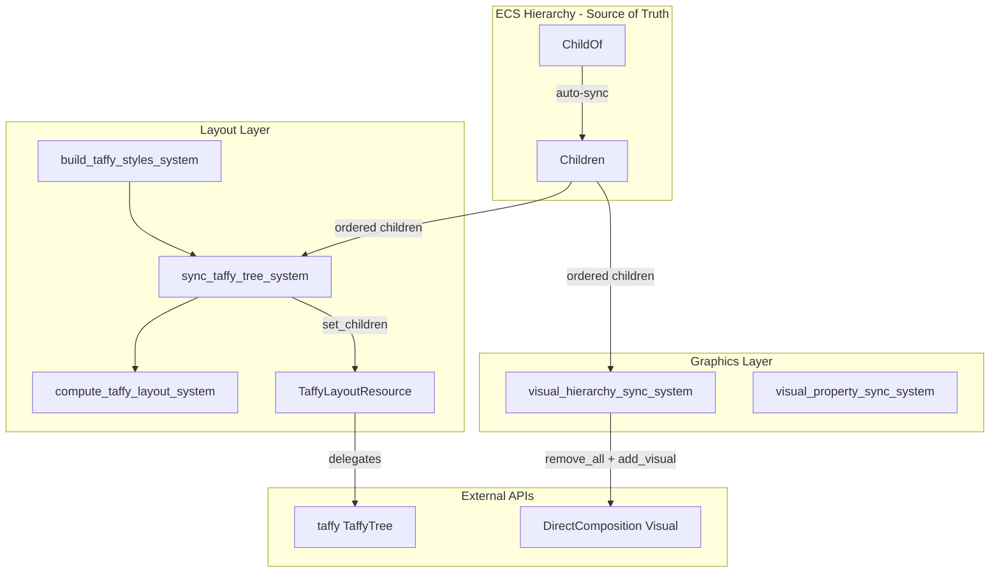
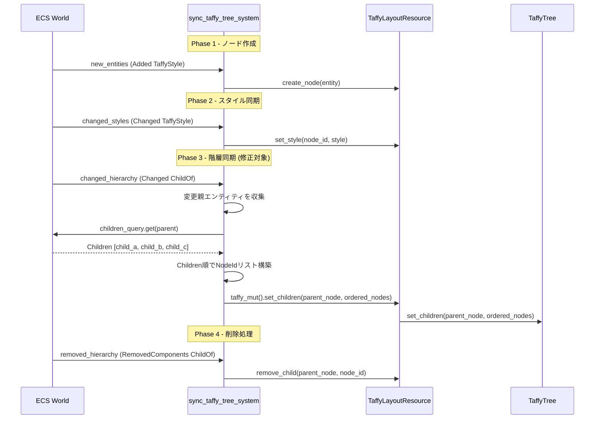
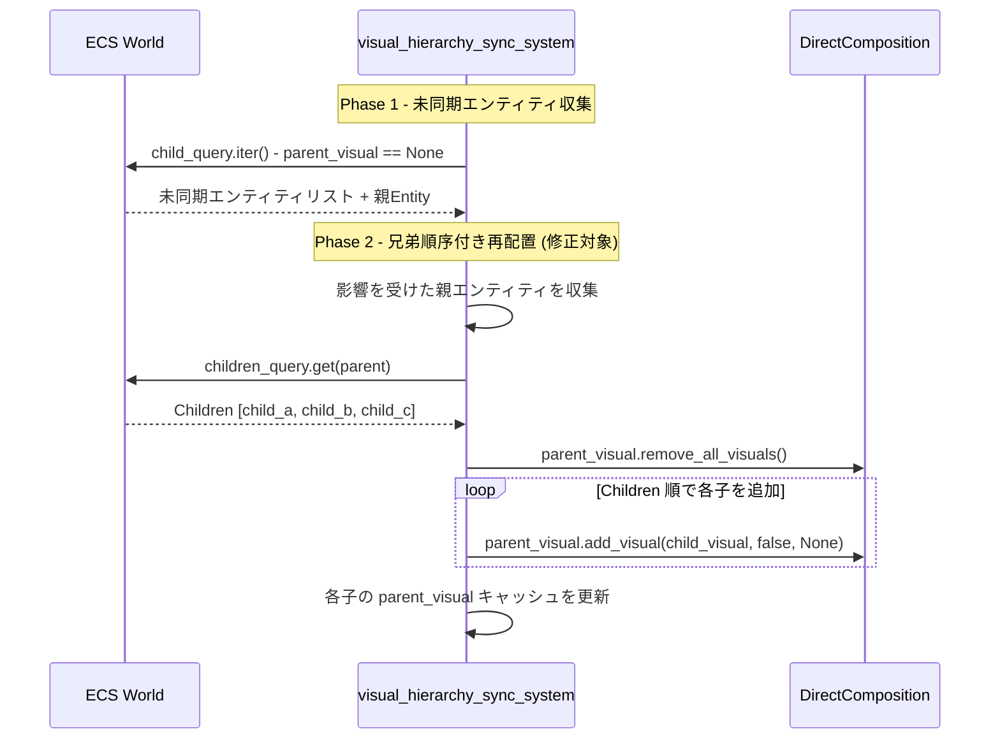

# Design: wintf-taffy-child-order-fix

## Overview

**目的**: `sync_taffy_tree_system` および `visual_hierarchy_sync_system` が `Children` コンポーネントを参照していない問題を修正し、「親子階層は `Children` コンポーネントが権威的ソースである」というアーキテクチャポリシーを両レイヤーに適用する。

**ユーザー**: wintf フレームワーク利用開発者。ECS 階層の spawn 順序どおりにレイアウトと Visual Z-order が保証されることを前提とした UI 構築ワークフローに影響する。

**影響**: レイアウトシステム（`sync_taffy_tree_system`）とグラフィックスシステム（`visual_hierarchy_sync_system`）の階層同期ロジックを修正。既存のシステムシグネチャに `Query<&Children>` パラメータを追加し、子ノード順序の決定方法を変更する。

### Goals
- `Children` コンポーネントの兄弟順序に基づいて taffy ツリーの子ノード順序を設定する
- `Children` コンポーネントの兄弟順序に基づいて DirectComposition Visual の Z-order を設定する
- 異なるアーキタイプを持つ兄弟エンティティでも順序が保証されることを回帰テストで検証する

### Non-Goals
- DComp Visual ツリーの全面的な再設計（既存の `parent_visual` キャッシュ方式は維持）
- taffy レイアウトエンジン自体の変更
- `Children` 順序の動的変更（reorder）API の提供
- パフォーマンス最適化目的のバッチ処理やキャッシュ戦略の導入

## Architecture

### Existing Architecture Analysis

**現行アーキテクチャの制約**:
- レイヤー依存: COM wrapper → ECS components → Message handling の一方向依存
- `sync_taffy_tree_system` は `ResMut<TaffyLayoutResource>` を通じて taffy ツリーを操作
- `visual_hierarchy_sync_system` は `ParamSet` で子/親クエリを分離し、`DCompositionVisualExt` trait 経由で DComp API を呼び出す
- 変更検知: `Changed<ChildOf>` / `parent_visual.is_none()` パターンが確立

**維持すべき統合ポイント**:
- `TaffyLayoutResource` の `entity_to_node` / `node_to_entity` マッピング（変更なし）
- `VisualGraphics` の `parent_visual` キャッシュ方式（on_remove フックでの自動削除）
- `build_taffy_styles_system` → `sync_taffy_tree_system` → `compute_taffy_layout_system` の実行順序

**対処するテクニカルデット**:
- `sync_taffy_tree_system` が `Children` を参照せずに `add_child` で末尾追加している
- `visual_hierarchy_sync_system` が depth ソートのみで兄弟間順序を保証していない

### Architecture Pattern & Boundary Map



**アーキテクチャ統合**:
- 選択パターン: 既存システム拡張（新規コンポーネント・リソース追加なし）
- ドメイン境界: Layout Layer と Graphics Layer は独立して同じ修正パターンを適用
- 維持する既存パターン: `Changed<ChildOf>` 検知、`parent_visual` キャッシュ、`TaffyLayoutResource` マッピング
- 新規コンポーネント: なし（`Query<&Children>` パラメータ追加のみ）
- ステアリング準拠: レイヤー分離（COM → ECS → Message）、型安全性

### Technology Stack

| レイヤー | 選択 / バージョン | 本機能での役割 | 備考 |
|---------|-----------------|--------------|------|
| ECS 基盤 | bevy_ecs 0.18.0 | `Children` コンポーネント、`Query` システム | `Children` は `Deref<Target = [Entity]>` |
| レイアウト | taffy 0.9.2 | `TaffyTree::set_children` による子順序一括設定 | `add_child` から `set_children` に変更 |
| グラフィックス | DirectComposition (windows 0.62.2) | `add_visual`, `remove_all_visuals` による Z-order 制御 | COM wrapper 経由 |
| テスト | Rust 標準テスト + bevy_ecs World | ECS 統合テストで順序検証 | 既存テストパターン流用 |

## System Flows

### sync_taffy_tree_system 修正後フロー



**キーポイント**:
- Phase 3 で `changed_hierarchy.iter()` の反復順序に依存せず、`Children` コンポーネントから順序を取得
- `set_children` はべき等操作であり、同じ順序で再設定しても副作用なし
- `Children` に含まれるが taffy ノードが存在しないエンティティはスキップ

### visual_hierarchy_sync_system 修正後フロー



**キーポイント**:
- 同一親の子が1つでも未同期なら、その親の全子を再配置する
- `remove_all_visuals` + `Children` 順 `add_visual` で Z-order を保証
- `Commit()` までバッチ処理されるため描画フリッカーなし

## Requirements Traceability

| 要件 | サマリー | コンポーネント | インターフェース | フロー |
|------|---------|--------------|---------------|--------|
| 1.1 | Taffy子ノード順序を `Children` に従って設定 | sync_taffy_tree_system | `TaffyTree::set_children` | sync_taffy フロー Phase 3 |
| 1.2 | アーキタイプ反復順序に非依存 | sync_taffy_tree_system | `Query<&Children>` | sync_taffy フロー Phase 3 |
| 2.1 | Visual Z-order を `Children` に従って配置 | visual_hierarchy_sync_system | `remove_all_visuals` + `add_visual` | visual_hierarchy フロー Phase 2 |
| 2.2 | 同じ根本原因の修正パターン適用 | visual_hierarchy_sync_system | `Query<&Children>` | visual_hierarchy フロー Phase 2 |
| 3.1 | 異なるアーキタイプ兄弟の taffy 順序テスト | テストスイート | `TaffyTree::children` | — |
| 3.2 | taffy_flex_demo 相当シナリオテスト | テストスイート | ECS Schedule 実行 | — |
| 3.3 | Visual 階層の兄弟順序テスト | テストスイート | ECS 更新リスト検証 | — |

## Components and Interfaces

| コンポーネント | ドメイン/レイヤー | 意図 | 要件カバレッジ | 主要依存 | コントラクト |
|--------------|----------------|------|-------------|---------|------------|
| sync_taffy_tree_system | Layout | ECS階層をtaffyツリーに同期 | 1.1, 1.2 | TaffyLayoutResource (P0), Children (P0) | State |
| visual_hierarchy_sync_system | Graphics | ECS階層をDComp Visualツリーに同期 | 2.1, 2.2 | VisualGraphics (P0), Children (P0), DCompositionVisualExt (P0) | State |
| テストスイート | Testing | 回帰防止テスト | 3.1, 3.2, 3.3 | TaffyLayoutResource (P1), bevy_ecs World (P1) | — |

### Layout Layer

#### sync_taffy_tree_system

| フィールド | 詳細 |
|----------|------|
| 意図 | ECS の `ChildOf`/`Children` 階層を taffy レイアウトツリーに同期する |
| 要件 | 1.1, 1.2 |

**責務と制約**
- `Changed<ChildOf>` から変更があったエンティティの親を収集し、各親の `Children` を参照して taffy の子順序を `set_children` で一括設定する
- `Children` に含まれるがtaffyノードが未作成のエンティティはスキップする
- ノード作成（Phase 1）・スタイル同期（Phase 2）・階層同期（Phase 3）・削除処理（Phase 4）の実行順序を維持する

**依存**
- Inbound: `build_taffy_styles_system` — TaffyStyle 作成後に実行 (P0)
- Outbound: `TaffyLayoutResource` — `get_node`, `taffy_mut().set_children` (P0)
- External: `taffy::TaffyTree` — `set_children(NodeId, &[NodeId])` API (P0)

**コントラクト**: State [x]

##### State Management

**現行システムシグネチャ**:
```rust
pub fn sync_taffy_tree_system(
    mut taffy_res: ResMut<TaffyLayoutResource>,
    new_entities: Query<(Entity, Option<&ChildOf>), Added<TaffyStyle>>,
    changed_styles: Query<(Entity, &TaffyStyle), Changed<TaffyStyle>>,
    changed_hierarchy: Query<(Entity, Option<&ChildOf>), Changed<ChildOf>>,
    mut removed_hierarchy: RemovedComponents<ChildOf>,
)
```

**修正後システムシグネチャ**:
```rust
pub fn sync_taffy_tree_system(
    mut taffy_res: ResMut<TaffyLayoutResource>,
    new_entities: Query<(Entity, Option<&ChildOf>), Added<TaffyStyle>>,
    changed_styles: Query<(Entity, &TaffyStyle), Changed<TaffyStyle>>,
    changed_hierarchy: Query<(Entity, Option<&ChildOf>), Changed<ChildOf>>,
    mut removed_hierarchy: RemovedComponents<ChildOf>,
    children_query: Query<&Children>,  // 追加
)
```

**Phase 3 のコントラクト**:
- 前提条件: Phase 1 でノード作成済み
- 事後条件: 変更があった各親の taffy 子ノードリストが `Children` の順序と一致
- 不変条件: `entity_to_node` / `node_to_entity` マッピングは変更されない

**Implementation Notes**
- 統合: Phase 3 の `for (entity, child_of) in changed_hierarchy.iter()` ループの後に、収集した親エンティティ集合に対して `children_query.get(parent)` → `set_children` を実行
- 検証: `Children` 内の各エンティティに対して `get_node` を呼び、`Some` のもののみ `NodeId` リストに含める
- リスク: `Changed<ChildOf>` が発火するが `Children` がまだ更新されていないケース → bevy_ecs 0.18.0 では同一フレーム内で伝播されるため問題なし（`research.md` 調査 3 参照）

### Graphics Layer

#### visual_hierarchy_sync_system

| フィールド | 詳細 |
|----------|------|
| 意図 | ECS の `ChildOf`/`Children` 階層を DirectComposition Visual ツリーに同期する |
| 要件 | 2.1, 2.2 |

**責務と制約**
- `parent_visual.is_none()` で検出した未同期エンティティの親を収集し、影響を受けた親ごとに `remove_all_visuals` + `Children` 順 `add_visual` を実行する
- `Children` に含まれるが `VisualGraphics` を持たないエンティティはスキップする
- 親→子の方向（depth 浅い順）で処理する既存の制約を維持する

**依存**
- Inbound: `init_visual_graphics_system` — VisualGraphics 作成後に実行 (P0)
- Outbound: `DCompositionVisualExt` — `remove_all_visuals`, `add_visual` (P0)
- External: DirectComposition — `IDCompositionVisual::AddVisual`, `RemoveAllVisuals` (P0)

**コントラクト**: State [x]

##### State Management

**現行システムシグネチャ**:
```rust
pub fn visual_hierarchy_sync_system(
    mut vg_queries: ParamSet<(
        Query<(Entity, &ChildOf, &mut VisualGraphics, Option<&Name>)>,
        Query<(&VisualGraphics, Option<&Name>)>,
    )>,
    child_of_query: Query<&ChildOf>,
)
```

**修正後システムシグネチャ**:
```rust
pub fn visual_hierarchy_sync_system(
    mut vg_queries: ParamSet<(
        Query<(Entity, &ChildOf, &mut VisualGraphics, Option<&Name>)>,
        Query<(&VisualGraphics, Option<&Name>)>,
    )>,
    child_of_query: Query<&ChildOf>,
    children_query: Query<&Children>,  // 追加
)
```

**Phase 2 のコントラクト**:
- 前提条件: Phase 1 で未同期エンティティと影響親を収集済み
- 事後条件: 影響を受けた各親の DComp Visual 子リストが `Children` の順序と一致、各子の `parent_visual` キャッシュが更新済み
- 不変条件: `parent_visual.is_some()` の既同期エンティティは影響を受けない（影響親の子は除く）

**Implementation Notes**
- 統合: Phase 1 の未同期エンティティ収集後、`affected_parents: HashSet<Entity>` を構築。Phase 2 冒頭で各 affected_parent に対して `remove_all_visuals` を実行し、`Children` 順で `add_visual` を再実行
- 検証: `Children` 内の各エンティティについて `vg_queries.p0()` で `VisualGraphics` を取得。`visual()` が `Some` のもののみ `add_visual` 対象
- リスク: `remove_all_visuals` 後に `add_visual` が失敗した場合、子 Visual が欠落する → 既存コードと同じエラー無視パターン（`error!` ログ + 続行）を適用

## Data Models

本機能では新規データモデルの導入はない。既存のデータ構造に対する操作方法の変更のみ。

### Domain Model

**変更なし。以下は参照用の既存モデル**:

- `Children` コンポーネント: `SmallVec<[Entity; 8]>` — 兄弟順序の権威的ソース（bevy_ecs 管理、読み取り専用）
- `TaffyLayoutResource`: `entity_to_node: HashMap<Entity, NodeId>` — Entity ↔ NodeId の双方向マッピング
- `VisualGraphics`: `inner: Option<IDCompositionVisual3>`, `parent_visual: Option<IDCompositionVisual3>` — Visual 参照とキャッシュ

### Data Contracts & Integration

**API 操作の変更**:

| 操作 | 現行 | 修正後 |
|------|------|--------|
| taffy 子ノード設定 | `add_child(parent, child)` × N 回（反復順） | `set_children(parent, &[children_in_order])` × 1 回（`Children` 順） |
| DComp Visual 追加 | `add_visual(child, false, None)` × N 回（depth ソート順） | `remove_all_visuals()` + `add_visual(child, false, None)` × N 回（`Children` 順） |

## Error Handling

### Error Strategy

既存のエラーハンドリングパターンを継承。新規エラー型の導入は不要。

### Error Categories and Responses

| カテゴリ | 状況 | 対応 |
|---------|------|------|
| タffy ノード未作成 | `Children` に含まれるが `get_node` が `None` | スキップ（レイアウト非参加エンティティ） |
| Visual 未作成 | `Children` に含まれるが `VisualGraphics` が未初期化 | スキップ（Visual 未生成エンティティ） |
| `set_children` 失敗 | taffy 内部エラー | `let _ =` で無視（既存パターン） |
| `add_visual` / `remove_all_visuals` 失敗 | COM エラー | `error!` ログ + 続行（既存パターン） |

## Testing Strategy

### 単体テスト（taffy ツリー順序）

1. **異なるアーキタイプの兄弟順序テスト** (R3-AC1): 同一親に異なるコンポーネント構成の子を spawn し、`taffy().children()` の順序が `Children` と一致することを検証
2. **taffy_flex_demo 相当シナリオ** (R3-AC2): 3つの子のうち1つに追加コンポーネントを付与（アーキタイプ変更）し、レイアウト計算結果の Y 座標が spawn 順序に従うことを検証
3. **動的階層変更テスト**: 子の追加・削除後に `set_children` で順序が正しく再設定されることを検証

### 統合テスト（Visual 階層順序）

4. **Visual 階層の兄弟順序テスト** (R3-AC3): ECS レベルで `visual_hierarchy_sync_system` 実行後の更新リスト（`add_visual` 呼び出し順序）が `Children` の順序と一致することを検証
5. **VisualGraphics を持たない子のスキップテスト**: `Children` に含まれるが `VisualGraphics` を持たないエンティティが安全にスキップされることを検証

> Visual 階層テスト (R3-AC3) は DirectComposition COM オブジェクトを必要とするため、実際のGPU依存の部分はE2Eテスト（examples）で確認し、単体テストではECSレベルの更新データ構造を検証する。

