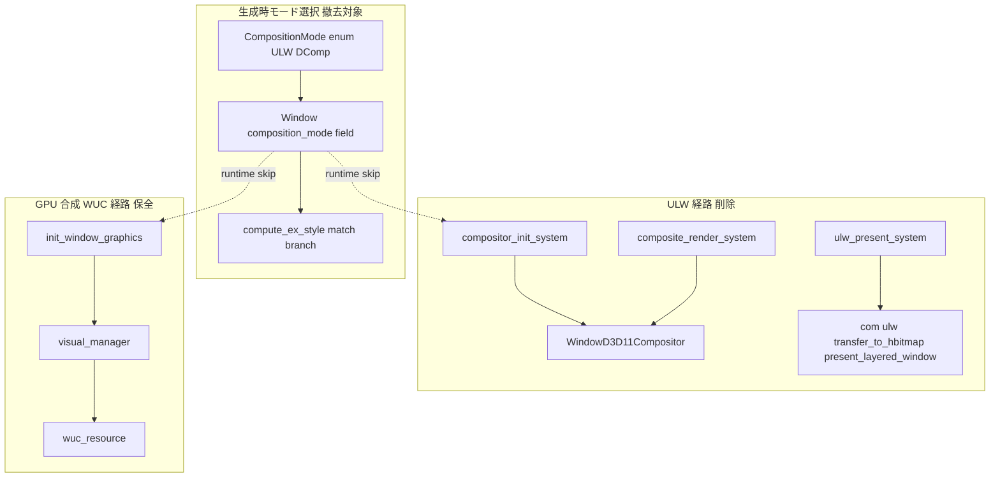
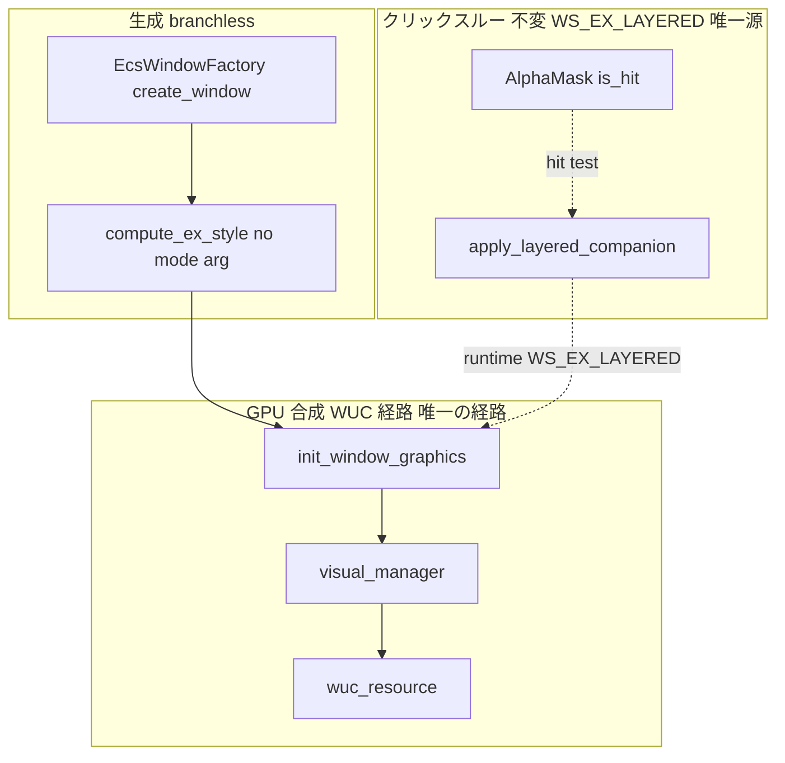
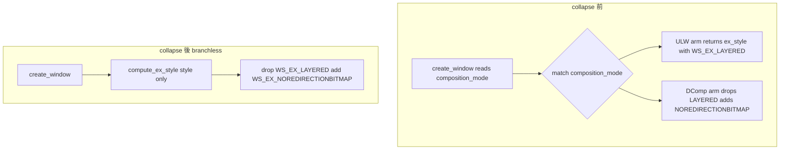

# Design Document

## Overview

**Purpose**: wintf の表示バックエンドを **GPU 合成（WUC）単独**へ collapse し、GPU 合成と併用不能な ULW（`UpdateLayeredWindow`）CPU ビットマップ経路と、その選択機構である `CompositionMode` 切替 API を wintf/areka から**完全撤去**する。本仕様は純粋な削除リファクタであり、残す GPU 合成パスの描画結果・当たり判定・ウィンドウ管理・スレッド構成を一切変えない。

**Users**: wintf 保守者（表示レイヤーの重複経路・切替分岐が消え保守面が単純化する）と areka 利用者（撤去前後で見た目・クリックスルー挙動が不変）。着手予定の後続 spec `areka-P0-emo-present`／`areka-P0-window-placement` は、本仕様が collapse した**新 API（`composition_mode` フィールドなし）**を前提に書き起こす（本仕様が front-run する）。

**Impact**: 現状の表示バックエンドは `CompositionMode`（`ULW`＝既定／`DComp`）の 2 択で、生成時に `compute_ex_style()` が分岐し、ECS スケジュールには ULW 系 system（`compositor_init_system`・`composite_render_system`・`ulw_present_system`）と GPU 合成系（`init_window_graphics`＝WUC）が**同一スケジュールに共存**する二重経路構造だった。本仕様はこの二重構造を GPU 合成 1 本へ潰し、ULW 専用の 3 ファイル（`compositor.rs`・`compositor_systems/`・`com/ulw.rs`）を削除、`CompositionMode` 型・`Window.composition_mode` フィールド・`composition_mode()` メソッドを撤去し、生成時の合成モードを GPU 合成（WUC）へ無条件固定する。

### Goals

- ULW 専用描画経路（合成器・present・ユーティリティ）を wintf crate から完全に消す（残存シンボルゼロ）。
- `CompositionMode` を **Option A（enum 完全撤去）**で collapse し、生成時分岐を branchless な単一経路にする。
- 撤去に伴う wintf 内・areka 側・examples・tests の全呼び出しを新 API へ追随させ、ビルドを通過させる。
- 残す GPU 合成（WUC）パスの描画結果・当たり判定・ウィンドウ管理・スレッド構成・tick 順序を byte-for-byte 不変に保つ。

### Non-Goals

- DComp→WUC 差し替え（別 spec `wintf-dcomp-to-wuc-migration`＝完了済み・残す側。`com/wuc.rs`・`ecs/graphics/wuc_resource.rs`・`visual_manager.rs`・`systems/init.rs::init_window_graphics` は撤去対象外）。
- クリックスルー機構の実装（`wintf-clickthrough-alpha-toggle`＝完了済み）。`win_style.rs`・`ecs/clickthrough/` は不変。
- 当たり判定（hit-test / α マスク）・ウィンドウ管理・スレッド構成の変更、新機能追加、GPU 合成パスの挙動変更・最適化。
- steering（`tech.md`／`product.md`／`roadmap.md`）の「ULW 一択」記述更新（2026-07-01〜03 に更新済み・本仕様スコープ外）。
- 新規スクリーンショット比較資産・production readback フックの追加（Req6.5・後述の非破壊検証方針）。

## Boundary Commitments

### This Spec Owns

- **ULW 専用描画経路の削除**: `ecs/graphics/compositor.rs`（`WindowD3D11Compositor`）・`ecs/graphics/compositor_systems/`（`compositor_init_system`・`composite_render_system`・`ulw_present_system` を含むディレクトリ全体）・`com/ulw.rs`（`transfer_to_hbitmap`・`present_layered_window`）。
- **ECS スケジュール登録の再配線**: `ecs/world/mod.rs` の `GraphicsSetup`／`Composition`／`CommitComposition` から ULW system 登録を除去（GPU 合成側 system の登録・順序は不変）。
- **`CompositionMode` collapse（Option A）**: `CompositionMode` enum 型・`Window.composition_mode` フィールド・`Window::composition_mode()` メソッドの完全撤去。生成時の合成モードを GPU 合成（WUC）へ無条件固定。
- **`compute_ex_style()` の分岐一本化**: `runtime/window_factory.rs` の `compute_ex_style()` から合成モード引数と `match` を除去し、`WS_EX_LAYERED` を落とし `WS_EX_NOREDIRECTIONBITMAP` を付与する branchless 単一経路へ。
- **破壊的変更の追随**: wintf 内（`window_proc/lifecycle.rs` の `WM_PAINT` 分岐・`ecs/clickthrough/controller.rs` の test ヘルパ・ULW 前提 examples/tests）と areka 側（`main.rs` の構造体リテラル・`tests.rs` の assert）の全呼び出しを新 API へ追随。
- **ドキュメント残余整合**: `doc/COMPAT_ARCHITECTURE.md` と残存 wintf コード内コメントの ULW 前提記述の整合更新。

### Out of Boundary

- WUC 保全集合（`com/wuc.rs`・`ecs/graphics/wuc_resource.rs`・`visual_manager.rs`・`systems/init.rs::init_window_graphics`・`systems/render.rs`・`systems/window_pos.rs`）— 別 spec の完了物、参照追随以外は変更しない。
- クリックスルー機構（`win_style.rs::apply_layered_companion()`・`apply_click_through()`・`ecs/clickthrough/` の production コード・`registry.rs`）— 変更・除去しない。
- 当たり判定・ウィンドウ管理・スレッド構成・tick スケジュール**構成**（13 本の schedule label とその実行順）。
- steering 文書・ワークスペース `Cargo.toml`（`opt-level='z'`・`lto=true`・`panic='unwind'`）。

### Allowed Dependencies

- **前提依存（完了済み）**: `wintf-clickthrough-alpha-toggle`（ULW 無しでも別プロセスクリック透過が GPU 合成のまま成立する安全網）。`wintf-dcomp-to-wuc-migration`（残す GPU 合成パスを WUC 化済み）。
- **`WS_EX_LAYERED` の唯一源**: ULW 撤去後、GPU 合成窓への `WS_EX_LAYERED` はクリックスルー機構（`win_style.rs::apply_layered_companion()`・controller から実行時付与）のみが源となる。本仕様はこの経路に依存するが変更しない。
- **クリックスルー α 源**: per-widget α マスク（`AlphaMask::is_hit`／`hit_test_in_window`）のみ。撤去される ULW compositor の staging α バッファへは依存しない（実査確認済み）。

### Revalidation Triggers

- **`Window` 構造体シェイプ変更（`composition_mode` フィールド削除）**: `Window { composition_mode: ... }` を書く全 consumer（areka `main.rs`・後続 `areka-P0-emo-present`／`areka-P0-window-placement`）は新 API へ追随が必要。本仕様が front-run するため後続は collapse 後に書き起こす。
- **`CompositionMode` 型・`composition_mode()` メソッド消滅**: import/呼び出しを持つ全コードは再検証が必要。
- **`compute_ex_style()` シグネチャ変更（引数 `composition_mode` 削除）**: 呼び出し側（`EcsWindowFactory::create_window`）の追随が必要。
- **`CommitComposition` schedule の空化**: schedule label と 13 本構成は維持するため tick 順序 consumer への波及は無いが、`CommitComposition` に新 system を登録する consumer が現れた場合は要再検証。

## Architecture

### Existing Architecture Analysis

現状の二重経路構造を以下に示す。ULW 系と GPU 合成（WUC）系は同一スケジュールに共存し、各 system が実行時に `composition_mode()` を照会して「自モードでない Window を `continue` でスキップ」する。ULW 専用コードは 3 ファイルに凝集し、切り出し境界は明瞭で、DComp/WUC 経路から参照されない。



### Architecture Pattern & Boundary Map

collapse 後の目標構造は、モード選択層が消滅し GPU 合成（WUC）経路のみが残る単一経路である。



**Architecture Integration**:
- **Selected pattern**: Single-path collapse（切替 API を持たない branchless 生成）。削除リファクタのため新規パターンは導入しない。
- **Domain/feature boundaries**: 描画層（撤去対象）／クリックスルー層（不変）／WUC 保全集合（不変）を明確に分離。撤去のブラスト半径は WUC 保全集合とクリックスルー層に触れない（実査確認済み）。
- **Existing patterns preserved**: WUC 合成パイプライン、ECS の 13 本 schedule 構成と実行順、クリックスルーの `WS_EX_LAYERED` 実行時付与経路、`AlphaMask` ベースの hit-test。
- **New components rationale**: 新規コンポーネントなし（純粋削除）。
- **Steering compliance**: Rust 2024・`windows` 0.62.2 系・tokio 禁止（`tech.md`）。x64+arm64 本体（i686 検証は課さない＝host-32 系専用）。リリース最適化（`opt-level='z'`・`lto=true`）互換。

### Technology Stack

| Layer | Choice / Version | Role in Feature | Notes |
|-------|------------------|-----------------|-------|
| Infrastructure / Runtime | Rust 2024, `windows` 0.62.2 | 削除対象コードの言語・Win32 バインディング | 新規依存追加ゼロ。削除により `UpdateLayeredWindow`・`transfer_to_hbitmap` 経由の GDI/DIBSection 依存が消える |
| Rendering | Windows.UI.Composition（WUC） | 残す唯一の GPU 合成パス | 撤去対象外（`wintf-dcomp-to-wuc-migration` 完了物） |
| ECS | bevy_ecs | schedule 再配線（ULW system 登録除去） | 13 本 schedule 構成・実行順は不変 |

> 削除のみのため外部依存調査は不要。詳細は `research.md` の Design Decisions を参照。

## File Structure Plan

### 完全削除（ファイル・ディレクトリ単位）

```
crates/wintf/src/
├── ecs/graphics/
│   ├── compositor.rs                    # 削除: WindowD3D11Compositor（ULW 合成器）
│   └── compositor_systems/              # 削除: ディレクトリ全体（ULW 専用 system 群）
│       ├── mod.rs
│       ├── init.rs                      #   compositor_init_system
│       └── render/
│           ├── mod.rs                   #   composite_render_system・ulw_present_system
│           ├── traverse.rs
│           └── guards.rs
└── com/
    └── ulw.rs                           # 削除: transfer_to_hbitmap・present_layered_window
crates/wintf/tests/
├── graphics/
│   ├── compositor_init_system_test.rs   # 削除: ULW compositor 専用単体テスト
│   ├── compositor_integration_test.rs   # 削除
│   ├── compositor_lifecycle_test.rs     # 削除
│   ├── compositor_opacity_test.rs       # 削除
│   ├── compositor_render_system_test.rs # 削除
│   └── compositor_transfer_test.rs      # 削除
└── window/
    └── find_owner_composition_mode_test.rs  # 削除（下記 D8 参照）
crates/wintf/examples/
├── ulw_twin_demo.rs                     # 削除: ULW 二窓比較が主題
├── ulw_debug_demo.rs                    # 削除: UpdateLayeredWindow 検証が主題
└── multi_backend_demo.rs                # 削除: ULW/DComp 二本立てが主題
```

### 編集（再配線・追随）

- `crates/wintf/src/ecs/graphics/mod.rs` — `pub mod compositor;`・`pub mod compositor_systems;` の mod 宣言（4-5 行）除去。
- `crates/wintf/src/com/mod.rs` — `pub mod ulw;` の mod 宣言（5 行）除去。
- `crates/wintf/src/ecs/world/mod.rs` — スケジュール登録の再配線: `GraphicsSetup`（259-266 行）から `compositor_init_system.after(...)` を外し `init_window_graphics` 単独へ／`Composition`（321-332 行）から末尾 `composite_render_system.after(clip_sync_system)` を外す／`CommitComposition`（337-340 行）を**空登録**にする（schedule label と `Schedule::new(CommitComposition)`・137-141 行は残す＝D3）。付随コメント（256-258・334-336 行）を WUC 現況へ整合。
- `crates/wintf/src/ecs/window/components.rs` — `CompositionMode` enum 定義（99-108 行）削除／`Window.composition_mode` フィールド（123 行）・`Window::composition_mode()`（128-130 行）・`Window::default` の `composition_mode`（138 行）削除／`WindowStyle::default().ex_style` は `WS_EX_LAYERED` を据え置き（D4）／in-source `#[cfg(test)]` の ULW 既定 assert を追随。ULW 前提コメント（101-107・121-122・168-176 行）整合。
- `crates/wintf/src/runtime/window_factory.rs` — `compute_ex_style()`（64-73 行）を `fn compute_ex_style(style: &WindowStyle) -> WINDOW_EX_STYLE` へ改め、`(style.ex_style & !WS_EX_LAYERED) | WS_EX_NOREDIRECTIONBITMAP` を branchless に返す。呼び出し側 `EcsWindowFactory::create_window` の `composition_mode` 読み取り・引数渡し除去。docstring（17-19・57-63 行）と in-source test（ULW test 削除・DComp test 残置）整合。`use ... CompositionMode` 除去。
- `crates/wintf/src/ecs/window_proc/lifecycle.rs` — `WM_PAINT`（36-72 行）を DComp 分岐（`DefWindowProcW` 委譲＝`None` 返却）へ無条件一本化し、ULW フォールバック分岐（`BeginPaint`/`EndPaint`）と `composition_mode()` 照会を除去。`WM_ERASEBKGND` コメント（22-24 行）と `WM_PAINT` docstring（36-39 行）整合。
- `crates/wintf/src/ecs/clickthrough/controller.rs` — in-source test ヘルパ `spawn_live_window`（922-940 行付近）の `CompositionMode::DComp` 使用を新 API（フィールド指定なし）へ追随。**production コードは不変**。
- `crates/wintf/tests/graphics.rs` — 削除する `compositor_*_test` 6 本の `#[path]` mod 宣言（12-23 行）除去。
- `crates/wintf/tests/window.rs` — `composition_mode_test`（2-3 行）・`find_owner_composition_mode_test`（4-5 行）の `#[path]` mod 宣言除去（後者は削除・前者は D8 で扱う）。
- `crates/wintf/tests/window/composition_mode_test.rs` — ULW 既定 hard-assert（`default_is_ulw` 等）が collapse で意味喪失。ファイル削除するか、GPU 合成固定の意味へ書き換え（D8）。
- `crates/wintf/tests/graphics/dcomp_integration_test.rs`・`init_window_graphics_test.rs` — `CompositionMode` 参照の追随（フィールド指定除去）。WUC 側テストの本体ロジックは不変。
- `crates/wintf/examples/clip_demo.rs` — `create_ulw_clip_window`（87・262・282 行）を除去し clip 検証を DComp 単独へ書き換え（D5）。
- `crates/wintf/examples/dcomp_demo.rs`・`dcomp_taffy_demo.rs` — `composition_mode: CompositionMode::DComp` フィールド指定と `use ... CompositionMode` 除去（フィールド消滅の追随）。
- `crates/wintf/examples/postmessage_click_test.rs` — `Window { .. }` の既定生成は不変（新既定=WUC）。ULW present 言及コメントの整合。
- `crates/areka/src/main.rs` — `composition_mode: CompositionMode::DComp`（225・292 行）除去／`use ... CompositionMode`（29 行）除去。`WindowStyle.ex_style` は据え置き（factory が `WS_EX_LAYERED` を落とすため実害なし）。
- `crates/areka/src/tests.rs` — `assert_eq!(window.composition_mode(), CompositionMode::DComp)`（108・118 行）の 2 テストを削除または「WUC 固定」の別観測へ書き換え（メソッド消滅の追随）。
- `doc/COMPAT_ARCHITECTURE.md` — ULW を残存機構として前提する記述（44・99・105 行）と「非スコープ（残置）: ULW アーム…除去は別 spec `wintf-ulw-removal`」（108 行）を「除去済み・GPU 合成単独」へ整合。

### 絶対不変（Preserve・巻き込み禁止）

- `crates/wintf/src/win_style.rs`（`apply_layered_companion`・`apply_click_through`）。
- `crates/wintf/src/ecs/clickthrough/`（controller production コード・`registry.rs`）。
- `crates/wintf/src/com/wuc.rs`・`ecs/graphics/wuc_resource.rs`・`ecs/graphics/visual_manager.rs`・`ecs/graphics/systems/init.rs`（`init_window_graphics`）・`systems/render.rs`・`systems/window_pos.rs`。
- `crates/wintf/src/ecs/world/schedule_labels.rs`（`CommitComposition` label 定義を含む 13 本 schedule label）。
- steering（`tech.md`・`product.md`・`roadmap.md`）・ワークスペース `Cargo.toml`。

## System Flows

### 生成時 ex_style 算出（collapse 前後）



collapse 後は分岐が消え、`compute_ex_style` は生成時に `WS_EX_LAYERED` を付与しない（Req4.3）。`WS_EX_LAYERED` は以降クリックスルー機構が実行時にのみ付与する。

### tick スケジュール構成の不変性（D3 の核）

`try_tick_world` は 13 本の schedule（`Input … CommitComposition … FrameFinalize`）を固定順で回す。`CommitComposition` schedule は `Schedule::new(CommitComposition)` として独立に生成され（`ecs/world/mod.rs` 137-141 行）、tick で無条件に `try_run_schedule(CommitComposition)` される（532 行）。ULW system 撤去後、`CommitComposition` は**登録 system を持たない空スケジュール**になるが、schedule label・生成・tick 呼び出しは残すため、`tick_order_tests` の 13 本固定列（`EXPECTED_ORDER`・612 行）と実行順は不変に保たれる。空スケジュールの実行は no-op で合法（`try_run_schedule` は登録 system ゼロでも成立）。

## Requirements Traceability

| Requirement | Summary | Components | Flows |
|-------------|---------|------------|-------|
| 1.1 | `WindowD3D11Compositor` を含まない | `compositor.rs` 削除 | File Structure Plan |
| 1.2 | ULW system 群を含まない | `compositor_systems/` 削除 | File Structure Plan |
| 1.3 | `com/ulw.rs` ユーティリティを含まない | `com/ulw.rs` 削除・`com/mod.rs` mod 宣言除去 | File Structure Plan |
| 1.4 | 撤去対象を事前提示（推測で消さない） | impl 時プロセスゲート（下記 Impl Notes） | — |
| 1.5 | ULW 専用シンボルの残存参照ゼロ | 全 mod 宣言・import・呼び出し除去 | grep 検証（Testing） |
| 2.1 | ULW system の schedule 登録除去 | `world/mod.rs` `GraphicsSetup`/`CommitComposition` 再配線 | tick 構成不変フロー |
| 2.2 | GPU 合成側 schedule 登録を不変に保つ | `world/mod.rs` `init_window_graphics`・`Composition` 先行 3 system 保全 | tick 構成不変フロー |
| 2.3 | 撤去後ビルド通過・schedule 矛盾なし | 空 `CommitComposition` 維持 | `tick_order_tests` |
| 3.1 | `CompositionMode` が ULW variant を持たない | enum 削除（Option A） | ex_style フロー |
| 3.2 | `CompositionMode` enum 型を完全撤去 | `components.rs` enum 削除 | — |
| 3.3 | `Window.composition_mode`・`composition_mode()` 撤去、WUC 無条件固定 | `components.rs` フィールド/メソッド削除 | 生成フロー |
| 3.4 | wintf 内全呼び出しの追随・ビルド通過 | `window_factory`・`lifecycle`・`controller` test・examples/tests | — |
| 3.5 | areka 側呼び出しの追随・ビルド通過 | `main.rs`・`tests.rs` | — |
| 4.1 | `compute_ex_style` が mode 引数・match を持たない | `window_factory.rs::compute_ex_style` 改修 | ex_style フロー |
| 4.2 | GPU 合成 ex_style を branchless 単一経路で返す | 同上（DComp 分岐と等価） | ex_style フロー |
| 4.3 | 生成時に `WS_EX_LAYERED` を付与しない | 同上 | ex_style フロー |
| 5.1 | クリックスルー機構が実行時に `WS_EX_LAYERED` 付与 | `win_style.rs`（Preserve） | クリックスルー境界 |
| 5.2 | `apply_layered_companion()` 経路を変更・除去しない | `ecs/clickthrough/`（Preserve） | — |
| 5.3 | 撤去後もクリックスルー挙動が不変 | 起動サニティ（Testing） | — |
| 5.4 | α 源は per-widget α マスクのみ（staging α 非依存） | `AlphaMask::is_hit`（Preserve） | — |
| 6.1 | 起動時に撤去前と同一描画 | WUC 保全集合（Preserve）＋起動サニティ | — |
| 6.2 | 再描画結果が撤去前と等価 | WUC 描画パス（Preserve） | — |
| 6.3 | 当たり判定・ウィンドウ管理・スレッド構成不変 | 撤去は描画層のみ | — |
| 6.4 | リリース最適化設定と互換ビルド | `Cargo.toml`（Preserve）＋release ビルド検証 | Testing |
| 6.5 | 手間の少ない非破壊確認（新規スクショ資産を必達としない） | 既存 WUC/areka テスト緑＋起動目視 | Testing |
| 7.1 | `COMPAT_ARCHITECTURE.md` を GPU 合成単独へ整合 | doc 編集 | — |
| 7.2 | wintf コード内コメントの ULW 残余除去 | `components`・`lifecycle`・`window_factory`・`world/mod` コメント整合 | — |
| 7.3 | steering の再更新を行わない | steering（Preserve） | — |

## Components and Interfaces

削除リファクタのため新規コンポーネントは無い。以下は**改修される既存インターフェースの契約**を、collapse 前後の差分として示す。

| Component | Domain/Layer | Intent | Req Coverage | Key Dependencies | Contracts |
|-----------|--------------|--------|--------------|------------------|-----------|
| `compute_ex_style` | Runtime / window factory | 生成時 ex_style を branchless 算出 | 4.1, 4.2, 4.3 | `WindowStyle`（P0） | Service |
| `Window` | ECS / window components | ウィンドウ生成パラメータ（`composition_mode` フィールド撤去） | 3.1, 3.3 | — | State |
| `CommitComposition` schedule | ECS / world | 空スケジュール維持（tick 構成不変） | 2.1, 2.3 | schedule labels（P0） | State |
| `WM_PAINT` handler | ECS / window_proc | 再描画委譲の DComp 一本化 | 3.4 | `DefWindowProcW`（P0） | Service |

### Runtime / window factory

#### compute_ex_style

| Field | Detail |
|-------|--------|
| Intent | 生成時の拡張ウィンドウスタイルを合成モード非依存で算出する純関数 |
| Requirements | 4.1, 4.2, 4.3 |

**Responsibilities & Constraints**
- collapse 前: `fn compute_ex_style(composition_mode: CompositionMode, style: &WindowStyle) -> WINDOW_EX_STYLE`（ULW/DComp の 2 アーム）。
- collapse 後: `fn compute_ex_style(style: &WindowStyle) -> WINDOW_EX_STYLE`（引数から `composition_mode` を除去、branchless）。
- 返す値は撤去前の DComp アームと byte-for-byte 等価（`WS_EX_LAYERED` を落とし `WS_EX_NOREDIRECTIONBITMAP` を付与）。
- 生成時に `WS_EX_LAYERED` を付与しない（Req4.3）。

**Dependencies**
- Inbound: `EcsWindowFactory::create_window` — 生成時 ex_style 算出（P0）。
- External: `windows` `WS_EX_LAYERED`・`WS_EX_NOREDIRECTIONBITMAP`（P0）。

**Contracts**: Service [x]

##### Service Interface
```rust
// collapse 後
fn compute_ex_style(style: &WindowStyle) -> WINDOW_EX_STYLE;
```
- Preconditions: `style` は有効な `WindowStyle`（`ex_style` は `WS_EX_LAYERED` を含みうる）。
- Postconditions: 返り値は `(style.ex_style & !WS_EX_LAYERED) | WS_EX_NOREDIRECTIONBITMAP`。`WS_EX_LAYERED` ビットは常に落ちる。
- Invariants: 合成モードに依存しない（分岐なし）。

**Implementation Notes**
- Integration: 呼び出し側 `create_window` から `composition_mode` の World 読み取りと引数渡しを除去する。
- Validation: in-source test の DComp ケース（`ex_style_dcomp_*`）を残置し、唯一経路の回帰検知に用いる。ULW ケース（`ex_style_ulw_keeps_layered`）は削除。
- Risks: `WindowStyle::default().ex_style = WS_EX_LAYERED`（D4 で据え置き）でも factory が落とすため実害なし。

### ECS / window components

#### Window（composition_mode 撤去）

| Field | Detail |
|-------|--------|
| Intent | ウィンドウ生成パラメータから合成モード選択を撤去し WUC 固定にする |
| Requirements | 3.1, 3.2, 3.3 |

**Responsibilities & Constraints**
- `CompositionMode` enum 型を削除（Option A）。
- `Window` から `composition_mode` フィールドと `composition_mode()` メソッドを削除。`Window::default` から `composition_mode` 初期化を削除。
- 生成時の合成モードは GPU 合成（WUC）へ無条件固定（モード選択の概念自体が消える）。

**Contracts**: State [x]

##### State Management
- State model: `Window { title, parent }`（`composition_mode` フィールド消滅）。
- 破壊的変更: `Window { composition_mode: ... }` を書く全 consumer は追随が必要（Revalidation Triggers 参照）。

**Implementation Notes**
- Integration: areka `main.rs`・examples・in-source/外部 test の構造体リテラルから `composition_mode:` 行を除去。
- Validation: `find_owner_composition_mode_test`（`composition_mode()` に全依存）は削除（D8）。`composition_mode_test` は削除または WUC 固定の意味へ書き換え（D8）。
- Risks: `Window` の `unsafe impl Send/Sync` 安全性コメントが `composition_mode: CompositionMode` に言及（148-149 行）— コメント整合が必要。

### ECS / world

#### CommitComposition schedule（空化）

| Field | Detail |
|-------|--------|
| Intent | ULW present system 撤去後も schedule label と 13 本構成を維持 |
| Requirements | 2.1, 2.3 |

**Responsibilities & Constraints**
- `CommitComposition` の `ulw_present_system` 登録を除去し、system を持たない空スケジュールにする。
- schedule label（`schedule_labels.rs::CommitComposition`）・`Schedule::new(CommitComposition)`（137-141 行）・tick の `try_run_schedule(CommitComposition)`（532 行）は**残す**。
- `GraphicsSetup`／`Composition` からは ULW system 登録のみを除去し、GPU 合成側 system の登録・順序を byte-for-byte 保つ。

**Contracts**: State [x]

##### State Management
- State model: 13 本 schedule 構成・実行順（`EXPECTED_ORDER`）を不変に保つ。`CommitComposition` は空実行（no-op）。
- Concurrency strategy: 既存の `ExecutorKind::SingleThreaded`（139 行）を維持。

**Implementation Notes**
- Integration: `tick_order_tests` の `EXPECTED_ORDER`（13 本）・件数 assert（13／26）は**改変不要**（空化しても label は残るため）。
- Validation: `tick_order_tests` が回帰検知器。撤去後もこの 2 テストが緑であることが Req2.3 の受入。
- Risks: 誤って schedule label や `try_run_schedule` 呼び出しを消すと 13→12 になり `tick_order_tests` が破綻する（D3 の明示的禁止事項）。

### ECS / window_proc

#### WM_PAINT handler（DComp 一本化）

| Field | Detail |
|-------|--------|
| Intent | 再描画を GPU 合成（DComp 委譲）へ無条件一本化 |
| Requirements | 3.4 |

**Responsibilities & Constraints**
- `composition_mode()` 照会（`is_dcomp` 判定）を除去し、常に `DefWindowProcW` へ委譲（`None` 返却）する。
- ULW フォールバック分岐（`BeginPaint`/`EndPaint` 最小ペア）を除去する。

**Contracts**: Service [x]

**Implementation Notes**
- Integration: `Window` からの `composition_mode()` 呼び出しが消えるため、`get::<Window>(entity)` の照会自体を除去できる。
- Validation: 起動サニティ（描画が撤去前と同一）。
- Risks: GPU 合成窓は元々 DComp 分岐（`DefWindowProcW` 委譲）を通っていたため、一本化は撤去前の GPU 合成挙動と等価（Req6.2）。

## Testing Strategy

削除 spec のため、非破壊検証は **Req6.5 の「手間の少ない」方針（Option 2）**に従い、既存テスト群の緑維持＋ビルド／起動サニティで受入を判定する。新規スクリーンショット比較資産・production readback フックは追加しない（GPU 合成窓は `WS_EX_NOREDIRECTIONBITMAP` を持つため素朴な OS 画面キャプチャで読めず、pixel readback には test-only swapchain backbuffer readback が必要だが、production 無改変で自明に低コストでない限り採用しない）。

### Unit Tests（既存の追随・回帰検知）
- `compute_ex_style` DComp ケース（`window_factory.rs` in-source `ex_style_dcomp_*`）— 一本化後の唯一経路が `WS_EX_LAYERED` を落とし `WS_EX_NOREDIRECTIONBITMAP` を付与することを検証（Req4.2/4.3）。ULW ケースは削除。
- `tick_order_tests`（`world/mod.rs` in-source）— 13 本 schedule の構成・実行順が不変（`CommitComposition` 空化後も 13 本）であることを検証（Req2.3）。**改変せず緑維持が受入基準**。
- `components.rs` in-source test — ULW 既定 hard-assert を新既定（WUC 固定）へ追随。

### Integration Tests（WUC 側緑維持）
- `dcomp_integration_test`・`init_window_graphics_test`（`tests/graphics/`）— WUC 合成パスの本体ロジックは不変。`CompositionMode` 参照の追随後、緑維持が Req6.1/6.2 の非破壊受入。
- areka `tests.rs` の窓生成テスト — `composition_mode()` assert を削除／WUC 固定の観測へ書き換え後、緑維持（Req3.5）。
- `surface_pixel_equivalence_test`（既存・WUC 側）— WUC 描画の pixel 等価を既存資産として活用可（新規資産の追加ではない）。

### Build / Launch Sanity（Req6.4/6.5, 5.3, 6.1）
- **release ビルド検証**: `opt-level='z'`・`lto=true` 有効ビルドが撤去後に通過し、LTO の dead-code 削除でリンクエラーが出ないこと（Req6.4）。
- **残存シンボル grep**: `WindowD3D11Compositor`・`UpdateLayeredWindow`・`compositor_init_system`・`composite_render_system`・`ulw_present_system`・`transfer_to_hbitmap`・`present_layered_window`・`CompositionMode` が wintf/areka から消えていることを grep で確認（Req1.5）。
- **起動目視サニティ**: areka を起動し、shell/balloon 窓が撤去前と同一の描画で表示され、透明ピクセル上のクリックが別プロセスへ透過し続けること（Req5.3・6.1）。

## Impl Notes（プロセスゲート）

- **Req1.4（推測で消さない）**: 撤去対象ファイルと変更内容を事前に依頼者へ提示し確認を得た上で削除する。本 design の File Structure Plan がその提示内容の確定版（削除 3 ファイル＋6 テスト＋3 example、編集 15 箇所）。
- **クロスユニット契約（front-run）**: 本 spec は `areka-P0-emo-present`／`areka-P0-window-placement` を front-run する。collapse 後の新 API（`composition_mode` フィールドなし）で後続が書き起こすため、本 spec 内で areka 側追随を完遂する。
