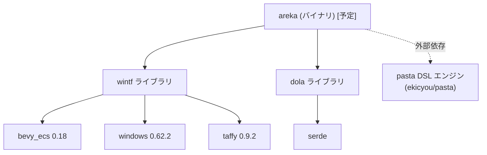

# areka アーキテクチャ概要 — ARCHITECTURE

| 項目 | 内容 |
|------|------|
| **Document Title** | areka アーキテクチャ概要 |
| **Version** | 1.0 |
| **Date** | 2026-02-14 |

---

## 1. クレート依存関係図



| クレート | 種別 | 責務 |
|---------|------|------|
| **wintf** | ライブラリ | Windows Tategaki Framework — 汎用Windows UIフレームワーク |
| **dola** | ライブラリ | 宣言的アニメーション定義フォーマット（JSON/TOML/YAML） |
| **areka** *(予定)* | バイナリ | デスクトップマスコット・プラットフォーム本体 |
| **pasta** | 外部 | 里々インスパイアの会話記述DSLスクリプトエンジン |

---

## 2. wintf 3層構造

wintf は COM ラッパー → ECS → メッセージハンドリングの3層構造で責務を分離しています。

```
┌─────────────────────────────────────────────┐
│  Message Handling Layer                      │
│  Win32メッセージループ・スレッド管理          │
│  winproc.rs, win_message_handler.rs,         │
│  win_thread_mgr.rs, api.rs                   │
├─────────────────────────────────────────────┤
│  ECS Component Layer                         │
│  コンポーネント定義・システム実行             │
│  ecs/ (window, graphics, layout,             │
│        widget, pointer, drag, ...)           │
├─────────────────────────────────────────────┤
│  COM Wrapper Layer                           │
│  Windows COM APIのRustラッパー               │
│  com/ (dcomp, d3d11, d2d, dwrite, wic, ...)  │
└─────────────────────────────────────────────┘
```

**依存方向**: Message Handling → ECS → COM（上位層が下位層に依存、逆依存禁止）

> 原典: [.kiro/steering/structure.md](../.kiro/steering/structure.md) — Organization Philosophy

---

## 3. ECS モジュール一覧

wintf の ECS 層は以下のモジュールで構成されています。

| モジュール | 責務 |
|-----------|------|
| `app.rs` | ECS App スケジュール管理 |
| `world.rs` | ECS World 管理、tick 実行 |
| `window.rs` | Win32 ウィンドウのライフサイクル管理と Entity の双方向マッピング |
| `window_system.rs` | ウィンドウ作成・破棄システム |
| `window_proc/` | ウィンドウプロシージャの ECS 統合 |
| `monitor.rs` | マルチモニタ・ディスプレイエンティティ管理 |
| `graphics/` | Direct2D / DirectComposition リソース管理、デバイスロスト対応 |
| `layout/` | Taffy Flexbox 統合、Arrangement 配置計算、Surface 生成最適化 |
| `common/` | 階層伝播システム（ジェネリックツリー走査） |
| `widget/` | UIウィジェット（Label, Rectangle, BitmapSource, brushes, shapes） |
| `pointer/` | ポインターイベント配信（Tunnel/Bubble 2フェーズ）、ヒットテスト |
| `drag/` | ドラッグシステム（エンティティドラッグ + ウィンドウ移動） |
| `transform/` | 変換システム（**非推奨**: Arrangement ベースの Layout System を推奨） |
| `nchittest_cache.rs` | WM_NCHITTEST キャッシュ最適化 |

> 各モジュールの詳細は [.kiro/steering/structure.md](../.kiro/steering/structure.md) — ECS機能グループ詳細 を参照

---

## 4. dola の責務

**dola** (Declarative Orchestration for Live Animation) は、Windows Animation Manager の概念をプラットフォーム非依存のデータモデルとして再構成したクレートです。

| 概念 | 説明 |
|------|------|
| `AnimationVariableDef` | アニメーション対象の変数定義（名前・初期値・範囲） |
| `TransitionDef` | トランジション定義（対象変数・目標値・時間・イージング） |
| `Storyboard` | トランジションの実行順序を束ねるコンテナ |
| `EasingFunction` | イージング関数（プリセット・パラメトリック） |

対応フォーマット: JSON (デフォルト), TOML, YAML（feature flags で選択）

> 詳細: [crates/dola/README.md](../crates/dola/README.md)

---

## 5. areka アプリケーション層（予定）

`crates/areka`（バイナリクレート）は wintf と dola を統合し、デスクトップマスコット・プラットフォームとして以下を提供する予定です：

- ゴースト実行環境（pasta DSL 解釈・実行）
- シェル/バルーン管理
- システムトレイ統合
- 状態永続化
- パッケージ管理（ゴースト/シェル/バルーンのインストール・切替）
- MCP サーバー（AI/LLM連携）

> 現在の `examples/areka.rs` はダミーであり、正式なバイナリクレート作成時に置き換え予定

---

## 6. pasta 外部連携

**pasta** は里々インスパイアの会話記述DSLのスクリプトエンジンで、独立した外部リポジトリとして管理されています。

| 項目 | 内容 |
|------|------|
| リポジトリ | https://github.com/ekicyou/pasta |
| 連携方式 | areka バイナリクレートが pasta ライブラリを依存として取り込み |
| 責務 | DSL のパース・解釈・実行（プラットフォーム非依存） |
| 状態 | ✅ 設計完了（仕様: `completed/areka-P0-script-engine`） |

---

## 7. 推奨読書順序

新規開発者がプロジェクトを理解するための推奨読書順序：

1. **[README.md](../README.md)** — プロジェクト全体像、ゴール、ビルド手順
2. **[doc/CONSTITUTION.md](CONSTITUTION.md)** — 設計理念、責務境界
3. **[.kiro/steering/product.md](../.kiro/steering/product.md)** — プロダクト概要、ユースケース
4. **本ドキュメント (ARCHITECTURE.md)** — クレート構成、モジュール俯瞰
5. **[.kiro/steering/structure.md](../.kiro/steering/structure.md)** — ディレクトリ構造、命名規則の詳細
6. **[doc/spec/README.md](spec/README.md)** — wintf 詳細設計仕様の概要
7. **[doc/spec/ 各章](spec/)** — 興味のある領域から各章を読む
8. **[doc/ROADMAP.md](ROADMAP.md)** — 開発計画とタスクの全体像

---

## 8. 詳細設計参照

wintf の詳細設計は doc/spec/ に 12 章構成でまとめられています：

| # | 章 | 内容 |
|---|---|------|
| 1 | [ECSコンポーネント](spec/01-ecs-components.md) | コンポーネント定義と命名規則 |
| 2 | [ウィジェットツリー](spec/02-widget-tree.md) | 論理ツリーとエンティティ階層 |
| 3 | [システム分離](spec/03-system-separation.md) | レイヤー間の責務境界 |
| 4 | [レイアウトシステム](spec/04-layout-system.md) | Taffy統合とArrangement |
| 5 | [レイアウト詳細](spec/05-layout-details.md) | 座標系・DPI・サイズ計算 |
| 6 | [Visual/DirectComposition](spec/06-visual-directcomp.md) | ビジュアルツリー同期 |
| 7 | [更新フロー](spec/07-update-flow.md) | フレーム更新パイプライン |
| 8 | [イベントシステム](spec/08-event-system.md) | Tunnel/Bubble配信 |
| 9 | [ヒットテスト](spec/09-hit-test.md) | アルファマスク・キャッシュ |
| 10 | [UI要素](spec/10-ui-elements.md) | Label, Rectangle, Image等 |
| 11 | [使用例](spec/11-usage-examples.md) | サンプルコードと動作例 |
| 12 | [Visual最適化](spec/12-visual-optimization.md) | Surface最適化・VSync |

> 仕様概要は [doc/spec/README.md](spec/README.md) を参照
