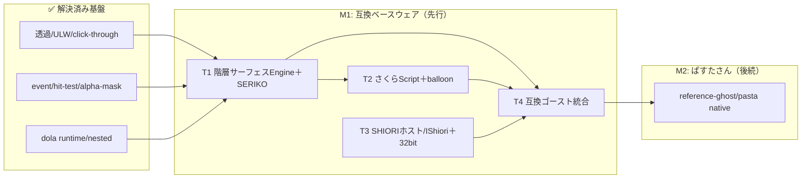

# areka ロードマップ — ukadoc互換ベースウェア

| 項目 | 内容 |
|------|------|
| **Document Title** | areka ロードマップ（互換ベースウェア戦略） |
| **Version** | 2.0 |
| **Date** | 2026-06-26 |
| **ゴール** | ① ukadoc準拠の互換ベースウェア確立（既存伺かゴーストが動く）→ ② ぱすたさん（native旗艦ゴースト） |

> **v2.0 戦略転換 (2026-06-26)**: 「ぱすたさん専用の試作」から **ukadoc準拠の互換ベースウェア（SSP代替）** へ
> 狙いを定め直す。**互換ベースウェアを先行**、ぱすたさんは互換土台の上のnative旗艦として後続。
> 確定した設計判断は [COMPAT_ARCHITECTURE.md](COMPAT_ARCHITECTURE.md)（議事の正本）を参照。
> v1.x のボトムアップ表示層計画は本トラック体系へ再マップした（破棄ゼロ）。

---

## 戦略：二枚看板・互換先行

- **二枚看板**: ①互換ベースウェア（既存伺か資産を動かす）／②ぱすたさん（native旗艦）
- **互換先行の理由**: 既存ゴーストが実際に動く達成感がモチベーションを最大化し、最難関の互換部を前倒しで潰してリスクを早期に溶かす。
- **互換契約**: ukadoc正典。SERIKO/MAYUNA完全マップ／さくらスクリプト優先度順／沈黙時はareka裁量＋対応表記録（詳細は [COMPAT_ARCHITECTURE.md](COMPAT_ARCHITECTURE.md) §2）。

### 北極星（縦スライス）
- **M1（互換ベースウェア）**: 実在の里々ベースゴースト1体が、SAORI込みで実際に表示・会話する。
- **M2（ぱすたさん）**: 同じ土台の上で、ぱすたさん（native脳pasta＋階層サーフェスの本領）が動く。

---

## 解決済み基盤資産（伺か土台の最難関は完了済み）

| 基盤 | 到達点 | 関連完了仕様 (`completed/`) |
|------|--------|---------------------------|
| 透過/レイヤードウィンドウ | DComp→ULW移行完遂、ULW既定 | `wintf-dcomp-migration-0`〜`4`, `wintf-dcomp-to-layered-migration` |
| DComp⇄ULW切替基盤 | ウィンドウ単位 `CompositionMode` | `wintf-dcomp-migration-4-switchable-backend` |
| クリック透過（別プロセスへ） | `ULW_ALPHA`/alpha=0で自動透過 | `wintf-P0-click-through`, `event-hit-test-alpha-mask` |
| イベント/ヒットテスト | mouse/drag/routing/named-regions/multiwindow | `wintf-P0-event-system` ＋配下8仕様 |
| dola演出ランタイム | コア/クロック/ファサード/競合/ループ/nested | `dola-runtime-1`〜`5`, `dola-nested-storyboard` ほか |

> 却下: `_rejected/wintf-P0-click-through-rgn`（`SetWindowRgn`はDComp描画をクリップし両立不可）。

---

## トラック体系（M1: 互換ベースウェア先行）

### T1 — 階層サーフェス／アニメーションエンジン
SERIKOを平坦サブセットとして内包する上位エンジン。native-firstで建て、SERIKOローダは後付け。

| 仕様 | .kiro/specs/ | 状態 | 備考 |
|------|-------------|:----:|------|
| dola→wintf バインディング＋階層合成 | `wintf-P0-animation-system` | 🔵 要件生成済 | T1の心臓。スコープに階層サーフェス＋再生制御プリミティブを追加 |
| SERIKOランタイム（完全マップ） | *(新規)* | ⚪ | pattern/interval/method 全集合。talk/mouse/bindトリガをwintfイベントへ結線 |
| 階層参照拡張（areka-native） | *(新規)* | ⚪ | エレメント→別サーフェス定義参照。循環検出・多重インスタンス。典拠=areka |
| シェルパッケージローダ | *(新規)* | ⚪ | descript.txt/surfaces.txt/surface*.png/collision。collisionをhit-testへ |

### T2 — さくらスクリプト互換＋バルーン
| 仕様 | .kiro/specs/ | 状態 | 備考 |
|------|-------------|:----:|------|
| バルーン（親→子分割） | `wintf-P0-balloon-system` ＋ `balloon01`〜`06` | 🔵 設計承認済/要件 | **さくらスクリプト駆動＋balloonパッケージ読込前提**へ再スコープ |
| さくらスクリプトrunner | *(新規)* | ⚪ | ukadoc優先タグから。`\s[]`→サーフェス、テキスト/`\n`/`\w`/`\e`/選択肢→balloon |
| balloonパッケージローダ | *(新規)* | ⚪ | balloon descript.txt/位置決め |

### T3 — SHIORI ホスト
| 仕様 | .kiro/specs/ | 状態 | 備考 |
|------|-------------|:----:|------|
| `IShiori` COM ＋ ネイティブin-proc | `areka-P0-shiori-com` | 🔵 | 内部唯一ABI。HSTRING/UTF-16。push=`IShioriHost`sink。**実装完了・/kiro-complete 承認待ち** |
| 簡易リファレンス COM-SHIORI | *(新規)* `areka-P0-shiori-reference` | ⚪ | 非テスト native 脳＋areka 実走デモ。content 不透明。DLL 契約の「正解見本」 |
| 正準 content プロトコル | *(新規)* `areka-P0-shiori-protocol` | ⚪ | json-rpc 2.0 具体形（shiori-com の設計判断 D5 を着地）。content 語彙・id/result/error マッピング |
| 32bit Rustホスト（過去互換） | *(新規)* `areka-P0-shiori-host-32` | ⚪ | i686随伴バイナリ。flat-C/HGLOBAL/charset/SAORI同居/自前ループ/毎秒poll。自前IPC。DLL 境界契約は本実装過程でリファレンスを見本に決定 |

### T4 — 統合（M1達成）
| 仕様 | .kiro/specs/ | 状態 | 備考 |
|------|-------------|:----:|------|
| 互換ゴースト統合 | *(新規)* | ⚪ | 実在里々ゴースト1体をE2E起動（shell＋balloon＋SHIORI＋SAORI） |
| areka バイナリ拡充 | `crates/areka/`（試作済） | 🔵 | 2ウィンドウ試作の上にベースウェア機能を積む |

---

## M1 Specs (dependency order)

新規 spec の brief は各 `.kiro/specs/<feature>/brief.md` に作成済み。依存順は以下（`/kiro-spec-init` または `/kiro-spec-batch` で着手可能）。`wintf-P0-animation-system` と `wintf-P0-balloon-system`＋`balloon01-06` は既存のため、新規ではなくスコープ拡張で対応。

- [ ] wintf-P0-surface-hierarchy -- 汎用の階層アニメーション・サーフェス合成能力（wintf）。Dependencies: wintf-P0-animation-system
- [ ] areka-P0-seriko-runtime -- SERIKO/MAYUNA を ukadoc 完全マップで解釈（areka）。Dependencies: wintf-P0-surface-hierarchy
- [ ] areka-P0-shell-loader -- 伺かシェルパッケージ読込→surfaceモデル（areka）。Dependencies: areka-P0-seriko-runtime
- [ ] areka-P0-sakura-script -- さくらスクリプト runner（優先度順, areka）。Dependencies: areka-P0-seriko-runtime, wintf-P0-balloon-system
- [ ] areka-P0-balloon-loader -- 伺かバルーンパッケージ読込（areka）。Dependencies: wintf-P0-balloon-system
- [x] areka-P0-shiori-com -- 内部唯一ABI `IShiori`(COM)＋ネイティブin-proc（areka）。Dependencies: none ※**実装完了・/kiro-complete 承認待ち**
- [ ] areka-P0-shiori-reference -- 簡易リファレンス COM-SHIORI（非テスト native 脳＋areka 実走デモ、content 不透明）。Dependencies: areka-P0-shiori-com
- [ ] areka-P0-shiori-protocol -- 正準 content プロトコル json-rpc 2.0 定義（D5 着地）。Dependencies: areka-P0-shiori-com
- [ ] areka-P0-shiori-host-32 -- 32bit Rust 過去互換ホスト＋SAORI同居（areka）。Dependencies: areka-P0-shiori-com, areka-P0-shiori-reference
- [ ] areka-P0-compat-ghost-integration -- 実在里々ゴースト1体をE2E起動（M1北極星）。Dependencies: areka-P0-shell-loader, areka-P0-seriko-runtime, areka-P0-sakura-script, areka-P0-balloon-loader, areka-P0-shiori-host-32

### 既存仕様のスコープ拡張（新規briefなし）
- `wintf-P0-animation-system` -- dola→wintfバインディングに「階層サーフェス＋SERIKO再生プリミティブ」を追加
- `wintf-P0-balloon-system`＋`balloon01-06` -- 「さくらスクリプト駆動＋balloonパッケージ読込」前提へ再スコープ

---

## M2 — ぱすたさん（native旗艦・互換後続）

| 仕様 | .kiro/specs/ | 状態 | 備考 |
|------|-------------|:----:|------|
| リファレンスシェル | `areka-P0-reference-shell` | ⚪ | 階層サーフェスの本領をnativeで活用 |
| リファレンスバルーン | `areka-P0-reference-balloon` | ⚪ | |
| リファレンスゴースト | `areka-P0-reference-ghost` | ⚪ | pasta脳が `IShiori` をnative実装 |
| pasta スクリプトエンジン | `completed/areka-P0-script-engine` | ✅ 完了 | vendored `vendors/pasta/` |

---

## アプリ統合・出荷（旧Phase D/E）

| 仕様 | .kiro/specs/ | 状態 |
|------|-------------|:----:|
| システムトレイ / 永続化 / パッケージマネージャ / MCPサーバー | `areka-P0-system-tray`/`-persistence`/`-package-manager`/`-mcp-server` | ⚪ 要件 |
| 統合テスト / ドキュメント / リリースビルド | *(新規予定)* | ⚪ |

---

## 依存関係図

**クリティカルパス（M1）**: animation-system＋階層Engine → SERIKO＋シェルローダ → さくらScript＋balloon → SHIORIホスト(里々) → 互換ゴースト統合

---

## 仕様ポートフォリオ実数（2026-06-26 畳み込み後）

| 配置 | 件数 |
|------|:----:|
| `completed/` | 84 |
| `.kiro/specs/` 直下（アクティブP0） | 17 |
| `backlog/`（待機P1-P3） | 18（＋`shape-*` 3件は `spec.json` 未生成の構想） |
| `_rejected/` | 3 |

> 件数は配置フォルダ基準で数える（集計ルールの正本は `.kiro/steering/focus.md`）。
> ※M1新規brief（8件）は `spec.json` 未生成。`/kiro-spec-init` 着手時に生成される。

### 畳み込みログ（2026-06-26 実施）
- `wintf-P1-clickthrough` → `_rejected/`（完了済みクリック透過に超越。旧DComp透過マップ前提）
- `areka-P1-legacy-converter` → `_rejected/`（互換ベースウェアで伊辢をネイティブ実行する方針により役割消失）
- `ukagaka-desktop-mascot` → `completed/`（旧メタ仕様・完了）
- `future-requirements-survey` → `completed/`（調査完了）
- `shape-brush-system` / `shape-path-geometry` / `shape-stroke-widgets` → `backlog/`（旧Dual Route Strategy由来・互換クリティカルパス外、保留）
- `codebase-review-loop` → 維持（レビュー運用プロセス・現役）

---

## 更新ガイド
1. トラック/マイルストーンの状態列を ⚪→🔮🔵→✅ に更新
2. 新規完了基盤は「解決済み基盤資産」へ追記
3. 設計判断の変更は [COMPAT_ARCHITECTURE.md](COMPAT_ARCHITECTURE.md) を正本として更新
4. ポートフォリオ件数は配置フォルダ基準で再計上

## 旧ロードマップ
v1.x（ボトムアップ表示層計画）の本文は git 履歴に保存（本ファイルを上書き更新）。旧 ukagaka-desktop-mascot ROADMAP は `doc/archive/ROADMAP_ukagaka_meta.md` にアーカイブ済み。
