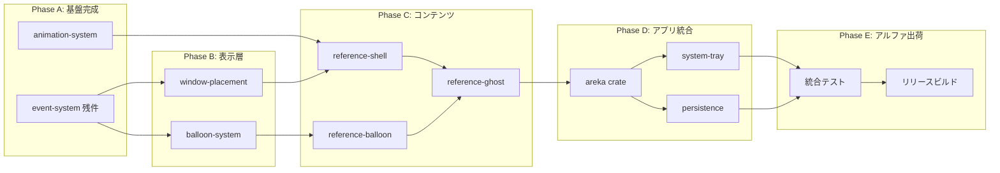

# areka ロードマップ — ぱすたさんアルファリリース

| 項目 | 内容 |
|------|------|
| **Document Title** | areka アルファリリースロードマップ |
| **Version** | 1.0 |
| **Date** | 2026-02-14 |
| **ゴール** | ぱすたさん（1体のデスクトップマスコット）のアルファリリース |

---

## プログレスサマリー

| フェーズ | 状態 | 進捗 |
|---------|:----:|:----:|
| Phase A: 基盤完成 | 🔵 進行中 | ████████░░ 80% |
| Phase B: 表示層 | ⚪ 未着手 | ░░░░░░░░░░ 0% |
| Phase C: コンテンツ | ⚪ 未着手 | ░░░░░░░░░░ 0% |
| Phase D: アプリ統合 | ⚪ 未着手 | ░░░░░░░░░░ 0% |
| Phase E: アルファ出荷 | ⚪ 未着手 | ░░░░░░░░░░ 0% |

**完了済み仕様**: 64件 / **アクティブ仕様(P0)**: 9件 / **バックログ(P1-P3)**: 18件

---

## Phase A: 基盤完成

**目標**: イベントシステム残件の完了と、dola アニメーション定義の wintf 統合。

| 仕様 | .kiro/specs/ | 状態 | 備考 |
|------|-------------|:----:|------|
| イベントシステム | `completed/wintf-P0-event-system` | ✅ 完了 | |
| ├ ヒットテスト | `completed/event-hit-test` | ✅ 完了 | |
| ├ ヒットテストキャッシュ | `completed/event-hit-test-cache` | ✅ 完了 | |
| ├ マウス基本 | `completed/event-mouse-basic` | ✅ 完了 | |
| ├ 親→子ルーティング | `completed/event-parent-to-child-routing` | ✅ 完了 | |
| ├ イベント配信 | `completed/event-dispatch` | ✅ 完了 | |
| ├ ドラッグシステム | `completed/event-drag-system` | ✅ 完了 | |
| ├ ヒットテスト名前付き領域 | `completed/event-hit-test-named-regions` | ✅ 完了 | |
| ├ マルチウィンドウイベント | `completed/multiwindow-event-validation` | ✅ 完了 | |
| アニメーションシステム | `wintf-P0-animation-system` | ⚪ 未着手 | dola → wintf 統合 |
| タイプライター | `completed/wintf-P0-typewriter` | ✅ 完了 | |

---

## Phase B: 表示層

**目標**: バルーン（吹き出し）の描画とウィンドウ配置（デスクトップ端固定等）の実装。

| 仕様 | .kiro/specs/ | 状態 | 依存 |
|------|-------------|:----:|------|
| バルーンシステム | `wintf-P0-balloon-system` | ⚪ 未着手 | typewriter ✅ |
| ウィンドウ配置 | `areka-P0-window-placement` | ⚪ 未着手 | event-system 🔵 |

---

## Phase C: コンテンツ

**目標**: ぱすたさんのリファレンス実装（シェル・バルーン・ゴーストの定義と素材）。

| 仕様 | .kiro/specs/ | 状態 | 依存 |
|------|-------------|:----:|------|
| リファレンスシェル | `areka-P0-reference-shell` | ⚪ 未着手 | animation-system |
| リファレンスバルーン | `areka-P0-reference-balloon` | ⚪ 未着手 | balloon-system |
| リファレンスゴースト | `areka-P0-reference-ghost` | ⚪ 未着手 | reference-shell, reference-balloon |
| pasta スクリプトエンジン | `completed/areka-P0-script-engine` | ✅ 完了 | 外部リポジトリ: [ekicyou/pasta](https://github.com/ekicyou/pasta) |

---

## Phase D: アプリ統合

**目標**: areka バイナリクレートの作成と、システムトレイ・永続化等のアプリケーション機能。

| 仕様 | .kiro/specs/ | 状態 | 依存 |
|------|-------------|:----:|------|
| areka バイナリクレート | *(新規作成予定)* | ⚪ 未着手 | reference-ghost |
| システムトレイ | `areka-P0-system-tray` | ⚪ 未着手 | areka crate |
| 永続化 | `areka-P0-persistence` | ⚪ 未着手 | areka crate |
| パッケージマネージャ | `areka-P0-package-manager` | ⚪ 未着手 | areka crate |
| MCPサーバー | `areka-P0-mcp-server` | ⚪ 未着手 | areka crate |

---

## Phase E: アルファ出荷

**目標**: 統合テスト、ドキュメント最終化、リリースビルドの作成。

| 仕様 | .kiro/specs/ | 状態 | 依存 |
|------|-------------|:----:|------|
| 統合テスト | *(新規作成予定)* | ⚪ 未着手 | Phase D 完了 |
| README/ドキュメント最終化 | — | ⚪ 未着手 | 統合テスト |
| リリースビルド | — | ⚪ 未着手 | ドキュメント完了 |

---

## 依存関係図

**クリティカルパス**: event-system → balloon-system → reference-balloon → reference-ghost → areka crate → 統合テスト → リリース

---

## 子仕様対応表

| フェーズ | 対応仕様 (.kiro/specs/) |
|---------|----------------------|
| Phase A | `wintf-P0-event-system`, `wintf-P0-animation-system`, `event-hit-test-named-regions`, `multiwindow-event-validation` |
| Phase B | `wintf-P0-balloon-system`, `areka-P0-window-placement` |
| Phase C | `areka-P0-reference-shell`, `areka-P0-reference-balloon`, `areka-P0-reference-ghost` |
| Phase D | `areka-P0-system-tray`, `areka-P0-persistence`, `areka-P0-package-manager`, `areka-P0-mcp-server` |
| Phase E | *(統合テスト・リリースビルド仕様を新規作成)* |

### アクティブ仕様以外の関連仕様

| 仕様 | 分類 | 状態 |
|------|------|:----:|
| `shape-brush-system` | UIウィジェット拡張 | ⚪ P0アクティブ |
| `shape-path-geometry` | UIウィジェット拡張 | ⚪ P0アクティブ |
| `shape-stroke-widgets` | UIウィジェット拡張 | ⚪ P0アクティブ |
| `future-requirements-survey` | 調査 | ⚪ P0アクティブ |
| `docs-restructure` | ドキュメント | ✅ 完了 |

---

## 更新ガイド

フェーズの完了状況が変化した際は、以下を更新してください：

1. **プログレスサマリー**: 該当フェーズの進捗バーと割合を更新
2. **各フェーズテーブル**: 該当仕様の「状態」列を ⚪ → 🔵 → ✅ に変更
3. **依存関係図**: 完了ノードのスタイルを変更（任意）

---

## 旧ロードマップ

本ロードマップは [ukagaka-desktop-mascot ROADMAP.md](archive/ROADMAP_ukagaka_meta.md) を置き換えるものです。旧ロードマップは `doc/archive/` にアーカイブ済みです。
