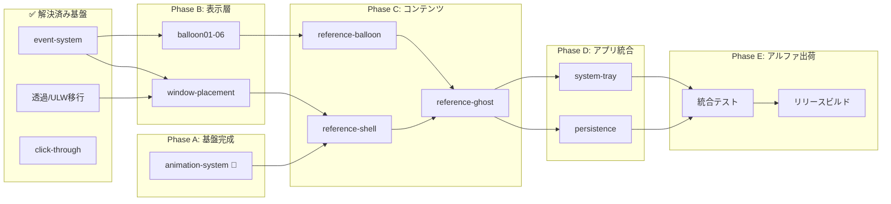

# areka ロードマップ — ぱすたさんアルファリリース

| 項目 | 内容 |
|------|------|
| **Document Title** | areka アルファリリースロードマップ |
| **Version** | 1.1 |
| **Date** | 2026-06-26 |
| **ゴール** | ぱすたさん（1体のデスクトップマスコット）のアルファリリース |

> **v1.1 再ベースライン (2026-06-26)**: 仕様ポートフォリオの実態（122件）と地図の乖離を是正。
> 完了済みの透過/レイヤードウィンドウ移行を「解決済み基盤資産」として顕在化し、バルーンの
> 子仕様分割（balloon01〜06）と未記載仕様を反映した。件数は配置フォルダ基準で再計上。

---

## プログレスサマリー

| フェーズ | 状態 | 進捗 |
|---------|:----:|:----:|
| Phase A: 基盤完成 | 🔵 進行中 | █████████░ 90% |
| Phase B: 表示層 | 🔵 進行中 | ██░░░░░░░░ 20%（仕様策定中） |
| Phase C: コンテンツ | ⚪ 未着手 | ░░░░░░░░░░ 0% |
| Phase D: アプリ統合 | ⚪ 未着手 | ░░░░░░░░░░ 0% |
| Phase E: アルファ出荷 | ⚪ 未着手 | ░░░░░░░░░░ 0% |

### 仕様ポートフォリオ実数（2026-06-26 棚卸し）

| 配置 | 件数 | 意味 |
|------|:----:|------|
| `completed/` | **82** | 完了 |
| `.kiro/specs/` 直下 | **19** | アクティブ（P0） |
| `backlog/` | **20** | 待機（P1-P3） |
| `_rejected/` | **1** | 却下 |
| spec.json 未生成（`shape-*`） | 3 | 構想段階（Phase 0） |

> 件数は **配置フォルダを基準**に数える（`spec.json` 内の phase 値は履歴上ズレることがあるため）。
> 集計ルールの正本は `.kiro/steering/focus.md`。

---

## 解決済み基盤資産（地図に埋もれていた完了群）

アルファの中核リスクと目された項目は、すでに完了済み。**仕切り直し・再設計は不要**。

| 基盤 | 到達点 | 関連完了仕様 (`completed/`) |
|------|--------|---------------------------|
| **透過ウィンドウ / レイヤードウィンドウ移行** | DirectComposition → UpdateLayeredWindow(ULW) 移行を完遂。ULW がデフォルト | `wintf-dcomp-migration-0`〜`4`, `wintf-dcomp-to-layered-migration` |
| **DComp ⇄ ULW 切替基盤** | ウィンドウ単位に `CompositionMode` で合成方式を選択（生成時固定） | `wintf-dcomp-migration-4-switchable-backend` |
| **クリック透過** | `ULW_ALPHA`（`AC_SRC_ALPHA`）で透明ピクセルを別プロセスへ自動透過 | `wintf-P0-click-through`, `event-hit-test-alpha-mask` |
| **イベント / ヒットテスト** | マウス・ドラッグ・親子ルーティング・名前付き領域・マルチウィンドウ検証まで完備 | `wintf-P0-event-system` と配下8仕様 |
| **dola 演出ランタイム** | コア型・クロック・ファサード・競合解決・ループまで実装 | `dola-runtime-1`〜`5`, `dola-runtime-engine` ほか |

> **却下された代替案**: `_rejected/wintf-P0-click-through-rgn` — `SetWindowRgn` は
> `WS_EX_NOREDIRECTIONBITMAP` 上の DComp 描画をクリップしてしまい「描画は残すがクリックだけ透過」が
> 両立できず却下（`setwindowrgn_compat_test.rs` で実証）。同じ轍は踏まないこと。

---

## Phase A: 基盤完成

**目標**: イベントシステム残件の完了と、dola アニメーション定義の wintf 統合。

| 仕様 | .kiro/specs/ | 状態 | 備考 |
|------|-------------|:----:|------|
| イベントシステム（+配下8仕様） | `completed/wintf-P0-event-system` ほか | ✅ 完了 | hit-test/drag/routing/named-regions/multiwindow |
| タイプライター | `completed/wintf-P0-typewriter` | ✅ 完了 | |
| dola 責務境界 | `completed/wintf-P0-dola-boundary` | ✅ 完了 | cue-system unblock |
| 透過/レイヤードウィンドウ移行 | （上記「解決済み基盤資産」参照） | ✅ 完了 | |
| **アニメーションシステム** | `wintf-P0-animation-system` | 🔵 要件生成済 | **Phase A 残件 = 現フロント**。dola → wintf 統合 |

---

## Phase B: 表示層

**目標**: バルーン（吹き出し）の描画とウィンドウ配置（デスクトップ端固定等）の実装。

> バルーンシステムは親仕様 `wintf-P0-balloon-system`（設計承認済）から、実装単位の子仕様
> `balloon01`〜`06` に分割済み。`balloon07-ruby` / `balloon08-portrait` は P1（backlog）。

| 仕様 | .kiro/specs/ | 状態 | 依存 |
|------|-------------|:----:|------|
| バルーンシステム（親） | `wintf-P0-balloon-system` | 🔵 設計承認済(R✓D✓T✓) | typewriter ✅ |
| ├ コア | `wintf-P0-balloon01-core` | 🔵 要件ドラフト | balloon-system |
| ├ リファレンススキン | `wintf-P0-balloon02-reference-skin` | ⚪ init | balloon01 |
| ├ コンテンツ | `wintf-P0-balloon03-content` | ⚪ init | balloon01 |
| ├ 選択肢 | `wintf-P0-balloon04-choice` | ⚪ init | balloon03 |
| ├ リンク | `wintf-P0-balloon05-link` | ⚪ init | balloon03 |
| └ テキストエフェクト | `wintf-P0-balloon06-text-effects` | ⚪ init | balloon03 |
| ウィンドウ配置 | `areka-P0-window-placement` | 🔵 要件ドラフト | event-system ✅ |

---

## Phase C: コンテンツ

**目標**: ぱすたさんのリファレンス実装（シェル・バルーン・ゴーストの定義と素材）。

| 仕様 | .kiro/specs/ | 状態 | 依存 |
|------|-------------|:----:|------|
| リファレンスシェル | `areka-P0-reference-shell` | ⚪ 要件ドラフト | animation-system |
| リファレンスバルーン | `areka-P0-reference-balloon` | ⚪ 要件ドラフト | balloon-system |
| リファレンスゴースト | `areka-P0-reference-ghost` | ⚪ 要件ドラフト | reference-shell, reference-balloon |
| pasta スクリプトエンジン | `completed/areka-P0-script-engine` | ✅ 完了 | vendored: `vendors/pasta/`（[ekicyou/pasta](https://github.com/ekicyou/pasta)） |

---

## Phase D: アプリ統合

**目標**: areka バイナリクレートの拡充と、システムトレイ・永続化等のアプリケーション機能。

> areka バイナリクレートは試作実装済み（`crates/areka/`：シェル+バルーン2ウィンドウ、ドラッグ移動、
> ダブルクリック終了）。本フェーズはその上に常駐アプリ機能を積む。

| 仕様 | .kiro/specs/ | 状態 | 依存 |
|------|-------------|:----:|------|
| システムトレイ | `areka-P0-system-tray` | ⚪ 要件ドラフト | areka crate |
| 永続化 | `areka-P0-persistence` | ⚪ 要件ドラフト | areka crate |
| パッケージマネージャ | `areka-P0-package-manager` | ⚪ 要件ドラフト | areka crate |
| MCPサーバー | `areka-P0-mcp-server` | ⚪ 要件生成済 | areka crate |

---

## Phase E: アルファ出荷

**目標**: 統合テスト、ドキュメント最終化、リリースビルドの作成。

| 仕様 | .kiro/specs/ | 状態 | 依存 |
|------|-------------|:----:|------|
| 統合テスト | *(新規作成予定)* | ⚪ 未着手 | Phase D 完了 |
| README/ドキュメント最終化 | — | ⚪ 未着手 | 統合テスト |
| リリースビルド | — | ⚪ 未着手 | ドキュメント完了 |

---

## 依存関係図

**クリティカルパス**: animation-system → balloon01-06 → reference-balloon → reference-ghost → 統合テスト → リリース

---

## アクティブ仕様以外の関連仕様（棚卸し）

ロードマップ本体テーブルに載らないが `.kiro/specs/` 直下に実在する仕様。配置の妥当性を随時見直すこと。

| 仕様 | 分類 | 状態 | メモ |
|------|------|:----:|------|
| `ukagaka-desktop-mascot` | 旧メタ仕様 | ✅ 完了(phase) | 本ロードマップの前身。`completed/` への移動候補 |
| `codebase-review-loop` | プロセス/レビュー | ✅ R✓D✓T✓ | リポジトリ全域レビュー運用 |
| `future-requirements-survey` | 調査 | 調査完了 | `salvage-report` あり。backlog 化候補 |
| `shape-brush-system` | UIウィジェット拡張 | 構想(Phase 0) | SPEC.md/STATUS.md のみ、`spec.json` 未生成 |
| `shape-path-geometry` | UIウィジェット拡張 | 構想(Phase 0) | 同上 |
| `shape-stroke-widgets` | UIウィジェット拡張 | 構想(Phase 0) | 同上 |

### 棚卸しで判明した整理候補（housekeeping）

- `ukagaka-desktop-mascot`（phase=completed）を `completed/` へ移動
- `shape-*` 3件は `spec.json` を生成して正式化するか、未着手なら `backlog/` へ退避
- `future-requirements-survey` は調査完了済み → 役割を終えたなら `backlog/` か `completed/` へ

---

## 更新ガイド

フェーズの完了状況が変化した際は、以下を更新してください：

1. **プログレスサマリー**: 該当フェーズの進捗バーと割合、および配置別件数を更新
2. **各フェーズテーブル**: 該当仕様の「状態」列を ⚪ → 🔵 → ✅ に変更
3. **解決済み基盤資産**: 新たに完了した基盤群があれば追記
4. **依存関係図**: 完了ノードを `Done` サブグラフへ移動（任意）

---

## 旧ロードマップ

本ロードマップは [ukagaka-desktop-mascot ROADMAP.md](archive/ROADMAP_ukagaka_meta.md) を置き換えるものです。旧ロードマップは `doc/archive/` にアーカイブ済みです。
